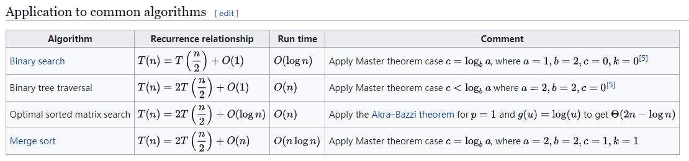

# 数据结构和算法-Geektime

* ref

  [在线编程-面试](http://collabedit.com/)

  [主定理 - Master Theorem](https://en.wikipedia.org/wiki/Master_theorem_(analysis_of_algorithms))

  


### 一、数组

1. 概念

   数组是一种线性表数据结构，用一组连续的内存空间，来存储一组具有相同类型的数据

2. 扩展

   线性表：每个数据最多只有一个前驱和后继结点，eg. 数组、链表、队列、栈等

   非线形表：eg. 树、堆、图

3. 特点

   连续的内存空间，相同数据类型的数据，保证了数组能随机访问（按下标顺序随机）

4. 大O操作

   * 随机访问

     根据下标随机访问的时间负责度O(1)

     根据下标即可知道 数组元素的地址 

     ```text
     num[index]_addr = base_addr + data_type_size * index
     ```

     

   * 插入

     前提：在确保数组有空间的情况下插入

     1. 如果确保原数组数据的顺序不变，在某个位置K插入某个数，需要把插入位置K以及以后的数据移动，平均时间复杂度为O(n)

     2. 如果对原数组数据顺序没有要求，直接在最后位置插入一个数，然后和第K个数进行调换即可，时间复杂度为O(1)

        

   * 删除

     删除数据，数据腰向前移动，平均时间复杂度为O(n)

     1. 删除最后一个元素，时间复杂度为O(1)
     2. 删除第一个元素，时间复杂度为O(n)
     3. 如果有多次删除操作，可以考虑合并提高效率

5. 补充学习

   * 数组越界问题，数组下标从0开始，下标取值范围[0,1,2...len-1]
   * 多维数组
   * 高级语言对数组的封装容器，Java的arrayList， C++的vector

6. 常见考点

   * 数组的查找，最大值，最小值，给定值，重复值
   * 数组的排序，快排，归并等
   * 多个数组的排序，合并，求交集，求并集
   * 优化方向：
     1. 如果数组有序，可以考虑二分法用于优化
     2. 如果数组无序，通常使用Hash帮助统计


---


* 链表

  1. 概念

     ​	链表是一种物理存储单元上非连续、非顺序的存储结构，数据元素的逻辑顺序是通过链表中的指针链接次序实现的

     ​	属于线性表

     ​	存在多种形式

  2. 内存分布

     和数组的内存分布不同，链表的内存分布是不连续的，跳跃的

     e.g.

     int *a																															int a[10]

     7000-7003																												0      a[0]     7000-7003

     ​	......																														1	  a[1]  	7004-7007

     7080-7083																												2	  a[2]	  7008-7011

     ​	......																																……

     7134-7137																												9      a[9]	  7036-7039

  3. 实现和特性

     每个节点包含两个部分，一个是存储数据元素的数据域，另一个是存储下一个节点地址的指针域，且只有一个后继节点

     @注意：头节点和尾节点

  4. 多种形式

     * 建立链表

       本质上就是不断插入节点

     * 插入节点：即申请空间，得到数据，建立链接的循环处理过程；画图法

       * 在指定指针的情况下插入节点，时间复杂度O(1)

         * 头插法：@注意：插入的前后操作顺序
           1. 将P节点的指针指向头节点的Next节点
           2. 将头节点的指针指向P节点

         * 尾插法
           1. 找到尾节点
           2. 将尾节点指针指向P

       * 在没有指定指针的时候，需要遍历先确定插入位置，再执行上述的插入步骤，时间复杂度为O(n)

     * 删除节点：画图法

       * 删除节点中 值为给定某个值 的节点，时间复杂度O(1)

       * 删除给定指针的节点，需要遍历前驱节点，时间复杂度O(1)

       * 删除操作：

         e.g.

         现有     -> a~i~[]  ->  a~i+1~[] ->  a~i+2~[] ->    需要删除 i+1

         1. a~i~ 指针指向 a~i+1~ 的Next （即a~i+2~）
         2. 断开a~i+1~的Next

