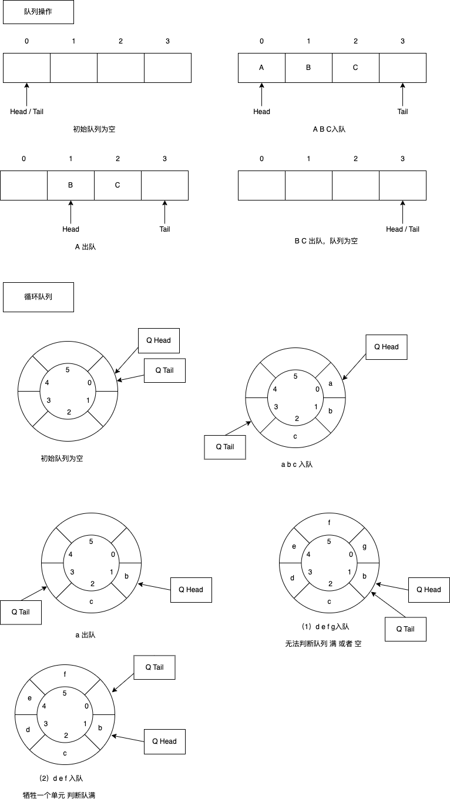
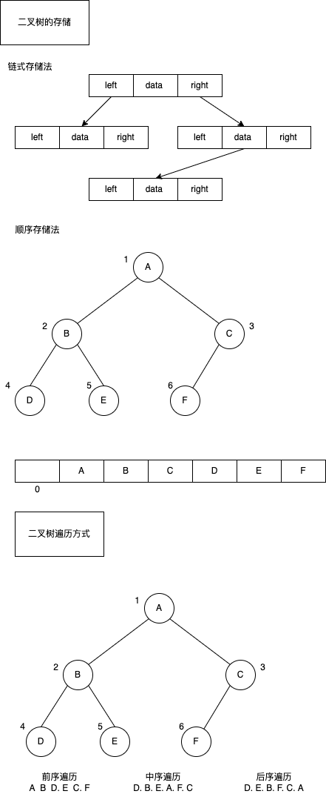
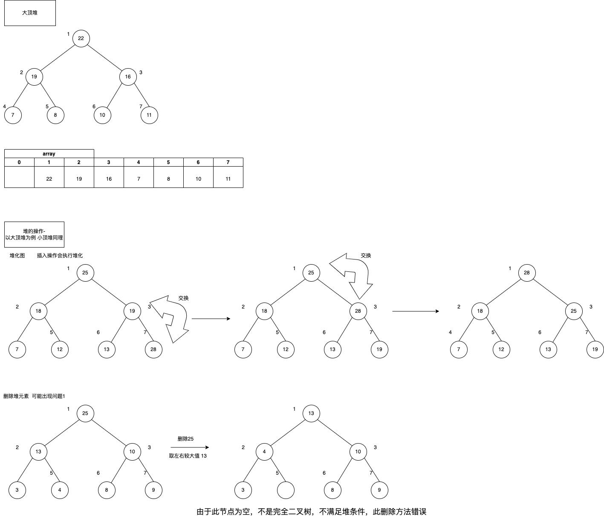
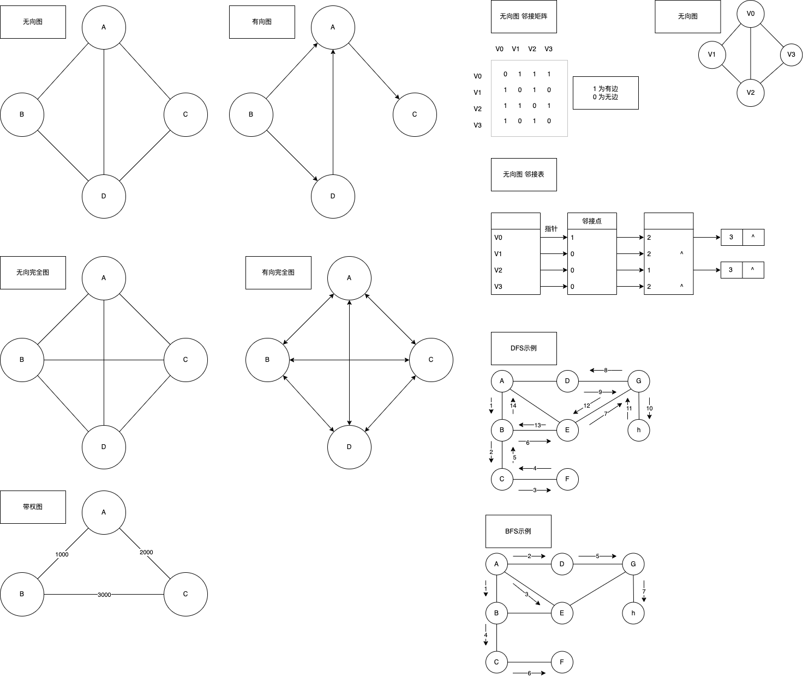

# 数据结构和算法2 - Geektime


* 链表补充

  * 删除节点

    @注意：删除头节点和尾节点 的特殊点

    删除节点中“值为给定值”的节点，时间复杂度为O(1)

    删除给定指针的节点，需要遍历前驱节点，时间复杂度为O(n)

  * 遍历链表： O(n)

  * 对比数组

    | 时间复杂度 | 插入、删除                   | 随机访问                       | 查找   | 存储密度 | 容量分配  |
    | ---------- | ---------------------------- | ------------------------------ | ------ | -------- | --------- |
    | 数组       | O(n)  / O(n/2)   最好0 最坏n | O(1)                           | O(n/2) | 1        | 事先确定  |
    | 链表       | O(1)                         | O(n) /  O([n+1]/2) 最好1 最坏n | O(n/2) | <1       | 动态 改变 |

  * 查找节点

    * 根据指针依次查找，直到找到相应的节点（存在多种情况）
    * 时间复杂度O(n)

* 循环链表

  * 概念特点：

    只有一个方向，节点只有一个后继指针next指向后面的节点

    尾节点指针指向头节点的链表

    单（向）链表和双（向）链表都可以循环

    方便从链表尾部到链表头部

    经典问题：约瑟夫环

* 双向链表

  * 概念特点

    支持两个方向，每个节点有一个后继指针next指向后面的节点，还有一个前驱指针prev指向前面的节点

    占用更大的内存空间

    插入和删除效率高

  * 插入删除

    * 删除给定指针指向的节点，直接获取前驱节点，不需要遍历，时间复杂度为O(1)
    * 插入时间复杂度O(1)
    * 案例：Java   LinkedHashMap
    * 空间换时间

* 静态链表

  * 概念

    用数组描述的链表

    构造数组元素，由两个数据域构成（data\cur），即每个数组下标需要对应一个data和cur

    data存放待处理的数据元素，cur相当于单链表中的next指针，存放该元素的后继在数组中的下标，即游标
    
    | （游标） 5 | 2    | 3    | 4    | 5    | 6    | 7    |      | 1    |
    | ---------- | ---- | ---- | ---- | ---- | ---- | ---- | ---- | ---- |
    | （数据）   | A    | C    | D    | E    |      |      |      |      |
    | （下标） 0 | 1    | 2    | 3    | 4    | 5    | 6    | ...  | 999  |
    
    

* 常考面试题
  * 从尾到头打印单链表
  * 单链表实现约瑟夫环（Joseph Circle）
  * 逆置 / 反转单链表
  * k个节点为一组进行翻转
  * 返回链表中间（1/2）节点（扩展   返回链表1/k 节点）
  * 单链表排序（冒泡排序、快速排序）
  * 查找单链表的中间节点，要求只能遍历一次链表
  * 查找单链表的倒数第K个节点，要求只能遍历一次链表
  * 删除链表的倒数第K个节点
  * 判断单链表是否带环？若带环，求环的长度，求环的入口点，并计算每个算法的时间复杂度 & 空间复杂度
  * （假设链表不带环/ 带环）判断两个链表是否相交，若相交，求交点
  * 求两个已排序单链表中相同的元素
  * 合并两个有序链表，合并后依然有序


---


* 散列表

  * 概念特性

    Hash Table.  哈希表

    支持高效的数据插入、删除、查找，根据key直接访问在内存中存储位置的数据

    来源于数组，借助散列函数进行扩展，利用类数组支持按下标进行随机访问元素的特性

    

    两个核心问题

    	1. 散列函数的设计，决定发生散列冲突的关键
    	2. 散列冲突的解决

  * 散列函数

    Hash(key)   key表示元素的键值

    Hash(key)的值表示经过散列函数计算得到的散列值

    设计散列函数：

    	1. 散列函数计算得到的散列值是一个非负整数
    	2. key1 = key2,   hash(key1) == hash(key2)
    	3. key1 != key2,  hash(key1) != hash(key2)

    实际中，因为数组存储空间有限，不可避免会产生散列冲突

  * 散列冲突解决方法

    开放寻执法

    链表法


---


* 并查集

  * 概念

    并查集（Disjoint Sets）是一种树型的数据结构，用于处理一些不相交集合的合并及查询问题，常常在使用中以森林来表示

  * 主要操作

    1. 初始化：把每个点所在集合初始化为其自身，这个步骤在每次使用该数据结构时只需要执行1次

       时间复杂度：O(n)

    2. 查找：查找元素所在集合，即根结点

    3. 合并：将两个元素所在的集合合并为一个集合


---


* LRU Cache

  * 概念

    缓存是一种提高数据读取性能的技术，应用于软硬件

    cpu缓存、数据库缓存、浏览器缓存等常见淘汰策略

    FIFO先进先出、LFU最少使用策略、LRU最近最少使用策略

  * 实现和特性

    基于双向链表、散列表实现

    时间复杂度为O(1)

    也可以基于数组实现

  * 操作

    添加一个数据

    删除一个数据

    查找一个数组

  * 常考面试题

    实现一个LRU缓存，当缓存达到N之后淘汰最近最少使用的数据


---


* 布隆过滤器

  * 概念

    实际上是一个很长的二进制向量和一系列随机映射函数

    可以用于搜索一个元素是否在一个集合中

    * 优点

      空间效率和查询时间都一般算法要好的多

    * 缺点

      有一定的误识别率和删除困难

  * 基本实现和特性

    底层使用的是位图

    当一个元素被加入集合时，通过K个Hash函数将这个元素映射成一个位阵列（Bit array）中的K个点，把它们的置为1

    检索时，我们只要检查这些点是不是都是1即可（大约）知道集合中有没有它了

    1. 如果这些点有任何一个0，则被检索元素一定不存在
    2. 如果都是1，则被检索元素很可能存在

  * 与哈希表的区别

    布隆过滤器是位图 + 哈希表 构成，更节省空间

  * 具体应用

    1. 网页URL去重
    2. 垃圾邮件判别
    3. 集合重复元素判别
    4. 查询加速（如基于KEY - VALUE的存储系统）

  * 常考面试题

    一个网站有100亿URL存在一个黑名单中，每条URL平均64字节，这？个黑名单要如何存？

    若此时随便输入一个URL，如何快速判读URL是否在这个黑名单中？


---


* 位运算

  * 概念

    程序中的所有数在计算机内存中都是以二进制的形式存储的，位运算就是直接对整数在内存中的二进制位进行操作

  * 常见操作

    左移<<.   右移>>.  按位或|.  按位与&.  按位取反~.  按位异或^（相同为0，不同为1）

  * 应用

    1. 判断奇偶性
    2. 交换两个数
    3. 取余
    4. 生成第一个大于a的满足2^n^ 的数
    5. 求相反数
    6. 求绝对值
    7. 获取int型变量的第K位
    8. 某个数的二进制里面1的个数
    9. 比较两个数的大小
    10. 使用异或对明文进行加密

  *  常考面试题

    注意点：

    优先级，    移位运算符、单目的取反运算符的优先级 比 比较运算符高，但是 & ｜ ^ 优先级比 比较运算符 低


---


* 栈

  * 概念

    一种 “操作受限” 的线性表，只能在一端插入删除数据，先进后出

  * 操作

    * 入栈PUSH：从栈顶压入元素，O(1)
    * 出栈POP：从栈顶弹出元素，O(1)
    * 取栈顶元素top（peek）：访问栈顶元素但不弹出，O(1)

  * 特性

    用数组实现（顺序栈）

    用链表实现（链式栈）

  * 扩展

    * 函数调用栈
    * 编译器利用栈实现表达式求值
    * 浏览器的前进后退功能使用栈

  * 常考面试题

    * 实现一个栈，入栈push，出栈pop，返回最小值min的复杂度为O(1)
    * 使用两个栈实现一个队列
    * 不借助额外空间实现栈的逆序
    * 实现共享栈
    * 括号的匹配问题


---


* 队列

  * 概念

    一种 “操作受限” 的线性表，先进先出

  * 操作

    * 入队：队列尾部插入数据
    * 出队：队列头部取数据

  * 普通队列

    ``` text
    1. 由于队列是在两端进行操作，需要两个指针，一个是head指针，指向队头；一个是tail指针，指向队尾
    2. 入队：尾指针向后移动，出队：头指针向后移动
    3. 顺序队列：使用数组实现
       链式队列：使用链表实现
       
    4. 顺序队列：队满：tail == n; 队空：head == tail
    5. 顺序队列：当尾指针指向数组最后一个位置时，入队操作需要注意，此时head由于出队操作已经后移，数组中有位置，为了利用这部分空间，因此出现循环队列，需要让数组首尾相连，当尾指针指向最后一个位置时，再次从数组第一个位置开始，
    	【循环队列判断队满和队空的条件是重点：判断方式，当tail == head时，牺牲队尾元素，如果tail + 1 = head时，表示之前队已满】
    	【循环队列：@注意：一般情况下，tail指针指向队列最后一个元素位置+1， 但是也可以指向队尾元素的实际位置】
    
    6. 实际应用，阻塞队列和并发队列
    7. 阻塞队列：给队列增加堵塞机制，入队时如果队列满，就会阻塞等待队列有空余位置，出队时如果队空就会阻塞等待队列有数据（常应用于，生产-消费）
    ```
  
  * 双端队列
  
    ``` tex
    是一种具有队列和栈的性质的数据结构，双端队列中的元素可以从两端弹出，其限定插入和删除操作在队列的两端进行
    实际：有输出受限的双端队列（即一个端点允许插入和删除，另一个端点只允许插入的双端队列）
    	  输入受限的双端队列 （即一个端点允许插入和删除，另一个端点只允许删除的双端队列）
    如果限定双端队列从某个端点插入的元素只能从该端点删除，则该双端队列就变成了两个栈底相邻的栈了
    ```
  
  * 优先级队列
  
    ``` text
    1. 是0个和多个元素的集合，每个元素都有一个优先权，对优先级队列执行的操作：查找、插入一个新元素、删除
    2. 一般，查找操作用来搜索优先权最大的元素，删除操作用来删除该元素
    3. 对于优先权相同的元素，可按先进先出的次序处理或按任意优先权进行
    4. 最突出的优点就是自动排序，本质上是堆实现，入栈和出栈：log(n)   非线性结构
    ```
  
  * 常考面试
  
    ``` text
    1. 使用两个队列实现一个栈
    2. BFS使用队列
    3. 滑动窗口
    ```
  
  * 示例
  
    


---


* 树

  * 概念

    树是一种非线性结构，树是包含n（n>=0）个结点的有穷集

    1. 每个元素称为结点
    2. 有一个特定的结点被称为根结点或树根
    3. 除根结点之外的其余数据元素被分为m（m>=0）个互不相交的结合T~1~ T~2~ ... T~m-1~ ，其中每一个集合 T~i~ （1<= i <= m） 本身也是一棵树，被称为原树的子树

  * 其他概念
  
    1. 树的高度
    2. 深度
    3. 层
    4. 树的度
    5. 树的定义是递归定义的
    6. 根据树中结点最多的子结点树引申出二叉树、三叉树、多叉树

* 二叉树

  * 概念

    每个结点最多有两个子树的树结构，即左子树和右子树

  * 分类1

    空二叉树

    只有根结点的二叉树

    只有左子树

    只有右子树

    完全二叉树

  * 分类2

    * 满二叉树

      符合叶子结点全部都在底层，除叶子结点外，每个结点都有左右两个子结点

    * 完全二叉树

      若设二叉树的深度为h，除第h层外，其他各层（1 ~ h-1）的结点数都达到最大个数，第h层所有结点都连续集中在最左边

    * 二叉搜索树

      * 定义

        在树中的任意一个结点，其左子树的值都小于这个结点的值，而右子树结点的值都大于这个结点的值

      * 特性

        为了实现快速查找而设计，不仅可以快速查找，还可以快速插入和删除

      * 查找、插入、删除 时间复杂度

        O(树的高度)

      * 查找

        先取根结点，如果它等于待查找的数就返回；

        如果查找的数据比根结点的值小，那就在左子树中递归查找；

        如果查找的数据比根结点的值大，就在右子树中递归查找

      * 插入

        如果要插入的数据比结点的数据大，并且结点的右子树为空，则将新数据插入到右子结点的位置上

        如果不为空，就再递归遍历右子树，查找插入位置

        如果要插入的数据比结点的数据小，并且结点的左子树为空，则将新数据插入到左子结点的位置上

        如果不为空，就再递归遍历左子树，查找插入位置

      * 删除（三种情况）

        1. 如果要删除的结点没有子结点，只需要将父结点中，指向要删除的结点的指针置为null
        2. 如果要删除的结点只有一个子结点（只有左或右），只需要更新父结点中，指向要删除结点的指针，将它指向要删除结点的子结点
        3. 如果要删除的结点有两个子节点，需要找到这个结点的右子树中的最小结点，把它替换到要删除的结点上，然后再删除掉这个最小结点

    * 平衡二叉搜索树（AVL）

      * 时间复杂度

        考虑到二叉树的高度可能退化成单链表的情况，造成插入、删除的效率变成O(n)，因此设计出平衡二叉搜索树，高度接近logn，因此插入删除和查找的时间复杂度接近为O(logn)

      * 定义

        二叉树中任意一个结点的左右子树的高度差不能大于1

    * 红黑树

      * 定义

        红黑树中的结点，一类被标记为黑色，一类被标记为红色

        是一种平衡二叉搜索树，为解决普通二叉搜索树再数据更新的过程中，复杂度退化问题而产生的红黑树的高度近似为logn，插入删除查找的时间复杂度都为O(logn)

      * 特性

        1. 根结点是黑色的
        2. 每个叶子结点都是黑色的空结点，叶子结点不存储数据
        3. 任何相邻的结点都不能同时为红色，红色的结点被黑色结点隔开
        4. 每个结点，从该结点到达其可达的叶子结点的左右路径，都包含相同数目的黑色系结点

  * 二叉树的存储

    1. 基于指针或引用的二叉链表存储法（链式存储法）

       left |  data  |  right

    2. 基于数组的顺序存储法，其中完全二叉树使用数组存储是最节省内存的一种方式

       ​			A

          B				C

       D    E		 F

       ==>   null |  A   |  B   |   C   |  D  |  E  |  F |

       ​			0       1         2        3       4      5      6

  * 遍历

    * 广度优先搜索

      即层次遍历

    * 深度优先搜素  （**遍历时，可以画图，用虚线框标明左子树右子树**）

      * 前序遍历

        对于树中的任意结点，先打印这个结点，再打印它的左子树，最后打印它的右子树

      * 中序遍历

        对于树中的任意结点，先打印它的左子树，再打印这个结点，最后打印它的右子树

      * 后序遍历

        对于树中的任意结点，先打印它的左子树，再打印它的右子树，最后打印结点本身

      * 例

        ​			A

           B				C

        D    E		 F

        前序：A -> B -> D -> E -> C -> F

        中序：D -> B -> E -> A -> F -> C

        后续：D -> E -> B -> F -> C -> A
  
  * 附录
  
    


---


* 堆

  * 概念

    符合以下两点：

    1. 堆是一个完全二叉树

    2. 堆中每一个结点的值都必须大于等于（或小于等于）其子树中每个结点的值

       大于等于的为 大顶堆     小于等于的为 小顶堆

  * 存储

    由于堆是一个完全二叉树，适合数组存储，可以使用下标方便找到左右子结点和父结点

    对于结点i 的结点，其左子结点的下标就是 i * 2，右子结点的下标  i * 2 + 1，父结点的下标  i / 2

    ​			22

       19				16

    7    8		 10        11

    ==>   null |  22   |  19  |   16   |  7  |  8  |  10 |  11  |

    ​			0       1           2        3         4      5        6       7	

  * 操作

    1. 堆化图

       大顶堆：方向从下到上

       ​	每次在数组最后添加一个元素，依次让新插入的结点和父节点进行比较，如果大于父节点，则交换，直到其小于等于父结点

       小顶堆：方向从上到下

    2. 插入元素

       往堆中插入一个元素，则进行上述堆化，从而保证堆的特征

    3. 删除

       大顶堆的堆顶元素就是该数组的最大值，当删除堆顶元素后， 就需要把第二大的元素放到堆顶继续符合大顶堆的定义

       根据堆的定义可知第二大元素一定在左右子结点中，然后依次迭代处理第二大元素所在的子结点，直到叶子结点被删除，

       上述处理方式可能出现不符合二叉树的问题

       ​			25

         13				10          ==> 删除25

       3    4		8

       ​			13

         4					10       ==>  不满足完全二叉树，存储数组出现中断

       3    null		8

       **实际上堆的解决思路：把最后一个元素移到堆顶，然后进行堆化，避免出现数组空洞造成不符合满二叉树的问题**

       

    4. 插入删除的时间复杂度：即**堆高**

       **O(log n)**

  * 实现

    * 建立堆的两种思路：
      1. 在数组的基础上，从下标1开始，依次插入2，3... n元素，类似元素插入过程，从前往后处理数据，每个数据插入的时候，从下往上堆化，这种处理效率为O(nlogn)
      2. 从后往前处理数组，并且每个数据从上往下进行堆化，考虑叶子结点往下堆化只能是自己，因此从非叶子结点开始堆化，时间复杂度为  O(n)

  * 应用

    * 堆排序

      包括建堆和排序，将下标 n/2 到 1 的节点，依次从上到下堆化操作，然后将数组中的数据组织成堆，接下来迭代处理将堆顶的元素放到堆的末尾，并将堆的大小减1 ，然后再堆化，重复这个工程，直到元素剩下一个，此时数组就是有序的

    * 大数据中选出TopK（静态数据、动态数据），如从几十亿条订单日志中选出金额靠前的1000条数据

    * 优先队列

      ``` c++
      ```
  
      
  
    * 中位数
  
  * 常考面试题
  
    1. 10GB文件，计算机只有512M大小的可用内存，如何按照字符串大小，给这个10GB的大文件排序
  
       ``` text
       外部排序：当数据量超过内存里时，借助于外存，保留排序过程中的中间阶段
       	采用分块（分治）
       
       处理过程：
       
       1. 按可用内存大小，把外存上含有n个记录的文件分成若干长度为L的子文件，把这些子文件依次读入内存，并利用有效的内部排序方法对他们进行排序，再将排序后得到的有序子文件重新写入外存
       2. 对这些有序子文件逐趟归并，使其逐渐由小到大，直至得到整个有序文件为止，
       （归并过程需要用到 败者树，或最小堆，和一个内存缓冲区）
       
       解：
       分别排序：根据内存1G，数据10G, 将10G数据分成10分，通过内存调用磁盘方式，每1G进行排序，排序结束后，会得到10个有序的数据数组
       归并：多路归并过程可以使用败者树或最小堆
       	内存开辟一个大小为10的最小堆，和一个缓冲区（小于1G，不能太小，太小会增加写入磁盘的IO耗时）
       	取10份排序号的数据的首位进入最小堆，则最小的数位于堆顶，移除堆顶元素并写入缓冲区，然后从移除元素的元素所属数组中下一位进入最小堆，再次移除堆顶进入缓冲区，直到缓冲区满，缓冲区写回到磁盘，清空缓冲区；继续上述操作，直到10份数据全部写完，然后将最小堆元素按顺序写回磁盘。
       ```
  
       
  
    
  
    1. 静态数据求中位数
    2. 动态数据求中位数
    
  * 附录
  
    


---


* 图

  * 概念

    由顶点的有穷非空集合和顶点之间边的集合组成，通常表示为G(V, E)  其中G表示一个图，V是图G中的顶点集合，E是图G中边的集合

    1. 顶点V~i~ 的度（degree）是指图中与V~i~ 相关联的边的条数（总和），对于有向图来说，有入度（in-degree）和出度（out-degree）之分

    2. 有向图顶点的度 == 该顶点的入度和出度之和

    3. 有些图的边或弧 具有与它相关的数字，称为权 （weight）

    不同于树（图有环，且没有层次结构）

  * 分类（基本实现和特点）

    * 无向图（undirected graphs）

      如果图中任意两个顶点之间的边都是无向边（没有方向的边）

    * 有向图（directed graphs）

      如果图中任意两个顶点之间的边都是有向边

    * 完全图

      1. 无向完全图

         在无向图中，如果任意两个顶点之间存在边，则称为无向完全图（含有n个顶点即有 [n(n-1)] / 2 条边）

      2. 有向完全图

         在有向图中，如果任意两个顶点之间存在方向**互为相反**的两条弧，则称为有向完全图（含有n个顶点的有向完全图有 n(n -1) 条边）

      3. 稠密图（dense graph）

         当一个图接近完全图时

      4. 稀疏图 (spare graph)

         当一个图含有较少边时

    * 带权图

      如果图中每条边都有一个权重

  * 图的存储

    1. 邻接矩阵

       存储方式是用两个数组来表示图，一个一维数组存储图中的顶点信息，一个二维数组（称为邻接矩阵）存储图中的边或弧的信息

       缺点：

       由于存在n个顶点的图需要n*n个数组元素进行存储，当图为稀疏图是，使用邻接矩阵存储方法会出现大量 0 元素，造成空间浪费

       如果是 无向完全图 可以考虑对角线折叠矩阵  使用倒三角存储

    2. 邻接表

       由表头结点和表结点两部分组成，图中每个顶点对应一个存储在数组中的表头结点，如果表头结点所对应的顶点存在邻接结点，则把邻接结点依次存放在表头结点所指向的单向链表中（有向图的邻接结点：以出度来算）

  * 相关算法

    * 图的遍历

      DFS：（depth first search）  （类似于树的先根遍历，前序遍历）

      1. 从图中某个顶点V~0~ 出发，首先访问V~0~ 
      2. 访问结点V~0~的第一个邻接点，以这个邻结点 V~t~ 作为一个新结点，访问V~t~ 所有邻接点，直到以 V~t~ 出发的所有结点都被访问到，回溯到V~0~ 的下一个未被访问过的邻接点，重复上述步骤，直到图中与 V~0~ 相通的所有结点都被访问到
      3. 若此时图中仍有未被访问的结点，则另选图中一个未被访问的顶点作为起始点，重复深度优先搜索过程，直到图中所有结点都被访问过

      BFS：（breadth first search）

       1. 从图中某个顶点V~0~ 出发，首先访问V~0~ 

       2. 依次访问V~0~ 的各个未被访问的邻接点

       3. 依次从上述邻接点出发，访问他们的各个未被访问的邻接点，始终保持一点：（如果V~i~  在 V~k~  之前被访问，则V~i~ 的邻接点应该在V~k~ 前被访问，重复上述步骤，直到所有顶点都被访问到）

       4. 若此时图中仍有未被访问的结点，则随机选择图中一个未被访问的顶点作为起始点，重复上述步骤，直到图中所有结点都被访问过

          （为了按照优先访问顶点的次序访问其邻接点，所以需要建立一个优先队列（先进先出））

    * 单源最短路径（Dijkstra算法）

      定一个起点S(源)，求出其与所有顶点的最短路径。最短指的是权值之和最小

      基本思想：
      
      1.  找到所有已知顶点（起始点只有源点S）
    2. 将所有已知顶点指向的所有未知顶点罗列出来
      3. 计算源点S到这些未知顶点的距离distance，找到新distance最小的顶点X
    4. 只修改X的distance，并将X设为已知
      5. 回到第2步，若所有已知顶点的指向结点都已知，则结束
  
    * 拓扑排序（Topological Sorting） （类似于树的层次遍历）

      在图论中，拓扑排序是一个有向无环图（DAG）的所有顶点的线性序列

      满足两个条件：
  
      	1. 每个顶点出现且只出现一次
      	2. 若存在一条从顶点A到顶点B的路径，那么在序列中顶点A出现在顶点B之前
  
      注意点：
  
      	1. 有向无环图才有拓扑结构，非DAG图没有拓扑排序一说
      	2. 通常，一个有向无环图，可以有多个拓扑排序序列

      算法思想：

      	1. 从DAG图中选择一个 没有前驱（即入度为0）的顶点并输出
      	2. 从图中删除该顶点和所有以它为起点的有向边
      	3. 重复以上步骤，直到当前图中不存在无前驱的顶点

    * 最小生成树

      图的生成树是指包含图的所有结点且仅有 n -1 边的子图，最小生成树是所有边的代价之和最小的生成树，求最小生成树

      1. Kruskal算法（加边法）

         此算法初始最小生成树边数为0，每迭代一次就选择一条满足条件的最小代价边，加入到最小生成树的边集合里

         步骤：

          1. 把图中的所有边按代价（权）从小到大排序

          2. 把图中的n个顶点看成独立的n棵树组成的森林

          3. 按权值从小到大选择边，所选的边连接的两个顶点U~i~  V~i~  ，U~i~  V~i~  应属于两棵不同的树，则成为最小生成树的一条边，并将这两棵树合并作为一棵树
  
             注意不能形成回路

          4. 重复步骤3，直到所有顶点都在一棵树内或有n-1条边为止

      2. Prim算法（加点法）

         此算法每次迭代选择代价最小的边对应的点，加入到最小生成树中，算法从某个顶点s开始，逐渐长大直至覆盖整个连通网的所有顶点

         步骤：

         1. 图的所有顶点集合为V ，初始令集合 u={s}, v=V-u
         2. 在两个集合u,v 能够组成的边中，选择一条代价最小的边（u~0~ , v~0~），加入到最小生成树中，并把v~0~ 并入到集合u中
         3. 重复以上步骤，直到最小生成树有n-1条边或者n个顶点为止

         由于不断向集合u中加点，所以最小代价必须同步更新，需要建立一个辅助数组closedge，用来维护集合v中每个顶点与集合u中最小代价边信息

  * 应用场景
  
    微博、微信等社交网络中的好友关系
  
    地图导航，交通网络
  
    游戏地图、迷宫
  
    计算机网络
  
    人际关系推荐系统
  
    知识图谱
    
  * 附录
  
    
