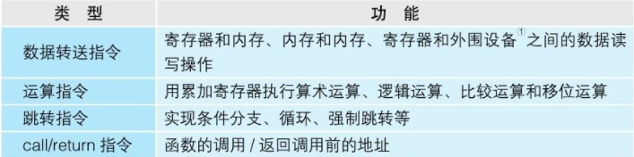

# 计算机基础

## 一、程序运行基础


### *CPU*

* 概念一

  ``` tex
  * 程序：指示计算机每一步动作的一组指令
  * 程序组成：指令和数据
  * 机器语言：CPU可以识别并使用的语言
  * 内存：存储正在运行的程序
  * 内存地址：内存中，用来表示命令和数据存储位置的数值
  * CPU: 属于计算机构成元件，负责程序的解释和运行
  ```

* CPU组成

  * 寄存器

    暂存指令、数据等处理对象，有多种类型的寄存器

  * 控制器

    把内存上的指令、数据等读入寄存器，并根据指令的执行结果来控制整个计算机

    （控制：主要是数据输入输出的时机控制）

  * 运算器

    运算从内存读入寄存器的数据

  * 时钟（可能在CPU外部）

    发出CPU开始计时的时钟信号，1GHZ = 10^9 次/s  1MHZ = 10^6次/s  1KHZ = 10^3次/s


* 寄存器

  开发程序中将寄存器作为对象，程序开发中主要掌握寄存器

  寄存器种类通过名字来区分，eax（累加），ebp（基址）...

  寄存器中可以存储指令和数据（用于运算和表示内存地址的数值）

  


* 汇编语言（assembly）

  通过助记符（memonic）编写，基本是一一对应机器语言指令；

  汇编：汇编语言转成机器语言

  反汇编：机器语言转汇编语言


* 机器语言

  


* 程序计数器

  CPU每执行一个指令，程序计数器会加1；

  当程序存在分支和循环时，程序计数器会存放指定跳转地址

  ``` tex
  函数调用跳转回调用时的位置的方法：
  使用call 和 return 
  在将函数的入口地址设定到程序计数器之前，call指令会把调用函数后要执行的指令地址存储在名为栈的主存内。
  函数处理完毕后，再通过函数的出口来执行return命令。return命令的功能是把保存在栈中的地址设定到程序计数器中。
  ```

  

  

* 标志寄存器

  条件分支中比较运算

  保存当前寄存器的运算结果（累加：负数、零、正数），以及存放溢出（运算结果超过寄存器长度范围）和奇偶校验结果

  寄存器中使用三个bit（位）来分别表示 正数、零、负数

  ``` tex
  CPU比较机制：
  内部做减法，两个寄存器中的数值进行减法，正数表示前者大，零表示相等...
  ```

  

* 基址寄存器、变址寄存器

  对内存上特定内存区进行划分，实现”数组“操作

  实际内存地址 = 基址寄存器（值） + 变址寄存器（值）

  变址寄存器的值相当于数组的索引功能


---


### *内存*

* 概念一

  主存（main memory）

  负责存储程序、数据；DRAM（Dynamic Random Access Memory，动态随机存取存储器）

  使用时需要保证稳定电源供给，并且时常刷新（保证数据最新），断电后自动清楚

  

  内存中存储是按地址划分的


---


### *进制*


* 16进制

  通常使用16进制表示2进制，解决2进制位数过多问题

  A - F分别表示10 - 15

  ``` tex
  2进制 4位
  0000 -  1111
  16进制
  0 - F
  
  32位2进制可以用8位16进制表示
  00000000 - FFFFFFFF
  ```

  