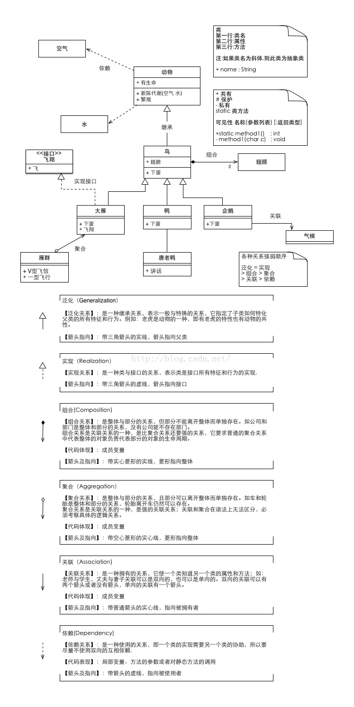

# 设计模式


### UML




---

### 术语

* handle vs. handler

  [闲话handle和handler](https://www.cnblogs.com/idorax/p/6414007.html)

  ``` text
  handle: 句柄(勾柄)
  a handle is an abstract reference to a resource
  是对某个资源的抽象引用
  
  unix / linux中
  进程号pid就是一个handle
  文件描述符(fd)也是一个handle
  系统调用号(syscall num)仍然是一个handle
  
  在操作系统中，一切对用户来说是透明(注：这里的"透明"指的是"看不见摸不着就如空气一样"而不是"一览无余毫无秘密可言")的但是操作系统内核看得懂的无符号整数(unsigned int)都可以被看作是handle
  
  在操作系统设计与实现中，联系内核态和用户态，靠的就是一个个无符号整数
  一个unsigned int占4个字节，可以表征的通信密码总数为2^32(=4G, 约40亿)
  
  对于持有handle的用户，不需要关心内部（内核）资源的具体实现，不能直接访问内核资源，而一个被内核映射成指向内核资源的首地址pointer才能访问真正的内核资源
  
  
  handler: 回调函数（callback）, 或者用delegate / del 等表示
  当某个事件到达时，事先注册的handler会被接收到事件的主体所调用
  is an asynchronous callback subroutine
  是一个异步的回调函数（子程序）
  
  ```

  

* data vs. info

  ``` tex
  data 未经过整理的
  infomation/info  经过组织分析后的数据
  ```

  ``` tex
  data  （datum的复数形式）
  Data is raw, unorganized facts that need to be processed. Data can be something simple and seemingly random and useless until it is organized.
  
  e.g 每个学生成绩
  
  
  infomation/info
  When data is processed, organized, structured or presented in a given context so as to make it useful, it is called information.
  
  "the act of informing"（告知行为） usually in regard to education, instruction, or other knowledge communication.
  
  e.g 平均成绩（从给定data中得到的信息）
  ```


* OnXXXClick / OnXXXSelected / OnXXXUpdate...   vs.   SelectedXXXCallback / UpdateXXXCallback

  ``` tex
  OnXXXUpdate 是指代 XXX内部发生改变（Update）时, 通知外部对象
  UpdateXXXCallback 是指代 外部对象改变XXX，XXX内部作出响应的变化
  
  都是为了降低耦合，使用一个委托（事件）进行拆分两种对象
  ```

  

* Update vs. Upgrade vs. Refresh

  ``` tex
  Update: 获得某物的最新版本	"I need to update this app on my phone"
  						将内存中的对象写入数据库（View Update Model）   						 更新数据
  Upgrade: 得到比现在拥有的更好的东西	"I need to upgrade to a new phone."  （升级手机或换手机）
  Refresh: 查看最近的东西	"I need to refresh the page to see if there is anything new."
  						用数据库更新内存中的对象（内存对象可以看作View, Model Refresh View）		刷新界面
  ```


* Task vs. Mission

  ``` tex
  task 主要表达“工作”、“差事”之意，表示雇主、父母或者老师所摊派、分配、布置或者强加给的工作。比如，XX派某人去执行某个差事。再比如，XX能胜任这样一项工作。（He is equal to such a task.）
  mission 主要表达“使命”、“天职”之意。比如，XX大使带着外交使命出访某国。
  
  As nouns the difference between mission and task is that mission is (countable) a set of tasks that fulfills a purpose or duty; an assignment set by an employer while task is a piece of work done as part of one’s duties.
  As verbs the difference between mission and task is that mission is to send to a mission while task is to assign a task to, or impose a task on.
  作为名词，mission和task的区别在于，mission是(可数的)一组完成目的或职责的任务;由雇主安排的任务，而task是作为一个人的职责的一部分完成的工作。
  作为动词，mission和task的区别在于mission是发送任务，而task是分配任务或强加任务。
  
  Task most likely means something small and simple, like a chore
  Mission can mean like an errand or striving for a goal that requires much effort (like spy movies)
  Assignment: a job/task that is assigned to you. Like a homework assignment.
  任务,很可能是指一些小事和简单的事情，比如家务
  使命,可以是一项使命，或者是为一个需要付出很大努力的目标而奋斗(就像间谍电影)
  分配,分配给你的工作/任务。就像家庭作业一样。
  ```

  


* bind event(handlers) vs. register handler

  ``` tex
  现在就认为
  
  持久存在的对象，如DataManager，使用	Bind Events，如BindUIEvents BindNetEvents
  短暂存在的对象，如Frame（UI）, 使用	register handlers/ register ui event, 如RegisterUIEvent(Handler)
  
  对于短暂存在对象内部的子对象，如果子对象也需要绑定/注册事件回调，可以用bind event handlers
  ```
  
  

* init vs. initialize vs. uninit vs. deinit

  ``` tex
  配套使用
  init()  deinit() 清理函数
  
  initialize() uninitialize() 卸载
  
  initView()  clearView()  refreshView()
  
  updateData()
  ```

  


---


### 基本架构

* MVC vs. MVP vs. MVVM

  ref: https://www.ruanyifeng.com/blog/2015/02/mvcmvp_mvvm.html

  ``` tex
  MVC
  
  单向通信
  View -> Controller -> Model -> View
  视图（View）：用户界面。
  控制器（Controller）：业务逻辑
  模型（Model）：数据保存
  
  View 传送指令到 Controller
  Controller 完成业务逻辑后，要求 Model 改变状态
  Model 将新的数据发送到 View，用户得到反馈
  
  
  互动模式 （接受用户指令）
  一种是通过 View 接受指令，传递给 Controller。
  User -> View -> Controller -> Model -> View
  
  另一种是直接通过controller接受指令。
  User -> Controller -> Model -> View
  
  项目灵活配置
  User -> View <-> Controller —> Model <-> View
  User -> Controller ...
  1. 用户可以向 View 发送指令（DOM 事件），再由 View 直接要求 Model 改变状态。
  2. 用户也可以直接向 Controller 发送指令（改变 URL 触发 hashChange 事件），再由 Controller 发送给 View。
  3. Controller 非常薄，只起到路由的作用，而 View 非常厚，业务逻辑都部署在 View。所以，Backbone 索性取消了 Controller，只保留一个 Router（路由器） 。
  
  
  ------------------------------------------------------------------------------------
  
  
  MVP
  
  双向通信
  View <->  Presenter <-> Model
  1. 各部分之间的通信，都是双向的。
  2. View 与 Model 不发生联系，都通过 Presenter 传递。
  3. View 非常薄，不部署任何业务逻辑，称为"被动视图"（Passive View），即没有任何主动性，而 Presenter非常厚，所有逻辑都部署在那里。
  
  
  
  -------------------------------------------------------------------------------------
  
  MVVM
  
  View <-双向绑定-> ViewModel <->  Model
  类似于MVP，唯一的区别是，它采用双向绑定（data-binding）：View的变动，自动反映在 ViewModel，反之亦然。Angular 和 Ember 都采用这种模式。
  ```

  


---


### 游戏设计模式

