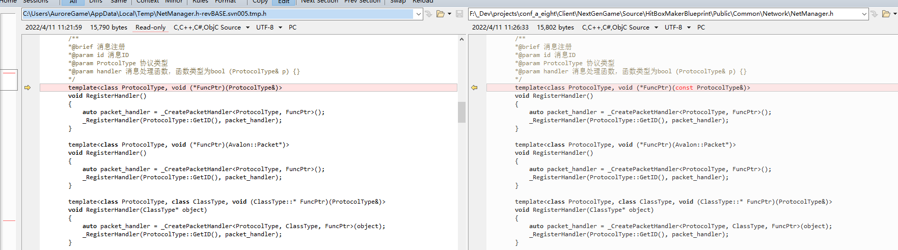

#  C++模板


* link:

  [C++ Template](https://sg-first.gitbooks.io/cpp-template-tutorial/content/)

  [CppTemplateTutorial](https://github.com/wuye9036/CppTemplateTutorial)


---


* 实例1

  特化模板类时继承（Inheritance when specializing a template class）

  ``` c++
  template<typename T>
  class myClass{
      public:
          double Foo(double x){return x;}
      	string GetStr() const {return str;}					//注意  不能使用virtual !!!  即使在特化的类中 override 不会执行到
      private:													//str在特化类中的改动会设置到基类中
      	string str;
  }
  template<>
  class myClass<SpecialType>{
      public:
          double Bar(double x){return x+1.0;}
  }
  //期望
  /*
  myClass<SpecialType> A;
  double y = A.Foo(1.0);
  */
  
  //e.g. 1
  struct myClassBase
  {
      virtual double Foo(double x) const {return x+1.0;}
  };
  
  template<typename T> struct myClass : public myClassBase
  {
       //...
  };
  
  template<>
  struct myClass<SpecialType> : public myClassBase
  {
      double Bar(double x){return x+1.0;}
  }
  
  
  //e.g. 2
  template<typename Derived>
  struct myClassBase
  {
      double Foo(double x) const
      {
          return static_cast<Derived const&>(*this).specialMember(x);
      }
      //all other stuff independent of the derived class specialization
  
      //possibly define specialMember once:
      virtual double specialMember(double x) const { return x; }
  }
  
  template<typename T> struct myClass : public myClassBase<myClass<T> >
  {
      //... special member of Base class is sufficient
  };
  
  template<> struct myClass<SpecialType> : public myClassBase<myClass<SpecialType> >
  {
      virtual double specialMember(double x) const { return x+1.0; }
  };
  ```

* 实例2

  模板判断是否是类类型

  ``` c++
  template<typename T>
  class IsClassT {
  private:
      typedef char One;
      typedef struct { char a[2]; } Two;
      template<typename C> static One test(int C::*);
      template<typename C> static Two test(...);
  public:
      enum { Yes = sizeof(test<T>(0)) == 1 };
      enum { No = !Yes };
  };
  
  // check by passing type as template argument
  template <typename T>
  void check()
  {
      if (IsClassT<T>::Yes) {
          std::cout << " IsClassT " << std::endl;
      }
      else {
          std::cout << " !IsClassT " << std::endl;
      }
  }
  
  template <typename T>
  void checkT(T)
  {
      check<T>();
  }
  
  //check<int>();
  //checkT(myfunc);
  ```

  模板判断类型

  ``` c++
  //判断输入的两个模板类型是否一样
  
  template<typename T1, typename T2>
  struct is__same
  {
  	operator bool()
  	{
  		return false;
  	}
  };
   
  template<typename T1>
  struct is__same<T1, T1>
  {
  	operator bool()
  	{
  		return true;
  	}
  };
  //std::cout << is__same<int, char>() << endl;
  //std::cout << is__same<short int, short int>() << endl;
  
  
  
  //判断输入的模板类型是否为指定的类型
  
  template <typename T>
  struct is_double
  {
  	operator bool()
  	{
  		return false;
  	}
  };
   
  template <>
  struct is_double<double>
  {
  	operator bool()
  	{
  		return true;
  	}
  };
  
  /*
  	if (!is_double<int>())
  		std::cout << "this is not double type" << std::endl;
   
  	if (is_double<double>())
  		std::cout << "this is double type" << std::endl;
  */
  ```

  

* 模板方法的override

  [Override template member in Interface](https://stackoverflow.com/questions/22422845/override-template-member-in-interface)

  ``` c++
  //注意： member function template cannot be virtual
  //注意：a member function template in a derived class cannot override a virtual member function from the base class.
  
  //例：
  class Base
  {
  public:
      template <typename T>
      void print(T var)
      {
          std::cout << "This is a generic place holder!\n";
      }
  };
  
  class A: public Base
  {
  public:
      template <typename T>
      void print(T var)
      {
          std::cout << "This is A printing " << var << "\n";
      }
  };
  
  class B: public Base
  {
  public:
      template <typename T>
      void print(T var)
      {
          std::cout << "This is B printing " << var << "\n";
      }
  };
  
  int main()
  {
      Base * base[2];
      base[1] = new A;
      base[2] = new B;
  
      base[1]->print(5);  //output : This is a generic place holder!
      base[2]->print(5);	//output : This is a generic place holder!
  
      delete base[1];
      delete base[2];
      return 0;
  }
  // 需要使用  A *a = new A;  //print才能输出对应的子类 A的实现方法
  
  //注意：Templated functions are instantiated at the POI(Point of Instantiation 实例化点) and can't be virtual
  //注意：Templated functions are a compile-time mechanism, virtual functions a runtime one.
  //例2:
  #include <iostream>
  #include <stdexcept>
  #include <string>
  
  //Your functions, in order to be polymorphic, should be marked with virtual
  class Base
  {
  public:
      template<typename T>
      std::string method() { return "Base"; }
  };
  
  class Derived : public Base
  {
  public:
      template<typename T>
      std::string method() override { return "Derived"; }
  };
  
  int main()
  {
      Base *b = new Derived();
      std::cout << b->method<bool>() << std::endl;  //output : Base
      return 0;
  }
  
  //修改：
  //use static polymorphism to simulate the behavior of "template virtual" methods:
  #include <iostream>
  #include <stdexcept>
  #include <string>
  
  //where method is the interface and _method is the implementation. 
  //To simulate a pure virtual method, _method would absent from Base.
  
  template<typename D>
  class Base
  {
      template<typename T>
      std::string _method() { return "Base"; }
  public:
  
      template<typename T>
      std::string method()
      {
         return static_cast<D&>(*this).template _method<T>();
      }
  };
  
  class Derived : public Base<Derived>
  {
      friend class Base<Derived>;
  
      template<typename T>
      std::string _method() { return "Derived"; }
  public:
      //...
  };
  
  int main()
  {
      Base<Derived> *b = new Derived();
      std::cout << b->method<bool>() << std::endl;
      return 0;
  }
  //补充
  /*
  for a const method, static_cast<D&> changes to static_cast<const D&>. 
  for an rvalue-reference (&&) method, it changes to static_cast<D&&>.
  */
  ```

  

* 静态函数模板需要声明在类外部（同时static不能添加到类外）

  error: explicit specialization cannot have a storage class [-Werror]

  [Explicit template specialization cannot have a storage class - member method specialization](https://stackoverflow.com/questions/29041775/explicit-template-specialization-cannot-have-a-storage-class-member-method-spe)

  ``` c++
  //error : error: explicit specialization in non-namespace scope 'class Myclass'
  //error: template-id 'func' in declaration of primary template
  class Myclass
  {
      template <typename T>
      static T func()
      {
          T obj;
          return obj;
      }
      
      template<>
      static int func<int>()
      {
  
      }
  };
  
  //fix :
  //特化函数模板，需要在类外部，并且不能添加static关键字
  struct Myclass {
      template <class T>
      static T func() {
          T obj;
          return obj;
      }
  };
  
  //注意 特化模板需要放到cpp中 ！！！
  //否则可能会出现 link-error-duplicate-symbol
  template <>
  int Myclass::func<int>() { return 42; }
  
  
  //例2：
  struct foo {
    template<typename T>
    void bar() {}
  
    template<typename T>
    static void baz() {}
  };
  
  int main() {
    foo f;
    f.template bar<void>();
    foo::baz<void>();
  }
  
  //fix:
  struct foo {
    template<typename T, typename U>
    static void bar(T, U) {}
  
    // Error, you'd need to also specialize the class, which requires a template class, we don't have one.
    // template<>
    // static void bar(int, int) {}
    // test.cpp:2:12: error: explicit specialization of non-template ‘foo’
    //     2 | struct foo {
    //       |            ^
    
    // Partial specializations aren't allowed even in situations where full ones are
    // template<typename U>
    // static void bar<int, U>(int, U) {}
    // test.cpp:14:33: error: non-class, non-variable partial specialization ‘bar<int, U>’ is not allowed
    //   14 |   static void bar<int, U>(int, U) {}
    //      |                                 ^
  
    // Instead just overload
    template<typename U>
    static void bar(int, U) {}
  };
  ```

  

* 模板同名冲突

  ``` tex
  解决方案1：
  	模板参数添加const 
  ```

  