# C++语法


### CPU眼里的C++

* 工具

  https://gcc.godbolt.org/

* 传值 vs. 传引用 vs. 传指针

  1. cpu内没有传值、传指针概念，传值的数值不同；同样没有形参和实参概念

  2. 传递形参，即给寄存器赋值

     寄存器是 主调函数 向 被调函数 输入参数的 载体

  3. 传引用本质上还是传指针

  ``` c++
  //pass-by-value
  void func_1(int x, int y, int z)
  {
      x = 0;
  }
  //pass-by-pointer
  void func_2(int* x, int* y, int* z)
  {
      *x = 0;
  }
  //pass-by-reference
  void func_3(int& x, int& y, int& z)
  {
      x = 0;
  }
  int a = 1;
  int b = 2;
  int c = 3;
  int main()
  {
      func_1(a, b, c);			//a= 1, b= 2, c= 3
      func_1(1, 2, 3);			//a= 1, b= 2, c= 3
      func_2(&a, &b, &c);			//a= 0, b= 2, c= 3
      func_3(a, b, c);			//a= 0, b= 2, c= 3
  }
  ```

  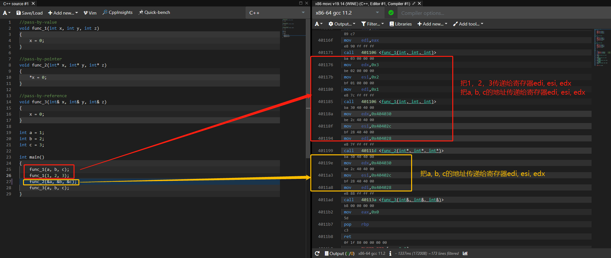


* 模板和泛化

  * 对于未被调用的模板类，编译器不会进行编译（懒惰原则）

  * CPU对模板无感，本质上是编译器根据我们提供的脚本，自动补全代码，代码涉及类型越多，编译生成的代码版本也越多

  * 单步调试时，源代码可能无法一一对应，模板代码类似于黑盒，难于调试

    ``` c++
    template<typename T>
    T add(T x, T y)
    {
        return (x + y);
    }
    
    class A
    {
    public:
        int x;
    
        A& operator+ (const A& a)           //需要重载运算符才能进行模板运算
        {
            this->x += a.x;
            return *this;
        }
    };
    
    int main()
    {
        add<int>(1, 2);
        add<float>(1, 2);
        A x, y;
        add<A>(x, y);
    }
    
    int add(int x, int y)
    {
        return x + y;
    }
    
    float add(float x, float y)
    {
        return x + y;
    }
    ```

  

* 左值 vs. 右值

  ``` c++
  /*
  i 	= 	i + 1;
  左值 	  右值
  
  左值用于写操作，可以存储数据
  右值用于读操作，读取的数据会存在一个“看不见的”临时变量中
  
  一般来说：
  左值表达式，往往在等号左边，由于往往需要支持写操作，所以常以 变量 或 引用 的形式出现
  右值表达式，往往在等号右边，多用于读操作和计算，但读取和存储计算结果的地方，往往在代码中不可见（内部寄存器中）
  左值可以降级为右值使用，但右值不能升级为左值使用
  CPU眼里没有左右值概念，通过汇编指令，可以分析出代码含义
  
  左右值语法错误的判断:
  1.变量的后加(i++)操作，属于右值；可以理解为“变量经过后加操作，变成了看不见的临时变量或者常量”
      ++i++		错误  
      ++(i++)		错误
      ++(1)		错误
      
  2.变量的前加操作(++i)，属于左值，变量经过前加操作，依然可见，可读可写
  	++i = 1;	正确
  	(++i)++		正确
  	++(++i)		正确
  	++++++++i	正确	
  */
  ```

  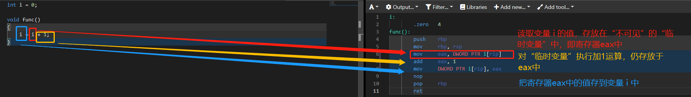


* 线程 vs. 进程

  ``` c++
  //test_1.cpp
  #include <stdio.h>
  #include <unistd.h>
  
  int a = 1;
  int main()
  {
      printf("address: 0x%p, value: %d", &a, a);
      sleep(10000000);
  }
  
  //g++ test_1.cpp -o p1
  // .\p1.exe
  ```

  ``` c++
  //test_1.cpp
  #include <stdio.h>
  #include <unistd.h>
  
  int a = 2;
  int main()
  {
      printf("address: 0x%p, value: %d", &a, a);
      sleep(10000000);
  }
  
  //g++ test_1.cpp -o p2
  // .\p2.exe
  ```

  

  ``` c++
  /*
  两个窗口（进程）同时执行，变量a的内存地址一样，但是所存的值不一样
  
  原因：
  	1. CPU内存管理单元 MMU(memory management unit)
  		两个进程中 变量a的地址为虚拟地址，通过MMU，实际映射到不同的物理内存地址上
  */
  
  /*
  进程 vs. 线程
  
  进程：拥有空间独立性，一般来说，进程之间无法相互访问（排除进程之间的通信方法）
  	每个进程拥有独立的物理内存空间，MMU将这块物理内存空间保护起来，使其与其他进程隔离开来
  	
  线程：不被MMU束缚（或者早期计算机不存在MMU）,那时称为线程（task），没有独立的空间，
  	线程之间可以通信，便于实现多任务编程，但是当一个线程奔溃时，将导致所有线程奔溃（网络服务器常采用多进程，而非多线程）
  
  进程和线程
  1、进程是操作系统进行资源分配和调度的基本单位，线程是CPU调度的基本单位，是进程中一个单一顺序的执行流。
  2、把进程当成做一件事情，操作系统管理进程，负责调度进程。具体怎么做？是进程的事。一个进程至少有一个主线程，可以有多个辅助线程，真正做事的是线程。进程做的事情：可以是一个线程按顺序一步一步做，也可以启动多个线程，协作完成。
  3、进程有一块内存，也就是可执行文件装载到操作系统中，从上到下大致为：栈，堆，全局存储区，常量存储区，代码区。而线程可以认为是一个执行流，每个线程都有一个自己的调用堆栈，可以访问进程中的资源，对于共享资源需要进行同步控制。而一个进程是不能访问另一个进程的资源，只能通过进程间的通信传递数据。
  4、进程之间的切换代价大，而线程之间的切换代价小。
  5、多线程的使用场景：
  　　a、对于UI界面，如果执行一个耗时的操作，为了让界面及时响应，可以重启一个线程，去执行。
  　　b、同时有多个请求，可以创建一个线程池，来一个请求，从线程池中拿出一个空闲的线程处理。
  　　c、对于网络数据的接受，创建一个线程用于接受数据，接受的数据保存在本地，处理之后一个一个转发出去。
  */

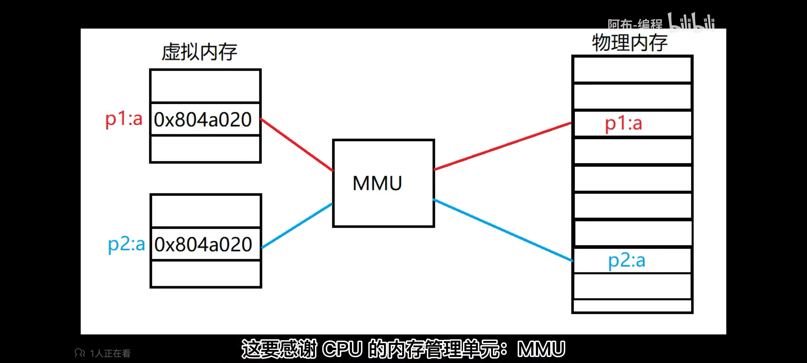


* 竞争，线程切换，线程上下文

  ``` tex
  竞争：由于多线程、多进程，共同读写共享资源时，会出现竞争
  	共享资源：全局变量、静态变量、或者任何一段内存
  	
  解决方法：加锁
  注意点：因为加锁导致等待的线程或者进程，虽然会释放一定的CPU资源，但是还是会影响程序运行时的表现，设计多任务时，需要注意任务优先级
  ```

  ``` c++
  #include <stdio.h>
  #include <unistd.h>
  #include <pthread.h>
  
  int sum = 0;
  void* task(void* ptr)
  {
      for(int i = 0; i < 1000; ++i)
      {
          disable_interrupt();            //关闭中断，禁止线程调度，消除所有潜在竞争对手，影响较大
          sum++;
          enable_interrupt();             //开启中断，等待执行完后，允许其他线程执行
  
          pthread_mutex_lock(&lock);      //相比于中断，使用互斥锁，可以让不符合条件的线程放弃执行，进入等待状态，
          sum++
          pthread_mutex_unlock(&lock);
  
          usleep(10);
      }
  }
  
  int main()
  {
      pthread_t thread1, thread2;
      pthread_create(&thread1, 0, task, 0);
      pthread_create(&thread2, 0, task, 0);
      pthread_join(thread1, 0);
      pthread_join(thread2, 0);
      printf("%d\n", sum);
  }
  
  /*
  命令行执行
  g++ test_2.cpp -lpthread
  for i in {1..10}; do ./a.out; done
  */
  ```

    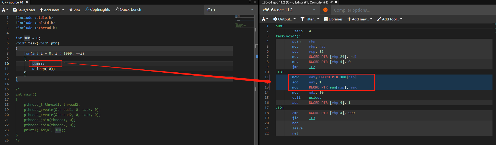

  ``` c++
  /*
  如上：sum++ 指令在CPU中不为原子操作，在执行三条指令时，如果发生线程切换，很可能发生竞争
  */
  ```

  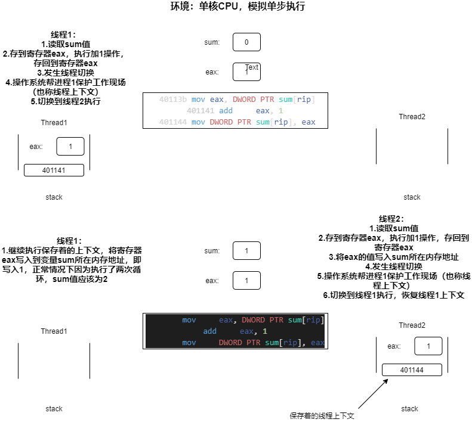

  ``` tex
  不同的操作系统对线程上下文的保护，会有差异
  ```

  

  


* 数组

  * 内存排布

    ``` tex
    数组在内存中连续排布
    		
    		char a[8] = {1,2,3,4,5,6,7,8}
    		char* p = a
    	
    		...  1   2   3   4   5   6   7   8  ...
    			 ⬆
    		 char* p = &a[0]
    ```

  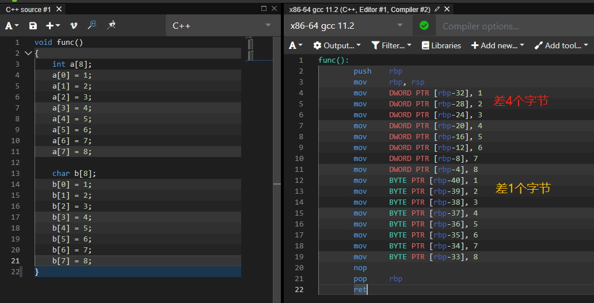

  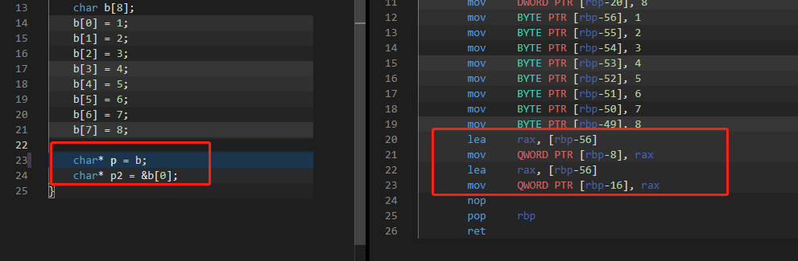

  ​			 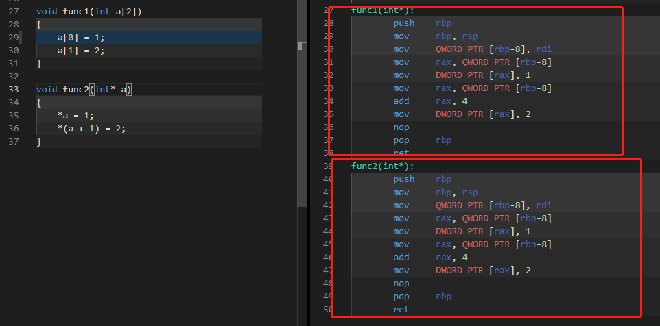			

  ​			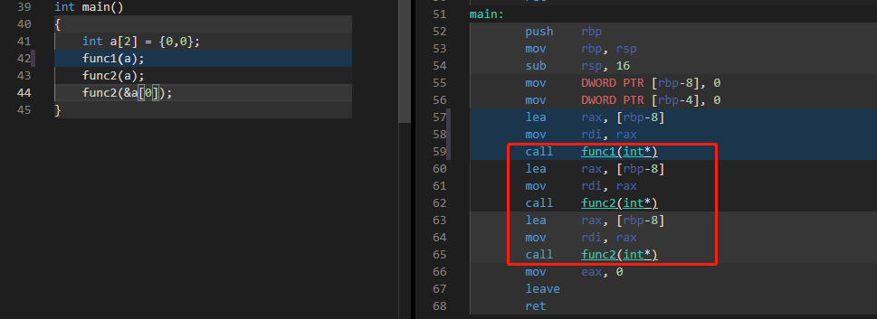

  

  * 数组传递

    **本质上是传递指针**

    ``` tex
    编译器不会为数组 在内存中构建一个临时数组变量
    数组传递只是通过  一个存放了数组首地址的临时指针变量  进行传递，即传递数组内存首地址，而非传递数组的临时变量
    数组读写操作 等价于 指针的*操作
    
    改变传递到函数内的数组指针对应的值，会改变函数外的数组对应的值
    ```

    ``` c++
    //数组传递 一般写法
    //传递首地址指针，并且防止数组越界，同时传递数组长度
    void func(int* array, int length)
    ```

  * 多维数组

    **CPU眼中，一维数组和其他多维数组，都是一段连续的一维内存，多维数组只是索引方式不同，应对不同使用场景** 

    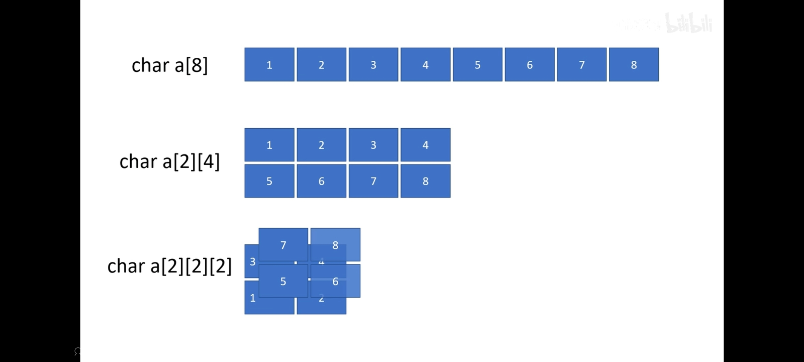

    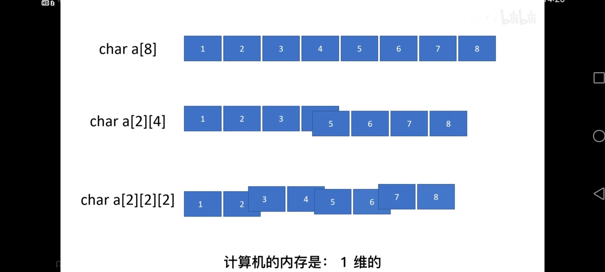

    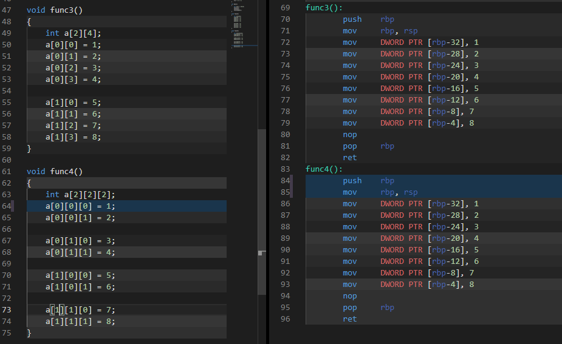

    ``` c++
    void func()
    {
        int a[8];
        a[0] = 1;
        a[1] = 2;
        a[2] = 3;
        a[3] = 4;
        a[4] = 5;
        a[5] = 6;
        a[6] = 7;
        a[7] = 8;
    
        char b[8];
        b[0] = 1;
        b[1] = 2;
        b[2] = 3;
        b[3] = 4;
        b[4] = 5;
        b[5] = 6;
        b[6] = 7;
        b[7] = 8;
    
        char* p = b;
        char* p2 = &b[0];
    }
    
    void func1(int a[2])
    {
        a[0] = 1;
        a[1] = 2;
    }
    
    void func2(int* a)
    {
        *a = 1;
        *(a + 1) = 2;
    }
    
    int main()
    {
        int a[2] = {0,0};
        func1(a);
        func2(a);
        func2(&a[0]);
    }
    
    void func3()
    {
        int a[2][4];
        a[0][0] = 1;
        a[0][1] = 2;
        a[0][2] = 3;
        a[0][3] = 4;
    
        a[1][0] = 5;
        a[1][1] = 6;
        a[1][2] = 7;
        a[1][3] = 8;
    }
    
    void func4()
    {
        int a[2][2][2];
        a[0][0][0] = 1;
        a[0][0][1] = 2;
    
        a[0][1][0] = 3;
        a[0][1][1] = 4;
    
        a[1][0][0] = 5;
        a[1][0][1] = 6;
    
        a[1][1][0] = 7;
        a[1][1][1] = 8;
    }
    ```

    


---


### 指针

* 内存

  物理结构：DRAM芯片，存储数据

*  操作系统

  结合硬件软件，抽象物理内存空间，虚拟存储器（Virtual Memory）

* Virtual Memory

  形象表示为，一块足够大的空间，分为一个个连续的格子，每个格子为一个字节（byte，8bit），每个格子有连续的序号（独立且唯一的编号）

  ``` tex
  2GB ==> 2*1024 ^ 3 byte
  ```

  * 内存地址

    ``` tex
    int a = 1024; 
    
    64位系统中大小通常为4个字节，即占用上述抽象的4个格子
    第一个格子的编号为变量a的内存地址
    可以使用 & 取地址符获取 a 的地址
    ```

* 指针

  > 指针也是一个数据类型
  >
  > 指针类型不是单独存在的，是由其他类型派生而来的，如指向int的指针类型，定义为int* a_ptr
  >
  > 指针类型的值，在内存中也占据一块内存空间（常为4个字节）

  * 指针类型 vs. 指针类型的变量 vs. 指针类型的值

    ``` c
    int a = 1024;
    int* p = &a;    // 含义：p指向a
    // p的值是变量a(int类型)在内存中存储的第一个地址单元的编号（首地址），可以读取该地址上存储的数据
    // p的类型是int类型的指针，表明指针指向的数据占用的内存大小
    // *p 的值是 变量a的内存地址  * 为解引用运算符
    // p 的值是 指针p本身占用的内存地址
    ```

  * 指针加减运算

    > 加法运算：不是简单的加一，而是根据指针类型，递增相应的大小

    ``` tex
    一个int类型的指针，加一时，指针所保存的地址会加上int类型所占用的存储单元的个数，从而使指针跨过当前数据，指向下一个完整的数据
    ```

  * 指针和数组

    


---


### 对象模型 Object Model

* 虚机制（Virtual mechanism）- 虚指针、虚表

  ref: 《侯捷C++面向对象下》
  
  ``` c++
  //🌰
  class A {
  public:
    virtual void vfunc1();
    virtual void vfunc2();
    		  void func1();
    		  void func2();
    
  private:
    int m_data1, m_data2;
  };
  
  class B : public A {
  public:
    virtual void vfunc1();
    		  void func2();
  private:
    int m_data3;
  };
  
  class C : public B {
  public:
    virtual void vfunc1();
    		  void func2();
  private:
    int m_data1, m_data4;
  };
  
  
  //虚表访问 编译器内部方式
  (* (p->vptr)[n])(p);
  或
  (* p->vptr[n] )(p);
  ```
  
  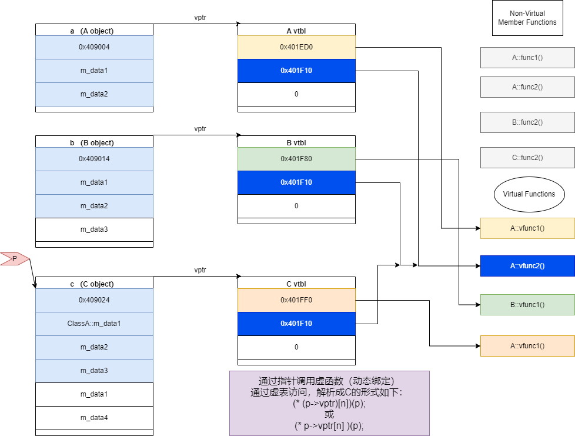
  
  
  
* 函数调用 - 动态绑定 vs. 静态绑定

  ``` tex
  静态绑定调用：
  	汇编指令call + 函数地址
  	
  动态绑定调用：
  	需要满足三个条件：
  		1. 是指针调用
  		2. 指针会向上转型(Upcasting)，即派生类转为基类，安全转型，即多态
  		3. 调用虚函数
  ```

  


---


* 静态变量初始化

  * ref: https://segmentfault.com/q/1010000004157283

  **静态变量的内存分配和初始化**

  对于C语言的全局和静态变量，不管是否被初始化，其内存空间都是全局的；如果初始化，那么初始化发生在任何代码执行之前，属于编译期初始化。由于内置变量无须资源释放操作，仅需要回收内存空间，因此程序结束后全局内存空间被一起回收，不存在变量依赖问题，没有任何代码会再被执行！

  C++引入了对象，这给全局变量的管理带领新的麻烦。C++的对象必须有构造函数生成，并最终执行析构操作。由于构造和析构并非分配内存那么简单，可以说相当复杂，因此何时执行全局或静态对象（C++）的构造和析构呢？这需要执行相关代码，无法在编译期完成，因此C++标准规定：全局或静态对象当且仅当对象首次用到时才进行构造，并通过atexit()来管理对象的生命期，在程序结束之后（如调用exit，main），按FILO顺序调用相应的析构操作！

  总结：

  > 全局变量、文件域的静态变量和类的静态成员变量在main执行之前的静态初始化过程中分配内存并初始化；局部静态变量（一般为函数内的静态变量）在第一次使用时分配内存并初始化。这里的变量包含内置数据类型和自定义类型的对象。

  修改：

  ``` tex
  局部静态变量的内存分配应该和全局变量一样，在main函数之前分配好，在第一次调用的时候只是初始化。
  ```

  
  
  **静态变量初始化的线程安全性说明**
  
  > 非局部静态变量一般在main执行之前的静态初始化过程中分配内存并初始化，可以认为是线程安全的；
  >
  > 局部静态变量在编译时，编译器的实现一般是在初始化语句之前设置一个局部静态变量的标识来判断是否已经初始化，运行的时候每次进行判断，如果需要初始化则执行初始化操作，否则不执行。这个过程本身不是线程安全的。
  
  C++11标准针规定了局部静态变量初始化需要保证线程安全，具体说明如下：
  If control enters the declaration concurrently while the variable is being initialized, the concurrent execution shall wait for completion of the initialization

  新的编译器大多对C++11的标准支持，因此也保证了这一点，但是C++03标准之前并无此说明，所以很多旧版本的编译器并不能完全支持。
  
  注：VS2008 测试多线程的条件下虽然只有一个线程执行一次初始化，但非初始化的线程并不会等待初始化结束，而是立即返回未正确初始化的静态对象。
  
  针对局部静态变量初始化的线程安全性，g++编译器的实现相当于使用了一个全局锁来控制一个局部静态变量的标识（标识用来判定是否已经初始化）。详情参考：[http://www.cnblogs.com/xuxm2007/p/4652944.html](https://link.segmentfault.com/?enc=DE7TAsn5gSzW7%2Bvvfm0%2BtA%3D%3D.9jLYm1gI%2FeZ%2FBDy4iOpW57c5VeEdNX2fvuR3g%2BPEc4nc9rrVK6DuJHa8ey6Kx6hj)
  
  **使用相关：**
  
  以前的标准都没有规定局部静态变量的初始化在并发模式下是否安全，很多旧版本的编译器并没有处理它的并发安全问题。因此在不支持C++11标准的编译环境下，多线程程序最好不要使用需要明显初始化的局部静态变量（对象），如果需要使用（比如单例模式中），则可以考虑使用一个全局锁或静态成员变量锁，最好不要使用局部静态变量锁，因为其本身存在一个构造的问题，多个线程获取实例的时候，可能会出现一个线程在进行锁对象构造，另一个线程则避开了构造，在锁对象还没有完全构造完成的情况下，就lock了，这个时候的行为能不能成功锁定取决于锁的实现了，虽然一般的实现不会出现问题但终归不是很严谨。


* C++ const 常量内存分配 ???

  ``` tex
  ref: https://blog.csdn.net/xiazhiyiyun/article/details/71969618
  对于const全局常量，如果初始值是字面值常量，一般会存放在常量表中，编译器在编译过程中就会直接使用常量表中的值来进行语句的操作。如果经过优化，可能会使得直接使用常而放弃存储在常量表中。
  对于编译器没有办法处理的初始值常量，一般就需要分配到内存空间，然后等待运行时进行赋值，取值时候也是从内存空间中提取。
  对于非static 的 const局部变量(如函数中)，由于其是局部变量，符号表中将不存在其值，如果需要内存空间也是在栈中进行分配。根据编译器的优化，以及const 变量初始值的不同来决定是否需要分配内存空间。
  对于static 的 const局部变量(如函数中)，会根据编译器的优化能力，以及初始值，来决定其是不进行存储，还是直接存储在常量符号表，或者是栈中等等均有可能。
  对于第三点和第四点可以尝试验证。
  ```

  


* C++局部静态变量的内存什么时候创建

  ``` tex
  ref:https://www.zhihu.com/question/40693991
  
  局部静态变量是保持在程序的全局/静态存储区，初始化是在第一次执行时处理
  
  在Windows和Linux平台，全局/静态存储区跟执行代码一样，是在编译过程中就已经生成在执行文件中。
  在执行文件被加载（比如执行a.exe或a.out）时，由操作系统直接映射到内存中，即是在程序运行时就创建
  
  局部静态跟全局静态内存中性质一样，文件里都在数据段。
  唯一区别局部静态变量有作用域限制，是靠编译器帮忙语法检测。
  局部静态变量有个初始化问题，当多次调用一个含有局部静态变量的函数时候，怎么保持之初始化一次。
  程序会在内存中第一个bit位，来标识是否初始化过。所以答案是，该局部静态变量跟全局变量一样很早就存在于全局数据区。
  但当第一次运行到该函数，会检测一个位，来判断是否已经初始化
  ```

  ``` tex
  《Working Draft, Standard for Programming Language C++》
  
  The keyword static can be used to declare a local variable with static storage duration.
  The static storage shall last for the duration of the program. 
  The zero-initialization of all block-scope variables with static storage duration is performed before any other initialization takes place. 
  Constant initialization of a block-scope entity with static storage duration, if applicable, is performed before its block is first entered. 
  Such a variable is initialized the first time control passes through its declaration; 
  such a variable is considered initialized upon the completion of its initialization. 
  If the initialization exits by throwing an exception, the initialization is not complete, so it will be tried again the next time control enters the declaration. 
  If control enters the declaration concurrently while the variable is being initialized, the concurrent execution shall wait for completion of the initialization. 
  If control re-enters the declaration recursively while the variable is being initialized, the behavior is undefined. Destructors for initialized objects (that is, objects whose lifetime has begun) with static storage duration are called as a result of returning from main and as a result of calling std::exit.
  ```

  

* 初始化、显示初始化、隐式初始化

  ``` tex
  ref: https://www.zhihu.com/question/31938613
  
  初始化：分配空间给变量后，赋予初值
  
  非自动变量是在编译期分配其空间，可以显式（即手工）给予初值，否则会隐式把该空间内所有内容设为零。
  
  自动变量是运行时每次进入函数时，才分配空间的，同一变量名实际上会对应不同的空间（例如考虑递归时的情况）
  与非自动变量不同，自动变量是不会自隐式清零的。若没有在定义变量时显式初始化，未赋值前，该变量的内容是不确定值。
  
  区分是否可以自动清零的原因：
  非自动变量只有一份，可以在编译、链接及加载过程初始化其值，而没有什么运行时开销。
  自动变量进行初始化是有运行时开销的。
  存在只需为变量分配空间而不需初始化，例如sprintf(buffer, ...)中的buffer若是自动变量，为它初始化是徒劳无功的。
  所以C语言设计时为了性能，便容许自动变量不进行初始化。这和许多语言不一样。
  
  
  静态变量的隐示初始化，是在加载的时候，.bss区直接初始化为0。即不赋值，静态变量为0。
  静态变量声明不初始化，会在.bss中。.bss不会占据可执行文件空间。
  在程序加载时，映射到匿名文件二进制清零。声明的变量是要占空间的。只是如果是指针，没有初始化分配，不占堆空间
  
  常量，比如立即数，可能在代码段。但是常量串，比如"hello world"在.rodata常量区。
  另外用const修饰的全局变量是放入常量区的，但是使用const修饰的局部变量只是设置为只读起到防止修改的效果（因此可以通过地址修改），没有放入常量区。
  ```

  


---


* NULL、0、nullptr

  [NULL、0、nullptr](http://www.cppblog.com/airtrack/archive/2012/09/16/190828.aspx)

  ``` c
  //在C语言中，用NULL表示空指针
  int *i = NULL;
  foo_t *f = NULL;
  
  //通常定义如下：
  #define NULL((void *)0)
  //NULL是一个void *的指针，会隐式转换成对应的其他类型
  ```

  ``` c++
  //在C++中，由于是强类型语言，void *不能转换成其他的指针类型
  //编译器通常将NULL定义如下：
  #ifdef __cplusplus
  #define NULL 0
  #else
  #define NULL((void *)0)
  #endif
  
  //C++中，用0表示空指针，即如上定义
  //在C++11之前，通常用0而不是NULL来表示空指针
  ```

  ``` c++
  //foo.h
  void bar(sometype1 a, sometype2 *b);
  //a.cpp
  bar(a, b);
  //b.cpp
  bar(a, 0);
  
  //foo.h ---1
  //重载bar()
  void bar(sometype1 a, sometype2 *b);
  void bar(sometype1 a, int i);
  //为了满足b.cpp的bar()能正常调用
  bar(a, static_cast<sometype2 *>(0));
  
  //如果一开始在b.cpp中
  bar(a, NULL);
  //那么在重载方法新增时，下意识会认为调用的是 void bar(sometype1 a, sometype2 *b); 导致后续运行结果不正确
  
  //如果是使用0来表示空指针，那就会够“明显”，因为0是空指针，它更是一个整形常量。
  
  //C++11添加了nullptr作为空指针，可以有效避免上述问题
  ```
  [NULL、0、nullptr](https://www.cnblogs.com/silentNight/p/5507991.html)

  ``` c++
  //C++11前自定义nullptr
  const                                     //---解释1
  class nullptr_t
  {
  public:
      template<class T>
      inline operator T*() const			 //---解释2
          { return 0; }
  
      template<class C, class T>
      inline operator T C::*() const		 //---解释3
          { return 0; }
   
  private:
      void operator&() const;				 
  } nullptr = {};							 // = {} 初始化变量  （c++11后）
  
  //解释1
  //类前加const，修饰类{}后面定义的对象
  const 
  class A
  {
  public:
      int i;
  }a, b;
  
  //等价于
  class A
  {
  public:
      int i;
  };
  const A a1;
  const A a2;
  
  //解释2
  //重载 类型转换运算符 类似重载operator = , 但是类型转换运算符 没有返回值
  //解释3 
  //重载 内部类的类型转换
  ```

  

* 打印基本数据类型

  ``` c++
  hhd，hhx，hhu，     	 这几个都是输出8位的，
  hd， hx， hu，      	 这几个都是输出16位数据的，
  d，  lx， ld， lu， 	这几个都是输出32位的，
  lld，ll， llu，llx，	这几个都是输出64位的，
  其中 %llu 64位无符号， %llx 64位16进制数
  ```

  


* forward declaration of class 类的前向声明

  ``` text
  可以声明一个类而不定义它
     class Screen;//declaration of the Screen class
     这个声明,有时候被称为前向声明(forward declaration),在程序中引入了类类型的Screen.在声明之后,定义之前,类Screen是一个不完全类型(incompete type),即已知Screen是一个类型,但不知道包含哪些成员.
     不完全类型只能以有限方式使用,不能定义该类型的对象,不完全类型只能用于定义指向该类型的指针及引用,或者用于声明(而不是定义)使用该类型作为形参类型或返回类型的函数.
     
     使用前置声明是因为不想引入该类的头文件，但是前置声明是有限制的，只能用来定义前置声明类的指针或者引用。如果继承了该类，则不能使用前置声明，因为继承是需要了解类的内部结构的
  ```

  ``` c++
  //e.g.
  #ifndef FIRSTPAGE_H
  #define FIRSTPAGE_H
  
  #include "ui_dialog.h"
  //#include <QWizardPage>
  class QWizardPage;              //报错了
  
  class FirstPage : public Ui::Dialog, public QWizardPage
  {
  public:
      FirstPage();
  };
  #endif // FIRSTPAGE_H
  ```

  ``` text
  类似的报错信息：
  Syntax error missing ; before *
  ```


* static_cast     vs.     dynamic_cast      vs.     reinterpret_cast     vs.    const_cast 

  [c++的四种强制类型转换](https://www.cnblogs.com/silentNight/p/5508602.html)

  [C++ static_cast、dynamic_cast、const_cast和reinterpret_cast（四种类型转换运算符）](https://naoketang.com/p/zr8qd13lqodg)

  ``` text
  c风格：  Type b = (Type)a
  
  c++风格：
  
  const_cast   去const属性或volatile属性
  
  static_cast  静态类型转换，int转char  （编译期间转换）
  	static_cast 类似于C风格的强制转换。无条件转换，静态类型转换。用于：
  　　1. 基类和子类之间转换：其中子类指针转换成父类指针是安全的;父类指针转换成子类指针是不安全的。
  　　	 (基类和子类之间的非动态类型转换只能用static_cast)(基类和子类之间的动态类型转换必须用dynamic_cast)
  　　2. 基本数据类型转换。enum, struct, int, char, float等。static_cast不能进行无关类型(如非基类和子类)指针之间的转换。
  　　3. 把空指针转换成目标类型的空指针。
  　　4. 把任何类型的表达式转换成void类型。
  　　5. static_cast不能去掉类型的const、volitale属性(用const_cast)。
  　　
  dynamic_cast 命名上理解是动态类型转换。如子类和父类之间的多态类型转换,准确的说是父类指针转子类指针  (运行期转换)
      dynamic_cast 有条件转换，动态类型转换，运行时类型安全检查(转换失败返回NULL)：
      1. 安全的基类和子类之间转换。
      	(向下转换时，具有类型检查，比static_cast更安全)
      2. 必须要有虚函数。  注意:非多态类的父类和子类用static_cast转换
      	（这是由于运行时类型检查需要运行时类型信息，而这个信息存储在类的虚函数表
      	（关于虚函数表的概念，详细可见<Inside c++ object model>）中，只有定义了虚函数的类才有虚函数表，没有定义虚函数的类是没有虚函数表的。）
      3. 相同基类不同子类之间的交叉转换但结果是NULL。
      
      dynamic_cast主要用于类层次间的上行转换和下行转换，还可以用于类之间的交叉转换。
      dynamic_cast 会在程序运行过程中遍历继承链，如果途中遇到了要转换的目标类型，那么就能够转换成功，如果直到继承链的顶点（最顶层的基类）还没有遇到要转换的目标类型，那么就转换失败。对于同一个指针（例如 pa），它指向的对象不同，会导致遍历继承链的起点不一样，途中能够匹配到的类型也不一样，所以相同的类型转换产生了不同的结果。
      
      
  reinterpret_cast 仅仅重新解释类型，但没有进行二进制的转换
  	reinterpret_cast 仅仅重新解释类型，但没有进行二进制的转换：
  　　1. 转换的类型必须是一个指针、引用、算术类型、函数指针或者成员指针。
  　　2. 在比特位级别上进行转换。它可以把一个指针转换成一个整数，也可以把一个整数转换成一个指针
  　　   (先把一个指针转换成一个整数，在把该整数转换成原类型的指针，还可以得到原先的指针值)。但不能将非32bit的实例转成指针。
  　　3. 最普通的用途就是在函数指针类型之间进行转换。
  　　4. 很难保证移植性。
  ```

  ``` text
  向下转型：需要通过static_cast 或  dynamic_cast
  
  向上转型：c++允许隐式向上转换
  将派生类的对象赋值给基类的对象 （实际上将派生类中基类的部分直接赋给基类的对象）
  向上转型时不执行运行期检测，效率提高，但是还是有安全隐患
  int main() {
  	int n = 100;
      Derived *pd2 = reinterpret_cast<Derived*>(&n);
      Base *pb2 = dynamic_cast<Base*>(pd2);  //p2不是对象
      cout<<"pd2 = "<<pd2<<", pb2 = "<<pb2<<endl;
      cout<<pb2->get_a()<<endl;  //输出一个垃圾值
      pb2->func();  //内存错误
      //pb2 指向的是一个假的“对象”，它没有虚函数表，也没有虚函数表指针，而 func() 是虚函数，必须到虚函数表中才能找到它的地址。
  }
  
  C++不建议使用C风格的强制类型转换 Type b = (Type)a
  ```

  ``` c++
  //使用static_cast进行float double int等基本数据类型转换
  
  //int64 to double
  int64_t a = 1234;
  double d = static_cast<double>(a);
  double f = a;
  
  //尽量不要使用隐式类型转换 或者 C风格的强制类型转换 !!!
  /*
  Implicit casts are a common source of compiler warnings, meaning you may be adding noise to the build (either now, or later when better warning flags are added).
  
  The next maintenance programmer behind you will see an implicit cast, and needs to know if it was intentional behavior or a mistake/bug. Having that static_cast makes your intent immediately obvious.
  
  static_cast and the other C++-style casts are easy for grep to handle.
  */
  
  //double to usigned int
  double db1 = 7.9992;
  unsigned int uint = (unsigned int)db1;
  // output uint = 7
  
  unsigned int uint2 = static_cast<unsigned int>(db1 + 0.5);
  // output uint = 8
  ```
  
  
  
  
  
  [c++ - converting a base class pointer to a derived class pointer](https://stackoverflow.com/questions/18873871/c-converting-a-base-class-pointer-to-a-derived-class-pointer)
  
  ``` c++
  #include <iostream>
  using namespace std;
  
  class Base {
  public:
      Base() {};
      virtual ~Base(){};
  };
  
  template<class T>
  class Derived: public Base {
    T _val;
  public:
    Derived() {}
    Derived(T val): _val(val) {}
    T raw() {return _val;}
  };
  
  int main()
  {
    Base * b = new Derived<int>(1);
    Derived<int> * d = b;
    cout << d->raw() << endl;
    return 0;
  }
  
  Base *b = new Derived<int>(1);
  Derived<int> *d = dynamic_cast<Derived<int> *>(b);
  
  //also , due to the cast cannot fail , not polymorphic
  Base *b = new Derived<int>(1);
  Derived<int> *d = static_cast<Derived<int> *>(b);
  ```
  
  
  
  


* virtual + override

  ``` text
  最顶层的虚函数上加上virtual关键字后，其余的子类覆写后就不再加virtual了，但是要统一加上override
  
  Prefer to use override whenever you are overriding a virtual function andvirtual only for the topmost declaration of that function.
  
  override可以检查子类覆写时的类型
  
  override放置位置：
  放在const，volatile等其他关键字后 
  在纯虚标志 =0 之前
  ```

* final  + override

  ``` text
  父类中方法加入 final  防止子类覆写
  
  final放置位置：
  放在const，volatile等其他关键字后 
  在纯虚标志 =0 之前
  
  final override 没有先后顺序
  ```

* class final

  ``` text
  放置位置：类名之后
  
  禁止其他类继承
  ```

* static 

  [C++中static变量的初始化](https://blog.csdn.net/qq_34139994/article/details/105157313)

  ``` text
  静态变量初始化
  1. 编译时初始化
  如果静态变量本身是基本数据类型(POD)，且初始化值是常量,那么这个初始化过程是在编译期间完成的。
  
  2. 加载时初始化
  程序被加载时立即进行的初始化。这个初始化发生在main函数之前。即使程序任何地方都没访问过该变量, 仍然会进行初始化，因此形象地称之为"饿汉式初始化"。
  	静态变量是一个基本数据类型，但是初始值非常量
  	静态变量是一个类对象，这种情况下即使是使用常量初始化，也是加载时初始化，而不是编译时初始化
  	
  3. 运行时初始化 （存在线程安装问题）
  变量第一次被引用
  从程序执行模型角度看，程序所在进程空间中，哪个线程先访问了这个变量，就是哪个线程来初始化这个变量。
  因此，相对于加载初始化来说，这种初始化是把真正的初始化动作推迟到第一次被访问时，因而形象地称为"懒汉式初始化"
  ```

  ``` c++
  //静态变量的初始化就是通过静态变量后面的一个32位内存位来做记录
  //每次运行到当前位置，会先去判断这个地址
  //如果不是1，就给它赋值1，然后给变量赋值
  //如果是1，直接跳过赋值代码块这样它就做到了只赋值一次的效果；
  
  int main()
  {
      for(int x = 5; x < 10; x++)
      {
          static int y = x;	//第一次被引用时初始化，并且只初始化一次
          cout << "x = " << x << ", y = " << y << endl;
      }
      return 0;
  }
  
  /*
  输出结果：
  x = 5, y = 5
  x = 6, y = 5
  x = 7, y = 5
  x = 8, y = 5
  x = 9, y = 5
  */
  
  int main()
  {
      for(int x = 5; x < 10; x++)
      {
          static int y = x;
          cout << "x = " << x << ", y = " << y << endl;
  
          int *p = &y;
          p++;
          *p = 0;
      }
      return 0;
  }
  
  /*
  输出结果：
  x = 5, y = 5
  x = 6, y = 6
  x = 7, y = 7
  x = 8, y = 8
  x = 9, y = 9
  */
  //我们每次都将这个值赋值为0，所以程序就一直认为变量一直没有被初始化过，并每次都初始化。该操作并非一个原子操作，因此从代码逻辑角度来说，static变量并不具有“线程安全”性能
  ```

  ``` text
  由于静态对象的作用域只局限在当前文件内，所以不同文件中的静态对象重名不会在程序连接时产生错误，因为他们对于当前文件外的代码是透明的
  ```

  [c++静态对象的初始化  ](http://duanple.blog.163.com/blog/static/70971767200932195934967/)

  ``` text
  静态对象语义
  
  所谓的静态对象，是指从产生一直持续到程序结束的那些对象，在这个过程中不会动态的消亡，所以被称为静态对象。包括global对象，定义于namespace的对象，在class 函数 file里的static对象。其中函数里的是local静态对象，其他都是non-local的，local与non-local的初始化时机不同。对于local的静态对象，初始化发生在函数被调用期间，首次碰到该定义时。而对于non-local的静态变量则在main函数的usercode之前进行初始化。
  
  对于类中的静态变量和全局变量都是non-local静态变量，必要的初始化都是在main里的user code之前完成，作为类的成员而非对象成员，初始化时机与该类对象并无关系。
  
  其中出现在类定义中的静态变量语句只是声明，对于要使用的类的静态成员变量，必须还要在类外进行定义，否则使用时会发生链接错误。声明并不会导致空间的分配，只有定义才会使其被生成。也就是如果你对类的静态成员进行了定义，那么它就肯定会被分配空间并初始化。就像全局变量一样。
  
  静态成员变量初始化
  
  有人可能提出这样的疑问：假如好多类都声明了自己大量的静态变量，但是这些类好多都没用，这样其不是浪费了好多空间，为啥不等到有类被使用的时候在申请空间呢？
  
  首先如果你没有用这个东西，你可以不定义它。另一方面既然你声明了，说明你需要它，但你用根本没用它，那这个变量根本就是不需要的，那就是可以去掉了。另外从库的观点看，作为类的属性，一般应当与类同时被用到 。当然像你说的java的实现方法，也没有问题啊，同样都是很多因素下权衡下来的一个决定吧。
  
  但是如果在c++中如果这样实现，意味着要改变变量定义的语义，而这个改变的影响是巨大的，就像一个全局变量我们定义了，能否不给他分配空间，而是等到第一次使用它时再搞呢？当然也许会问：能否通过编译器优化把这样定义了而没使用的变量优化掉呢？实际上这也是不可能的，因为虽然没有使用这样的变量，但是程序可能依赖与该变量的初始化动作，比如在它的构造函数中建立起执行环境，如果把它优化掉了，程序就是错误的了。
  
  实现方法：
  
  对于non-local静态变量的初始化，编译器实际上是这样实现的。对每个编译文件里需要初始化的静态变量，生成一系列的sti_开头的函数，在里面完成初始化调用语句，然后把这些sti_函数抽取出来，形成一个初始化函数表，然后在__main()函数里调用，然后把这个函数放到main里的开头。
  
  而对于local静态变量，为了实现第一次碰到时初始化，附加了一个全局变量，标志该对象是否被初始化，同时在析构时检查这个变量。这样就保证了第一次碰到时初始化，同时只有在执行了构造函数的时候，才会在程序退出时执行对应的析构函数。
  ```

  [C/C++中static的用法全局变量与局部变量](https://www.cnblogs.com/33debug/p/7223869.html)

  ``` text
  存储：（包括全局和局部的静态变量）
  全局（静态）存储区：分为DATA段和BSS段 （程序运行结束时自动释放）
      DATA段（全局初始化区）存放初始化的全局变量和静态变量，
      BSS段（全局未初始化区）存放未初始化的全局变量和静态变量，程序执行之前会被系统自动清0（即未初始化的全局变量和静态变量在程序执行前已经置为0）
  
  初始化时机：
  静态数据成员要在程序一开始运行时就必须存在，因为函数在程序运行中被调用，所以静态数据成员不能在任何函数内分配空间和初始化
  
  可能的空间分配实际：
  一是作为类的外部接口的头文件，那里有类声明；（不能在类声明中定义，类声明不进行实际的内存分配；也不能在头文件中的类声明的外部定义，当有多个引用的源文件会导致重复定义）
  故，只能在二、三处进行定义！
  二是类定义的内部实现，那里有类的成员函数定义；
  三是应用程序的main()函数前的全局数据声明和定义处。
  
  生命周期：
  static修饰的静态局部变量只执行初始化一次，程序运行结束才释放
  
  作用域：
  全局变量/函数：仅当前文件中可以访问，即使加extern外部声明也无法在其他文件中访问，
  
  安全性：
  当程序需要使用全局变量时，尽量使用static
  
  区分于全局变量：
  默认有外部链接性，作用域是整个工程，可以通过extern外部声明实现文件间的访问
  
  局部静态和全局静态：
  局部静态生命周期是整个程序运行期间，但是作用域只是在函数或者语句块结束时
  
  作用范围：
  1.被static修饰的变量属于类变量，可以通过类名::变量名直接引用，而不需要new出一个类来
  2.被static修饰的方法属于类方法，可以通过类名::方法名直接引用，而不需要new出一个类来
  3.修饰一个静态内部类，即匿名内部类
  
  注意点：
  类的静态成员变量在使用前必须先初始化
  ```


* static  vs.  const  vs.  static const  vs. constexpr

  * static

    ``` c++
    //static的使用时机
    //需要一个数据对象为整个类而非某个对象服务,同时又力求不破坏类的封装性,即要求此成员隐藏在类的内部，对外不可见。
    
    /*
    1. 类的静态成员函数是属于整个类而非类的对象，所以它没有this指针，这就导致了它仅能访问类的静态数据和静态成员函数。
    2. 不能将静态成员函数定义为虚函数。(注意：如果在static函数加上virtual关键字就会报出这样子的错误error: Semantic Issue: 'virtual' can only appear on non-static member functions)
    3. 由于静态成员声明于类中，操作于其外，所以对其取地址操作，就多少有些特殊，变量地址是指向其数据类型的指针，函数地址类型是一个“nonmember函数指针”。
    4. 由于静态成员函数没有this指针，所以就差不多等同于nonmember函数，结果就产生了一个意想不到的好处：成为一个callback函数，使得我们得以将C++和C-based X Window系统结合，同时也成功的应用于线程函数身上。
    5. static并没有增加程序的时空开销，相反她还缩短了子类对父类静态成员的访问时间，节省了子类的内存空间。
    6. 静态数据成员在<定义或声明>时前面加关键字static。
    7. 静态数据成员是静态存储的，所以必须对它进行初始化。
    8. 静态成员初始化与一般数据成员初始化不同:
        初始化在类体外进行，而前面不加static，以免与一般静态变量或对象相混淆；
        初始化时不加该成员的访问权限控制符private，public等；
        初始化时使用作用域运算符来标明它所属类；
        所以我们得出静态数据成员初始化的格式：
          <数据类型><类名>::<静态数据成员名>=<值>
    9. 为了防止父类的影响，可以在子类定义一个与父类相同的静态变量，以屏蔽父类的影响。静态成员为父类和子类共享，一但有重复定义了静态成员，编译器会采用：name-mangling 用以生成唯一的标志
    */
    
    /*
    作用：
    变量、函数隐藏          
    变量保持变量内容持久  （静态存储区）
    变量默认初始化		（静态存储区）
    */
    ```
    
    

  * const

    ``` tex
    ref: https://blog.csdn.net/zzhongcy/article/details/108340872
    const 可以修饰变量、函数
    作用：通过编译器来保证对象的常量性，强制编译器将所有可能违背const对象的常量性的操作视为error
    c++采用物理常量性（区分于逻辑常量性，物理常量性保证每个bit都不可改变）
    	struct A {
    		int *ptr;
    	};
    	int k = 5, r = 6;
    	const A a = {&k};
    	a.ptr = &r;  //! error
    	*a.ptr = 7;  // no error   实际上改变了逻辑常量性，A的表现已经发生改变
    	
    const语义保证了物理常量性，但通过mutable可以支持一部分逻辑常量性
    const变量必须在初始化时就对其赋值
    
    
    ```

    

  * constexpr


* 引用 vs. 指针

  [C++引用和指针](https://www.cnblogs.com/zhxmdefj/p/11185124.html)

  ``` text
  引用即别名 （非对象）
  必须初始化
  定义时 引用即和它的初始值绑定了
  
  
  指针（是一种对象）
  不一定要初始化，但是非常建议初始化
  
  指针的值（地址）：
  1.指向一个对象
  2.指向紧邻对象所占空间的下一个位置
  3.空指针（不指向任何对象）
  4.无效指针
  
  指针指向的值：
  void*指针： 用于存放任意对象的地址
  
  指向指针的指针：
  指向指针的引用：
  int i = 10;
  int *p = &i;
  int *&r = p;  r是一个对指针p的引用
  int j = 1;
  r = (*p) = &j;
  *r = (i) = 0;
  
  
  
  
                                                  引用 和 const
  
  const的引用 （对常量的引用）
  
  const int ci = 1024;
  const int &ri = ci;
  ri = 2048; //error
  int &r2 = ci; //error   
  对常量的引用即对const的引用
  
  不存在 常量引用（引用不是对象，且c++不允许修改引用所绑定的对象）
  
  一般来说引用的类型必须与其所引用的对象的类型一致
  但初始化常量时允许用任意表达式作为初始值，只要该表达式结果能转换成引用类型即可
  允许一个常量引用绑定非常量的对象，字面量或者是一般表达式
  
  int i = 10;
  const int &r1 = i;		//允许const int&绑定到一个普通int对象上
  const int &r2 = 42;		//正确：r2是一个常量引用
  const int &r3 = r1 * 2; //正确：r3是一个常量引用
  int &r4 = r1 * 2;		//错误：r4是一个普通的非常量引用
  
  常量的引用赋值内部的绑定关系：
  double dval = 3.14;
  const int &ri = dval; -->  const int temp = dval;
  						   const int &ri = temp;	
  						   
  //引入了一个临时对象
  //临时量对象就是当编译器需要一个空间暂存表达式的求值结果时临时创建的一个未命名的对象，我们也常把临时量对象称为临时量
  
  //常量引用绑定非常量是合法行为，然而不允许通过该常量引用修改其绑定的非常量的值
  
  
  
  
  
                                                  指针 和 const
  指向常量的指针(常量的指针)：
  不允许改变其所指对象的值；同时，只能用指向常量的指针存放常量对象的地址
  
  const double pi = 3.14;
  double *ptr = &pi;		  //错误：ptr是一个普通指针 （只能用指向常量的指针存放常量对象的地址）
  const double *cptr = &pi; //正确：cptr可以指向一个双精度常量
  *cptr = 42;				  //错误：不能给*cptr赋值 （不能修改指向对象的值）
  
  指针类型必须与其指向对象的类型一致
  const double pi = 3.14;
  double dval = 3.14; //dval是一个双精度浮点数
  const double *cptr = &pi;
  cptr = &dval;		//正确，但不能通过cptr改变dval的值
  
  
  常量指针（const指针）
  常量指针必须被初始化，而且一旦初始化完成(存放在指针里的地址)就不能再改变
  
  int errNumb = 0;
  int *const curErr = &errUnmb;  //curErr将一直指向errNumb
  const double pi = 3.14159;
  const double *const pip = &pi; //pip是一个 指向常量对象的 常量指针
  
  不变的是指针本身而非指向的那个值
  
  *pip = 2.72 //错误：pip指向的对象是常量
  *curErr = 1 //正确：curERR指向的是一个非常量整数
  
  
  
                                          指针、引用（顶层const vs. 底层const）
  顶层const表示指针本身是个常量
  底层const表示指针所指的对象是一个常量
  
  int i = 0;
  int *const p1 = &i; 	  //不能改变p1的值，这是一个顶层const
  const int ci = 42;		  //不能改变ci的值，这是一个顶层const
  const int *p2 = &ci;	  //允许改变p2的值，这是一个底层const
  const int *const p3 = p2; //靠右的是顶层const，靠左的const是底层const
  const int &r = ci;		  //用于声明引用的const都是底层const
  
  在拷贝操作时，需要注意区分顶层const 和 底层const
  
  i = ci;  //正确：ci是一个顶层const，无影响
  p2 = p3; //正确：p2和p3指向对象类型相同，p3顶层const部分不影响
  
  拷入和拷出的对象都有必须具有相同的底层const资格（两个对象的数据类型必须能够转换）
  一般，非常量可以转换成常量，常量不能转换成非常量
  
  （p3既是顶层const也是底层const，拷贝p3时可以不去在乎它是一个顶层const，但是必须清楚它指向的对象得是一个常量，因此不能用p3去初始化p）
  int *p = p3;	   //错误：p3包含底层const的定义，p没有
  p2 = p3;		   //正确：p2和p3都是底层const
  p2 = &i;		   //正确：int*能转换成const int*
  int &r = ci;	   //错误：普通的int&不能绑定到int常量上		（常量不能转换成非常量）
  const int &r2 = i; //正确：const int&可以绑定到一个普通int上  （非常量可以转换成常量）
  ```

  


* struct vs. class

  [深度理解：struct和class的区别](https://www.topomel.com/archives/1297.html)

  ``` text
  注意：
  c的struct 和 c++的struct不同
  
  C语言中的struct不能定义函数，仅能定义数据成员。所以，我们通常使用struct来构建数据结构
  
  
  struct默认的数据访问控制是public的，class默认的访问控制是private的。
  struct可以添加private/public修饰符，但是如果没有显式添加，则默认的访问权限为public，class默认为private。
  
  struct也可以继承 struct默认的继承访问权限是public的，而class是private  (默认的意思是 不包含在public / private 等访问控制块下)
  
  struct可以继承class，同样class也可以继承struct，默认的继承访问权限是看子类到底是用的struct还是class
  
  关于使用大括号初始化
  1.）class和struct如果定义了构造函数的话，都不能用大括号进行初始化
  2.）如果没有定义构造函数，struct可以用大括号初始化。
  3.）如果没有定义构造函数，且所有成员变量全是public的话，class可以用大括号初始化
  
  class这个关键字可以用于定义模板参数，struct则不能
  
  
  目标用法：
  1) 对类及对象进行建模时，使用class。
  2) 对数据结构进行建模时，使用struct。
  ```

  

  [结构体指针](https://www.cnblogs.com/noticeable/p/8576100.html)

  [C++动态分配和撤销内存以及结构体类型作为函数参数](https://www.jb51.net/article/72282.htm)

  * 指向结构体的指针

    ``` c++
    #include<iostream>//预处理
    #include<string> 
    using namespace std;//命名空间 
    struct Student
    {
      int num;//学号 
      string name;//姓名 
      char sex;//性别 
    };
    int main()//主函数 
    {
      Student * point;//定义结构体指针变量 
      point=new Student;//用new运算符开辟一个存放Student型数据的空间 
      point->num=10001;//赋值 
      point->name="yan xiao lin"; //赋值 
      point->sex='M';//赋值 
      cout<<point->num<<endl;//输出学号 
      cout<<point->name<<endl;//输出姓名 
      cout<<point->sex<<endl;//输出性别 
      delete point;//撤销空间 
      return 0; //函数返回值为0；
    }
    ```

    

    ``` tex
    在动态分配/撤销空间时，往往将这两个运算符和结构体结合使用，是很有效的。可以看到：
    要访问用new所开辟的结构体空间，无法直接通过变量名进行，只能通过指针p进行访问。如果要建立一个动态链表，必须从第一个结点开始，逐个地开辟结点并输入各结点数据，通过指针建立起前后相链的关
    ```

    ``` tex
    struct 作为函数参数
    1. 用结构体变量名作参数。效率低，需要拷贝
    2. 用指向结构体变量的指针作实参，将结构体变量的地址传给形参。
    3. 用结构体变量的引用变量作函数参数。
    ```

  

  * 结构体存储和填充

    结构体填充是编译器用来对齐内存偏移数据的步骤

    ``` c++
    //结构体变量的大小等于它包含所有变量的总大小。假定字符型变量占用一个字节、整型变量占用四个字节
    #include <stdio.h>
    #include <string.h>
    int main()
    {
            struct data
            {
                int i;
                int j;
                int k;
            };
    
            struct data v1;
            printf("Size of struct data=%d\n", sizeof(struct data));
        return 0;
    } //data = 12
    ```

    

    

  * 数据对齐

    ``` text
    数据对齐：
    	当CPU读写内存时，他都在通过小块内进行（成为字长或4字节）。这种安排增加了系统性能，能有效的将数据放在字长整数被的偏移/地址。
    
    情况1
    假定处理器的任务是从内存读取四个字并将器放入寄存器。这是理想情况，因为偏移量是字长（0，1，2）整数倍。处理器取一个字需要一个周期
    ```

    

    

    

    ``` text
    情况2
    数据没有存储在那些字长整数倍的偏移量中，如下图所示，字大小的数据存储位置从第二到第三到第四到第五。这里，假定第0位置和第1位置要么是空的，要么已存数据
    ```

    

    

    

    ``` text
    首先，处理器从0位置加载一个字节并且项左偏移两个字节得到最高两个字节。接着从第一位置取另一个字节并且向后偏移两个字节得到最低两个字节。如此操作后，合并两个字节得到最后字节。
    
    最后，当要去字节未对齐时，处理器取一个字节需要两个周期。额外周期会对代码产生极大影响。有时某些处理器会出现对齐异常情况，读取过程会越来越慢。
    
    实际上，不同数据类型需要按其大小自然对其。对于char类型需要对齐1个字节，对于short int类型需要对齐4个字节，对于double类型，需要对齐8个字节等。
    ```

    

  * 字节填充

    ``` c++
    #include <stdio.h>
    #include <string.h>
    int main()
    {
            struct data
            {
                int i;
                char j;
                int k;
            };
            struct data v1;
            struct data *dsptr;
            dsptr = (struct data*)malloc(sizeof(struct data));
            printf("Size of struct data=%d\n", sizeof(struct data));
            printf("Address of number int i=%u\n", &(dsptr->i));
            printf("Address of number char j=%u\n", &(dsptr->j));
            printf("Address of number int k=%u\n", &(dsptr->k));
        return 0;
    }  
    /*
    int i =  6636392
    char j = 6636396
    int k = 6636400
    
    k从j后的4个字节偏移处开始
    
    系统禁止编译器在一个结构的起始位置跳过几个字节来，满足对齐要求，只有当存储成员满足正确的对齐要求时，成员之间才可能出现用于填充的额外内存空间，所以编译器添加需要的字节数来对齐结构体数据成员
    */
    ```

    

  * 避免结构体填充的情况和方法

    ``` text
    数据结构体经常用于图像、数据包等应用，此时可能不希望出现结构体填充的现象。比如编写一个如下假定的GIF图像结构体
    ```

    

    ``` c++
    struct git_hdr
    {
        char signature[3];
        char version[3];
        int width;
        int heigth;
        char colormap;
        char bgcolor;
        char ratio;
    };
    
    //代码校验
    #include <stdio.h>
    #include <string.h>
    int main()
    {
        struct git_hdr
        {
            char signature[3];
            char version[3];
            int width;
            int height;
            char colormap;
            char bgcolor;
            char ratio;
        };
            struct git_hdr v1;
            struct git_hdr *dsptr;
            printf("Size of struct data=%d\n", sizeof(struct git_hdr));
            dsptr = (struct git_hdr*)malloc(sizeof(struct git_hdr));
            printf("Offset of signature=%d\n", &(dsptr->signature[0])-&(dsptr->signature[0]));
            printf("Offset of version=%d\n", &(dsptr->version[0]) - &(dsptr->signature[0]));
            printf("Offset of width=%d\n", (char*)&(dsptr->width) - &(dsptr->signature[0]));
            printf("Offset of height=%d\n", (char*)&(dsptr->height) - &(dsptr->signature[0]));
            printf("Offset of colormap=%d\n", &(dsptr->colormap) - &(dsptr->signature[0]));
            printf("Offset of bgcolor=%d\n", &(dsptr->bgcolor) - &(dsptr->signature[0]));
            printf("Offset of ratio=%d\n", &(dsptr->ratio) - &(dsptr->signature[0]));
        return 0;
    }
    /*
    size of data : 20
    offset：
    signature = 0
    version=3
    width=8
    heighyt=12
    colormap=16
    bgcolor=17
    ratio=18
    */
    
    //希望的结构体分配如下：
    //可以看出结构体填充使我们的GIF文件解码会产生错误偏移量的值。所以，当我们使用图像头文件、二进制文件头和网络数据包，以及试图访问TCP/IP报头时，必须避免使用结构体填充。
    ```

    

    

    ``` c++
    m//为避免结构体填充，使用#pragma指令或在GNU C编译器下使用pack指令
        
    #pragma pack(1)//1-byte alignment
    struct data
    {
        int I;
        char c;
        int j ;
    }
    
    //使用1
    struct data
    {
        int i _attribute_((_packed_));
        char c _attribute_((_packed_));
        int _attribute_((_packed_));
    }
    
    //使用2
    struct data
    {
        int i;
        char c;
        int k;
    }_attribute_((_packed_));
    
    //windows不支持 __attribute__((packed)) ?
    ```

    

* 函数返回值和函数参数

  ``` 
  1. 返回类成员变量的引用 （不建议返回指向类内部的成员的引用）
  
  2. 函数返回变量：该变量的在进入函数前，已经被分配了内存
  
  ```

  ``` c++
  class P {};
  class Foo {
  public:
      P& getp() const;
  private:
      P m_bar;
  };
  
  //出错！
  /*
  因为函数后有const修饰，所以this是 const Foo*类型
  即 m_bar是不能修改的 
  修改 需要 const P& Foo::getp() const {...}
  */
  P& Foo::getp() const {
      return m_bar;   //即this->m_bar
  }
  
  //无const
  //this指针在这里的类型是Foo*. 不是Foo* const 因为this不是lvalue(左值), 而是一个prvalue.
  //this在没有const修饰时只能是T*, 不能是T* const
  
  //有const
  //this指针的类型就是Foo const*(或者是const Foo*, 这两者是等价的). 从右往左读: pointer to const Foo. 
  //this指向的Foo对象是const的, 所以this->data_member = ...是非法的.
  
  
  int main()
  {
      Foo f;
      P p1 = f.getp();
  }
  ```

* new vs. malloc

  ``` text
  new分配内存按照数据类型进行分配，malloc分配内存按照大小分配；
  
  new不仅分配一段内存，而且会调用构造函数，但是malloc则不会。new的实现原理？但是还需要注意的是，之前看到过一个题说int* p = new int与int* p = new int()的区别，因为int属于C++内置对象，不会默认初始化，必须显示调用默认构造函数，但是对于自定义对象都会默认调用构造函数初始化。
  #include<iostream>
  using namespace std;
  int main()
  {
     int *p  = new int();
     cout << *p << endl; // 输出0 默认构造函数
  
     int *q = new int;
     cout << *q << endl; //输出一个很大的数
  
     delete p;
     delete q;
     return 0;
  }
  
  new返回的是指定对象的指针，而malloc返回的是void*，因此malloc的返回值一般都需要进行类型转化；
  
  new是一个操作符可以重载，malloc是一个库函数；
  
  new分配的内存要用delete销毁，malloc要用free来销毁；delete销毁的时候会调用对象的析构函数，而free则不会；
  
  malloc分配的内存不够的时候，可以用realloc扩容。扩容的原理？new没用这样操作；
  
  new如果分配失败了会抛出bad_malloc的异常，而malloc失败了会返回NULL。因此对于new，正确的姿势是采用try…catch语法，而malloc则应该判断指针的返回值。为了兼容很多c程序员的习惯，C++也可以采用new nothrow的方法禁止抛出异常而返回NULL；
  
  new和new[]的区别，new[]一次分配所有内存，多次调用构造函数，分别搭配使用delete和delete[]，同理，delete[]多次调用析构函数，销毁数组中的每个对象。而malloc则只能sizeof(int) * n；
  
  如果不够可以继续谈new和malloc的实现，空闲链表，分配方法(首次适配原则，最佳适配原则，最差适配原则，快速适配原则)。delete和free的实现原理，free为什么知道销毁多大的空间？
  ```

  

* 左值 vs. 右值（扩展：右值引用）

  ``` text
  一般定义：
  左值为非临时对象，右值是临时对象（没有变量名的类实例，直接量、字面量）
  在赋值语句中
  int i = 1; //i为左值，1为右值；i可以被引用
  
  右值常在赋值表达式的右边，但也可以在赋值表达式的左边
  ((i > 0) ? i : j) = 1;   //i j 为左值  0为右值
  
  在C++ 11前右值不能被引用，常绑定到一个常量引用上，同时右值不能被修改
  const int &a = 1;
  
  右值存在可以被修改的情况
  T().set().get()   //T() 生成一个临时对象，就是右值，set() 修改了变量的值，也就修改了这个右值
  
  因为右值可以被修改，所以可以实现右值引用
  右值引用(Rvalue Referene) ： C++11加入，实现转移语义（move）和精确传递（perfect forwarding）
  ```


---


* link

  [C++ 引用的本质](https://blog.csdn.net/K346K346/article/details/46805159)


---


* stl

  * std::string

    ``` c++
    //清空string并释放内存空间
    #include <iostream>
    #include <string>
     
    int main()
    {
    	std::string s;
    	std::cout << "Default-constructed capacity is " << s.capacity()
    		<< " and size is " << s.size() << '\n';
    	for (int i = 0; i < 42; i++)
    		s.append(" 42 ");
    	std::cout << "Capacity after a couple of appends is " << s.capacity()
    		<< " and size is " << s.size() << '\n';
    	s.clear();
    	std::cout << "Capacity after clear() is " << s.capacity()
    		<< " and size is " << s.size() << '\n';
        
    	s.shrink_to_fit();
    	std::cout << "Capacity after shrink_to_fit() is " << s.capacity()
    		<< " and size is " << s.size() << '\n';
        
    	for (int i = 0; i < 42; i++)
    		s.append(" 42 ");
    	std::cout << "Capacity after a couple of appends is " << s.capacity()
    		<< " and size is " << s.size() << '\n';
        
    	string().swap(s);
    	std::cout << "Capacity after swap() is " << s.capacity()
    		<< " and size is " << s.size() << '\n';
    }
    
    /*
    output:
    Default-constructed capacity is 15 and size is 0
    Capacity after a couple of appends is 235 and size is 168
    Capacity after clear() is 235 and size is 0
    Capacity after shrink_to_fit() is 15 and size is 0
    Capacity after a couple of appends is 235 and size is 168
    Capacity after swap() is 15 and size is 0
    */
    ```

  
  
  
  * std::stack
  
    ``` c++
    //using top with empty stack
    {
        //...
    	stack<TownPathNode*> nodeStack = FindTownPathNode(areaID, position);
        //如果FindTownPathNode返回的是 stack<TownPathNode*> size() == 0
        //直接调用nodeStack.top()会导致crash
    	if(nodeStack.empty())
    	{
    		return nodeQueue;
    	}
        TownPathNode* topNode = nodeStack.top();
        //...
    }
    ```
  
    
  
    


---


* 面向对象

  * 继承关系

    [Difference between private, public, and protected inheritance](https://stackoverflow.com/questions/860339/difference-between-private-public-and-protected-inheritance)

    ``` c++
    class A 
    {
        public:
           int x;
        protected:
           int y;
        private:
           int z;
    };
    
    class B : public A
    {
        // x is public
        // y is protected
        // z is not accessible from B
    };
    
    class C : protected A
    {
        // x is protected
        // y is protected
        // z is not accessible from C
    };
    
    class D : private A    // 'private' is default for classes
    {
        // x is private
        // y is private
        // z is not accessible from D
    };
    ```

  * 多重继承问题（不推荐使用多继承）

    [C++中类的多继承](https://blog.csdn.net/luoweifu/article/details/46959173)

    ``` c++
    #pragma once
    
    #include <iostream>
    #include <string>
    
    using namespace std;
    
    class Furniture
    {
    public:
        Furniture(void) : m_weight(0){}
        Furniture(double weight) : m_weight(weight){}
        ~Furniture(void){}
    
        double GetWeight() const { return m_weight; }
        void SetWeight(double val) { m_weight = val; }
    
    private:
        double m_weight;
    };
    
    class Bed : public Furniture
    {
    public:
        Bed() : Furniture(), m_second(0) {}
        Bed(double weight, int second) : Furniture(weight), m_second(second){}
        void Sleep(int second) 
        {
            m_second = second;
            cout << "休息" << m_second << "秒..."<< endl;
        }
    
    private:
        int m_second;
    };
    
    class Sofa : public Furniture
    {
    public:
        Sofa() : Furniture() {}
        Sofa(double weight) : Furniture(weight){}
    
        void WatchTV(string  programme)
        {
            cout << "正在看" << programme << "节目..." << endl;
        }
    };
    
    class SleepSofa : public Bed, public Sofa
    {
    public:
        SleepSofa() : Bed(), Sofa() {}
        SleepSofa(double weight, int second) : Bed(weight, second), Sofa(weight) {}
    
        void FoldOut()
        {
            cout << "展开沙发当床用." << endl;
            Sleep(360);
        }
    };
    
    
    //构造顺序
    //构造由内而外
    //Bed Sofa SleepSofa
        
    //调用接口ambiguous歧义
    //@注意：Bed的父类Furniture 和 Sofa的父类Furniture   为两个不同的对象，被构造了两次，不合理！
    
    //解决：使用virtual 继承
    class Furniture{……};
    class Bed : virtual public Furniture{……}; // 这里我们使用虚继承
    class Sofa : virtual public Furniture{……};// 这里我们使用虚继承
    class SleepSofa : public Bed, public Sofa {……};
    //Furniture只会被构造一次
    ```

    

    

