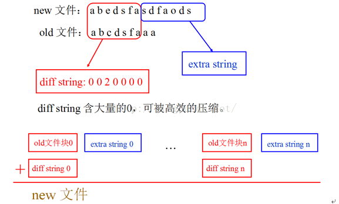
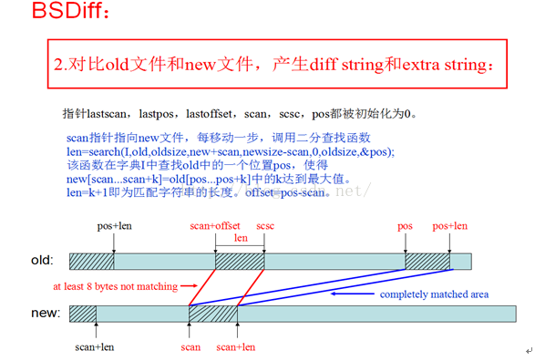
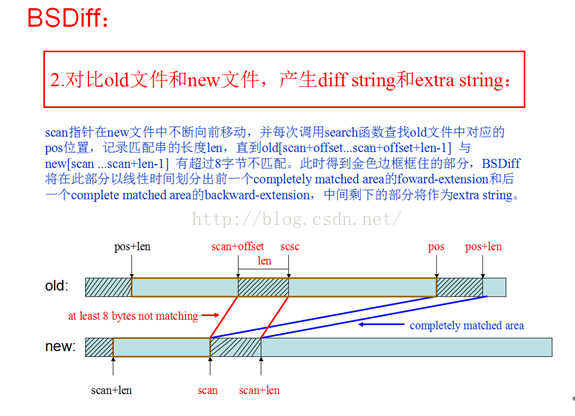
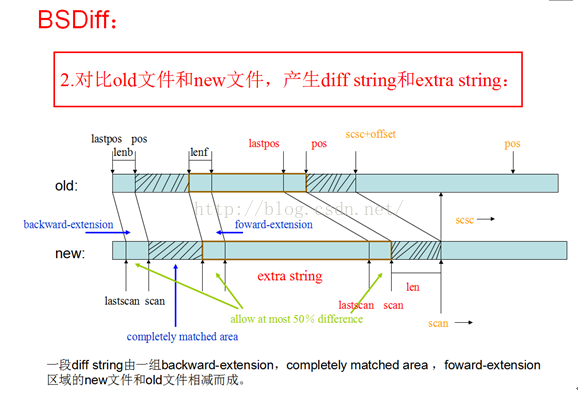
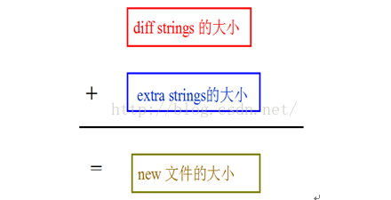

# bsdiff入门

ref: https://blog.csdn.net/add_ada/article/details/51232889

* 差分更新算法

  尽可能多的利用old文件中已有的内容，尽可能少的加入新的内容来构建new文件。通常的做法是对old文件和new文件做子字符串匹配或使用hash技术，提取公共部分，将new文件中剩余的部分打包成patch包，在Patch阶段中，用copying和insertion两个基本操作即可将old文件和patch包合成new文件。

* **BsDiff基本步骤**

  ``` tex
  Insertion操作会引起大量的指针变动和修改，要记录这些值才能在Patch阶段给修改过的区域重新定位，由于这些指针控制字必须在BSDiff阶段加入patch包，产生的patch包会较大。BSDiff通过引入diff string的概念，大大减少了要记录的指针控制字的数目，从而使得patch包更小。
  ```

  

  ``` tex
  基本步骤：
  1．对old文件中所有子字符串形成一个字典；
  2．对比old文件和new文件，产生diffstring和extra string；
  3．将diffstring 和extra string 以及相应的控制字用zip压缩成一个patch包。
  ```

  **步骤1**.是所有差量更新算法的瓶颈，时间复杂度为O(nlogn),空间复杂度为O(n)，n为old文件的长度。BSDiff采用 Faster suffix sorting方法获得一个字典序，使用了类似于快速排序的二分思想，使用了bucket，I，V三个辅助数组。最终得到一个数组I，记录了以前缀分组的各个字符串组的最后一个字符串在old中的开始位置
  **步骤2.**是BSDiff产生patch包的核心部分，详细描述如下：

  

  

  

  **步骤3.**将diff string 和extrastring 以及相应的控制字用zip压缩成一个patch包。

  可以看出在用zip压缩之前的patch包是没有节约任何字符的，但diff strings可以被高效的压缩，故BSDiff是一个很依赖于压缩与解压的算法！

  

* **BSPatch基本步骤**

  ``` tex
  客户端合成patch的基本步骤如下：
  1．接收patch包；
  2．解压patch包；
  3．还原new文件。
  三个步骤同时在O（m）时间内完成，但在时间常数上更依赖于解压patch包的部分，m为新文件的长度
  ```

* **复杂度分析**

  ``` tex
  根据以上步骤，不难得出BSDiff与BSPatch的时间与空间复杂度如下：
  
  BSDiff
  时间复杂度 O(nlogn) 空间复杂度 O(n)
  
  BSPatch
  时间复杂度 O(n+m)  空间复杂度 O(n+m)
  ```

  
