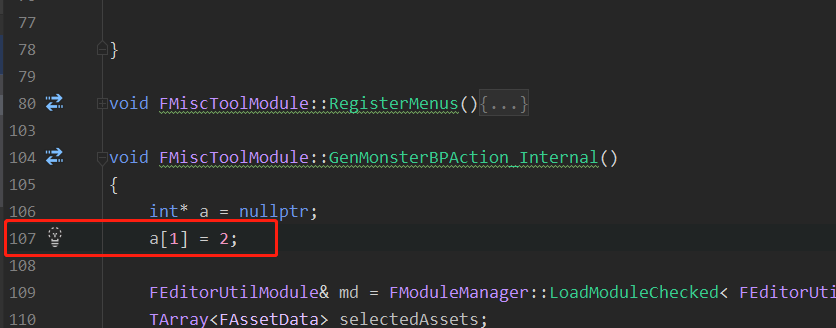

# Visual Studio使用

**基于VS 2017**

* 设置#include中的头文件或者库文件的路径

  ``` tex
  需要引入msgpack-c-cpp_master
  将下图中的目录放到工程目录下，将需要的文件包含到项目里
  
  打开菜单栏“项目-xxx（项目名）属性---配置属性---C++---常规---附加包含目录”
  选择到指向include的文件夹
  保存
  ```

  

  ``` tex
  添加libs文件目录和lib文件名
  
  方法1
  打开菜单栏“项目-xxx（项目名）属性---配置属性---链接器---常规---附加库目录” 
  加入链接库路径
  
  打开菜单栏“项目-xxx（项目名）属性---配置属性---链接器---输入---附加依赖项” 
  添加链接库名字 xxx.lib
  
  
  方法2
  VS导入一个库文件的方法  (在目标文件中加入xxx.lib库文件，提供链接支持）
  #pragma comment(lib, “xxx.lib”)
  #pragma comment(lib, “绝对路径/xxx.lib”)
  ===>
  #pragma仅仅影响编译时的link，运行时只需要保证exe目录下（或者系统目录下或者PATH变量中都有lib对应的dll）exe即能运行
  ```


**基于2019**

* 配置c++动态引用dll

  ``` tex
  1. 配置头文件引用目录（用于编译）
  	解决方案管理器->项目->属性页->
  	配置属性(先确定是否应用到所有配置（debug,release等）和平台（win32,x64,android等）) ->
  	C/C++ -> 常规 -> 附加包含目录 -> 编辑（添加头文件目录，
  									@注意：需要保证引用头文件自身#include的相对路径，如#include为ace/XXX.h，则选择目录为ace的根目录）
  
  2. 配置xxx.lib库文件（用于链接）
  	解决方案管理器->项目->属性页->
  	配置属性(先确定是否应用到所有配置（debug,release等）和平台（win32,x64,android等）) ->
  	链接器（Linker）-> 输入 -> 附加依赖项 -> 编辑（添加 XXX.lib）
  	
  	链接器（Linker）-> 常规 -> 附加库目录 -> 编辑（添加 XXX.lib的目录）
  	
  3. 添加运行时动态连接库 xxx.dll（运行时）
  	解决方案管理器->项目->属性页->
  	配置属性(先确定是否应用到所有配置（debug,release等）和平台（win32,x64,android等）) ->
  	配置属性 -> 生成事件 -> 生成后事件 -> 命令行
  	（xcopy /y /d "..\..\XXXXXXLibraryXXXXXX\$(IntDir)xxx.dll" "$(OutDir)"）
  	(如果 DLL 和客户端项目在其他目录中，请更改 DLL 的相对路径以进行匹配。)
  ```

  


---


### 辅助

* 添加头部注释

  ``` tex
  \Common7\IDE\ItemTemplates\CSharp\目录（WinForm/Web/...）
  
  $time$ 日期
  $year$ 年份
  $clrversion$ CLR版本
  $GUID$ 用于替换项目文件中的项目 GUID 的 GUID。最多可以指定 10 个唯一的 GUID（例如，guid1)）。
  $itemname$ 用户在对话框中提供的名称。
  $machinename$ 当前的计算机名称（例如，Computer01）。
  $projectname$ 用户在对话框中提供的名称。
  $registeredorganization$ HKLM\Software\Microsoft\Windows NT\CurrentVersion\RegisteredOrganization 中的注册表项值。
  $rootnamespace$ 当前项目的根命名空间。此参数用于替换正向项目中添加的项中的命名空间。
  $safeitemname$ 用户在“添加新项”对话框中提供的名称，名称中移除了所有不安全的字符和空格。
  $safeprojectname$ 用户在“新建项目”对话框中提供的名称，名称中移除了所有不安全的字符和空格。
  $time$ 以 DD/MM/YYYY 00:00:00 格式表示的当前时间。
  $userdomain$ 当前的用户域。
  $username$ 当前的用户名。
  ```

  

---


### 调试

* UE4 VisualStudio断点调试自编译引擎（暂时不支持JetBrains Rider调试）
  1. 打开vs工程
  2. 打开设置
     
  3. 打开源服务器开关
     
  4. 设置符号服务器路径，并设置本地缓存路径，选择Load all会加载所有符号，不需要继续按后续文档操作，速度比较慢，选择Load only的话需要继续看文档
     
  5. 启动本地调试，找到你想要断点的文件所在的模块，右键加载
     
     
     
     
  6. 命中断点后，选中External Code右键，展开External Code
     
  7. 右键想要解析的堆栈，选择加载符号，或者下面那个总是自动加载
     
  8. 如弹出执行命令的窗口，点确定将会拉取源服务器上代码文件


* 符号表服务器 - 符号仓库搭建 - 搭建2级目录树的符号仓库

  

  **符号服务器路径格式**

  1. `srv\*{可选:本地一级缓存}\*{可选:二级缓存}\*...\*{上游符号服务器}`,符号从上游依次传递到一级缓存，中间缓存失效则会跳过，若符号为压缩格式，则只在一级缓存解压，其他缓存以压缩格式储存，符号搜索顺序是从左到右，若无本地缓存，则使用默认缓存路径`C:\ProgramData\dbg\sym`
  2. `symsrv\*symsrv.dll\*{可选:本地一级缓存}\*{可选:二级缓存}\*...\*{上游符号服务器}`
  3. 1为2的缩写，2可指定自定义符号服务器dll
  4. http符号仓库只可读，所以只能位于最右并且只能存在一个，若要使用多个，需要使用symproxy
  5. 可使用分号创建多个辅链，从左到右依次搜索符号

  

  **创建储存用共享文件夹**

  [windows server 2019 创建共享文件夹](https://www.opss.cn/6337.html)

  1. 上文到安装共享文件夹服务
  2. 共享指定文件夹
     
     
     
     
  3. 可能的错误
     
     解决方案
     

  

  **2级目录树**

  在空符号仓库根目录创建index2.txt文件即可，若要转换1级目录结构到2级，则使用convertstore.exe进行转换

  

  **命令**

  1. 添加 `symstore.exe add /s "{storePath}" /h {PUB|PRI} /f @"{responseFilePath}" /t "{productName}" /v "{versionName}" /c "{commentMsg}" /compress`
  2. 删除 `symstore.exe del del /i ID /s Store`
  3. 创建指针对add使用/p

  

  **注意点**

  1. pdb的公共和私有版本不能在一个仓库内储存，因为两者有相同签名和age

  

  **symproxy搭建http符号仓库**

  1. [创建http符号仓库](https://docs.microsoft.com/zh-cn/windows-hardware/drivers/debugger/http-symbol-stores)

  流程：

  1. IIS创建默认网站
  2. 添加虚拟目录
     
     
  3. 配置目录浏览
     
     
  4. allowSubDirConfig设置为false
     
  5. 添加mine类型application/octet-stream
     

  1. [使用开源pysymproxy搭建代理](http://192.168.2.110/jenkins/pySymProxy)

  1. [使用自带symproxy支持多个http符号仓库](https://docs.microsoft.com/zh-cn/windows-hardware/drivers/debugger/symproxy) 未成功搭建，只是参考

  流程：

  1. 拷贝C:\Program Files (x86)\Windows Kits\10\Debuggers\x64\symproxy目录下的symproxy.exe、symproxy.dll、symsrv.dll、symproxy.man、symproxy.reg到C:\Windows\System32\inetsrv，并创建symsrv.yes
  2. 启用性能计数器
     lodctr.exe /m:%WINDIR%\system32\inetsrv\symproxy.man
  3. 修改symproxy.reg并双击
     
  4. 添加应用程序池并配置
     
     
     （配置身份验证）
     
  5. 创建虚拟路径
  6. 右键添加应用程序
  7. 安装ISAPI筛选器
     
  8. 默认网站添加ISAPI筛选器
     
  9. 代理配置mine类型
     
  10. 配置排除列表，减少无意义的网络消耗
      
  11. 配置超时
      

  

  **agestore定期清理符号仓库**

  开启Last-Access-Time支持

  ```
  fsutil behavior set disablelastaccess 0
  ```

  使用agestore进行清理

  ```
  agestore.exe {path} -days=xxx
  ```


* Windows下奔溃堆栈解析

  **windows调试工具链**
  部署环境：

  1. 下载windows sdk https://developer.microsoft.com/zh-cn/windows/downloads/windows-sdk/
     
  2. 一直next，直到弹出下图，选中安装调试工具链安装
     
  3. 工具目录为：C:\Program Files (x86)\Windows Kits\10\Debuggers\x64

  

  **解析**

  这里使用cdb，gui界面可以使用windbg
  公式：符号表内地址 = PE头（0x1000000） + 二进制中崩溃的偏移地址

  ### pdb和二进制匹配

  校验码=pdb7签名+Age
  PDB7Sig=8BDC1AB99AAE4D90A976F2F16521C4F8
  Age=1
  checksum=8BDC1AB99AAE4D90A976F2F16521C4F81

  1. 获取PDB7Sig和Age，执行命令 `dbh.exe 二进制文件 info`
     
     

  

  **解析纯堆栈，如下图：**

  

  1. 如图可获取UE4Editor_MiscTool+0x3da2，可得知 二进制中崩溃的偏移地址=0x3da2，得到符号表内地址0x1003da2
     注：可以通过命令`symchk.exe /s srv*本地符号缓存路径*符号服务器地址 本地二进制文件`下载指定二进制文件的pdb文件，也可以手动进入符号服务器，根据pdb校验码规则拿指定.pdb或.pd_文件，.pd_文件需要使用命令`expand -R {cab压缩文件} {解压路径}`解压
  2. 使用`dbh 符号文件路径 laddr 0x1003da2`进行解析，得到崩溃文件行号为D:_wk\A8\Program\Client\NextGenGame\Plugins\EditorTool\MiscTool\Source\MiscTool\Private\MiscTool.cpp#107，无误
     
     

  

  **解析minidump文件，如下图：**

  
  方法1：使用VS进行解析

  1. 双击打开minidump文件
  2. 点击进行调试
     
  3. 切换未解析堆栈
     
  4. 添加符号服务器（符号服务器地址见《符号服务器》文档），点击Load加载即可完成解析
     

  方法2：使用cdb进行解析

  1. 执行命令： `cdb.exe -lines -c "!analyze -v;q" -y srv*本地符号缓存路径*符号服务器地址;其他符号地址 -z minidump文件路径`


* UE4 项目奔溃调试

  ``` tex
  使用自定义符号表仓库，快速调试
  
  UE4奔溃文件路径：..\Saved\Crashes\..
  ```

  * 用VS打开minidump文件

  * 设置VS自定义符号表路径

    

  * 调试-选项-启用源服务器支持（将源服务器诊断消息打印到输出窗口）

    

  * 使用仅限本机调试

    

    在调用堆栈窗口 - 加载符号表

    

    