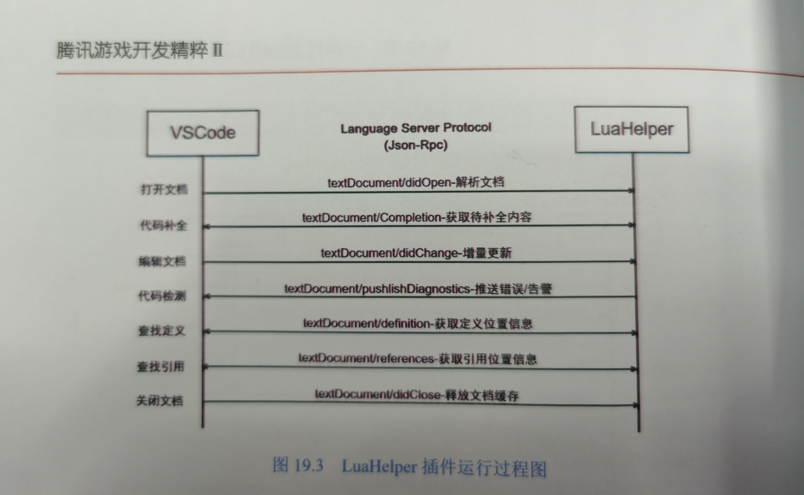
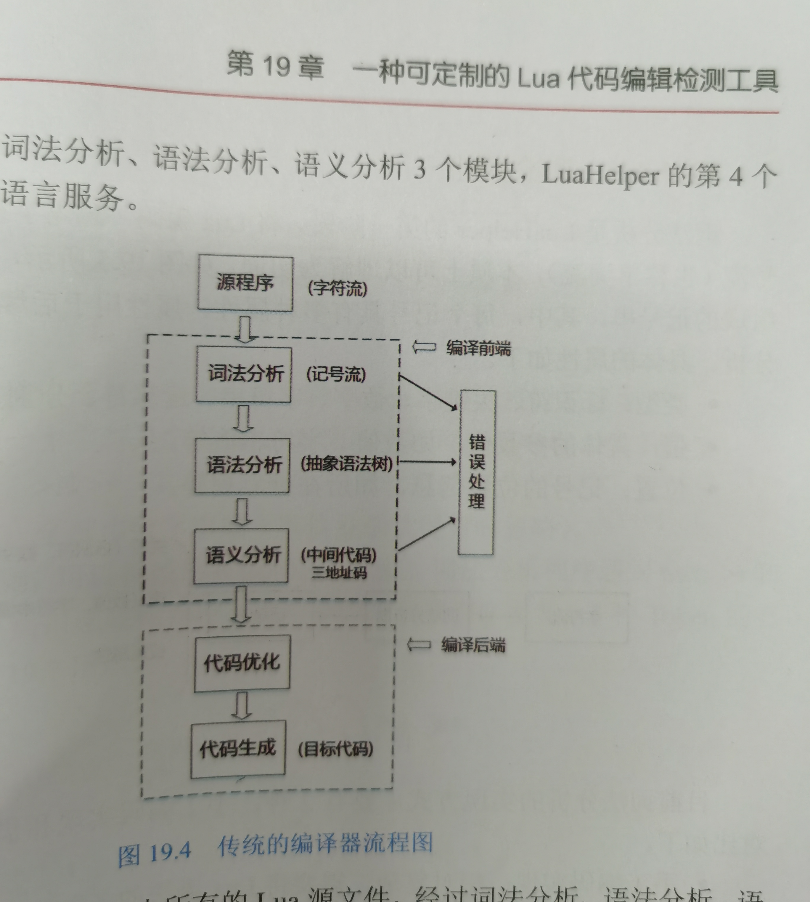

# VSCode 插件

* Remote SSH

  [配置Visual Studio Code的Remote - SSH插件进行远程开发](https://note.qidong.name/2019/08/vscode-remote-ssh/)


* plantuml

  UML画图


---


* C++

  [VS Code 搭建 C/C++ 编译运行环境的四种方案](https://zhuanlan.zhihu.com/p/35178331)


---


* 头部注释

  配置路径： “File”—“Preferences”—“User Snippets”

  ```  json
  {
  	// Place your snippets for python here. Each snippet is defined under a snippet name and has a prefix, body and 
  	// description. The prefix is what is used to trigger the snippet and the body will be expanded and inserted. Possible variables are:
  	// $1, $2 for tab stops, $0 for the final cursor position, and ${1:label}, ${2:another} for placeholders. Placeholders with the 
  	// same ids are connected.
  	// Example:
  	// "Print to console": {
  	// 	"prefix": "log",
  	// 	"body": [
  	// 		"console.log('$1');",
  	// 		"$2"
  	// 	],
  	// 	"description": "Log output to console"
  	// }
  
  	"HEADER": {
  		"prefix" : "header",
  		"body": [
              "#!/usr/bin/env python",
              "# -*- encoding: utf-8 -*-",
              "'''",
  			"@File           : $TM_FILENAME",
              "@Time           : $CURRENT_YEAR/$CURRENT_MONTH/$CURRENT_DATE $CURRENT_HOUR:$CURRENT_MINUTE:$CURRENT_SECOND",
  			"@Author         : mjx",
  			"@Version        : 1.0.0",
  			"@Desc           : ",
              "'''",
  			"",
  			"",
  			"$0"
  		],
  	}
  }
  ```
  
  ``` json
  {
  	// Place your snippets for shellscript here. Each snippet is defined under a snippet name and has a prefix, body and 
  	// description. The prefix is what is used to trigger the snippet and the body will be expanded and inserted. Possible variables are:
  	// $1, $2 for tab stops, $0 for the final cursor position, and ${1:label}, ${2:another} for placeholders. Placeholders with the 
  	// same ids are connected.
  	// Example:
  	// "Print to console": {
  	// 	"prefix": "log",
  	// 	"body": [
  	// 		"console.log('$1');",
  	// 		"$2"
  	// 	],
  	// 	"description": "Log output to console"
  	// }
  
  	"HEADER": {
  		"prefix" : "header",
  		"body": [
              "#!/bin/bash ",
              "###################################################################",
  			"#File           : $TM_FILENAME",
              "#Time           : $CURRENT_YEAR/$CURRENT_MONTH/$CURRENT_DATE $CURRENT_HOUR:$CURRENT_MINUTE:$CURRENT_SECOND",
  			"#Author         : mjx",
  			"#Version        : 1.0.0",
  			"#Desc           : ",
              "###################################################################",
  			"",
  			"",
  			"$0"
  		],
  	}
  }
  ```
  
  


---


### 配置

* windows

  ``` tex
  系统命令识别不到：无法将"xx"项识别为cmdlet...
  
  解决方案：vscode快捷方式 -> 兼容性 -> 以管理员身份运行
  设置后需要关闭所有打开的vscode窗口后重启
  ```

  


---


### 快捷键

``` tex
通过编辑器中提供的Ctrl + Shift + P(或Mac上的Command + Shift + P)搜索功能，然后搜索format document(格式化文档)，找到相应的快捷方式。
```


* 选中鼠标光标所在位置单词

  ``` tex
  Ctrl+D 
  selects the word at the cursor, or the next occurrence of the current selection.
  ```

* 代码格式化，代码移动

  ``` tex
  选中按TAB右移，按SHIFT+TAB左移
  
  Windows Shift + Alt + F
  Mac		Shift + Option + F
  Ubuntu 	Ctrl + Shift + I
  ```

  


---


### 插件扩展

* LSP

  * 基于微软LSP(Language Server Protocol)，一种语言服务协议，用于语言功能插件开发
  * 为不同编程语言添加 自动补全（Auto Complete）跳转定义（Go to Definition） 悬停文档（Documentation on Hover）等功能，提供统一标准化开发工具与功能插件之间的通信协议，一套功能插件通过LSP可以适配多个开发工具
  * 本质：根据编辑器与功能插件的交互，制定的一套公共流程与协议

* 支持LSP的编辑器

  VSCode，Eclipse IDE，Atom，Subline Text， Emacs等

* VSCode 中 LuaHelper插件

  

  
