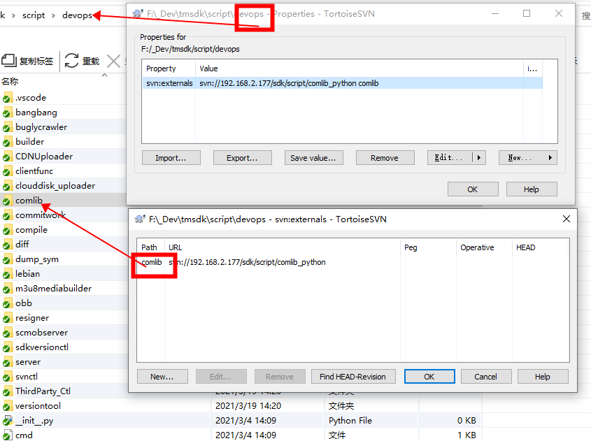

# SVN

### VisualSVN Server

* 添加用户

  ``` text
  下载一个含有htpasswd.exe的程序，如httpd；下载后找到htpasswd.exe;
  在命令行中输入htpasswd.exe -bm httppasswd.file username passwd,即可增加用户。
  使用cmd的for命令可实现批量创建
  ```

  

* 修改密码

  [VisualSVN Server 增加自助修改密码页面](https://my.oschina.net/u/3115403/blog/994234)

  [VisualSVN Server 增加自助修改密码页面（支持2.1-3.6最新版）](https://tiger99111.github.io/2017/10/svn_modify_passowrd/)

  [VisualSVN Server PowerShell Cmdlet Reference](https://www.visualsvn.com/support/topic/00088/#Remove-SvnLocalUser)

  ``` powershell
  #Available since VisualSVN Server 4.2.
  #Modifies properties of an existing local Subversion user account.
  
  PS C:\> $password = Read-Host -AsSecureString
  ********************
  PS C:\> Set-SvnLocalUser -Name jack -Password $password
  ```

  

  

  [VisualSVN Server password change](https://stackoverflow.com/questions/4354356/visualsvn-server-password-change)

  ``` shell
  #通过 WMI 里用 PowerShell脚本更改
  
  $svnuser = Get-WmiObject -Namespace Root\VisualSVN `
  -ComputerName svn.hostname.com `
  -query "select * from VisualSVN_User where name = 'username'"
  $svnuser.SetPassword('123456')
  ```

  

  [Control VisualSVN Server from C#](https://stackoverflow.com/questions/10017282/control-visualsvn-server-from-c-sharp)

  ``` c#
  /*
  This C# code will create a Subversion user 'user1' with password 'secret'.
  */
  ManagementClass userClass = new ManagementClass("root\\VisualSVN", "VisualSVN_User", null);
  
      // Obtain in-parameters for the method
      ManagementBaseObject inParams =
          userClass.GetMethodParameters("Create");
  
      // Add the input parameters.
      inParams["Name"] = "user1";
      inParams["Password"] = "secret";
  
      // Execute the method and obtain the return values.
      ManagementBaseObject outParams =
          userClass.InvokeMethod("Create", inParams, null);
  
  
  /*
  This C# code will create a new repository 'Repo1'.
  */
  
      ManagementClass repoClass = new ManagementClass("root\\VisualSVN", "VisualSVN_Repository", null);
  
      // Obtain in-parameters for the method
      ManagementBaseObject inParams =
          repoClass.GetMethodParameters("Create");
  
      // Add the input parameters.
      inParams["Name"] = "Repo1";
  
      // Execute the method and obtain the return values.
      ManagementBaseObject outParams =
          repoClass.InvokeMethod("Create", inParams, null);
  
  
  
  /*
  This C# code will provide SID S-1-5-32-545 ('BUILTIN\Users') with Read / Write access to repository 'Test'. FYI: The AccessLevel values are as described in the MOF: "0 - no access, 1 - read only, 2 - read/write".
  */
  
  ManagementClass userClass = new ManagementClass("root\\VisualSVN", "VisualSVN_WindowsAccount", null);                            
  ManagementClass authzClass = new ManagementClass("root\\VisualSVN", "VisualSVN_SecurityDescriptor", null);
  ManagementClass permClass = new ManagementClass("root\\VisualSVN", "VisualSVN_PermissionEntry", null);
  
  ManagementObject userObject = userClass.CreateInstance();
  userObject.SetPropertyValue("SID", "S-1-5-32-545");
  
  ManagementObject permObject = permClass.CreateInstance();
  permObject.SetPropertyValue("Account", userObject);
  permObject.SetPropertyValue("AccessLevel", 2);
  
  ManagementObject repo = new ManagementObject("VisualSVN_Repository.Name='Test'");
  
  ManagementBaseObject inParams =
      authzClass.GetMethodParameters("SetSecurity");
  
  inParams["Object"] = repo;
  inParams["Permissions"] = new object[] { permObject };
  
  ManagementBaseObject outParams =
      authzClass.InvokeMethod("SetSecurity", inParams, null);
  ```

  

  

  ``` text 
   特别注意:如果用 VisualSVN Server x64 就必须找 x64 的 php!
     否则 Apache 加载 php 模块会提示错误 Cannot load php5apache2_2.dll into server因为 Apache x64 无法使用 php x86。
  使用 32 位版本的 VisualSVN Server 比较简单，因为 php 官网都是 x86 版本: http://windows.php.net/downloads/releases/archives/
  使用 64 位版本的 VisualSVN Server 就得找第三方编译的 php x64 版本了，提供两个下载： https://www.anindya.com/php-5-4-12-and-5-3-22-x64-64-bit-for-windows/
  http://www.apachelounge.com/viewtopic.php?t=6123
     我下载的是 php-5.4.36-Win32-VC9-x64.zip，下载后解压到 C:\Program Files\VisualSVN Server\php 文件夹。把 php.ini-production 文件重命名为 php.ini 即可，其他不用配置。
  
  修改空文件 C:\Program Files\VisualSVN Server\conf\httpd-custom.conf
  LoadModule php5_module "php/php5apache2_2.dll"
  <IfModule php5_module>
      AddType application/x-httpd-php .php
      DirectoryIndex index.html index.php
  </IfModule>
  # 配置 php.ini 的路径
  PHPIniDir "php"
  
  
  在header增加超链接麻烦，可以在页脚增加修改密码的链接， 修改文件 C:\Program Files\VisualSVN Server\WebUI\index.html
  <footer>
  Powered by <a href="http://www.visualsvn.com/server/">VisualSVN Server</a>. &copy; 2005-2016 VisualSVN Limited.
  <br /><br /><a href="/pw">自助修改密码</a>
  </footer>
  
  需要重启Visual SVN Server
  
  新建一个 php 文件放到 C:\Program Files\VisualSVN Server\htdocs\pw\index.php 
  ```

  ``` php+HTML
  <?php
  /***************************************************************/
  $passwdfile="C:\Repositories\htpasswd";
  $htpasswdPath = "C:\Program Files\VisualSVN Server\bin\htpasswd.exe";
  /***************************************************************/
  
  $username = $_SERVER["PHP_AUTH_USER"]; //经过 AuthType Basic 认证的用户名
  $authed_pass = $_SERVER["PHP_AUTH_PW"]; //经过 AuthType Basic 认证的密码
  $input_oldpass = (isset($_REQUEST["oldpass"]) ? $_REQUEST["oldpass"] : ""); //从界面上输入的原密码
  $newpass = (isset($_REQUEST["newpass"]) ? $_REQUEST["newpass"] : ""); //界面上输入的新密码
  $repeatpass = (isset($_REQUEST["repeatpass"]) ? $_REQUEST["repeatpass"] : ""); //界面上输入的重复密码
  $action = (isset($_REQUEST["action"]) ? $_REQUEST["action"] : ""); //以hide方式提交到服务器的action
  
  if ($action!="modify") {
      $action = "view";
  } else if ($authed_pass!=$input_oldpass) {
      $action = "oldpasswrong";
  } else if (empty($newpass)) {
      $action = "passempty";
  } else if ($newpass!=$repeatpass) {
      $action = "passnotsame";
  } else{
      $action = "modify";
  }
  ?>
  
  <html>
  <head>
      <meta http-equiv="Content-Type" content="text/html; charset=GBK">
      <title>Subversion 在线自助密码修改</title>
  </head>
  <body>
  
  <?php
  //action=view 显示普通的输入信息
  if ($action == "view") {
  ?>
  <script language = "javaScript">
  <!--
  function loginIn(myform) {
      var newpass=myform.newpass.value;
      var repeatpass=myform.repeatpass.value;
  
      if (newpass=="") {
          alert("请输入密码！");
          return false;
      }
  
      if (repeatpass=="") {
          alert("请重复输入密码！");
          return false;
      }
  
      if (newpass!=repeatpass) {
          alert("两次输入密码不一致，请重新输入！");
          return false;
      }
  return true;
  }
  //-->
  </script>
  
  <style type="text/css">
  <!--
      table {
          border: 1px solid #CCCCCC;
          background-color: #f9f9f9;
          text-align: center;
          vertical-align: middle;
          font-size: 9pt;
          line-height: 15px;
      }
      th {
          font-weight: bold;
          line-height: 20px;
          border-top-width: 1px;
          border-right-width: 1px;
          border-bottom-width: 1px;
          border-left-width: 1px;
          border-bottom-style: solid;
          color: #333333;
          background-color: f6f6f6;
      }
      input{
          height: 18px;
      }
      .button {
          height: 20px;
      }
  -->
  </style>
  
  <br><br><br>
  <form method="post">
  <input type="hidden" name="action" value="modify"/>
  <table width="220" cellpadding="3" cellspacing="8" align="center">
  <tr>
  <th colspan=2>Subversion 密码修改</th>
  </tr>
  <tr>
  <td>用 户 名：</td>
  <td align="left"> <?php echo $username?></td>
  </tr>
  <tr>
  <td>原 密 码：</td>
  <td><input type=password size=12 name=oldpass></td>
  </tr>
  <tr>
  <td>用户密码：</td>
  <td><input type=password size=12 name=newpass></td>
  </tr>
  <tr>
  <td>确认密码：</td>
  <td><input type=password size=12 name=repeatpass></td>
  </tr>
  <tr>
  <td colspan=2>
  <input onclick="return loginIn(this.form)" class="button" type=submit value="修 改">
  <input name="reset" type=reset class="button" value="取 消">
  <a href="/"><input name="return" type=button class="button" value="返 回"></a>
  </td>
  </tr>
  </table>
  </form>
  <?php
  } else if ($action == "oldpasswrong") {
      $msg="原密码错误！";
  } else if ($action == "passempty") {
      $msg="请输入新密码！";
  } else if ($action == "passnotsame") {
      $msg="两次输入密码不一致，请重新输入！";
  } else {
  //    $passwdfile="D:\SVN_Repositories\htpasswd";
  //    $command='"d:\VisualSVN Server\bin\htpasswd.exe" -b '.$passwdfile." ".$username." ".$newpass;
      $command='"'. $htpasswdPath. '" -b '.$passwdfile." ".$username." ".$newpass;
      system($command, $result);
      if ($result==0) {
          $msg_succ="用户[".$username."]密码修改成功，请用新密码登陆.";
      } else {
          $msg="用户[".$username."]密码修改失败，返回值为".$result."，请和管理员联系！";
      }
  }
  
  if (isset($msg_succ)) {
  ?>
  <script language="javaScript">
  <!--
  alert("<?php echo $msg_succ?>");
  window.location.href="/"
  //-->
  </script>
  <?php
  } else if (isset($msg)) {
  ?>
  <script language="javaScript">
  <!--
  alert("<?php echo $msg?>");
  window.location.href="<?php echo $_SERVER["PHP_SELF"]?>"
  //-->
  </script>
  <?php
  }
  ?>
  </body>
  </html>
     在header增加超链接麻烦，所以我就在页脚增加修改密码的链接， 修改文件 <font color=###0000FF>C:\Program Files\VisualSVN Server\WebUI\index.html</font> 内容如下:
  
   <footer>
  Powered by <a href="http://www.visualsvn.com/server/">VisualSVN Server</a>. &copy; 2005-2016 VisualSVN Limited.
  <br /><br /><a href="/pw">自助修改密码</a>
  </footer>
  ```

  

* svn可以创建软链接

  

  ``` shell
  //递归展示当前目录下的软链接
  svn propget svn:externals -R
  
  
  //获取目录的信息
  svn propget svn:externals dirpath（指定一个目录）
  //创建软链接
  svn propset svn:externals -F dirPath oPath
  //大规模编辑
  svn propedit svn:externals dirpath
  
  svn propset svn:externals "-r611 htp://svn.company.com/svn/Build" Build/Tool
  等同于
  文件 externals.txt 内容 ： -r611 htp://svn.company.com/svn/Build  （无双引号）
  svn propset svn:externals -F externals.txt Build/Tool
  
  
  ```

  


---


### Command

* 获取.svn目录

  ``` shell
  svn info --show-item wc-root
  ```


---


### Exception

* Checksum mismatch while updating

  ``` sh
  #Go to the folder with the file causing problems
  #Execute command 
  svn update --set-depth empty #(note: this will delete your files, so make a copy first!)
  #Execute command 
  svn update --set-depth infinity
  ```


* SVN database is locked

  ``` sh
  sqlite3 .svn/wc.db "select * from work_queue"
  sqlite3 .svn/wc.db "delete from work_queue"
  ```

  ``` sh
  #cd /项目路径/.svn #需要自行找到项目svn所在目录
  mv wc.db wc.db.locked
  sqlite3 wc.db.locked
  sqlite> .backup main wc.db 
  ```

  

