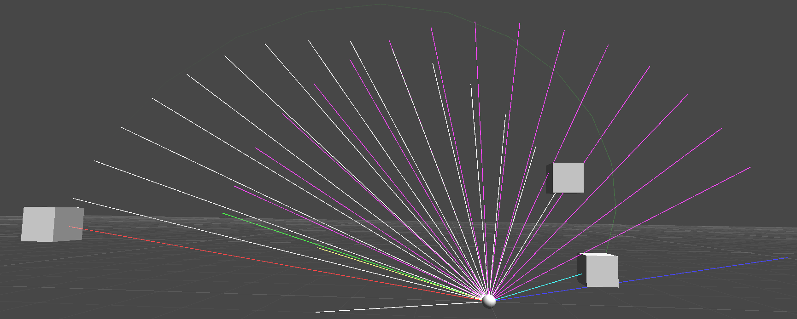
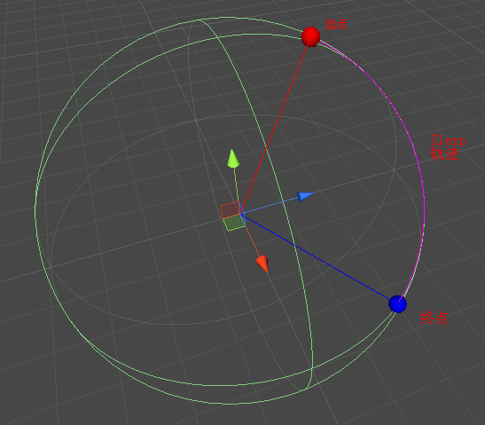
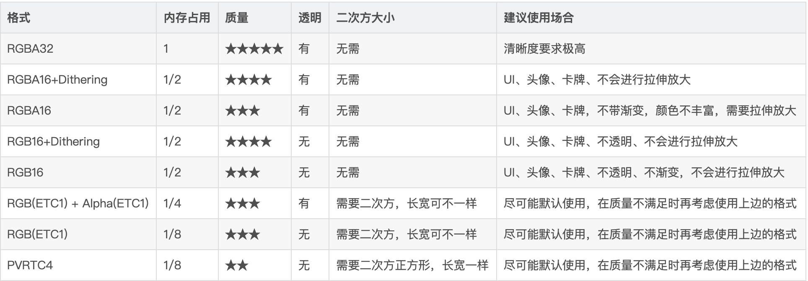

# Unity API

 ### 项目结构

* 使用DLL

  ``` tex
  VS创建 xxx dll项目 --->  bin/Debug/XXX.dll
  
  Unity添加 Assets/Plugins/xxx.dll（可以考虑分平台 x64_86...）
  ```

  


---


### 内置API

* deviceUniqueIdentifier

  ``` c#
  iOS不支持，返回值不唯一！
  ```

  

* Awake vs. Start

  ``` tex
  ref: https://blog.csdn.net/haohan_meng/article/details/21857029
  Awake:
  	1.当脚本实例被加载时会调用Awake函数；Awake函数在所有的游戏对象被初始化完毕之后才会被调用；在脚本实例的整个生命周期中，Awake函数仅执行一次。
  	2.如果游戏对象（即gameObject）的初始状态为关闭状态，那么运行程序，Awake函数不会执行；反之，如果游戏对象的初始状态为开启状态，那么Awake函数会执行。并且，值得注意的一点是，Awake函数的执行与否与脚本实例的状态（启用或禁用）并没有关系，而是与脚本实例所绑定的游戏对象的状态有关。
  	3.在不切换场景的前提下，原本处于关闭状态的游戏对象，当它被首次开启时，Awake函数会执行，并且是只在首次开启时才会执行；而已经开启（激活）的游戏对象（Awake函数已经执行过一次），将它关闭后再次开启，Awake函数不会再次执行。看来这是对应了手册中说明的在脚本实例的整个生命周期中仅执行一次的情况。
  	4.如果重新加载场景，那么场景内Awake函数的执行情况重新遵循上述两点。
  	
  Start:
  	1.当Update函数第一次被调用前会调用Start函数；Start函数只在脚本实例被启用时才会执行；Start函数总是在Awake函数之后执行。
  	2.如果游戏对象被关闭，那么Start函数不会执行。
  	3.如果游戏对象开启了，对象上绑定的脚本实例被禁用了，那么Start函数不会执行。  即脚本被禁用
  	4.如果游戏对象开启了，对象上绑定的脚本实例也开启了，那么Start函数会执行。并且Start函数只会在脚本实例首次被开启时才会执行。如果是已经开启过的脚本实例被关闭后再次开启，那么Start函数不会再次执行。
  	5.如果重新加载场景，那么场景内Start函数的执行情况重新遵循上述三点。
  ```

  

* 生命周期函数

  [UNITY3D中自带事件函数的执行顺序](http://vitalzhu.github.io/2015/02/13/Unity3D/Unity3D%E4%B8%AD%E8%87%AA%E5%B8%A6%E4%BA%8B%E4%BB%B6%E5%87%BD%E6%95%B0%E7%9A%84%E6%89%A7%E8%A1%8C%E9%A1%BA%E5%BA%8F/)

  ``` tex
  ### 编辑器（Editor）
  
  Reset：Reset函数被调用来初始化脚本属性当脚本第一次被附到对象上，并且在Reset命令被使用时也会调用。
  编者注：Reset是在用户点击Inspector面板上Reset按钮或者首次添加该组件时被调用。Reset最常用于在见识面板中给定一个默认值。
  
  ### 第一次场景加载（First Scene Load）
  
  这些函数会在一个场景开始（场景中每个物体只调用一次）时被调用。
  
  Awake：这个函数总是在任何Start()函数之前一个预设被实例化之后被调用，如果一个GameObject是非激活的（inactive），在启动期间Awake函数是不会被调用的直到它是活动的（active）。
  OnEnable：只有在对象是激活（active）状态下才会被调用，这个函数只有在object被启用（enable）后才会调用。这会发生在一个MonoBehaviour实例被创建，例如当一个关卡被加载或者一个带有脚本组件的GameObject被实例化。
  注意：当一个场景被添加到场景中，所有脚本上的Awake()和OnEable()函数将会被调用在Start()、Update()等它们中任何函数被调用之前。自然的，当一个物体在游戏过程中被实例化时这不能被强制执行。
  
  ### 第一帧更新之前（Before the first frame update）
  
  Start:只要脚本实例被启用了Start()函数将会在Update()函数第一帧之前被调用。
  对于那些被添加到场景中的物体，所有脚本上的Start()函数将会在它们中任何的Update()函数之前被调用，自然的，当一个物体在游戏过程中被实例化时这不能被强制执行。
  
  ### 在帧之间（In between frames）
  
  OnApplicationPause：这个函数将会被调用在暂停被检测有效的在正常的帧更新之间的一帧的结束时。在OnApplicationPause被调用后将会有额外的一帧用来允许游戏显示显示图像表示在暂停状态下。
  
  ### 更新顺序（Update Order）
  
  当你在跟踪游戏逻辑和状态，动画，相机位置等的时候，有几个不同的事件函数你可以使用。常见的模式是在Update()函数中执行大多数任务，但是也有其它的函数你可以使用。
  
  FixedUpdate：FixedUpdate函数经常会比Update函数更频繁的被调用。它一帧会被调用多次，如果帧率低它可能不会在帧之间被调用，就算帧率是高的。所有的图形计算和更新在FixedUpdate之后会立即执行。当在FixedUpdate里执行移动计算，你并不需要Time.deltaTime乘以你的值，这是因为FixedUpdate是按真实时间，独立于帧率被调用的。
  Update：Update每一帧都会被调用，对于帧更新它是主要的负荷函数。
  LateUpdate：LateUpdate会在Update结束之后每一帧被调用，任何计算在Update里执行结束当LateUpdate开始时。LateUpdate常用为第三人称视角相机跟随。
  
  ### 渲染（Rendering）
  
  OnPreCull：在相机剔除场景前被调用。剔除是取决于哪些物体对于摄像机是可见的，OnPreCull仅在剔除起作用之前被调用。
  OnBecameVisible/OnBecameInvisible：当一个物体对任意摄像机变得可见/不可见时被调用。
  OnPreRender：在摄像机开始渲染场景之前调用。
  OnRenderObject：在指定场景渲染完成之后调用，你可以使用GL类或者Graphics.DrawMeshNow 来绘制自定义几何体在这里。
  OnPostRender：在摄像机完成场景渲染之后调用。
  OnRenderImage(Pro Only)：在场景徐然完成之后允许屏幕图像后期处理调用。
  OnGUI：为了响应GUI事件，每帧会被调用多次（一般最低两次）。布局Layout和Repaint事件会首先处理，接下来处理的是是通过
  Layout和键盘/鼠标事件对应的每个输入事件。
  OnDrawGizmos：用于可视化的绘制一些小玩意在场景视图中。
  
  ### 协同程序（Coroutines）
  
  正常的协同程序更新是在Update函数返回之后运行。一个协同程序是可以暂停执行（yield）直到给出的依从指令（YieldInstruction ）完成，写成的不同运用：
  
  yield：在所有的Update函数都已经被调用的下一帧该协程将持续执行。
  yield WaitForSeconds：一段指定的时间延迟之后继续执行，在所有的Update函数完成调用的那一帧之后。
  yield WaitForFixedUpdate：所有脚本上的FixedUpdate函数已经执行调用之后持续。
  yield WWW：在WWW下载完成之后持续。
  yield StartCoroutine：协同程序链，将会等到MuFunc函数协程执行完成首先。
  
  ### 销毁（When the Object is Destroyed）
  
  OnDestory:这个函数在会在一个对象销毁前一帧调用，会在所有帧更新一个对象存在的最后一帧之后执行，对象也许会响应Object.Destroy 或一个场景关闭时被销毁。
  
  ### 退出游戏（When Quitting）
  
  这些函数会在你场景中所有的激活的物体上调用：
  
  OnApplicationQuit：这个函数在应用退出之前的所有游戏物体上调用，在编辑器（Editor）模式中会在用户停止PlayMode时调用，在网页播放器（web player）中会在网页视图关闭时调用。
  OnDisable：当行为变为非启用（disable）或非激活（inactive）时调用。
  ```


* FixedUpdate和Update的执行顺序和区别

  ``` tex
  Update: 每帧调用一次（非物理对象的移动，简单计时器，输入检测等）
  	​不是按固定时间调用的，如果某一帧和下一帧的处理时长不同，则Update的调用时间间隔不同
  
  FixedUpdate: 按固定时间调用，调用时间间隔相同（物理对象，如Rigidbody刚体应该在FixedUpdate中执行，最好使用力来定义对象移动）
  	​受Edit - Time - Fixed Timestep的值影响
  	可能在Update之前调用多次
  ```


* Layer / LayerMask

  ``` c#
  //位运算
  Unity是用 int32来表示32个Layer层，int32用二进制来表示一共有32位（0~31）。
  0000 0000 0000 0000 0000 0000 0000 0000
  
  //LayerMask mask = 1 << 你需要开启的Layers层。
  //LayerMask mask = 0 << 你需要关闭的Layers层。
  
      
  //开启Layer2
  LayerMask mask = 1             << 2;
  				//1表示开启          左移2表示Layer2
                  //0表示没有该Layer   
  //开启Layer 0 和 Layer 2
  LayerMask mask = 1 << 0 | 1 << 2;
  //开启Layer 0 并 关闭Layer 2
  LayerMask mask = 1 << 0 | 0 << 2;
  //开启Layer Default
  LayerMask mask = 1 << LayerMask.NameToLayer("Default");
  
  //关闭Layer3和Layer7
  LayerMask mask = ~（1<<3|1<<7）;
  
  
  //ref: https://www.cnblogs.com/zhaoqingqing/p/3820414.html
  using UnityEngine;
  using System.Collections;
  [RequireComponent(typeof(Camera))]
  public class LayerMaskTest : MonoBehaviour {
  
      //打开Npc层，变1 或 运算符
      private void Show()
      {
          //camera.cullingMask |= 1 << LayerMask.NameToLayer("Npc");
          camera.cullingMask = (int) 1<<LayerMask.NameToLayer("Npc");//写法二
      }
  
      // 关闭Npc层，变0 按位与 &  按位取反 ~
      private void Hide()
      {
          camera.cullingMask &= ~(1 << LayerMask.NameToLayer("Npc"));
      }
  
      // 开关Npc层，按位异或 ^
      private void Toggle()
      {
          camera.cullingMask ^= 1 << LayerMask.NameToLayer("Npc");
      }
  
      void OnGUI()
      {
          if (GUILayout.Button("Show")) Show();
          if (GUILayout.Button("Hide")) Hide();
          if (GUILayout.Button("Toggle")) Toggle();
      }
  }
  
  //Unity碰撞检测
  static bool Raycast(Vector3 origin, Vector3 direction, float distance = Mathf.Infinity, int layerMask = DefaultRaycastLayers);
  
  //物理碰撞互斥
  //开启Npc层的碰撞
  LayerMask mask = 1 << (int)GameLayerDef.Npc;
  float bounds = 2;
  RaycastHit2D raycastHit = Physics2D.CircleCast(transform.position, bounds, Vector2.right, Mathf.Infinity, mask.value);
  ```

  

* Time.timeScale

  ``` c#
  //@注意：
  //timeScale不会影响Update和LateUpdate的执行速度(受设备性能影响)，OnGUI也不会受time.timescale影响
  //因为FixedUpdate是根据时间来的，所以timeScale只会影响FixedUpdate的速度。
  
  //游戏暂停
  Time.timeScale ＝ 0;
  //受影响的如下：
  /*
  Time.time不再变化，但是Time.realtimeSinceStartup可以使用
  
  1.FixedUpdate不会执行，Update和LateUpdate仍会执行,此时Time.deltaTime会变为0，Update()中使用Time.deltatime不会生效，但是Update()会一直被调用
  2.Coroutine协程不会停止，但是WaitForSeconds会停止，因为此时Time.deltaTime为0
  3.Invoke和InvokeRepeating
  4.粒子系统
  5.动画
  6.声音
  */
  
  //动画Animation设置不受timescale影响
  //Time.realtimeSinceStartup记录是不受timeScale影响的真实时间，利用它来在每一帧采样播放Animation。代码片段如下：
  AnimationState animState = animation[clipName]; // 当前动画状态
  curTime = Time.realtimeSinceStartup; // 当前真实时间
  deltaTime = curTime - lastFrameTime; // 此帧与上一帧的时间间隔
  lastFrameTime = curTime; // 记录此帧时间，下一帧用
  progressTime += deltaTime; // 动画已播放时间
  animState.normalizedTime = progressTime / currState.length; // 动画规范化时间[0-1]
  animation.Sample(); // 在当前状态对动画进行采样，当你想显式设置动画状态并且对它取样的时候使用
  
  //动画Animator设置不受timescale影响
  //可以在Inspactor界面修改Animator组件中Update Mode --> Unscaled Time
  Animator _animator=...;
  _animator.updateMode = AnimatorUpdateMode.UnscaledTime; // 指定该Animator更新模式为不受scale影响
  
  //粒子特效设置不受timescale影响
  ParticleEmitter _emitter = ...;
  _emitter.Simulate(Time.unscaledDeltaTime);
  ParticleEmitter _emitter = ...;
  _particleSystem.Simulate(Time.unscaledDeltaTime, true, false);
  
  //AudioSource
  //添加一个声音组件
  AudioSource source = gameObject.AddComponent<AudioSource>();
  //设置播放声音的速度。 默认速度是1 ，那如果我们加速了，那就应该是 Time.timeScale
  source.pitch =IgnoreTimeScale?1:Time.timeScale;
  //播放声音
  source.Play();
  ```


* 读写XML

  ``` c#
  //@注意：拆分底层XML读写和上层数据结构封装（序列化，反序列化）（编码格式转换）
  public String UTF8ByteArrayToString(byte []characters)
  {
          UTF8Encoding encoding = new UTF8Encoding();
          String constructedString = encoding.GetString(characters);
          return (constructedString);
   }
   
   public byte[] StringToUTF8ByteArray(String pXmlString)
   {
           UTF8Encoding encoding = new UTF8Encoding();
          byte []byteArray = encoding.GetBytes(pXmlString);
          return byteArray;
   }
   
   // Here we serialize our UserData object of myData
   public String SerializeObject(object pObject)
   {
          String XmlizedString = "";
          MemoryStream memoryStream = new MemoryStream();
          XmlSerializer xs = new XmlSerializer(typeof(UserData));
          XmlTextWriter xmlTextWriter = new XmlTextWriter(memoryStream, Encoding.UTF8);
          xs.Serialize(xmlTextWriter, pObject);
          memoryStream = (MemoryStream)xmlTextWriter.BaseStream; // (MemoryStream)
          XmlizedString = UTF8ByteArrayToString(memoryStream.ToArray());
          return XmlizedString;
   }
   
   // Here we deserialize it back into its original form
  public object DeserializeObject(String pXmlizedString)
   {
          XmlSerializer xs   = new XmlSerializer(typeof(UserData));
          MemoryStream memoryStream  = new MemoryStream(StringToUTF8ByteArray(pXmlizedString));
          XmlTextWriter xmlTextWriter  = new XmlTextWriter(memoryStream, Encoding.UTF8);
          return xs.Deserialize(memoryStream);
   }
  ```


* 球形插值Slerp

  ref: https://www.cnblogs.com/suoluo/p/5695362.html

  官方：http://docs.unity3d.com/ScriptReference/Vector3.Slerp.html

  ``` tex
  一开始主观认为这个球形插值Slerp应该本来就是两点之间画弧线，貌似很简单，但该官方例子实现太阳升降却写得很复杂，虽没几行代码却不明白做了些什么事- -
  
  向量即既有长度同时有方向，看介绍可以知道，相比线性插值Lerp将Vector3当作空间的点，球形插值Slerp则是将Vector3当作方向，返回的Vector3的长度是两点之前的距离插值，方向是两个向量之间的夹角度数的插值。
  
  注意这里的“夹角度数”，我觉得理解这个夹角度数比较重要，不然仅仅靠Slerp是在两向量之间做距离插值的同时也对方向做插值还是不太好理解Slerp的最终效果会是个什么样的弧线。
  
  为了能形象的理解Slerp是怎样在做“插值”，我将每一帧的状态都以图形的方式画在了场景中，代码如下，仅仅在官方代码基础上增加了画图功能：
  ```

  ``` c#
  void Start ()
  {
      startTime = Time.time;
      DrawLine (sunrise.position, Color.red);
      DrawLine (sunset.position, Color.cyan);
      StartCoroutine (UpdateLine ());
  }
  
  IEnumerator ShowSlerp ()
  {
      while (Vector3.Distance (transform.position, sunset.position) > 0.05f)
      {
          Vector3 center = (sunrise.position + sunset.position) * 0.5F;
          DrawLine (center, Color.yellow);
          yield return null;
          center -= new Vector3 (0, 1, 0);
          DrawLine (center, Color.gray);
          yield return null;
  
          Vector3 riseRelCenter = sunrise.position - center;
          DrawLine (riseRelCenter, Color.green);
          yield return null;
          Vector3 setRelCenter = sunset.position - center;
          DrawLine (setRelCenter, Color.blue);
          yield return null;
  
          float fracComplete = (Time.time - startTime) / journeyTime;
          transform.position = Vector3.Slerp (riseRelCenter, setRelCenter, fracComplete);
          DrawLine (transform.position, Color.magenta);
          yield return null;
          transform.position += center;
          DrawLine (transform.position, Color.white);
          yield return null;
      }
  }
  ```

  

  ``` tex
  这样代码逻辑就显而意见了：原本是在红向量与浅蓝（蓝绿）向量间做Slerp，转变为绿向量与蓝向量间做Slerp，从而产生紫（品红）向量尾部相连的运动轨迹，最终再形成类似太阳升降的白向量尾部相连的曲线运动轨迹。
  
  至此基本明白Slerp代码之外的其他代码的作用了：sunrise与sunset两向量如果共线则直接做Slerp运动是水平方向的曲线！由于这两个点并未指定初始值而是用户可以任调整的值，所以说做这些多就只是为了将任意值的起点与终点作偏移使得运动轨迹初终能更符合太阳升降的曲线。
  
  当看到绿蓝向量间做Slerp运动可以形成紫向量那样的运动轨迹时，可能有的童鞋也可以猜到了，只要两条向量间的夹角不是180度，Slerp的结果就不会是水平方向的弧线。看下图：
  ```

  

  ``` tex
  上面那条曲线即是将起点和终点向量稍微上移之后直接进行Slerp运动时的轨迹。可见相比直接Slerp，转换过后的曲线弯曲程度也得到了调节更符合太阳升起降落的轨迹。
  
  由此知道两向量直接进行Slerp球形插值时是能直接产生一个曲线弧形的轨迹，不同位置的向量可以产生不同面上的弧形，在两向量位置固定不可变时可以像官方例子这样调整两向量获得中间向量再Slerp。
  
  官方代码说明到此结束，至此Slerp为什么被称作球形插值也就明白了，看下图：
  ```

  

  ``` tex
  当两向量长度相同时，Slerp的结果即是两向量所在球形表面两点之间的弧线！
  如此，当两向量为180度水平共线时为什么会形成水平方向的弧形了也就很显然了，因为两点所在球面上的弧线本来就是这样一条弧线。
  ```

  


---


### 性能优化

* 图片纹理压缩

  


* 字体花屏或乱码

  [参考](https://www.cnblogs.com/yaukey/p/unity_ugui_font_texture_uv_wrong.html)

  [案例代码](./scripts/tools/fix_font_problems/DynamicFontTextureRebuildTracker.cs)


---


### 项目经验

* 对象池

  [C# Memory Management for Unity Developers (part 1 of 3)](https://www.gamedeveloper.com/programming/c-memory-management-for-unity-developers-part-1-of-3-)

  [C# Memory Management for Unity Developers (part 2 of 3)](https://www.gamedeveloper.com/programming/c-memory-management-for-unity-developers-part-2-of-3-)

  [C# Memory Management for Unity Developers (part 3 of 3)](https://www.gamedeveloper.com/programming/c-memory-management-for-unity-developers-part-3-of-3-)

  [[译]Unity3D内存管理——对象池(Object Pool)](https://www.cnblogs.com/mezero/p/3955130.html)


* 有限状态机


---


### 游戏开发经验

* 抛物线实现

  [实现案例](./scripts/parabola)

  

* 陀螺仪

  [实现案例](./scripts/gyroscope)


---


### 游戏框架

* Assetbundle & xlua

  [KSFramework](https://github.com/mr-kelly/KSFramework)

* GameFramework

  [GameFramework](https://gameframework.cn/)
