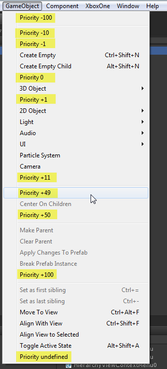
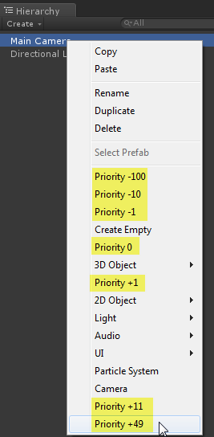
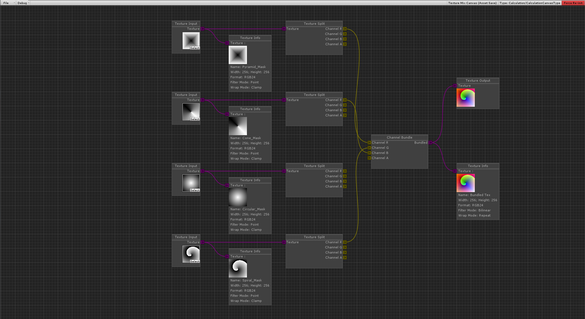
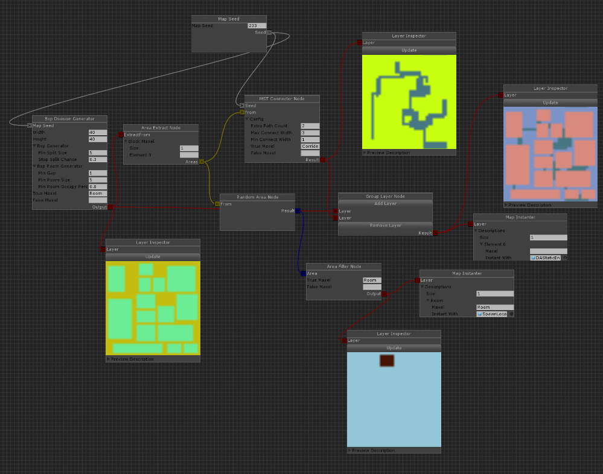
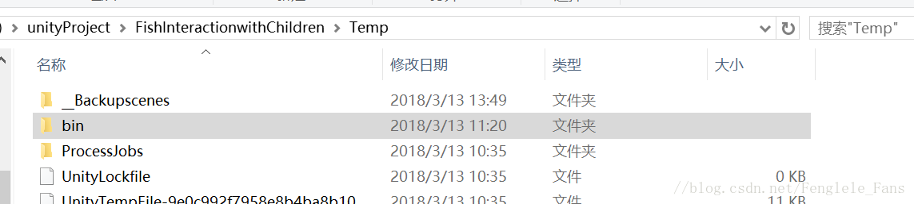
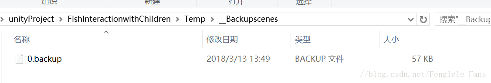

# Unity Editor

* link

  [Unity C# Editor Tutorials](https://catlikecoding.com/unity/tutorials/editor/)
  
  [Unity Editor](https://blog.csdn.net/qq_33337811/category_6785901.html)


---


### API

* Unity API

  [Unity Editor常用方法](https://www.cnblogs.com/zhaoqingqing/p/3944718.html)

  * 扩展

    ``` c#
    using UnityEngine;
    using UnityEditor;
    public class MenuItems
    {
        //扩展顶部菜单
        [MenuItem("Tools/Clear PlayerPrefs")]
        private static void NewMenuOption()
        {
            PlayerPrefs.DeleteAll();
        }
    }
    public static class Test {
     
        //扩展右键菜单
         [MenuItem("GameObject/MyMenu/Do Something", priority = 0)]
         static void Init() {
             Debug.Log("here");
         }
     }
    
    ```

    

    

* C# API

  [调用exe](https://blog.csdn.net/chen_zw/article/details/7896264)

  [调用exe 2](https://www.cnblogs.com/glorey/archive/2011/03/08/1977725.html)


---


* Unity可视化

  ref: https://www.bilibili.com/video/BV1i7411w7tW

  
  
  
  
  * Bolt - Unity AssetStore
  
    ref: https://assetstore.unity.com/packages/tools/visual-scripting/bolt-163802?locale=zh-CN
  
    主要功能点
  
    * 流图：强大的流控制图（类似 Unreal 蓝图），用于低级别逻辑和复杂任务。
    * 状态图：优雅的有限状态机 (FSM)，来用于高级逻辑和简单状态管理。
  
  * AssetGraph - UnityTech
  
    ref: https://github.com/Unity-Technologies/AssetGraph
  
  * Node Editor Framework for Unity
  
    ref: https://github.com/Seneral/Node_Editor_Framework
  
  * UndoPro for Unity
  
    ref: https://github.com/Seneral/UndoPro
  
  * xNode for Unity
  
    ref: https://github.com/Siccity/xNode
  
    xNodeGroups
  
    ref: https://github.com/Siccity/xNodeGroups
  
  * NPBehave for Unity 
  
    ref: https://github.com/meniku/NPBehave
  
    * 行为树
  
  * odin-serializer for Unity
  
    ref: https://github.com/TeamSirenix/odin-serializer
  
    * 序列化显示编辑器
    
  * PerfAssist
  
    ref:https://github.com/GameBuildingBlocks/PerfAssist
  
    Unity性能相关组件：协程Profiler和表格编辑器查看等
  
  * UnityComponent 
  
    ref:https://github.com/GameBuildingBlocks/UnityComponent
  
    这里整合了Unity资源管理上的一些解决方案。包括资源统计，资源格式化，资源打包以及资源加载等等。
    
  * NodeEditorFramework
  
    ref:https://github.com/Seneral/Node_Editor_Framework
  
    ``` tex
    Unity自带的动画状态机有一套对策划非常友好的UI。但是Unity官方没有公开这些控件的api
    ```
  
    
  
    


---


### 可视化和自动化

* [Attribute]应用

  [Unity C# Attribute应用](https://blog.csdn.net/kakashi8841/article/details/41891345)


---


### 编辑器使用

* 奔溃恢复

  ``` tex
  Unity提供了一种拯救场景的措施的；
  首先unity崩溃后不要重新打开unity，切记，不然就之前的成果就找不回来了；
  打开你的工程所在目录，找到Temp文件夹（该文件夹正常情况下在工程里是没有的，只有崩溃后才出现，重新打开unity，该文件夹就会消失），在其中找到_Backupscenes文件夹，然后打开_Backupscenes文件夹，找到其中的0.backup文件，没错，就是它，将backup后缀改成a.unity，然后将文件存放到其他地方去（非Temp文件夹）。然后重新打开unity，将a.unity文件拖到unity中即可；
  ```

  
  


---


### 辅助工具

* BMFont制作自定义字体

  [UGUI使用BMFont]https://blog.csdn.net/liqiangeastsun/article/details/46672403()


* PSD 2 UGUI

  [psd2ugui将psd中的文件直接导出到unity中](https://blog.csdn.net/woyidinghuichenggong/article/details/44566041)
