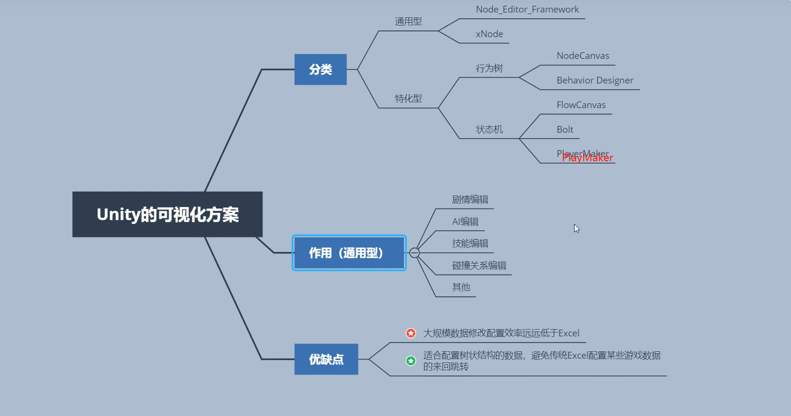

# Unity Editor

* link

  [Unity C# Editor Tutorials](https://catlikecoding.com/unity/tutorials/editor/)

---

* Unity可视化

  ref: https://www.bilibili.com/video/BV1i7411w7tW

  
  
  
  
  * Bolt - Unity AssetStore
  
    ref: https://assetstore.unity.com/packages/tools/visual-scripting/bolt-163802?locale=zh-CN
  
    主要功能点
  
    * 流图：强大的流控制图（类似 Unreal 蓝图），用于低级别逻辑和复杂任务。
    * 状态图：优雅的有限状态机 (FSM)，来用于高级逻辑和简单状态管理。
  
  * AssetGraph - UnityTech
  
    ref: https://github.com/Unity-Technologies/AssetGraph
  
  * Node Editor Framework for Unity
  
    ref: https://github.com/Seneral/Node_Editor_Framework
  
  * UndoPro for Unity
  
    ref: https://github.com/Seneral/UndoPro
  
  * xNode for Unity
  
    ref: https://github.com/Siccity/xNode
  
    xNodeGroups
  
    ref: https://github.com/Siccity/xNodeGroups
  
  * NPBehave for Unity 
  
    ref: https://github.com/meniku/NPBehave
  
    * 行为树
  
  * odin-serializer for Unity
  
    ref: https://github.com/TeamSirenix/odin-serializer
  
    * 序列化显示编辑器
    
  * PerfAssist
  
    ref:https://github.com/GameBuildingBlocks/PerfAssist
  
    Unity性能相关组件：协程Profiler和表格编辑器查看等
  
  * UnityComponent 
  
    ref:https://github.com/GameBuildingBlocks/UnityComponent
  
    这里整合了Unity资源管理上的一些解决方案。包括资源统计，资源格式化，资源打包以及资源加载等等。
