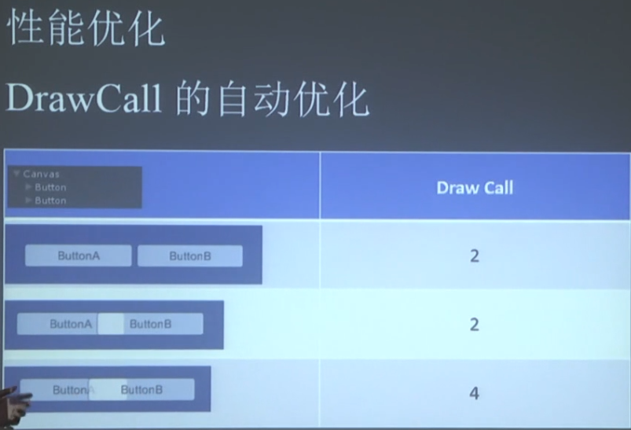

### UGUI 优化

* UGUI会自动检测优化，如果多个材质间没有遮挡或只有小部分不影响的遮挡则会合并DrawCall为一个

  

  * 尽可能保证Text在Image的上方。字体的DrawCall就可能自动会优化，而不需要像NGUI那样让字体跟图片pack在一起来减少DrawCall。

  * 尽可能保证Image之间不存在不必要的重叠。

  * ``` tex
    Canvas的重建主要就是为了合并DrawCall，可以将有动画的文字放在单独的Canvas中去，手动分离DrawCall（增加DrawCall）后就不会再要去跟别的文字作合并，该Canvas就不需要再重建故减少了重建开销。
    
    尽可能使用缓冲池。如人物身上的伤害数字，生成时会有较大的开销因为有Mesh的生成等过程。
    ```

  * 

* UI变色：修改材质和修改顶点色两种方式
  * 合并DrawCall一定要是相同的材质，修改材质会将本来已合并的DrawCall分离开，就导致了DrawCall的增加及Canvas的重建。
  * 修改顶点色（Button中Transition中的ColorTint方式）只会修改Canvas中的数据。

* UI边框：Sliced & Fill Center
  * Sliced模式的Sprite更节省纹理尺寸。
  * 中空的边框不应该勾选Fill Center，可减小Fill rate。
* Mask的代价，通过Stencil buffer实现
  * 移动平台需要Use 24-bit Depth Buffer（Tegra GPU 2、3上不支持，4支持）。
  * Mask中的UI元素无法与其他batch，从而增加DrawCall。
  * 可以的话尝试用Filled Sprite代替。
* 动画：Text vs Image
  * 如果Image上做了动画则Canvas需要重建，Image的顶点数一般不会很多，开销不会很大。
  * Text与文本内容（生成的网格数）相关，如果文字比较多则相比Image开销可能会翻倍。