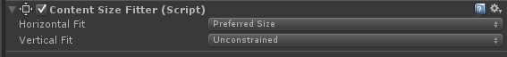
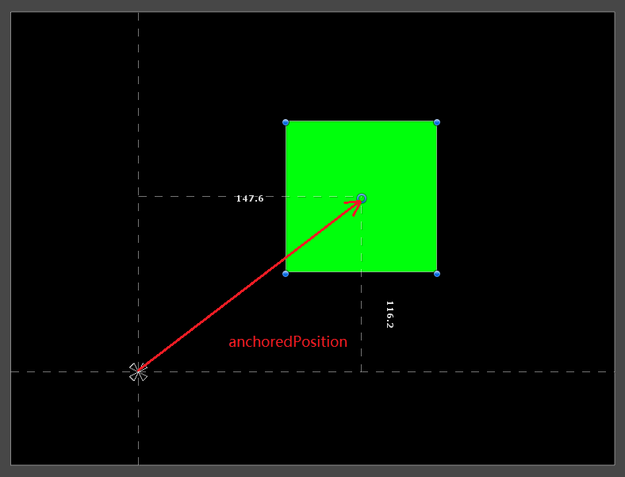

### Unity UI适配

* UGUI Text自适应

  ``` tex
  Unity 3D UGUI 的text不支持根据文本内容自适应显示宽度
  解决：
  加个content size fitter组件，那他就会自己适应长度了，其他锚点之类的设置好就不用自己算大小了
  ```

  

* 屏幕自适应

  ``` tex
  用UGUI做东西的时候，自适应选择scalewithscreensize,默认是基于高度进行等比缩放，
  UGUI的Anchor，即当前图片相对于父节点的位置，将anchor的四个角与自己的四个角关联在一起，既可以实现非等比缩放。
  即物体的大小就等于四个anchor所形成的区域，一般是屏幕的百分比。
  如果要使屏幕在宽高比低于某个标准值的时候表现为顶部和底部出现黑边，大于标准值横向拉伸，可以在Canvas下面添加一个panel，动态的去改变该panel的大小即可。
  
  private readonly float _refWidth = 960.0f;
  private readonly float _refHeight = 640.0f;
  private readonly float _refRatio = 960.0f / 640.0f;
  
  // Use this for initialization
  void Start ()
  {
  if (Screen.width * 1.0f / Screen.height > _refRatio)
  {
  GetComponent<RectTransform>().sizeDelta = new Vector2(Screen.width / (Screen.height / _refHeight), _refHeight);
  }
  else
  {
  GetComponent<RectTransform>().sizeDelta = new Vector2(_refWidth, _refHeight);
  }
  }
  ```

  

---


### UGUI基础组件

ref: https://www.cnblogs.com/suoluo/p/5427514.html

- Text中的可以单独指定某些文字的颜色，只需将想要变色的文本放在<color=**></color>之间即可，如“吃<color=#ff7a38>橙色物品</color>有机会获得<color=red>红色宝石</color>”，同样适用于NGUI。

- 两张图片，如头像框，头像在背景图之上，头像会挡住背景的点击事件，要实现全框的点击效果，只需要将头像作为背景的子物体就可以了。当然头像上不能有Button组件。

- 自带的CanvasGroup组件可以实现屏蔽其下所有UI的点击等事件触发，也可以实现整休改变所有子UI的alpha透明度。

- RectMask2D，类似Mask，但：

  the limitations of RectMask2D control are:

  - It only works in 2D space
  - It will not properly mask elements that are not coplanar

  The advantages of RectMask2D are:

  - It does not use the stencil buffer
  - No extra draw calls
  - No material changes
  - Fast performance

-  Content Size Fitter组件：自动改变RectTransfrom的size大小。如Text根据文字内容的长短自动缩放控件本身的大小，如一个ScrollRect下的Grid中的元素超时Rect时拖动无效的原因便是Grid未加上该组件它自身的大小未跟随元素的增多而增大。
  注意自动变化宽高时的方向是根据Pivot的设置，若Pivot在中心时则会上下左右同时都会有缩放，若Pivot在顶部时则大小只会从底部放大或缩小。

- Grid的使用：若元素（子物体）是大小一样的则优先使用Grid Layout Group组件；若元素是大小不一的则选用Horizontal/Vertical layout Group并配合Layout Element组件。
  通过灵活组合ScrollRect、ContentSizeFitter、GridLayoutGroup、HorizontalLayoutGroup/VerticalLayoutGroup、LayoutElement、可以实现很复杂的动态增删组合UI效果。
  详见UGUI Auto Layout 自动布局http://www.manew.com/thread-95758-1-1.html

- 避免使用布局分组（Layout Group，包括Grid,Scroll Rect等），使用锚点进行比例布局，或者考虑编写代码来计算布局，仅在需要时而不是每次发生改变时都计算。因为布局分组中有一个元素使布局变脏就会至少GetComponents一次且继续遍历Transform层级，有一定的开销。

- RectTransform的大小改变时有一个回调函数：OnRectTransformDimensionsChange。当ContentSizeFitter来自动调整RectTransform的大小时并不能立马生效，而是需要到下一帧才能得到正确的大小，此时该回调便有用武之地了。然而该回调的触发确有点奇怪会被触发多次且有时触发的次数还不同，另一解决办法是在获取RectTransform的size时调用LayoutRebuilder.ForceRebuildLayoutImmediate(rectTransform);不过该接口要5.x版本才能用....

- RectTransform的属性说明：

  * anchorMin、anchorMax：这两个点确定一个矩形，这个矩形的四个顶点就是锚点，为0-1之间，x边的长度（anchorMax.x与anchorMin.x差值构成的边，即矩形的宽度）占父RectTransform宽的比例和相对位置即为自身RectTransform水平方向相对父物体大小变化时的变化量（和局部坐标位置变化量），y垂直方向同理。
    当x边（水平）或y边（垂直）长度为1时，父物体在该方向大小改变时子物体大小（和局部坐标）按等比例变化；长度在0-1之内时，父物体大小变化量乘以该比例即为子物体大小变化量同时改变子物体局部坐标；长度0时，子物体大小不随父物体大小改变，该值仅表示两者的相对位置（为父物体在该方向上的大小变化量与子物体局部坐标变化量的比例值）。
  * anchoredPosition：中心点Pivot相对于锚点位置的坐标，若四个锚点未重合，则根据Pivot摆放信息在四个锚点中计算出锚点的参考位置，如中心点位于左下时，anchoredPosition为中心点相对于左下锚点的坐标。
    anchoredPosition为相对坐标，不会随着父物体大小的改变而改变，会变的是localPosition。
  * sizeDelta：RectTransform的Rect矩形区域大小相对于四个锚点（点的坐标，不是anchorMin、anchorMax值）组成的矩形大小（anchorSize）的差量。仅当四个锚点重合时该大小等于RectTransform的大小，当四个锚点分别跟父RectTransform四角重合时，该值表示子大小相对于父大小的差值。
    anchorSize = parentRectTransform.rect.size * (anchorMax - anchorMin);
    //或者anchorSize = LerpUnclamped(parentRect.min, parentRect.max, anchorMin) - LerpUnclamped(parentRect.min, parentRect.max, anchorMax);（LerpUnclamped即对x和y坐标分别Lerp，不局限在0-1之前插值）
    sizeDelta = realSize(即rect.size) - anchorSize;
    以上即SetSizeWithCurrentAnchors的实现，可见sizeDelta的意义所在。
  * offsetMin、offsetMin：这两个值是根据anchoredPosition和sizeDelta计算出来的值，表示RectTransform左下角相对左下锚点的坐标和右上角相对右上角锚点的坐标。
    sizeDelta大小等于offsetMax-offsetMin。
    想让子物体跟父一样大小且位置重合，可这样修改：rectTransform.anchorMin = Vector2.zero; rectTransform.anchorMax = Vector2.one; rectTransform.offsetMin = Vector2.zero; rectTransform.offsetMax = Vector2.zero;
    可以在不改中心点的情况下，向特定方向修改大小：修改offsetMin可以让RectTransform向左下方向改变大小，修改offsetMax可以让RectTransform向右上方向改变大小。
  * rect：RectTransform的矩形区域的数据表示。x、y为矩形左下角相对中心点的坐标，size即实际大小。该值为只读的。

* RectTransform的几个API说明：
  * public void GetLocalCorners(Vector3[] fourCornersArray)：传入4个长度的Vector3数组，得到该RectTransform从左下开始到右下的四个角相对自身中心点Pivot的坐标，注意这并不是相对父物体的局部坐标，所以移动RectTransform时这4个坐标并不会发生变化。
  * public void GetWorldCorners(Vector3[] fourCornersArray)：得到该RectTransform的四个角的世界坐标，不用关心当前及父对象的中心点及锚点的设置。
  * public void SetSizeWithCurrentAnchors(Axis axis, float size)：设置RectTransform的宽或高，可以不用关心当前及父对象的中心点及锚点的情况而直接设置宽高。当anchor的四角合一时该函数便跟设置sizeDelta效果一样。
  * public void SetInsetAndSizeFromParentEdge(Edge edge, float inset, float size)：设置RectTransform相对父物体的某一边缘的距离和宽高，同样可以不关心当前及父对象的中心点及锚点的情况而直接设置位置和宽高。edge父物体的上下左右某一边，inset为到edge边的距离，size为要将RectTransform设置的宽度或高度，当edge为左右时size为宽度，当edge为上下时size为高度。注意该函数会根据edge改变RectTransform的anchor。
    如：rectTrans.SetInsetAndSizeFromParentEdge (RectTransform.Edge.Top, 200, 400);rt.SetInsetAndSizeFromParentEdge (RectTransform.Edge.Left, 100, 300);该两次调用后rectTrans的高为400，上边距离父物体的上边为200，宽为300，左边距离父物体的左边为100。

* 当UI和ParticleSystem特效混用时会出现类似NGUI中特效与UI显示层级混乱的问题，如一个特效想要显示在两个UI之间或者一个UI的前面和后面各有一个特效时：
  首先Canvas不能为Overlay，需要指定Camera。
  然后UI1的Canvas的OrderInLayer为1，UI2的Canvas的OrderInLayer为3（可多个Canvas嵌套使用），Particle所在的Canvas的OrderInLayer为2。
  正常认为Particle应该位于两个UI之间了，然而由于Particle默认是位于0层，通过设置之上的Canvas的层是不起作用的，故特效仍显示不了。（针对半透明3D物体（放在Transparent队列），在渲染上是关闭了ZWrite的（使用了Blend就会自动设置ZWrite Off），因此Unity采用了一种简单的手段，将其强制放在缺省的Default Layer的Order in Layer（0）渲染（因此，对其挂Canvas是徒劳的））
  办法1：由于Particle为0层，则让需要显示Particle之下的UI层设置为小于0的负数层级，显示在Particle之上的UI则设置为大于0的层级数。这样做有个问题是当同时有多个Particle，有的要显示在UI之上有的要显示在之下，即Particle需要位于不同层级时有问题。
  办法2：设置Particle的层，在5.3版之后Particle本身Renderer可以直接设置层，但旧版本不行，增加脚本：

  ``` c#
  public class SetOrder : MonoBehaviour
  {
      public int order;
  
      void Awake ()
      {
          Renderer[] renderers = GetComponentsInChildren<Renderer> ();
          for (int i = 0; i < renderers.Length; i++)
          {
              renderers[i].sortingOrder = order;
          }
      }
  }
  
  /*
  将需要设置Particle层的物体上挂上该脚本即可设置Particle的层了，如此各UI及特效都能自由设置层级关系了。同时多个Particle也可指定为同一个层级然后在代码中设置renderer.material.renderQueue应该也是能调整特效之间的显示层级的，未测试亲可自测。
  */
  ```

* UGUI的Mask组件对Particle不起作用，解决办法：
  创建两个Shader，一个给粒子用，一个给UI Mask 用,两个Shader的内容均采用Build-in Shader的Particle-Additive 和 UI-Default。利用Shader 的 Stencil 功能， 分别对两个Shader加入以下内容：

  ``` c
  //UI Mask 
  Stencil
  {
  Ref 1
  Comp Always
  Pass Replace
  }
  //Paritcle
  Stencil {
  Ref 1
  Comp equal
  }
  
  /*
  之后分别创建相应材质球，将其赋予UIImage 和 想被遮罩的 Particle 即可。 如果看不见效果，调整一下Particle的位置。原文在评论区：http://www.xuanyusong.com/archives/3518
  */
  ```

* 代码中主动调用UI事件以模拟点击按钮等操作：

  ``` c#
  ExecuteEvents.Execute<IPointerClickHandler>(uiButton.gameObject, new PointerEventData(EventSystem.current), ExecuteEvents.pointerClickHandler);
  
  ExecuteEvents.Execute<ISubmitHandler>(uiButton.gameObject, new PointerEventData(EventSystem.current), ExecuteEvents.submitHandler);
  ```

* 当按钮图片延Y轴旋转180度（即背面在前，镜像翻转）时，按钮点击功能失效！同理推论所有UI元素只要背面在前时其点击等所有事件都会失效。当有两控件只是左右相反时想要共用一张图就会出该问题。解决办法是将点击区域和图片分离，在图片上层放置一个透明图片作为实际按钮，按钮的Target Graphic设置为翻转后的图片即可。新版可以设置Canvas上的GraphicRaycaster.ignoreReversedGraphics为false来禁用该功能解决。

* 隐藏UI的方式：

  1. 禁用Canvas组件，会阻止画布向GPU发起绘图调用，所以该画布不再可见。然而，此时该画布不会丢弃它的顶点缓冲区，它会保留所有网格和顶点，当重新启用时不会触发重构过程，它只会重新绘制画布内容。

     此外，禁用Canvas组件不会触发Canvas层级上性能消耗较大的OnDisable/OnEnable回调。

  2. SetActive(false)禁用根节点，整个UI都是未激活状态，如果运行性能消耗较大的每帧代码则可减少不必要开销。


---

### UGUI

* 基础

  ref: https://blog.csdn.net/SerenaHaven/article/details/78826851

  * RectTransform

    ``` tex
    Position, size, anchor and pivot information for a rectangle.
    RectTransforms are used for GUI but can also be used for other things. It’s used to store and manipulate the position, size, and anchoring of a rectangle and supports various forms of scaling based on a parent RectTransform.
    RectTransform主要提供一个矩形的位置、尺寸、锚点和中心信息以及操作这些属性的方法，同时提供多种基于父级RectTransform的缩放形式。
    ```

  * Anchor（锚点）

    ``` tex
    锚点（四个）由两个Vector2的向量确定，这两个向量确定两个点，归一化坐标分别是Min和Max，再由这两个点确定一个矩形，这个矩形的四个顶点就是锚点。
    在Min的x、y值分别小于Max的x、y值时，Min确定矩形左下角的归一化坐标，Max确定矩形右上角的归一化坐标。刚创建的Image，其Anchor的默认值为Min（0.5，0.5)和Max（0.5，0.5）。也就是说，Min和Max重合了，四个锚点合并成一点。
    
    ```

  * Pivot（中心点）

    ``` tex
    Pivot用来指示一个RectTransform（或者说是矩形）的中心点。矩形左下角为（0，0），右上角为（1，1）。Pivot为（0，0）时，即与矩形左下角重合。默认状态下，Pivot为（0.5，0.5），即Pivot在矩形中心。
    
    蓝色圆圈表示的就是Pivot。如果无法看见，需要在工具栏中选择Transform Tools的最后一个选项，或者使用快捷键T。
    
    可以通过直接在Scene视图中拖动Pivot来调整锚点位置，也可以在Inspector中直接输入Pivot的两个值以得到精确的位置。当对RectTransform进行定位、旋转和缩放操作时，都将以Pivot为参考点进行
    ```

    ``` tex
    子级RectTransform的在父级RectTransfrom中的定位是由子级Anchor和Pivot共同作用完成的。
    
    在锚点全部重合的情况下，PosX、PosY和PosZ确定了它的Pivot相对于Anchor的位置，Width和Height确定了它的尺寸。
    
    在仅左右拉伸的情况下，子RectTransform的左边和右边会分别与其左右两个Anchor保持Left和Right的距离；相对于两个Anchor连线的竖直偏移由PosY确定；自身的高度由Height确定。
    
    在仅上下拉伸的情况下，子RectTransform的上边和下边会分别与其上下两个Anchor保持Top和Bottom的距离；相对于两个Anchor连线的水平偏移由PosX确定；自身的宽度由Width确定。
    
    在上下左右均拉伸的情况下，子RectTransform的上下左右会分别与其上下左右四个Anchor保持Top、Bottom、Left和Right的距离；其位置和尺寸完全由父RectTransform控制。
    ```

  * postion localPosition anchoredPosition anchoredPosition3D

    ``` tex
    Transform有position和localPosition属性，这两个分别代表在世界空间的绝对位置和相对于父级物体的相对位置。RectTransform引入了anchoredPosition和anchoredPosition3D，它们都是相对位置，但是相对的是自身的Anchor。
    
    当锚点全部重合时，anchoredPosition代表的就是自身Pivot到Anchor的向量。
    
    anchoredPosition和anchoredPositoin3D都可以认为是以像素为单位。
    
    关于RectTransform的position和localPosition，它们的值根其所属的Canvas的渲染模式有关。
    在Screen Space——Overlay的模式下，由于Canvas的世界尺寸与其像素尺寸在数值上相等，因此其rectTransform的position与其在屏幕空间的坐标在数值上也相等。这种模式下，要获取某个RectTransform的屏幕坐标，直接使用position就可以。
    
    在Screen Space——Camera的模式和World Space下，RectTransform的渲染与摄像机有关，在获取其屏幕坐标时，需要利用canvas.worldCamera，或者transform.TransformPoint等坐标转换函数进行坐标转换。
    ```

    

  * offsetMax offsetMin

    ``` tex
    offsetMax The offset of the upper right corner of the rectangle relative to the upper right anchor.
    offsetMin The offset of the lower left corner of the rectangle relative to the lower left anchor.
    
    offsetMax是RectTransform右上角相对于右上Anchor的距离；
    offsetMin是RectTransform左下角相对于左下Anchor的距离。
    
    offset可以认为是以像素为单位。
    ```

    ``` c#
    //用代码控制RectTransform时很有用，比如在制作UI时，其中有个RectTransform采用的是“绝对定位”，
    //运行时需要用代码来将其设置为全拉伸，那么对该RectTransform执行如下操作就可以实现：
    rectTransform.anchorMin = Vector2.zero;
    rectTransform.anchorMax = Vector2.one;
    rectTransform.offsetMin = Vector2.zero;
    rectTransform.offsetMax = Vector2.zero;
    ```

  * sizeDelta

    ``` tex
    sizeDelta是个由引擎计算出来的值，这个值很容易被错误地使用。要正确地使用sizeDelta，就要先理解它是怎么算出来的。
    
    The size of this RectTransform relative to the distances between the anchors.
    If the anchors are together, sizeDelta is the same as size. If the anchors are in each of the four corners of the parent, the sizeDelta is how much bigger or smaller the rectangle is compared to its parent.
    
    sizeDelta是offsetMax-offsetMin的结果。
    在锚点全部重合的情况下，它的值就是面板上的（Width，Height）。
    在锚点完全不重合的情况下，它是相对于父矩形的尺寸。
    
    一个常见的错误是，当RectTransform的锚点并非全部重合时，使用sizeDelta作为这个RectTransform的尺寸。此时拿到的结果一般来说并非预期的结果。
    
    sizeDelta可以认为以像素为单位。
    ```

  * rect

    ``` tex
    获取一个RectTransform的矩形信息，应该使用rectTransform.rect属性
    rect属性同样是一个计算出来的值，但是它表示的是该rectTransform对应的矩形的相关信息。其中前两个参数分别代表矩形左下角相对于锚点的x和y坐标，后两个参数分别代表矩形的宽度和高度。
    
    rect可以认为是以像素为单位。
    ```

  * RectTransformUtility

    ``` tex
    RectTransformUtility是原生的RectTransform工具
    它提供了多个静态函数来对RectTransform进行操作，如坐标转换、范围测试等等
    ```

    


---


### NGUI使用问题

* 问题1

  ref: https://www.cnblogs.com/suoluo/p/5317430.html

  ``` tex
  NGUI panel 之下widget最大depth是1000，超过1000时OnClick会出问题！
  
  经过我的测试发现ngui widget的depth是有限制的！原本以为只要不同panel间的depth设置好了后无论widget depth如何设置都没问题，直到我们项目中出现奇怪的点击问题后才发现这个坑……
  
  当一个panel1 depth =1之下的widget depth>1000时，该widget相当于处在了panel2 depth=2层上去了！假如panel2底下所有的widget depth全部小于0，此时虽然所有panel2上面的UI看起来都是处在panl1上面的，但如果panel2上的widget上面有collider需要响应OnClick()时就会点击到panel1上面的collider上去！
  
  如果你发生了这种状况，就得将所有widget depth调整到1000以下，不过该panel下的widget可能超级多，简单点就将其他panel的depth再增加几层，两个panel depth不能相差只有1层。
  
  同理，如果widget depth>2000，则两个panel depth不能相差2层以内。
  ```

  

  