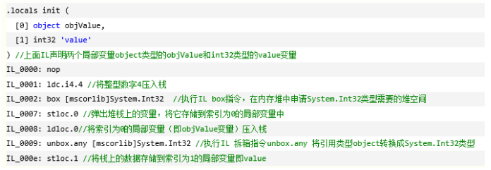
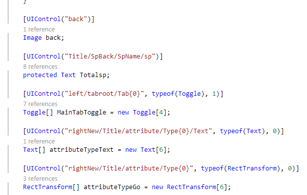
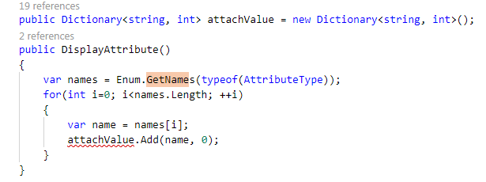
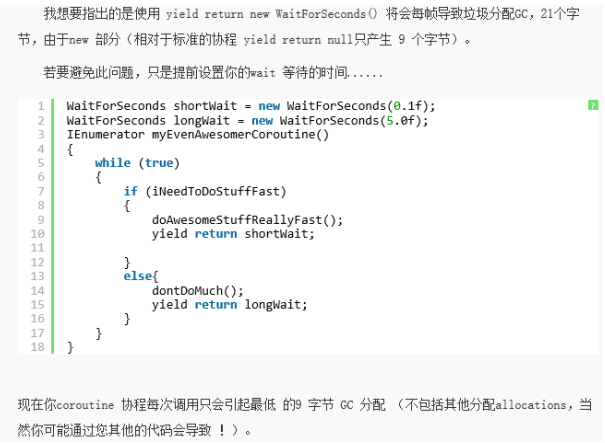

### Unity优化方案

* [【整理】unity3d优化总结篇](https://www.cnblogs.com/harlan1009/p/3970584.html)

  ``` tex
  对项目优化有很多，如：mesh合并 ，减少DrawCall和模型骨骼以及物理计算，合并材质球，优化代码等等，
  现在继续补上，该内容为本人经验以及网上收集整理，希望大家有更好的优化方法，能够继续跟帖，一起探讨，共同进步。
  
  优化： 
  1. 更新不透明贴图的压缩格式为ETC 4bit，因为android市场的手机中的GPU有多种，
  每家的GPU支持不同的压缩格式，但他们都兼容ETC格式，
  2. 对于透明贴图，我们只能选择RGBA 16bit 或者RGBA 32bit。
  3. 减少FPS，在ProjectSetting-> Quality中的
  VSync Count 参数会影响你的FPS，EveryVBlank相当于FPS=60，EverySecondVBlank = 30；
  这两种情况都不符合游戏的FPS的话，我们需要手动调整FPS，首先关闭垂直同步这个功能，然后在代码的Awake方法里手动设置FPS（Application.targetFrameRate = 45;）
  降低FPS的好处：
  1）省电，减少手机发热的情况；
  2）能都稳定游戏FPS，减少出现卡顿的情况。
  4. 当我们设置了FPS后，再调整下Fixed timestep这个参数，
  这个参数在ProjectSetting->Time中，目的是减少物理计算的次数，来提高游戏性能。
  5. 尽量少使用Update LateUpdate FixedUpdate，这样也可以提升性能和节省电量。
  多使用事件（不是SendMessage，使用自己写的，或者C#中的事件委托）。
  6. 待机时，调整游戏的FPS为1，节省电量。
  7. 图集大小最好不要高于1024，否则游戏安装之后、低端机直接崩溃、原因是手机系统版本低于2.2、超过1000的图集无法读取、导致。
  
  2.2 以上没有遇见这个情况。
  注意手机的RAM 与 ROM、小于 512M的手机、直接放弃机型适配。
  VSCount 垂直同步
     unity3d中新建一个场景空的时候，帧速率（FPS总是很低），大概在60~70之间。
  一直不太明白是怎么回事，现在基本上明白了。我在这里解释一下原因，如有错误，欢迎指正。
  在Unity3D中当运行场景打开Profiler的时候，我们会看到VSync 这一项占了很大的比重。
  这个是什么呢，这个就是垂直同步，稍后再做解释。
  我们可以关闭VSync来提高帧速率，选择edit->project settings->Quality。
  <ignore_js_op>
  在右侧面板中可以找到VSync Count,把它选成Don't Sync。
  <ignore_js_op> 
  这就关闭了VSync(垂直同步)，现在在运行场景看看，帧速率是不是提高很多。
  
  现在来说说什么是垂直同步，要知道什么是垂直同步，必须要先明白显示器的工作原理，
  显示器上的所有图像都是一线一线的扫描上去的，无论是隔行扫描还是逐行扫描，
  显示器都有两种同步参数——水平同步和垂直同步。
  
  什么叫水平同步？什么叫垂直同步？
  垂直和水平是CRT中两个基本的同步信号，水平同步信号决定了CRT画出一条横越屏幕线的时间，
  垂直同步信号决定了CRT从屏幕顶部画到底部，再返回原始位置的时间，
  而恰恰是垂直同步代表着CRT显示器的刷新率水平。
  
  为什么关闭垂直同步信号会影响游戏中的FPS数值？
  如果我们选择等待垂直同步信号（也就是我们平时所说的垂直同步打开），
  那么在游戏中或许强劲的显卡迅速的绘制完一屏的图像，但是没有垂直同步信号的到达，
  显卡无法绘制下一屏，只有等85单位的信号到达，才可以绘制。
  这样FPS自然要受到操作系统刷新率运行值的制约。
  
  而如果我们选择不等待垂直同步信号（也就是我们平时所说的关闭垂直同步），那么游戏中作完一屏画面，
  显卡和显示器无需等待垂直同步信号就可以开始下一屏图像的绘制，自然可以完全发挥显卡的实力。
  但是不要忘记，正是因为垂直同步的存在，才能使得游戏进程和显示器刷新率同步，使得画面更加平滑和稳定。
  取消了垂直同步信号，固然可以换来更快的速度，但是在图像的连续性上势必打折扣。
  这也正是很多朋友抱怨关闭垂直后发现画面不连续的理论原因。
  
  合并材质球unity 3d中每倒入一次模型就多一个材质球，可我的这些模型都是共用一张贴图的就想共用一个材质球，所以每次都要删除再附上，很麻烦。怎么才能合并这些材质球？
  采用TexturePacking吧
  1、遍历gameobject，取出material，并根据shader来将material分类
  2、调用Unity自带的PackTextures函数来合并每个shader分类中的material所对应的textures（PackTextures函数有缺陷，不过可以将就用）
  3、根据合并的大的texture来更新原有模型的texture、material已经uv坐标值。
  
  需要注意的是：需要合并的纹理应该是物体在场景中距离相近的，如果物体在场景中的距离较远，
  则不建议合并纹理，因为这样做很有可能非但起不到优化的作用，反而降低了运行效率。 
  
  mesh合并 
  分为2种方式合并
  1.自带的合并必须勾选静态。
  <ignore_js_op> 
  所有被勾选了“Static”的GameObject，其中的Mesh Filter中的mesh都会被合并到 "Combined Mesha (root: scene)" 中
  
  2.也可以用脚本来合并mesh 。
  using UnityEngine;
  using System.Collections;
  public class MyClass : MonoBehaviour
  {
      void Start ()
      {
          MeshFilter [] meshFilters = GetComponentsInChildren<MeshFilter> ();
          CombineInstance[] combine = new CombineInstance[meshFilters.Length];
   
          for (int i = 0; i < meshFilters.Length; i++) {
              combine [i].mesh = meshFilters [i].sharedMesh;
              combine [i].transform = meshFilters [i].transform.localToWorldMatrix;
              meshFilters [i].gameObject.active = false; 
          }
   
              transform.GetComponent<MeshFilter> ().mesh = new Mesh ();
              transform.GetComponent<MeshFilter> ().mesh.CombineMeshes (combine);
              transform.gameObject.active = true;
      }
  }
  1. 先在 Unity 中建立 空物件 ( Empty ) 
  2. 再创建2个 Cube 方块，并放入 空物件底下 (可以改成你自己的模型)
  3. 把 MyClass 代码丟进 空物件上 。
  4. (可选) 建立一个 Material 材质，并且丢进 空物件上
  5. 执行
  ========================================分割线====================================
  
  角色Material数量
  2-3个
  骨骼数量
  小于30个
  面片数量
  300-1500
  一般角色应该没有IK结点
  这是因为角色的动作大多数都是事先设定好的，并不需要经过IK操作来进行实时计算（Rogdoll除外），所以在模型导入时，不要将IK结点一起导入。
   
  
  2、静态实体
  不要附加Animation Component
  在静态实体上附加Animation部件虽然对结果没有影响，但却会增加一定的CPU开销来调用这一组件，所以尽量去掉该组件。
  网格顶点数
  小于500
  UV值范围尽量不要超过（0, 1）区间
  尽量保证UV值不越界，这对于将来的纹理拼合优化很有帮助。
   
  
  3、地形
  地形的分辨率大小
  长宽均尽量小于257。这是因为地形太大，会造成大量顶点数据，给你的内存带宽造成一定的影响，在目前的ios设备中，内存带宽是非常有限的，需要尽量节省。同时，如果用Unity自带的地形，一定也要使用Occlusion Culling，因为Unity的刷地形工具虽然方便，但却是framekiller，刷过之后，你会发现drawcall增加的非常多。
  混合纹理数量
  不要超过4。地形的混合操作是很耗时的，应该尽量避免。能合并的纹理尽量合并。
   
  
  4、纹理
  纹理格式
  建议png或tga。不用转成ios硬件支持的PVRTC格式，因为Unity在发布时会帮你自动转的。
  纹理尺寸
  长宽小于1024。同时应该尽可能地小，够用就好，以保证纹理对内存带宽的影响达到最小。
  支持Mipmap
  建议生成Mipmap。虽然这种做法会增加一些应用程序的大小，但在游戏运行时，系统会根据需求应用Mipmap来渲染，从而减少内存带宽。
  检查Alpha值
  如果纹理的alpha通道均为1，则用RGB的24位纹理来代替RGBA的32位纹理。（据说Unity内部会进行自动检测）
   
  
  5、光源
  光源“Important”个数
  建议1个，一般为方向光。“Important”个数应该越小越少。个数越多，drawcall越多。
  Pixel Light数目
  1-2个。
  
  6、粒子特效
  屏幕上的最大粒子数
  建议小于200个粒子。
  每个粒子发射器发射的最大粒子数
  建议不超过50个。
  粒子大小
  如果可以的话，粒子的size应该尽可能地小。因为Unity的粒子系统的shader无论是alpha test还是alpha blending都是一笔不小的开销。同时，对于非常小的粒子，建议粒子纹理去掉alpha通道。
  尽量不要开启粒子的碰撞功能。
  非常耗时。
   
  7、音频
  游戏中播放时间较长的音乐（如背景音乐）
  使用.ogg或.mp3的压缩格式。
  较短音乐（如枪声）
  使用.wav和.aif的未压缩音频格式。
   
  8、相机
  裁剪平面
  将远平面设置成合适的距离。远平面过大会将一些不必要的物体加入渲染，降低效率。
  根据不同的物体设置不同的远裁剪平面
  Unity提供了可以根据不同的layer来设置不同的view distance，所以我们可以实现将物体进行分层，大物体层设置的可视距离大些，而小物体层可以设置地小些，另外，一些开销比较大的实体（如粒子系统）可以设置得更小些等等。
   
  9、碰撞
  尽量不用MeshCollider
  如果可以的话，尽量不用MeshCollider，以节省不必要的开销。如果不能避免的话，尽量用减少Mesh的面片数，或用较少面片的代理体来代替。
   
  10、其他
  Drawcall
  尽可能地减少Drawcall的数量。IOS设备上建议不超过100。减少的方法主要有如下几种：Frustum Culling，Occlusion Culling，Texture Packing。Frustum Culling是Unity内建的，我们需要做的就是寻求一个合适的远裁剪平面；Occlusion Culling，遮挡剔除，Unity内嵌了Umbra，一个非常好OC库。但Occlusion Culling也并不是放之四海而皆准的，有时候进行OC反而比不进行还要慢，建议在OC之前先确定自己的场景是否适合利用OC来优化；Texture Packing，或者叫Texture Atlasing，是将同种shader的纹理进行拼合，根据Unity的static batching的特性来减少draw call。建议使用，但也有弊端，那就是一定要将场景中距离相近的实体纹理进行拼合，否则，拼合后很可能会增加每帧渲染所需的纹理大小，加大内存带宽的负担。这也就是为什么会出现“DrawCall降了，渲染速度也变慢了”的原因。
  
  非运动物体尽量打上Static标签
  Unity在运行时会对static物体进行自动优化处理，所以应该尽可能将非运行实体勾上static标签。
  
  场景中尽可能地使用prefab
  尽可能地使用prefab的实例化物体，以降低内存带宽的负担。检查实体的PrefabType，尽量将其变成PrefabInstance，而不是ModelPrefabInstance。
  
  
  ========================================分割线==================================== 
  
  移动平台相对于PC机，具有体积小，计算弱，带宽少的特点。
  因此做手机游戏的开发，优化的方向，与力度对比PC游戏都有所区别。
  必须要做到优化流程，合理利用资源。
  目前在手机上面，还不能够像PC游戏那样追求高质量渲染效果，为了让手机不那么容易发烫，还要控制cpu，gpu，不能让他们全速运算。
  
  
  材质方面：
  纹理方面，建议使用压缩纹理，
  Android上面使用ETC1，苹果上面使用PVRTC。
  UV坐标控制在0到1之间，人物模型面数控制在1500内，骨骼控制在30个以内。
  场景中使用一个主光（不能再多了）。
  尽量减少alphaTest和alphaBlend材质的使用。在手机上，这是很杀效率的。
  
  
  骨骼动画方面：
  在动画方面可以考虑不使用插值，固定的帧率的动画。
  如果要做插值，考虑使用四元数（表示旋转）和向量（表示位移）来做插值。
  四元数做插值速度比矩阵来的快，Slerp提供了平滑插值。
  
  
  ========================================分割线==================================== 
  
  优化的常规技巧
  剖析你的游戏。
  不要花费时间来优化那些晦涩的代码或者缩减图形文件的大小，除非这是你游戏的瓶颈。
  第一次剖析你的游戏将会使你发现你游戏的瓶颈。Apple's Shark是一个很好的用来剖析基于OpenGL的程序的工具。
  再次剖析你的游戏。
  优化之后不要忘记再剖析一次你的游戏，这样可以检查你所做的优化是否达到了预期的效果。
  当然，这样做也可能会使你发现更多的瓶颈。
  流程第一、性能第二。花费时间来使你游戏的创建尽可能地流畅。
  尽可能快地修正游戏中的错误将会使你后期更容易优化你的游戏。
  在Scene View中测试场景。
  这样做将会使你清楚了解这个场景中的物体或者附加在物体上的脚本是否降低了游戏性能。
  如果Scene View反应迟钝，那么有可能是图形方面的原因，如果Scene View反应不迟钝，那么瓶颈可能出在脚本或者物理系统上。
  禁用指定游戏物体。
  在play模式下，尝试禁用并启用游戏物体来排查出游戏慢的原因。
  
  网格
  如果可能的话，把相邻的物体（网格）合并为一个只有一个材质的物体（网格）。比如，你的游戏中包含一个桌子，上面有一堆东西，你完全可以在3D程序中将它们合并在一起（这可能也需要你将这些物体的纹理合并为一个大的纹理集）。减少需要渲染的物体的数量可以极大地提高游戏性能。
  
  不要有不必要的网格。
  如果你的游戏场景中有一个人物，那么他应该是一个网格。如果你有一个船，那么它也应该只是一个网格。
  每一个网格只用一种材质。
  使用极少的面数的网格（比如500个多边形以下）。
  最好把你人物的三角面数量控制在1500-2000个之间。
  这个数量可以说是游戏质量和性能之间一个均衡值。如果你的模型有四边形，那么在导入模型的时候，引擎将会把每个四边形变为两个三角形。
  
  光照
  像素光。
  像素光可以让你的游戏看起来效果很牛逼，但是不要使用过多的像素光。
  在你的游戏中可以使用质量管理器来调节像素光的数量来取得一个性能和质量的均衡点.
  
  性能占用顺序：聚光灯>点光源>平行光。
  一个好的点亮场景的方法就是先得到你想要的效果，然后看看哪些光更重要；
  在保持光效的前提下看看哪些光可以去掉。
  
  点光源和聚光灯只影响它们范围内的网格。
  如果一个网格处于点光源或者聚光灯的照射范围之外，并且光源的attenuate开关是打开的，那么这个网格将不会被光源所影响，这样就可以节省性能开销。
  这样做理论上来讲可以使用很多小的点光源而且依然能有一个好的性能，因为这些光源只影响一小部分物体。
  一个网格在有8个以上光源影响的时候，只响应前8个最亮的光源。
  
  贴图
  在外观不变的前提下，贴图大小越小越好。
  如果你的显卡的显存不够大的话，你游戏中的贴图将会被转存到系统内存中，在显卡调用它们的时候再传到显卡中。
  对于比较新的电脑来说，内存和显卡之间有足够的带宽来达到一个很好的性能；
  如果你很无耻地用了巨多的大图片的话，在低显存的电脑上运行你的游戏的时候，你的游戏必然会挂掉。
  倒是没有必要在图形编辑软件中调整贴图的大小。你可以在unity导入贴图的时候进行调整。
  
  不要使用低质量的图片。
  在小播放界面的游戏中使用低质量的jpeg图片或者低色彩的png图片亦或是gif图片没什么问题。
  在发布游戏的时候，引擎会自动压缩这些图片，多重压缩和解压将会降低图片的质量，所以最好保持贴图文件的分辨率为原始分辨率。
  这样就会减少多重压缩和解压所导致的图片失真现象。
  
  Shaders
  多重效果的shader就比看起来样式很单一的shader要更耗费资源。
  同样在一个拥有贴图和光反射的物体上，使用VertexLit Diffuse shader无疑是最省资源的。
  
  
  ========================================分割线==================================== 
  
  在美术制作场景的过程中，会使用到大量的粒子系统。
  比如场景中的火把。在我们的一个地下城场景中，美术们放置了大量的火把。整个场景中的各个地方，有100来个火把。
  
  unity中，在摄像机范围外的粒子系统虽然不会被绘制。
  但是update是一直持续的。这也就意味着，这100多个火把，不论是否可见都在更新。
  
  这个设计应该是很不合理的，在我看过的其他引擎中，都会有一个开关，来控制不可见的粒子系统是否需要update。
  有的粒子系统在不可见的时候需要更新,比如爆炸。有的不需要更新，比如火堆火把。
  
  为了避免不必要的update开销，尤其是最后游戏是要发布到页游平台（web player只能使用一个cpu的核）。
  于是写了一个脚本，控制不可见的粒子系统就不更新。
  
  该脚本主要是用到了2个MonoBehaviour的函数。
  OnBecameInvisible() 当变为不可见   和   OnBecameVisible() 当变成可见。 
  
  要这2个函数起作用的前提是，该GameObject绑定了MeshRender组件。
  所以，我们要在粒子系统的GameObject放置在一个GameObject  下，且给该GameObject绑定一个MeshRender 与 MeshFilter。
  MeshFilter中的mesh可以随便找个cube。
  
  在Start（） 的时候，把最GameObject的scale设置为很小，以保证该cube不被看见。
  其实遍历所有的child，把active设置为false。
  
  在OnBecameVisible 中 遍历所有child，把active设置为true。
  在OnBecameInvisible中 遍历所有child，把active设置为false。
  
  ========================================分割线==================================== 
  
  Unity 性能优化 Draw Call 
  
  Unity（或者说基本所有图形引擎）生成一帧画面的处理过程大致可以这样简化描述：引擎首先经过简单的可见性测试，确定摄像机可以看到的物体，然后把这些物体的顶点（包括本地位置、法线、UV等），索引（顶点如何组成三角形），变换（就是物体的位置、旋转、缩放、以及摄像机位置等），相关光源，纹理，渲染方式（由材质/Shader决定）等数据准备好，然后通知图形API——或者就简单地看作是通知GPU——开始绘制，GPU基于这些数据，经过一系列运算，在屏幕上画出成千上万的三角形，最终构成一幅图像。
  
  在Unity中，每次引擎准备数据并通知GPU的过程称为一次Draw Call。这一过程是逐个物体进行的，对于每个物体，不只GPU的渲染，引擎重新设置材质/Shader也是一项非常耗时的操作。因此每帧的Draw Call次数是一项非常重要的性能指标，对于iOS来说应尽量控制在20次以内，这个值可以在编辑器的Statistic窗口看到。
  
  Unity内置了Draw Call Batching技术，从名字就可以看出，它的主要目标就是在一次Draw Call中批量处理多个物体。只要物体的变换和材质相同，GPU就可以按完全相同的方式进行处理，即可以把它们放在一个Draw Call中。Draw Call Batching技术的核心就是在可见性测试之后，检查所有要绘制的物体的材质，把相同材质的分为一组（一个Batch），然后把它们组合成一个物体（统一变换），这样就可以在一个Draw Call中处理多个物体了（实际上是组合后的一个物体）。
  
  但Draw Call Batching存在一个缺陷，就是它需要把一个Batch中的所有物体组合到一起，相当于创建了一个与这些物体加起来一样大的物体，与此同时就需要分配相应大小的内存。这不仅会消耗更多内存，还需要消耗CPU时间。特别是对于移动的物体，每一帧都得重新进行组合，这就需要进行一些权衡，否则得不偿失。但对于静止不动的物体来说，只需要进行一次组合，之后就可以一直使用，效率要高得多。
  
  Unity提供了Dynamic Batching和Static Batching两种方式。Dynamic Batching是完全自动进行的，不需要也无法进行任何干预，对于顶点数在300以内的可移动物体，只要使用相同的材质，就会组成Batch。Static Batching则需要把静止的物体标记为Static，然后无论大小，都会组成Batch。如前文所说，Static Batching显然比Dynamic Batching要高效得多，于是，Static Batching功能是收费的……
  
  要有效利用Draw Call Batching，首先是尽量减少场景中使用的材质数量，即尽量共享材质，对于仅纹理不同的材质可以把纹理组合到一张更大的纹理中（称为Texture Atlasing）。然后是把不会移动的物体标记为Static。此外还可以通过CombineChildren脚本（Standard Assets/Scripts/Unity Scripts/CombineChildren）手动把物体组合在一起，但这个脚本会影响可见性测试，因为组合在一起的物体始终会被看作一个物体，从而会增加GPU要处理的几何体数量，因此要小心使用。
  
  对于复杂的静态场景，还可以考虑自行设计遮挡剔除算法，减少可见的物体数量同时也可以减少Draw Call。
  
  总之，理解Draw Call和Draw Call Batching原理，根据场景特点设计相应的方案来尽量减少Draw Call次数才是王道，其它方面亦然。
  
  
  Draw Call Batching （绘制调用批处理）
  
  To draw an object on the screen, the engine has to issue a draw call to the graphics API (OpenGL ES in the case of iOS). Every single draw call requires a significant amount of work on the part of the graphics API, causing significant performance overhead on the CPU side.
  在屏幕上渲染物体，引擎需要发出一个绘制调用来访问图形API（iOS系统中为OpenGL ES）。
  每个绘制调用需要进行大量的工作来访问图形API，从而导致了CPU方面显著的性能开销。
  
  Unity combines a number of objects at runtime and draws them together with a single draw call. This operation is called "batching". The more objects Unity can batch together, the better rendering performance you will get.
  Unity在运行时可以将一些物体进行合并，从而用一个绘制调用来渲染他们。这一操作，我们称之为“批处理”。
  一般来说，Unity批处理的物体越多，你就会得到越好的渲染性能。
  
  Built-in batching support in Unity has significant benefit over simply combining geometry in the modeling tool (or using theCombineChildren script from the Standard Assets package). Batching in Unity happensafter visibility determination step. The engine does culling on each object individually, and the amount of rendered geometry is going to be the same as without batching. Combining geometry in the modeling tool, on the other hand, prevents effecient culling and results in much higher amount of geometry being rendered.
  Unity中内建的批处理机制所达到的效果要明显强于使用几何建模工具（或使用Standard Assets包中的CombineChildren脚本）的批处理效果。
  这是因为，Unity引擎的批处理操作是在物体的可视裁剪操作之后进行的。
  Unity先对每个物体进行裁剪，然后再进行批处理，这样可以使渲染的几何总量在批处理前后保持不变。
  但是，使用几何建模工具来拼合物体，会妨碍引擎对其进行有效的裁剪操作，从而导致引擎需要渲染更多的几何面片。
  
  Materials
  材质
  Only objects sharing the same material can be batched together. Therefore, if you want to achieve good batching, you need to share as many materials among different objects as possible.
  只有拥有相同材质的物体才可以进行批处理。
  因此，如果你想要得到良好的批处理效果，你需要在程序中尽可能地复用材质和物体。
  
  If you have two identical materials which differ only in textures, you can combine those textures into a single big texture - a process often calledtexture atlasing. Once textures are in the same atlas, you can use single material instead.
  如果你的两个材质仅仅是纹理不同，那么你可以通过 纹理拼合 操作来将这两张纹理拼合成一张大的纹理。
  一旦纹理拼合在一起，你就可以使用这个单一材质来替代之前的两个材质了。
  
  If you need to access shared material properties from the scripts, then it is important to note that modifyingRenderer.material will create a copy of the material. Instead, you should useRenderer.sharedMaterial to keep material shared.
  如果你需要通过脚本来访问复用材质属性，那么值得注意的是改变Renderer.material将会造成一份材质的拷贝。
  因此，你应该使用Renderer.sharedMaterial来保证材质的共享状态。
  
  Dynamic Batching
  动态批处理
  Unity can automatically batch moving objects into the same draw call if they share the same material.
  如果动态物体共用着相同的材质，那么Unity会自动对这些物体进行批处理。
  
  Dynamic batching is done automatically and does not require any additional effort on your side.
  动态批处理操作是自动完成的，并不需要你进行额外的操作。
  
  Tips:
  提醒：
  1、Batching dynamic objects has certain overheadper vertex, so batching is applied only to meshes containing less than900 vertex attributes in total.
               批处理动态物体需要在每个顶点上进行一定的开销，所以动态批处理仅支持小于900顶点的网格物体。
  
  2、If your shader is using Vertex Position, Normal and single UV, then you can batch up to 300 verts and if your shader is using Vertex Position, Normal, UV0, UV1 and
              Tangent, then only 180 verts.
              Please note: attribute count limit might be changed in future
              如果你的着色器使用顶点位置，法线和UV值三种属性，那么你只能批处理300顶点以下的物体；
  如果你的着色器需要使用顶点位置，法线，UV0，UV1和切向量，那你只
              能批处理180顶点以下的物体。
              请注意：属性数量的限制可能会在将来进行改变。
  
  4、Don't use scale. Objects with scale (1,1,1) and (2,2,2) won't batch.
              不要使用缩放尺度（scale）。分别拥有缩放尺度(1,1,1)和(2,2,2)的两个物体将不会进行批处理。
  
  5、Uniformly scaled objects won't be batched with non-uniformly scaled ones.
              统一缩放尺度的物体不会与非统一缩放尺度的物体进行批处理。
             Objects with scale (1,1,1) and (1,2,1) won't be batched. On the other hand (1,2,1) and (1,3,1) will be.
             使用缩放尺度(1,1,1)和 (1,2,1)的两个物体将不会进行批处理，但是使用缩放尺度(1,2,1)和(1,3,1)的两个物体将可以进行批处理。
  
  6、Using different material instances will cause batching to fail.
             使用不同材质的实例化物体（instance）将会导致批处理失败。
  
  7、Objects with lightmaps have additional (hidden) material parameter: offset/scale in lightmap, so lightmapped objects won't be batched (unless they point to same
             portions of lightmap)
             拥有lightmap的物体含有额外（隐藏）的材质属性，比如：lightmap的偏移和缩放系数等。所以，拥有lightmap的物体将不会进行批处理（除非他们指向lightmap的同一
             部分）。
  
  8、Multi-pass shaders will break batching. E.g. Almost all unity shaders supports several lights in forward rendering, effectively doing additional pass for them
             多通道的shader会妨碍批处理操作。比如，几乎unity中所有的着色器在前向渲染中都支持多个光源，并为它们有效地开辟多个通道。
  
  9、Using instances of a prefab automatically are using the same mesh and material.
             预设体的实例会自动地使用相同的网格模型和材质。
  
  Static Batching
  静态批处理
  
  Static batching, on the other hand, allows the engine to reduce draw calls for geometry of any size (provided it does not move and shares the same material). Static batching is significantly more efficient than dynamic batching. You should choose static batching as it will require less CPU power.
  相对而言，静态批处理操作允许引擎对任意大小的几何物体进行批处理操作来降低绘制调用（只要这些物体不移动，并且拥有相同的材质）。因此，静态批处理比动态批处理更加有效，你应该尽量低使用它，因为它需要更少的CPU开销。
  
  In order to take advantage of static batching, you need explicitly specify that certain objects are static and willnot move, rotate or scale in the game. To do so, you can mark objects as static using the Static checkbox in the Inspector:
  为了更好地使用静态批处理，你需要明确指出哪些物体是静止的，并且在游戏中永远不会移动、旋转和缩放。想完成这一步，你只需要在检测器（Inspector）中将Static复选框打勾即可，如下图所示：
  
  Using static batching will require additional memory for storing the combined geometry. If several objects shared the same geometry before static batching, then a copy of geometry will be created for each object, either in the Editor or at runtime. This might not always be a good idea - sometimes you will have to sacrifice rendering performance by avoiding static batching for some objects to keep a smaller memory footprint. For example, marking trees as static in a dense forest level can have serious memory impact.
  使用静态批处理操作需要额外的内存开销来储存合并后的几何数据。在静态批处理之前，如果一些物体共用了同样的几何数据，那么引擎会在编辑以及运行状态对每个物体创建一个几何数据的备份。这并不总是一个好的想法，因为有时候，你将不得不牺牲一点渲染性能来防止一些物体的静态批处理，从而保持较少的内存开销。比如，将浓密森里中树设为Static，会导致严重的内存开销。
  
  Static batching is only available in Unity iOS Advanced.
  静态批处理目前只支持Unity iOS Advanced。
  
  备注：最近一直在研究Unity3D的性能优化问题，这段时间可能会多翻译这方面的文章。
  
  前两天，MadFinger，就是当今iOS与Android上画质最牛逼闪闪的游戏之一——ShadowGun的开发商，令人惊异地放出了一个ShadowGun的样例关卡以及若干可免费使用的Shader，国外同行们的分享精神真的是令人赞叹不已。原文在这里，以下是我的一些摘录和笔记。
  
  首先是一些优化常识。针对图形方面的优化主要包括三角形数量，纹理所占内存，以及Shader，前两项基本没什么好讲的，针对设备机能的限制制定相应的指标即可，所以Shader就成为了图形性能优化的关键。
  
  Alpha blending
  在Unity官方文档中讲，由于硬件原因，在iOS设备上使用alpha-test会造成很大的性能开销，应尽量使用alpha-blend代替。这里提到，在同屏使用alpha-blend的面数，尤其是这些面所占屏幕面积的大小，对性能也会造成很大影响。原因是使用alpha-blend的面会造成overdraw的增加，这尤其对低性能设备的影响很大。不过没有购买Pro版，没有Occlusion Culling功能的话，就不必顾虑这一问题了，反正overdraw是必然的。
  
  复杂的Per-pixel shader
  Per-pixel shader即Fragment shader，顾名思义是要对每个渲染到屏幕上的像素做处理的shader，如果per-pixel shader比较复杂且需要处理的像素很多时，也就是使用该shader的面占屏幕面积很大时，对性能的影响甚至要超过alpha blending。因此复杂的per-pixel shader只适用于小物体。
  
  下面是对几个Shader的逐一讲解：
  Environment specular maps(Shader Virtual Gloss Per Vertex Additive)
  Specular map通常都是利用贴图的alpha通道来定义物体表面的光滑程度（反光度），这个shader的特点是per-vertex计算反光度的，有着相当不错的效果的同时比per-pixel的shader性能要高得多。这个shader很适用于关卡环境等占很大区域的模型。
  
  经过优化的动态角色光照和阴影(Light probes和BRDF Shader)
  传统的Lightmaps无法支持动态物体，对此Unity提供了Light probes技术，预先把动态物体的光照信息保存在代理对象(即Light probes)中，运行时动态物体从距离最近的Probe中获取光照信息。
  
  Unity本身还提供了一个效果非常棒的专为移动设备优化过的角色Shader，支持Diffuse、Specular和Normal maps，并通过一个特殊的脚本生成贴图用于模仿BRDF光照效果。最终产生的效果堪比次时代大作中的角色光影效果。
  
  雾和体积光(Shader Blinking Godrays)
  目前在移动设备上要开启真正的雾效基本不可行，ShadowGun的方案是通过简单的网格＋透明贴图(称为雾面)来模拟雾效。在玩家靠近时，雾面逐渐变淡，同时fog plane的顶点也会移开(即使完全透明的alpha面也会消耗很多渲染时间)。
  
  使用这个Shader的网格需要经过处理：
  
  顶点的alpha值用于决定顶点是否可以移动(在例子中0为不可动，1为可动)。
  顶点法线决定移动的方向
  然后Shader通过计算与观察者的距离来控制雾面的淡入/淡出。
  这个Shader还可以用来做体积光和其它一些alpha效果。
  
  飞机坠毁的浓烟效果(Shader Scroll 2 Layers Sine Alpha-blended)
  通过粒子产生浓烟的代价太高，所以ShadowGun中使用了网格＋贴图动画来制作这个效果。通过混合两层贴图并让它们交错移动来产生动画效果。其中顶点alpha值用于让网格的边缘看起来比较柔和，同时使用顶点颜色来模拟从火焰到烟雾的过渡效果。
  
  带动态效果的天空盒(Shader Scroll 2 Layers Multiplicative)
  通过两张贴图的混合和移动产生云的动态效果。
  
  旗帜和衣服的飘动效果(Shader Lightmap + Wind)
  同样利用顶点alpha值决定哪些顶点可以移动，然后shader的参数用于调整摆动的方向和速度。
  
  =======================分割线========================
  
  一、程序方面
  　　01、务必删除脚本中为空或不需要的默认方法；
  　　02、只在一个脚本中使用OnGUI方法；
  　　03、避免在OnGUI中对变量、方法进行更新、赋值，输出变量建议在Update内；
  　　04、同一脚本中频繁使用的变量建议声明其为全局变量，脚本之间频繁调用的变量或方法建议声明为全局静态变量或方法；
  　　05、不要去频繁获取组件，将其声明为全局变量；
  　　06、数组、集合类元素优先使用Array，其次是List；
  　　07、脚本在不使用时脚本禁用之，需要时再启用；
  　　08、可以使用Ray来代替OnMouseXXX类方法；
  　　09、需要隐藏/显示或实例化来回切换的对象，尽量不要使用SetActiveRecursively或active，而使用将对象远远移出相机范围和移回原位的做法；
  　　10、尽量少用模运算和除法运算，比如a/5f，一定要写成a*0.2f。
  　　11、对于不经常调用或更改的变量或方法建议使用Coroutines & Yield；
  　　12、尽量直接声明脚本变量，而不使用GetComponent来获取脚本；
  iPhone
  　　13、尽量使用整数数字，因为iPhone的浮点数计算能力很差；
  　　14、不要使用原生的GUI方法；
  　　15、不要实例化（Instantiate）对象，事先建好对象池，并使用Translate“生成”对象；
  　
  二、模型方面
  　　01、合并使用同贴图的材质球，合并使用相同材质球的Mesh；
  　　02、角色的贴图和材质球只要一个，若必须多个则将模型离分离为多个部分；
  　　02、骨骼系统不要使用太多；
  　　03、当使用多角色时，将动画单独分离出来；
  　　04、使用层距离来控制模型的显示距离；
  　　05、阴影其实包含两方面阴暗和影子，建议使用实时影子时把阴暗效果烘焙出来，不要使用灯光来调节光线阴暗。
  　　06、少用像素灯和使用像素灯的Shader；
  　　08、如果硬阴影可以解决问题就不要用软阴影，并且使用不影响效果的低分辨率阴影；
  　　08、实时阴影很耗性能，尽量减小产生阴影的距离；
  　　09、允许的话在大场景中使用线性雾，这样可以使远距离对象或阴影不易察觉，因此可以通过减小相机和阴影距离来提高性能；
  　　10、使用圆滑组来尽量减少模型的面数；
  　　11、项目中如果没有灯光或对象在移动那么就不要使用实时灯光；
  　　12、水面、镜子等实时反射/折射的效果单独放在Water图层中，并且根据其实时反射/折射的范围来调整；
  　　13、碰撞对效率的影响很小，但碰撞还是建议使用Box、Sphere碰撞体；
  　　14、建材质球时尽量考虑使用Substance；
  　　15、尽量将所有的实时反射/折射（如水面、镜子、地板等等）都集合成一个面；
  　　16、假反射/折射没有必要使用过大分辨率，一般64*64就可以，不建议超过256*256；
  　　17、需要更改的材质球，建议实例化一个，而不是使用公共的材质球；
  　　18、将不须射线或碰撞事件的对象置于IgnoreRaycast图层；
  　　19、将水面或类似效果置于Water图层
  　　20、将透明通道的对象置于TransparentFX图层；
  　　21、养成良好的标签（Tags）、层次（Hieratchy）和图层（Layer）的条理化习惯，将不同的对象置于不同的标签或图层，三者有效的结合将很方便的按名称、类别和属性来查找；
  　　22、通过Stats和Profile查看对效率影响最大的方面或对象，或者使用禁用部分模型的方式查看问题到底在哪儿；
  　　23、使用遮挡剔除（Occlusion Culling）处理大场景，一种较原生的类LOD技术，并且能够“分割”作为整体的一个模型。
  
  三、其它
  　　场景中如果没有使用灯光和像素灯，就不要使用法线贴图，因为法线效果只有在有光源（Direct Light/Point Light/Angle Light/Pixel Light）的情况下才有效果。
  ```

* [使用Unity3D的50个技巧：Unity3D最佳实践](https://www.cnblogs.com/harlan1009/p/3970581.html)

  ``` tex
  关于这些技巧这些技巧不可能适用于每个项目。
  这些是基于我的一些项目经验，项目团队的规模从3人到20人不等；
  框架结构的可重用性、清晰程度是有代价的——团队的规模和项目的规模决定你要在这个上面付出多少；
  很多技巧是品味的问题（这里所列的所有技巧，可能有同样好的技术替代方案）；
  一些技巧可能是对传统的Unity开发的一个冲击。例如，使用prefab替代对象实例并不是一个传统的Unity风格，并且这样做的代价还挺高的（需要很多的preffab）。也许这些看起来有些疯狂，但是在我看来是值得的。
  
  【流程】
  1、避免Assets分支
  
  所有的Asset都应该只有一个唯一的版本。如果你真的需要一个分支版本的Prefab、Scene或是Mesh，那你要制定一个非常清晰的流程，来确定哪个是正确的版本。错误的分支应该起一个特别的名字，例如双下划线前缀：__MainScene_Backup。Prefab版本分支需要一个特别的流程来保证安全（详见Prefabs一节）。
  2、如果你在使用版本控制的话，每个团队成员都应该保有一个项目的Second Copy用来测试修改之后，Second Copy和Clean Copy都应该被更新和测试。大家都不要修改自己的Clean Copy。这对于测试Asset丢失特别有用。
  3、考虑使用外部的关卡编辑工具
  Unity不是一个完美的关卡编辑器。例如，我们使用TuDee来创建3D Tile-Based的游戏，这使我们可以获得对Tile友好的工具的益处（网格约束，90度倍数的旋转，2D视图，快速Tile选择等）。从一个XML文件来实例化Prefab也很简单。详见Guerrilla Tool Development。
  4、考虑把关卡保存为XML，而非scene
  这是一种很奇妙的技术：
  它可以让你不必每个场景都设置一遍；
  他可以加载的更快（如果大多数对象都是在场景之间共享的）。
  它让场景的版本合并变的简单（就算是Unity的新的文本格式的Scene，也由于数据太多，而让版本合并变的不切实际）。
  它可以使得在关卡之间保持数据更简便。
  你仍就可以使用Unity作为关卡编辑器（尽管你用不着了）。你需要写一些你的数据的序列化和反序列化的代码，并实现在编辑器和游戏运行时加载关卡、在编辑器中保存关卡。你可能需要模仿Unity的ID系统来维护对象之间的引用关系。
  
  5、考虑编写通用的自定义Inspector代码
  实现自定义的Inspector是很直截了当的，但是Unity的系统有很多的缺点：
  它不支持从继承中获益；
  它不允许定义字段级别的Inspector组件，而只能是class类型级别。举个例子，如果没有游戏对象都有一个ScomeCoolType字段，而你想在Inspector中使用不同的渲染，那么你必须为你的所有class写Inspector代码。
  你可以通过从根本上重新实现Inspector系统来处理这些问题。通过一些反射机制的小技巧，他并不像看上去那么看，文章底部（日后另作翻译）将提供更多的实现细节。                                                                                                                                 
  【场景组织】
  6、使用命名的空Game Object来做场景目录
  仔细的组织场景，就可以方便的找到任何对象。
  7、把控制对象和场景目录（空Game Objec）放在原点（0，0，0）
  如果位置对于这个对象不重要，那么就把他放到原点。这样你就不会遇到处理Local Space和World Space的麻烦，代码也会更简洁。
  8、尽量减少使用GUI组件的offset
  通常应该由控件的Layout父对象来控制Offset；它们不应该依赖它们的爷爷节点的位置。位移不应该互相抵消来达到正确显示的目的。做基本上要防止了下列情况的发生：
  父容器被放到了（100，-50），而字节点应该在（10，10），所以把他放到（90，60）[父节点的相对位置]。
  这种错误通常放生在容器不可见时。
  9、把世界的地面放在Y=0
  这样可以更方便的把对象放到地面上，并且在游戏逻辑中，可以把世界作为2D空间来处理（如果合适的话），例如AI和物理模拟。
  10、使游戏可以从每个Scene启动
  这将大大的降低测试的时间。为了达到所有场景可运行，你需要做两件事：
  首先，如果需要前面场景运行产生的一些数据，那么要模拟出它们。
  其次，生成在场景切换时必要保存的对象，可以是这样：
  myObject = FindMyObjectInScene(); if (myObjet == null){   myObject = SpawnMyObject();}
  
  【美术】
  11、把角色和地面物体的中心点(Pivot)放在底部，不要放在中间
  这可以使你方便的把角色或者其他对象精确的放到地板上。如果合适的话，它也可能使得游戏逻辑、AI、甚至是物理使用2D逻辑来表现3D。
  12、统一所有的模型的面朝向（Z轴正向或者反向）
  对于所有具有面朝向的对象（例如角色）都应该遵守这一条。在统一面朝向的前提下，很多算法可以简化。
  13、在开始就把Scale搞正确
  请美术把所有导入的缩放系数设置为1，并且把他们的Transform的Scale设置为1,1,1。可以使用一个参考对象（一个Unity的Cube）来做缩放比较。为你的游戏选择一个世界的单位系数，然后坚持使用它。
  14、为GUI组件或者手动创建的粒子制作一个两个面的平面模型
  设置这个平面面朝向Z轴正向，可能简化Billboard和GUI创建。
  15、制作并使用测试资源
  
  为SkyBox创建带文字的方形贴图；
  一个网格（Grid）；
  为Shader测试使用各种颜色的平面：白色，黑色，50%灰度，红，绿，蓝，紫，黄，青；
  为Shader测试使用渐进色：黑到白，红到绿，红到蓝，绿到蓝；
  黑白格子；
  平滑的或者粗糙的法线贴图；
  一套用来快速搭建场景的灯光（使用Prefa）；                                                                                                                                                     
  【Prefabs】
  16、所有东西都使用Prefab
  只有场景中的“目录”对象不使用Prefab。甚至是那些只使用一次的唯一对象也应该使用Prefab。这样可以在不动用场景的情况下，轻松修改他们。（一个额外的好处是，当你使用EZGUI时，这可以用来创建稳定的Sprite Atlases）
  17、对于特例使用单独的Prefab，而不要使用特殊的实例对象
  如果你有两种敌人的类型，并且只是属性有区别，那么为不同的属性分别创建Prefab，然后链接他们。这可以：
  
  在同一个地方修改所有类型
  在不动用场景的情况下进行修改
  如果你有很多敌人的类型，那么也不要在编辑器中使用特殊的实例。一种可选的方案是程序化处理它们，或者为所有敌人使用一个核心的文件/Prefab。使用一个下拉列表来创建不同的敌人，或者根据敌人的位置、玩家的进度来计算。
  18、在Prefab之间链接，而不要链接实例对象
  当Prefab放置到场景中时，它们的链接关系是被维护的，而实例的链接关系不被维护。尽可能的使用Prefab之间的链接可以减少场景创建的操作，并且减少场景的修改。
  19、如果可能，自动在实例对象之间产生链接关系
  如果你确实需要在实例之间链接，那么应该在程序代码中去创建。例如，Player对象在Start时需要把自己注册到GameManager，或者GameManager可以在Start时去查找Player对象。
  对于需要添加脚本的Prefab，不要用Mesh作为根节点。当你需要从Mesh创建一个Prefab时，首先创建一个空的GameObject作为父对象，并用来做根节点。把脚本放到根节点上，而不要放到Mesh节点上。使用这种方法，当你替换Mesh时，就不会丢失所有你在Inspector中设置的值了。
  使用互相链接的Prefab来实现Prefab嵌套。Unity并不支持Prefab的嵌套，在团队合作中第三方的实现方案可能是危险的，因为嵌套的Prefab之间的关系是不明确的。
  20、使用安全的流程来处理Prefab分支
  我们用一个名为Player的Prefab来讲解这个过程。
  用下面这个流程来修改Player：
  
  复制Player Prefab；
  把复制出来的Prefab重命名为__Player_Backup；
  修改Player Prefab；
  测试一切工作正常，删除__Player_Backup；
  不要把新复制的命名为Player_New，然后修改它。
  有些情况可能更复杂一些。例如，有些修改可能涉及到两个人，上述过程有可能使得场景无法工作，而所有人必须停下来等他们修改完毕。如果修改能够很快完成，那么还用上面这个流程就可以。如果修改需要花很长时间，则可以使用下面的流程：
  
  第一个人：
  复制Player Prefab；
  把它重命名为__Player_WithNewFeature或者__Player_ForPerson2；
  在复制的对象上做修改，然后提交给第二个人；
  第二个人：
  在新的Prefab上做修改；
  复制Player Prefab，并命名为__Player_Backup；
  把__Player_WithNewFeature拖放到场景中，创建它的实例；
  把这个实例拖放到原始的Player Prefab中；
  如果一切工作正常，则可使删除__Player_Backup和__Player_WithNewFeature;                                                                                                                                                          
  【扩展和MonoBehaviourBase】
  21、扩展一个自己的Mono Behaviour基类，然后自己的所有组件都从它派生
  这可以使你方便的实现一些通用函数，例如类型安全的Invoke，或者是一些更复杂的调用（例如random等等）。
  22、为Invoke, StartCoroutine and Instantiate 定义安全调用方法
  定义一个委托任务（delegate Task），用它来定义需要调用的方法，而不要使用字符串属性方法名称，例如：
  public void Invoke(Task task, float time){   Invoke(task.Method.Name, time);}
  23、为共享接口的组件扩展
  有些时候把获得组件、查找对象实现在一个组件的接口中会很方便。
  下面这种实现方案使用了typeof，而不是泛型版本的函数。泛型函数无法在接口上工作，而typeof可以。下面这种方法把泛型方法整洁的包装起来。
  //Defined in the common base class for all mono behaviourspublic I GetInterfaceComponent<I>() where I : class{   return GetComponent(typeof(I)) as I;} public static List<I> FindObjectsOfInterface<I>() where I : class{   MonoBehaviour[] monoBehaviours = FindObjectsOfType<MonoBehaviour>();   List<I> list = new List<I>();    foreach(MonoBehaviour behaviour in monoBehaviours)   {      I component = behaviour.GetComponent(typeof(I)) as I;       if(component != null)      {         list.Add(component);      }   }    return list;}
  
  24、使用扩展来让代码书写更便捷
  例如：
  public static class CSTransform {   public static void SetX(this Transform transform, float x)   {      Vector3 newPosition =          new Vector3(x, transform.position.y, transform.position.z);       transform.position = newPosition;   }   ...}
  
  25、使用防御性的GetComponent()
  有些时候强制性组件依赖（通过RequiredComponent）会让人蛋疼。例如，很难在Inspector中修改组件（即使他们有同样的基类）。下面是一种替代方案，当一个必要的组件没有找到时，输出一条错误信息。
  public static T GetSafeComponent<T>(this GameObject obj) where T : MonoBehaviour{   T component = obj.GetComponent<T>();    if(component == null)   {      Debug.LogError("Expected to find component of type "          + typeof(T) + " but found none", obj);   }    return component;}
  
              
  【风格】
  26、避免对同一件事使用不同的处理风格
  在很多情况下，某件事并不只有一个惯用手法。在这种情况下，在项目中明确选择其中的一个来使用。下面是原因：
  
  一些做法并不能很好的一起协作。使用一个，能强制统一设计方向，并明确指出不是其他做法所指的方向；
  团队成员使用统一的风格，可能方便大家互相的理解。他使得整体结构和代码都更容易理解。这也可以减少错误；
  几组风格的例子：
  
  协程与状态机（Coroutines vs. state machines）；
  嵌套的Prefab、互相链接的Prefab、超级Prefab（Nested prefabs vs. linked prefabs vs. God prefabs）；
  数据分离的策略；
  在2D游戏的使用Sprite的方法；
  Prefab的结构；
  对象生成策略；
  定位对象的方法：使用类型、名称、层、引用关系；
  对象分组的方法：使用类型、名称、层、引用数组；
  找到一组对象，还是让它们自己来注册；
  控制执行次序（使用Unity的执行次序设置，还是使用Awake/Start/Update/LateUpdate，还是使用纯手动的方法，或者是次序无关的架构）；
  在游戏中使用鼠标选择对象/位置/目标：SelectionManager或者是对象自主管理；
  在场景变换时保存数据：通过PlayerPrefs，或者是在新场景加载时不要销毁的对象；
  组合动画的方法：混合、叠加、分层；                                                                                                                                           
  【时间】
  27、维护一个自己的Time类，可以使游戏暂停更容易实现
  做一个“Time.DeltaTime”和""Time.TimeSinceLevelLoad"的包装，用来实现暂停和游戏速度缩放。这使用起来略显麻烦，但是当对象运行在不同的时钟速率下的时候就方便多了（例如界面动画和游戏内动画）。
                     
  【生成对象】
  28、不要让游戏运行时生成的对象搞乱场景层次结构
  在游戏运行时，为动态生成的对象设置好它们的父对象，可以让你更方便的查找。你可以使用一个空的对象，或者一个没有行为的单件来简化代码中的访问。可以给这个对象命名为“DynamicObjects”。
   
  【类设计】
  29、使用单件（Singleton）模式
  从下面这个类派生的所有类，将自动获得单件功能：
  public class Singleton<T> : MonoBehaviour where T : MonoBehaviour{   protected static T instance;    /**      Returns the instance of this singleton.   */   public static T Instance   {      get      {         if(instance == null)         {            instance = (T) FindObjectOfType(typeof(T));             if (instance == null)            {               Debug.LogError("An instance of " + typeof(T) +                   " is needed in the scene, but there is none.");            }         }          return instance;      }   }}
  
  单件可以作为一些管理器，例如ParticleManager或者AudioManager亦或者GUIManager。
  
  对于那些非唯一的prefab实例使用单件管理器（例如Player）。不要为了坚持这条原则把类的层次关系复杂化，宁愿在你的GameManager（或其他合适的管理器中）中持有一个它们的引用。
  对于外部经常使用的共有变量和方法定义为static，这样你可以这样简便的书写“GameManager.Player”，而不用写成“GameManager.Instance.player”。
  
  30、在组件中不要使用public成员变量，除非它需要在inspector中调节
  除非需要设计师（策划or美术）去调节的变量，特别是它不能明确表明自己是做什么的变量，不要声明为public。如果在这些特殊情况下，无法避免，则可使用两个甚至四个下划线来表明不要从外部调节它，例如：
  public float __aVariable; 
  
  31、把界面和游戏逻辑分开
  这一条本质上就是指的MVC模式。
  所有的输入控制器，只负责向相应的组件发送命令，让它们知道控制器被调用了。举一个控制器逻辑的例子，一个控制器根据玩家的状态来决定发送哪个命令。但是这样并不好（例如，如果你添加了多个控制器，那将会导致逻辑重复）。相反的，玩家对象应该根据当前状态（例如减速、惊恐）来设置当前的速度，并根据当前的面朝向来计算如何向前移动。控制器只负责做他们自己状态相关的事情，控制器不改变玩家的状态，因此控制前甚至可以根本不知道玩家的状态。另外一个例子，切换武器。正确的方法是，玩家有一个函数：“SwitchWeapon(Weapon newWeapon)”供GUI调用。GUI不应该维护所有对象的Transform和他们之间的父子关系。
  所有界面相关的组件，只负责维护和处理他们自己状态相关的数据。例如，显示一个地图，GUI可以根据玩家的位移计算地图的显示。但是，这是游戏状态数据，它不属于GUI。GUI只是显示游戏状态数据，这些数据应该在其他地方维护。地图数据也应该在其他地方维护（例如GameManager）。
  游戏玩法对象不应该关心GUI。有一个例外是处理游戏暂停（可能是通过控制Time.timeScale，其实这并不是个好主意）。游戏玩法对象应该知道游戏是否暂停。但是，这就是全部了。另外，不要把GUI组件挂到游戏玩法对象上。
  这么说吧，如果你把所有的GUI类都删了，游戏应该可以正确编译。
  你还应该达到：在不需要重写游戏逻辑的前提下，重写GUI和输入控制。
  
  32、分离状态控制和簿记变量
  簿记变量只是为了使用起来方便或者提高查找速度，并且可以根据状态控制来覆盖。将两者分离可以简化：
  
  保存游戏状态
  调试游戏状态
  实现方法之一是为每个游戏逻辑定义一个”SaveData“类，例如：
  [Serializable]PlayerSaveData{   public float health; //public for serialisation, not exposed in inspector}  Player{   //... bookkeeping variables    //Don’t expose state in inspector. State is not tweakable.   private PlayerSaveData playerSaveData; }
  
  33、分离特殊的配置
  假设我们有两个敌人，它们使用同一个Mesh，但是有不同的属性设置（例如不同的力量、不同的速度等等）。有很多方法来分离数据。下面是我比较喜欢的一种，特别是对于对象生成或者游戏存档时，会很好用。（属性设置不是状态数据，而是配置数据，所以我们不需要存档他们。当对象加载或者生成是，属性设置会自动加载。）
  
  为每一个游戏逻辑类定义一个模板类。例如，对于敌人，我们来一个“EnemyTemplate”，所有的属性设置变量都保存在这个类中。
  在游戏逻辑的类中，定义一个上述模板类型的变量。
  制作一个敌人的Prefab，以及两个模板的Prefab：“WeakEnemyTemplate”和"StrongEnemyTemplate"。
  在加载或者生成对象是，把模板变量正确的复制。
  这种方法可能有点复杂（在一些情况下，可能不需要这样）。
  
  举个例子，最好使用泛型，我们可以这样定义我们的类：
  public class BaseTemplate{   ...} public class ActorTemplate : BaseTemplate{   ...} public class Entity<EntityTemplateType> where EntityTemplateType : BaseTemplate{   EntityTemplateType template;   ...} public class Actor : Entity <ActorTemplate>{   ...}
  
  34、除了显示用的文本，不要使用字符串
  特别是不要用字符串作为对象或者prefab等等的ID标识。一个很遗憾的例外是动画系统，需要使用字符串来访问相应的动画。
  35、避免使用public的数组
  举例说明，不要定义一个武器的数组，一个子弹的数组，一个粒子的数组，这样你的代码看起来像这样：
  public void SelectWeapon(int index){    currentWeaponIndex = index;   Player.SwitchWeapon(weapons[currentWeapon]);} public void Shoot(){   Fire(bullets[currentWeapon]);   FireParticles(particles[currentWeapon]);   }
  这在代码中还不是什么大问题，但是在Inspector中设置他们的值的时候，就很难不犯错了。
  
  我们可以定义一个类，来封装这三个变量，然后使用一个它的实例数组：
  [Serializable]public class Weapon{   public GameObject prefab;   public ParticleSystem particles;   public Bullet bullet;} 这样代码看起来很整洁，但是更重要的是，在Inspector中设置时就不容易犯错了。
  
  36、在结构中避免使用数组
  举个例子，一个玩家可以有三种攻击形式，每种使用当前的武器，并发射不同的子弹、产生不同的行为。
  你可以把三个子弹作为一个数组，并像下面这样组织逻辑：
  public void FireAttack(){   /// behaviour   Fire(bullets[0]);} public void IceAttack(){   /// behaviour   Fire(bullets[1]);} public void WindAttack(){   /// behaviour   Fire(bullets[2]);} 使用枚举值可以让代码看起来更好一点：
  
  public void WindAttack(){   /// behaviour   Fire(bullets[WeaponType.Wind]);} 
  但是这对Inspector一点也不好。
  
  最好使用单独的变量，并且起一个好的变量名，能够代表他们的内容的含义。使用下面这个类会更整洁。
  [Serializable]public class Bullets{   public Bullet FireBullet;   public Bullet IceBullet;   public Bullet WindBullet;}这里假设没有其他的Fire、Ice、Wind的数据。
  
  37、把数据组织到可序列化的类中，可以让inspector更整洁
  有些对象有一大堆可调节的变量，这种情况下在Inspector中找到某个变量简直就成了噩梦。为了简化这种情况，可以使用一下的步骤：
  
  把这些变量分组定义到不同的类中，并让它们声明为public和serializable；
  在一个主要的类中，把上述类的实例定义为public成员变量；
  不用在Awake或者Start中初始化这些变量，因为Unity会处理好它们；
  你可以定义它们的默认值；
  这可以把变量分组到Inspector的分组页签中，方便管理。
  
  [Serializable]public class MovementProperties //Not a MonoBehaviour!{   public float movementSpeed;   public float turnSpeed = 1; //default provided} public class HealthProperties //Not a MonoBehaviour!{   public float maxHealth;   public float regenerationRate;} public class Player : MonoBehaviour{   public MovementProperties movementProeprties;   public HealthPorperties healthProeprties;}
                                                                                                                                                      
  【文本】
  38、如果你有很多的剧情文本，那么把他们放到一个文件里面。
  不要把他们放到Inspector的字段中去编辑。这些需要做到不打开Unity，也不用保存Scene就可以方便的修改。
  39、如果你计划实现本地化，那么把你的字符串分离到一个统一的位置。
  有很多种方法来实现这点。例如，定义一个文本Class，为每个字符串定义一个public的字符串字段，并把他们的默认值设为英文。其他的语言定义为子类，然后重新初始化这些字段为相应的语言的值。
  另外一种更好的技术（适用于文本很大或者支持的语言数量众多），可以读取几个单独的表单，然后提供一些逻辑，根据所选择的语言来选取正确的字符串。                                                                                                                                 
  【测试与调试】
  40、实现一个图形化的Log用来调试物理、动画和AI。
  这可以显著的加速调试工作。详见这里。
  41、实现一个HTML的Log。
  在很多情况下，日志是非常有用的。拥有一个便于分析的Log（颜色编码、有多个视图、记录屏幕截图等）可以使基于Log的调试变动愉悦。详见这里。
  42、实现一个你自己的帧速率计算器。
  没有人知道Unity的FPS计算器在做什么，但是肯定不是计算帧速率。实现一个你自己的，让数字符合直觉并可视化。
  43、实现一个截屏的快捷键。
  很多BUG是图形化的，如果你有一个截图，就很容易报告它。一个理想的系统，应该在PlayerPrefes中保存一个计数，并根据这个计数，使得所有成功保存的截屏文件都不被覆盖掉。截屏文件应该保存在工程文件夹之外，这可以防止人们不小心把它提交到版本库中。
  44、实现一个打印玩家坐标的快捷键。
  这可以在汇报位置相关的BUG时明确它发生在世界中的什么位置，这可以让Debug容易一些。
  45、实现一些Debug选项，用来方便测试。
  一些例子：
  解锁所有道具；
  关闭所有敌人；
  关闭GUI；
  让玩家无敌；
  关闭所有游戏逻辑；
  46、为每一个足够小的团队，创建一个适合他们的Debug选项的Prefab。
  设置一个用户标识文件，单不要提交到版本库，在游戏运行时读取它。下面是原因：
  团队的成员不会因为意外的提交了自己的Debug设置而影响到其他人。
  修改Debug设置不需要修改场景。
  47、维护一个包含所有游戏元素的场景。
  例如，一个场景，包括所有的敌人，所有可以交互的对象等等。这样可以不用玩很久，而进行全面的功能测试。
  48、定义一些Debug快捷键常量，并把他们保存在统一的地方。
  Debug键通常（方便起见）在一个地方来处理，就像其他的游戏输入一样。为了避免快捷键冲突，在一个中心位置定义所有常量。一种替代方案是，在一个地方处理所有按键输入，不管他是否是Debug键。（负面作用是，这个类可能需要引用更多的其他对象）
  
  【文档】
  49、为你的设置建立文档。
  代码应该拥有最多的文档，但是一些代码之外的东西也必须建立文档。让设计师们通过代码去看如果进行设置是浪费时间。把设置写入文档，可以提高效率（如果文档的版本能够及时更新的话）。
  用文档记录下面这些：
  Layer的使用（碰撞、检测、射线检测——本质上说，什么东西应该在哪个Layer里）；
  Tag的使用；
  GUI的depth层级（说什么应该显示在什么之上）；
  惯用的处理方式；
  Prefab结构；
  动画Layer。
  
  【命名规则和目录结构】
  50、遵从一个命名规范和目录结构，并建立文档
  命名和目录结构的一致性，可以方便查找，并明确指出什么东西在哪里。
  你很有可能需要创建自己的命名规则和目录结构，下面的例子仅供参考。
  
  普遍的命名规则
  名字应该代表它是什么，例如鸟就应该叫做Bird。
  选择可以发音、方便记忆的名字。如果你在制作一个玛雅文化相关的游戏，不要把关卡命名为QuetzalcoatisReturn。
  保持唯一性。如果你选择了一个名字，就坚持用它。
  使用Pascal风格的大小写，例如ComplicatedVerySpecificObject。
  不要使用空格，下划线，或者连字符，除了一个例外（详见为同一事物的不同方面命名一节）。
  不要使用版本数字，或者标示他们进度的名词（WIP、final）。
  不要使用缩写：DVamp@W应该写成DarkVampire@Walk。
  使用设计文档中的术语：如果文档中称呼一个动画为Die，那么使用DarkVampire@Die，而不要用DarkVampire@Death。
  保持细节修饰词在左侧：DarkVampire，而不是VampireDark；PauseButton，而不是ButtonPaused。举例说明，在Inspector中查找PauseButton，比所有按钮都以Button开头方便。（很多人倾向于相反的次序，认为那样名字可以自然的分组。然而，名字不是用来分组的，目录才是。名字是用来在同一类对象中可以快速辨识的。）
  为一个序列使用同一个名字，并在这些名字中使用数字。例如PathNode0, PathNode1。永远从0开始，而不是1。
  对于不是序列的情况，不要使用数字。例如 Bird0, Bird1, Bird2，本应该是Flamingo, Eagle, Swallow。
  为临时对象添加双下划线前缀，例如__Player_Backup。
  
  为同一事物的不同方面命名
  在核心名称后面添加下划线，后面的部分代表哪个方面。例如
  
  GUI中的按钮状态：EnterButton_Active、EnterButton_Inactive
  贴图： DarkVampire_Diffuse, DarkVampire_Normalmap
  天空盒：JungleSky_Top, JungleSky_North
  LOD分组：DarkVampire_LOD0, DarkVampire_LOD1
  
  结构
  场景组织、工程目录、脚本目录应该使用相似的模式。
  
  目录结构
  MaterialsGUIEffectsMeshes   Actors      DarkVampire      LightVampire      ...   Structures      Buildings      ...   Props      Plants      ...   ...PluginsPrefabs   Actors   Items   ...Resources   Actors   Items   ...Scenes   GUI   Levels   TestScenesScriptsTexturesGUIEffects...
  
  场景结构
  CamerasDynamic ObjectsGameplay   Actors   Items   ...GUI   HUD   PauseMenu   ...ManagementLightsWorld   Ground   Props   Structure   ...
  
  脚本目录结构
  ThirdParty   ...MyGenericScripts   Debug   Extensions   Framework   Graphics   IO   Math   ...MyGameScripts   Debug   Gameplay      Actors      Items      ...   Framework   Graphics   GUI   ...
  ```


---


### Unity引擎操作优化

* 相机裁剪

  ``` tex
  Window  -   Occlusion Culling  -   Select Occluder Static /  Occludee Static   -Bake   -   Scene( VisualLizatiar )
  如果场景中存在大量“小物件”， 可以使用“层消隐距离”
  在比较远的距离剔除 小物件，减少绘图调用
  如：在较远距离下，大建筑物可见，小石块不可见
  处理方法：将小物件放入一个独立层（Separate Layer）中，  使用
       Camera.main.layerCullDistances = distance; //(设置的消隐距离)
  
  * 层级细节（LOD，Level of Detail）
  根据物体在游戏画面中所占的像素的多少（所占游戏试图的百分比）来调整不同复杂度的模型
  简单说就是，一个物体离摄像机较近时，用复杂度高的模型，较远时用复杂度低的模型
  ```

  


---


### Unity减少GC

基础知识：

Mono堆内存：C#托管的堆内存，只增不减，

GC：回收已经没有索引的资源，这个操作会有卡顿，所有不能频繁操作
  自动GC：mono上创建了太多对象的时候
  主动GC：我们会在战斗结束，切房间，切系统的时候进行GC。

参考： https://jingxuanwang.github.io/2014/05/02/unity-memory-management

进阶篇： 
https://blog.uwa4d.com/archives/optimzation_memory_1.html
https://blog.uwa4d.com/archives/optimzation_memory_2.html

注意点：

**字符串的连接不直接使用+号，”Hello” + “world”实际上会产生3个字符串。使用StringBuilder或者String.format**

**类的实例化是在堆上，结构体的实例化是在栈上，而且是值传递，不会产生GC。大量对象的时候能使用结构体就使用结构体**

```
堆栈的空间有限，对于大量的逻辑的对象，创建类要比创建结构好一些。``结构表示轻量对象，并且结构的成本较低，适合处理大量短暂的对象。``在表现抽象和多级别的对象层次时，类是最好的选择。``大多数情况下该类型只是一些数据时，结构是最佳的选择。
```

List和Dictionary初始化的时候最好把容量设置好，List的容量会根据当前在List里数量翻倍递增，递增的时候会使用copy操作，会产生GC。

```
List和Dictionary的构造会有GC，所以能少用就少用，
```

实例化GameObject的时候直接传递父结点，而不是先实例化再挂到父节点上，这样的速度更快，而且使用更少的内存

调用[GameObject.name](http://gameobject.name/)会产生GC，因为底层需要跟Native的代码交互。

使用[GameObject.CompareTag](http://gameobject.comparetag/)而不是直接使用==

不在Update里执行GameObject.Find GetComponent等操作

box和unbox 装箱和拆箱，泛型不会产生装箱拆箱，但是泛型会为每个类型都生成对应的IL代码

```
object objValue = ``4``;``int` `value = (``int``)objValue;
```



增加或者删除一个代理函数每次会产生104B的GC，最常用的比如调用List.RemovAll(()=>{})，类似这种的。

```
解决方法：避免在Update里调用，或者增加flag，当flag为``true``的时候才调用removeall
```

Pool

```
0``资源Pool（GameObject，texture，audio等）``1``逻辑对象Pool（BeActor,BeEntity等）``2``子弹pool（BeProjectile pool）
```

内置数组，ArrayList ，List的区别

```
内置数组：大小确定，访问快，但是不能扩容``ArrayList：Object，类型不安全，支持大小动态伸缩，有可能发生装箱拆箱``List<``int``>:泛型接口，类型安全，没有装箱拆箱
```

反射

```
作用：反射创建实例，反射调用成员函数，修改成员变量的值``缺点：慢，产生大量GC，获取/设置变量值的时候会有装箱，拆箱``参考：https:``//blog.csdn.net/jiankunking/article/details/53889287
```

TypeTable-反射

```
Type.GetType(typeName);得到type后再用Activator.CreateInstance()实例化``缓存得到的Type，加快访问速度
```

使用Attribute



`结论：运行时反射绑定费时又慢，用ComCommonBind`

枚举

```
不要把枚举当 Tkey 使用，不要把枚举转成 string 使用。``枚举名字ToString()的时候会有装箱，产生GC。如果一定要使用那就ToString()后缓存起来
```



闭包

```
使用闭包的时候，涉及到大约 120B 的 GC，随着闭包引用内容的增加而增大``看自己的需求，如果函数调用频繁的话，要考虑是否不使用闭包来实现
```

协程优化

