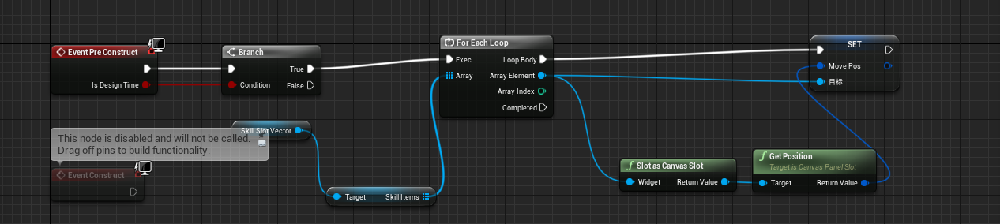
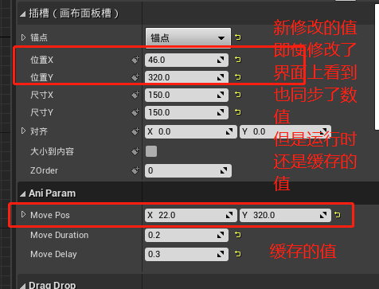
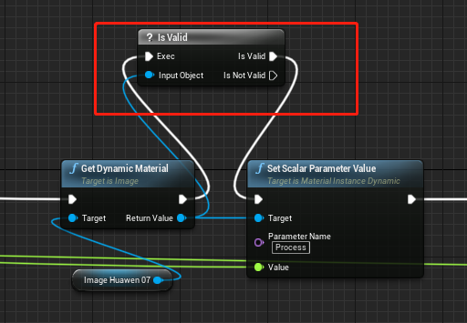
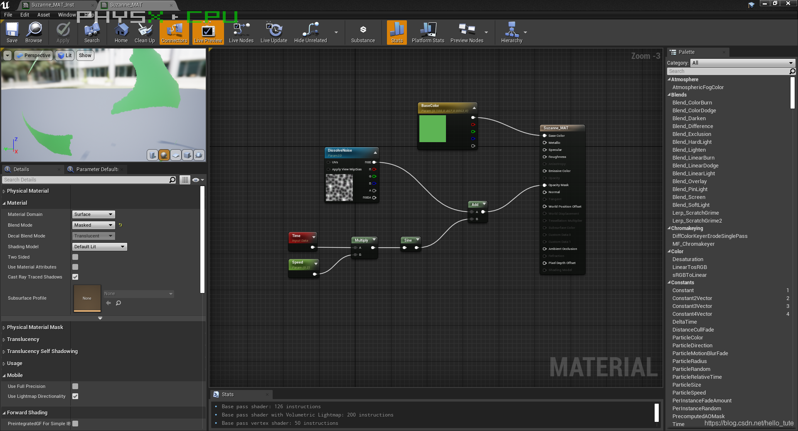
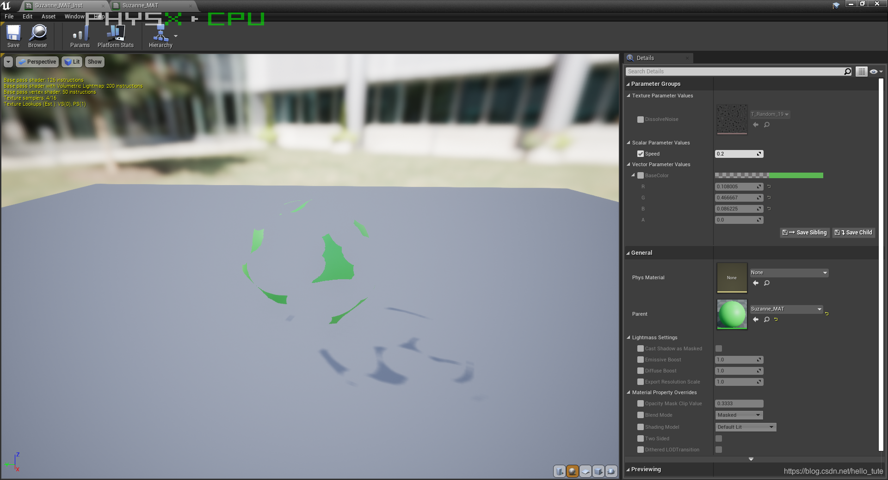

# UE4 蓝图


### UE4 基础

* 概念

  ``` tex
  蓝图也是一种代码
  以节点形式存在，节点可以是：
  	属性（Get,Set函数）
  	函数（C++/蓝图）			UE库函数：KismetSystemLibrary.h   GameplayStatics.h
  	宏定义（蓝图中的宏）
  	条件判断节点（Branch, Not）
  	循环结构（ForEach）
  	...
  	
  大部分节点都是C++定义好的函数（静态、成员函数，如：PrintString），函数有调用对象（蓝图内调用成员函数 Target为Self）
  必须遵循一定的规则，C++才能定义蓝图可用的节点（如：UPROPERTY() ）
  蓝图也可以定义蓝图使用的节点（自定义事件，函数）
  蓝图不需要编译器编译（也有编译按钮，实际是解释执行？）
  蓝图运行效率没有C++高
  
  UE中大部分UE的类或者函数都需要和蓝图进行交互，同时蓝图也会用到所有C++类和函数
  如，角色蓝图：即继承自C++类的ACharacter；动画蓝图：继承自C++类UAnimInstance，等等
  
  
  区别于C++
  蓝图不用太关心对象，指针，引用等，不用太关注内存，蓝图函数变量命名规则没有太多限制（变量可以带中文或特殊符号）
  ```

  


---


### UE4 蓝图技巧

* 快捷键

  ``` tex
  删除连线： Alt + 鼠标左键
  ```

  

---


### UE4 蓝图遇到的问题

* PreConstruct 事件

  ``` tex
  PreConstruct会导致缓存最开始设置的值，导致之后修改的值不起作用！！！
  勾选了IsDesginTime 会导致：运行时只会使用缓存第一次设置的值
  ```

  


* 蓝图也需要考虑空引用的情况，需要判空

  > 如下图，图片上挂载材质，获取材质后，尝试设置材质参数，如果材质不存在，会报错

  


---


### 蓝图 - 材质

* 材质和材质实例

  ``` tex
  创建好材质后，可以右键创建多个材质实例（Material Instance）
  
  材质实例就是材质的实例。它继承于材质，拥有材质的着色器逻辑，但是只暴露了可调节参数（也就是 Params） 而屏蔽了编辑着色器的能力，目的是当某个（些）模型需要修改参数时，不会影响到使用该材质的其它模型。并且当材质的逻辑更新以后，所有的材质实例也会随之更新。
  ```

  材质编辑界面：

  

  材质实例编辑界面：

  
