# UE4 UI开发


### 概念

- UMG，虚幻运动图形界面设计器（Unreal Motion Graphics UI Designer）
  - 一个可视化的UI创作工具，用来创建UI元素，如游戏中的HUD、菜单或其它界面相关元素。
  - 设计器（Designer）选项卡允许界面和基本函数的可视化布局
  - 图表（Graph）选项卡提供所使用控件背后的功能。
  - 可以暴露于BP

- Slate ，虚幻引擎中的自定义用户界面系统。
  - 主要用于编辑器的实现
  - 在游戏中也可以使用
  - 只能应用于C++

- 二者关联：
  - UMG是对Slate的上层封装
  - Slate是UMG的底层实现

* 举例

  ``` c++
  UCLASS()
  class UMG_API UButton : public UContentWidget
  {
  	GENERATED_UCLASS_BODY()
  public:
      // other codes
  protected:
  	/** Cached pointer to the underlying slate button owned by this UWidget */
  	TSharedPtr<SButton> MyButton;
  };
  
  TSharedRef<SWidget> UButton::RebuildWidget()
  {
  	MyButton = SNew(SButton)
  		.OnClicked(BIND_UOBJECT_DELEGATE(FOnClicked, SlateHandleClicked))
  		.OnPressed(BIND_UOBJECT_DELEGATE(FSimpleDelegate, SlateHandlePressed))
  		.OnReleased(BIND_UOBJECT_DELEGATE(FSimpleDelegate, SlateHandleReleased))
  		.OnHovered_UObject( this, &ThisClass::SlateHandleHovered )
  		.OnUnhovered_UObject( this, &ThisClass::SlateHandleUnhovered )
  		.ButtonStyle(&WidgetStyle)
  		.ClickMethod(ClickMethod)
  		.TouchMethod(TouchMethod)
  		.PressMethod(PressMethod)
  		.IsFocusable(IsFocusable)
  		;
      
  	if ( GetChildrenCount() > 0 )
  	{
  		Cast<UButtonSlot>(GetContentSlot())->BuildSlot(MyButton.ToSharedRef());
  	}
  	return MyButton.ToSharedRef();
  }
  ```

  

---


### API

* 获取屏幕大小、中心点、视口缩放比例

 ``` c++
 int32 X = GetWorld()->GetGameViewport()->Viewport->GetSizeXY().X;
 int32 Y = GetWorld()->GetGameViewport()->Viewport->GetSizeXY().Y;
 UE_LOG(LogTemp, Warning, TEXT("X : %d, Y : %d"), X, Y);
 
  //Viewport Size
  const FVector2D ViewportSize = FVector2D(GEngine->GameViewport->Viewport->GetSizeXY());
  //Viewport Center      
  const FVector2D ViewportCenter = FVector2D(ViewportSize.X/2, ViewportSize.Y/2);
 
  float Scale = UWidgetLayoutLibrary::GetViewportScale(this);
  FVector2D Vec2D;
  Vec2D.X = X / 2 / Scale - 200;
  Vec2D.Y = Y / 2 / Scale;
  SetRenderTranslation(Vec2D);
 ```


---

### UMG

* UMG生命周期


* By C++

  * link

    [UE4 C++ —— UMG和C++交互](https://blog.csdn.net/niu2212035673/article/details/82792910)

    ``` tex
    交互方法
    一，强转子集
    GetRootWidget()        //获取根节点
    GetChildAt()            //获取子节点
    UMG控件呈树状结构，根据根节点可以获取到所有的子节点
    
    二，反射绑定
    UPROPERTY(Meta = (BindWidget))
    UButton *ButtonOne;
    绑定的类型和名称必须和蓝图内的一致
    
    三，根据控件名获取
    GetWidgetFromName()
    获取到UWidget*类型，强转成指定类型
    UTextBlock* TxtOb = Cast<UTextBlock>(GetWidgetFromName(TEXT("TxtNameInWBP"))); 
    ```
    
    示例见：TMSDK/Unreal/UE4.25/GCloudTest
    
    ``` c++
    /*
    四, 获取根节点和子节点
    UMG节点呈树状结构，可通过接口 GetRootWidget 获取根节点，再通过 GetChildAt 获得指定下标的所有子节点，其他相关接口（如 GetChildIndex、GetAllChildren等）在具体使用时可参考源码。 
    */
    // 获取根节点画布面板
    UCanvasPanel* rootPanel = Cast<UCanvasPanel>(GetRootWidget());
    // 获取指定下标的节点，并通过Cast转换为对应类型指针，这里以 UTextBlock 类为例
    UTextBlock* txtOb = Cast<UTextBlock>(rootPanel->GetChildAt(6)));
    // 也可以通过 GetAllChildren 获取所有子节点，返回一个 TArray 数组
    TArray<UWidget*> nodesArr = rootPanel->GetAllChildren(); 
    ```
    
    ``` tex
    五, 获得 UUserWidget 的所有节点，将它们组装为一个Map，就可以轻易用Name作为Key来获取相应节点。 作者：程序员问尘 https://www.bilibili.com/read/cv11868180 出处：bilibili
    ```
    
    


* DPI缩放

  UMG窗口，选择分辨率Apple iPhone 5s，并且调整分辨率到640 * 1136，放入一张640*1136的Image，发现Image小于屏幕区域

  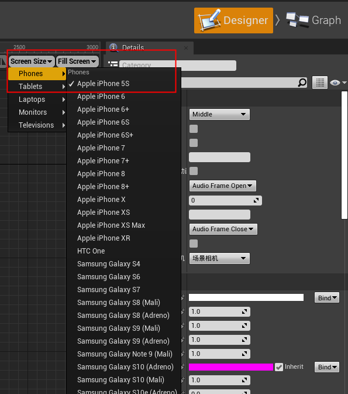

  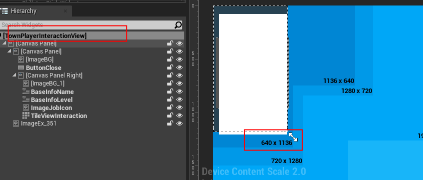

  ``` tex
  调整DPI（Project Settings中User Interface->DPI Scaling）
  DPI Curve 中新增Key，调整Resolution 为 640.0, Scale 为 1.0
  
  可以发现Image和屏幕大小一致了
  ```


* DPI屏幕适配

  ref: https://www.jianshu.com/p/2d37cf49580e
  
  ``` tex
  一般选择市场主流机型进行参考（分辨率，内存等参数），分辨率越高占用内存越大
  
  UE4中有 短边 长边  水平 垂直 自定义 5中设置方案， 本文采取自定义的方式
  
  
  ```
  
  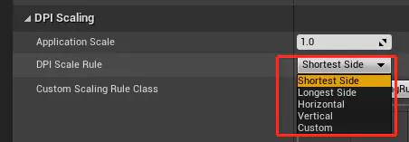
  
  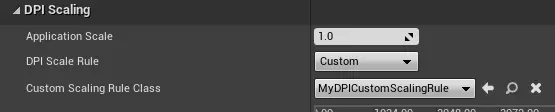
  
  ``` c++
  //藤木 A8 项目，基于标准分辨率 2340 * 1080
  
  #include "CoreMinimal.h"
  #include "Engine/DPICustomScalingRule.h"
  #include "UDPIScalingRuleEx.generated.h"
  
  UCLASS()
  class HITBOXMAKERBLUEPRINT_API UDPIScalingRuleEx : public UDPICustomScalingRule
  {
  	GENERATED_BODY()
  
  public:
  	float GetDPIScaleBasedOnSize(FIntPoint Size) const override;
  };
  
  
  #include "UI/UDPIScalingRuleEx.h"
  float UDPIScalingRuleEx::GetDPIScaleBasedOnSize(FIntPoint Size) const
  {
  	if (Size.X == 0 || Size.Y == 0)
  	{
  		return 1;
  	}
  
  	float NormalAspectRatio = (19.5f / 9.0f);  // (即：2340 / 1080 = 2.1667)  ---标准适配比例
  	float MinAspectRatio = (16.0f / 9.0f);  // (即：1920 / 1080 = 1.7778)  ---最低兼容适配比例
  	float curRatio = (float)Size.X / Size.Y;
  
  	//UE_LOG(LogTemp, Log, TEXT("[UDPIScalingRuleEx] X=%d, Y=%d, Ratio:%f"), Size.X, Size.Y, curRatio);
  
  	if (curRatio >= NormalAspectRatio) // 宽屏    比如: 2560×1080(高不变, 宽更长), 2340×900(宽不变, 高更短),
  	{								   //         2800×1200(宽高都变大，但宽高比也变更大), 1600×720(宽高都变小，但宽高比变更大)	
  		return (Size.Y / 1080.0f);
  	}
  	else			                   // 窄屏    比如: 1920×1080(高不变, 宽更短), 2340×1200(宽不变, 高更长),   
  	{				                   //		  2560×1200(宽高都变大，但宽高比变小), 1280×720(宽高都变小，但宽高比变更小)
  		if (curRatio > MinAspectRatio)
  		{
  			if (Size.X > 1920.0f && Size.X < 2340.0f)
  			{
  				return (Size.Y / 1080.0f);
  			}
  			else
  			{
  				return (Size.X / 2340.0f);
  			}
  		}
  		else
  		{
  			return (Size.X / 2340.0f);
  		}
  	}
  }
  ```
  
  * 安全区处理
  
    ``` tex
    为适配刘海屏等区域，UE4提供了SafeZone组件供我们使用，唯一需要注意的是，我们需要监听屏幕的旋转变化，来判断刘海在那一边进行不同的处理（UE4好像没有自动处理好）
    ```
  
    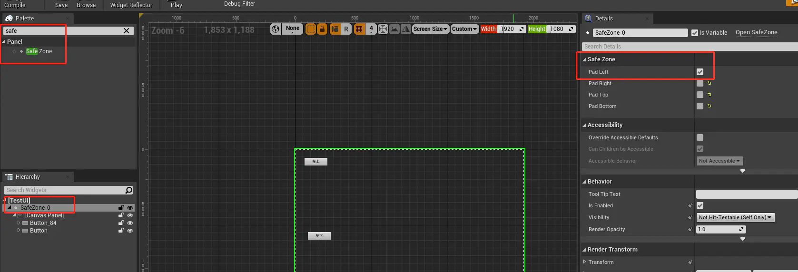
  
    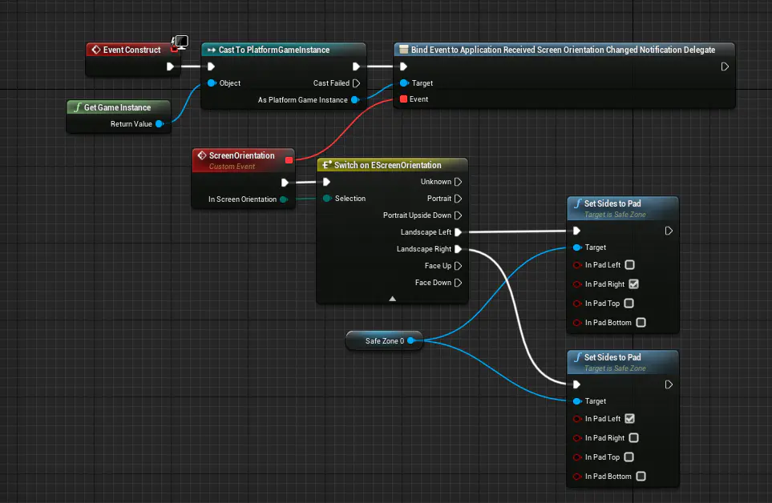


* Alignment （对齐）

  ``` tex
  对齐是控件的枢轴点
  从左上角(0,0)开始，到右下角(1,1)结束
  移动对齐点可以移动控件的原点
  ```

  

* Clipping（裁剪）

  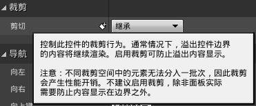

  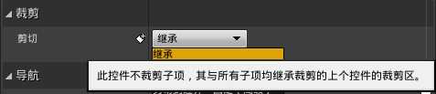

  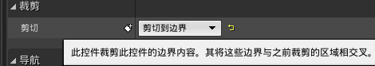

  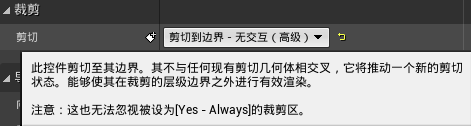

  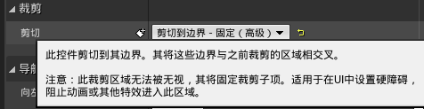

  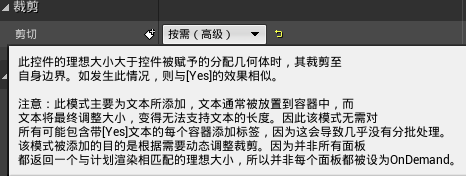

  * 裁剪应用1

    ``` tex
    需要子节点中的各组件锚点配合父节点的裁剪方向，做调整
    ```

    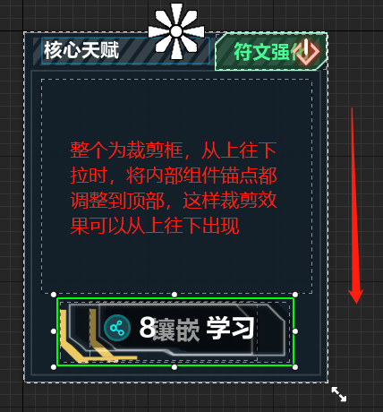

    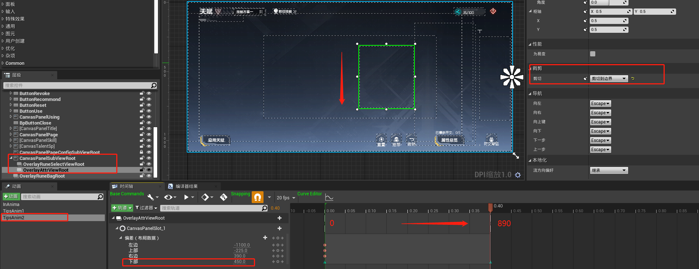

    

  * 应用2

    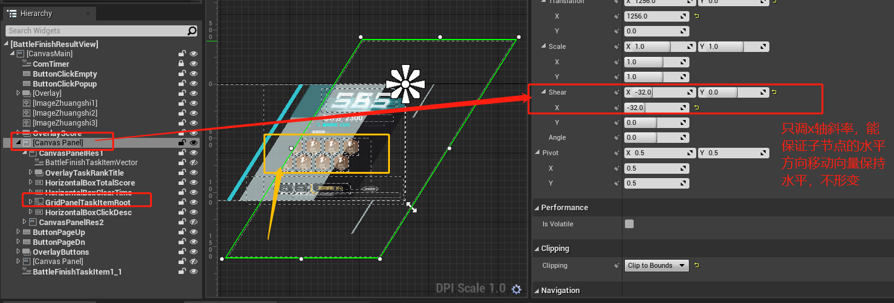


* RichTextBlock 富文本实现

  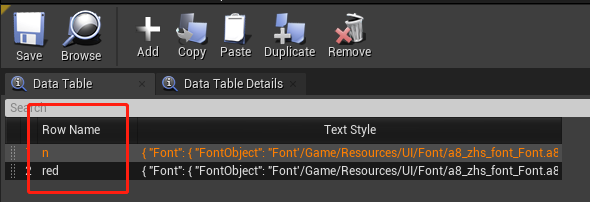
  
  ``` tex
  新建杂项（Miscellaneous）-> Data Table
  Add Row Name即为 标签名
  如上： <n>加油</><red>从现在开始</>
  
  Row Name设置尾Default时，默认输入文本能正常显示，不乱码
  
  通过设置TArray<Decorator Classes> 可以时RichTextBlock支持带图片的文本
  1. 创建新的蓝图类（或者C++类，然后建蓝图继承C++），选择RichTextBlockImageDecorator作为父类。
  	（RichTextBlockImageDecorator类不会出现在父类列表中。相反，您可以将其扩展为C++类。
  	然后，在C++文件中分配数据表资源，或在标题顶部向UCLASS宏添加 可设蓝图（Blueprintable），然后将子类扩展为蓝图。）
  2. 新建DataTable (RichImageRow)，Add Row Name -> 添加Image -> 修改Row Name为 TestImage
  2. 打开1中得到的新蓝图，并将DataTable分配给1中蓝图或C++类的（Image Set） 属性。
  3. 装饰器（Decorator）类设置妥当后，将其添加到UMG中的富文本块 装饰器类数组。然后，使用标记  
  	（其中"TestImage"是您分配的行名称）从数据表插入图像，重新编译控件后，图像就会立即显示出来。
  ```
  
  * ref 
  
    [尝试扩展 UE4 的 Rich Text Block - 类似Unity的RichText用法](https://qiita.com/Naotsun/items/aae717f11b31b53d4804)
  
    [CustomRichText](https://github.com/Naotsun19B/CustomRichText)


* 界面层级

  ``` tex
  处于同一嵌套层级的UI，通过Set ZOrder，可以设置哪个Widget的前后关系，Order越大，显示越前
  
  动态创建的子 Widget，通过add child节点而非add to viewport，挂载到指定父widget下，该子widget能显示在父widget之前
  ```


* [UserWidget] - SizeBox

  ``` tex
  注意特点：
  Single Child 只支持一个child
  Fixed Size	可以固定大小 常用于容器内单一Item(Entry)的根节点
  ```


* [UserWidget] - ScaleBox

  ``` tex
  只有一个子元素，并且保证子元素按比例缩放
  子元素需要设置为居中，保证能按比例缩放
  ```

  * 在ScrollBox中的Button，如果需要点击并且同时支持滑动
  
    **Down and Up 修改为 Precise Tap**，避免滑动列表不能接收到鼠标左键或者手机中的屏幕点击滑动消息
  
    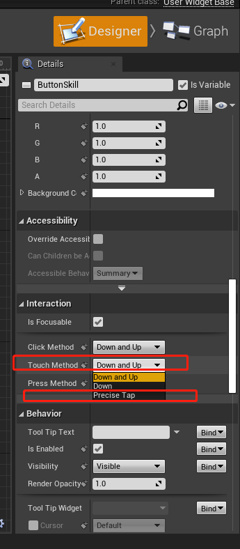
  
    * 实践（使用Button代替触发Toggle Checked状态）
  
      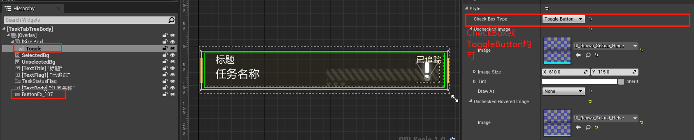
  
      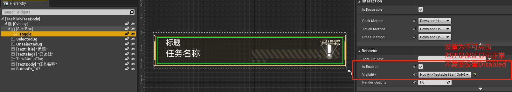
  
      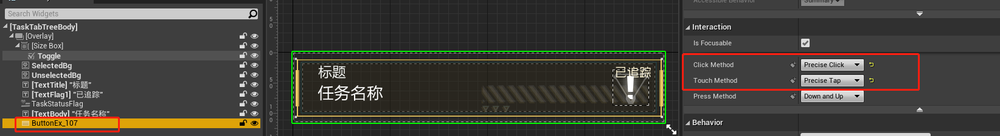
  
      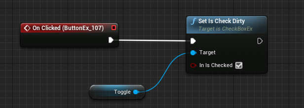
  
  
  
  
  
  * 多排多列滑动列表
  
    在Scroll Box中添加Wrap Box，然后以Wrap Box为父控件，添加子控件元素
  
  * 子控件自定义大小
  
    使用SizeBox


* VerticalBox/HorizonalBox  元素增减时，保持元素居中

  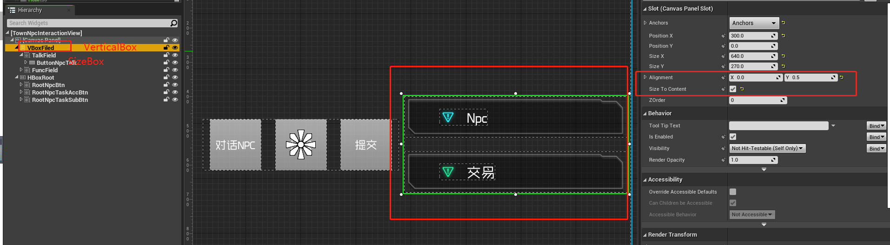

  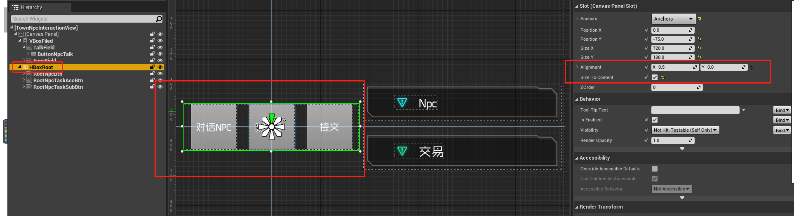

* ListView 元素增减时，保持元素居中

  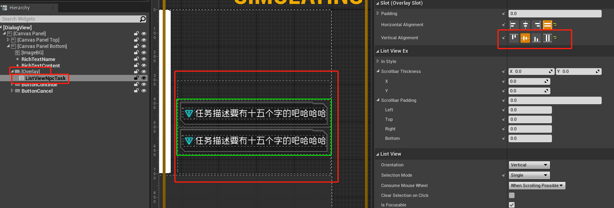


* [UserWidget] - Vectical + ScrollBox + Overlay

  Vectical包含ScrollBox，设置ScrollBox Size模式为Fill，**当其他Overlay隐藏时，ScrollBox可以全铺满**

  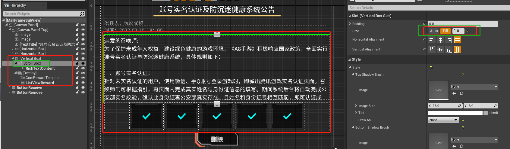
  
  * ScorllBox + VerticalBox + Overlay + ListView
  
    ScrollBox包含VerticalBox，设置子结点Overlay布局上偏移，**当Overlay隐藏时，下部ListView会填充VerticalBox**
  
    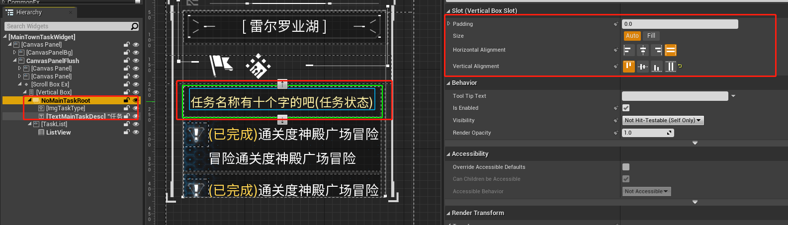
  
    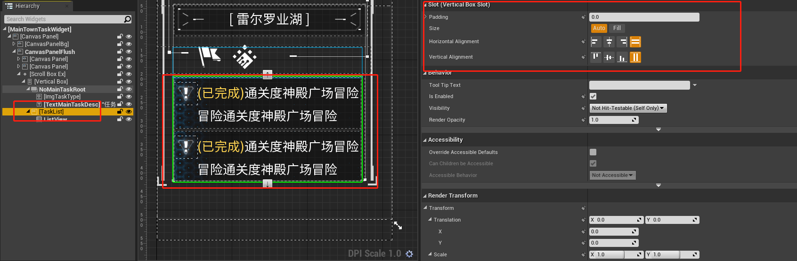


* [UserWidget] - SizeBox

  ``` tex
  只能放一个子控件，一般用来精确控制控件大小的容器
  SizeBox最好作为Child Widget的根节点。
  （如果SizeBox的父节点是Canvas Panel，SizeBox会变成可拉伸，ChildLayout属性设置无效）
  在Child Widget父级界面中勾选“Size To Content”，就会变成Child Widget中SizeBox的尺寸。可以做的控件尺寸的精确控制
  ```

  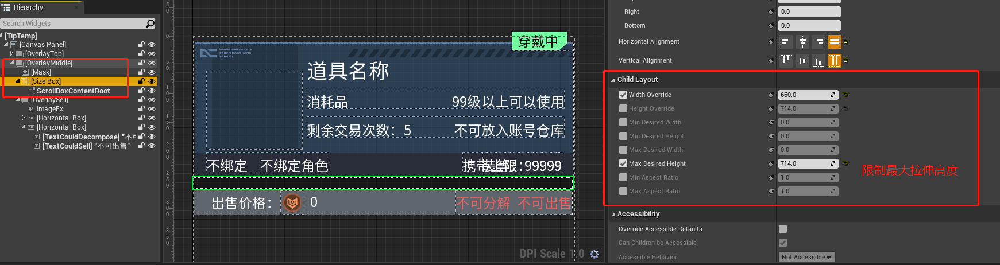

  ```
  使用SizeBox中的 Max Desired Height 限制子节点下的最大高度
  ```

  

* [UserWidget] - Border

  ``` tex
  只能包含一个子元素，用来做元素背景
  Border可以相应鼠标的各种事件
  
  可以设置背景图片，也可以是颜色
  背景颜色和背景图片可以同时设置，最终的效果是保留图片纹理+图片颜色背景颜色（“颜色颜色”就是叠加颜色）。
  如果背景颜色为白色，则保留背景图片原本的颜色。也可以设置Brush Color的透明度，这样背景图片也会变得透明
  ```

* [UserWidget] - WidetSwitcher

  ``` tex
  Widget Switcher可以有很多子控件，但一次只会显示一个子控件。所有的子控件默认情况下都是充满整个Widget Switcher容器
  ```

* [UserWidget] - ScaleBox

  ``` tex
  缩放容器，只能有一个子控件，用来缩放保持长宽比例
  ```


* UMG Behavior - IsEnabled

  **若父节点的IsEnabled为false,则子节点修改颜色不会生效，会呈现默认disabled状态的灰色；若父节点Visibility为不显示，则子节点不显示**

  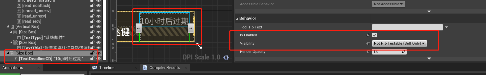


* UMG 编辑器中 TextBlock插入换行

  ``` tex
  手动换行要用Shit+Enter
  
  自动换行 Details面板 Wrapping -> Auto Wrap Text + Allow Per Character Wrapping
  ```


* **UMG 复用注意点**

  * 复用时最好挂载到一个Overlay下面，UE4.27遇到了直接挂载到CanvasPanel下，改动复用组件，挂载组件不发生改变

    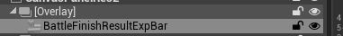


* UMG Text 使用内部布局 Margin 代替 相对于父节点偏移

  * 问题描述

    任务内容现在是居中的，我想改为顶部对齐，一行的时候也不要下移，对齐方式怎么调

    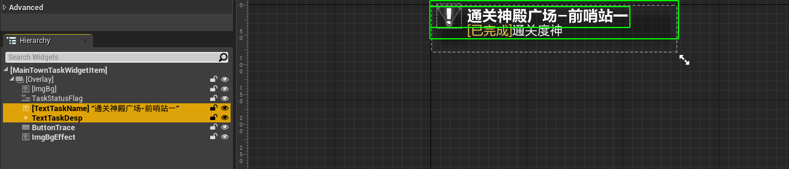

    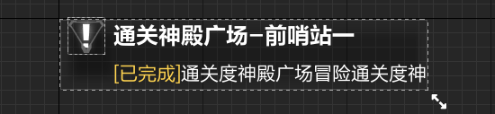

    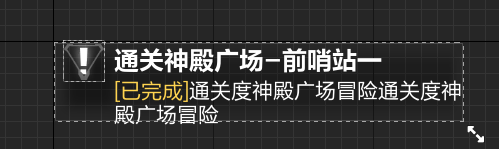

  * 解答

    使用外部上偏移 + 内部偏移，这样文本扩展时，文本偏移固定在相对的顶部

    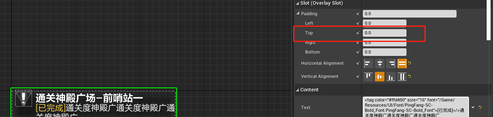

    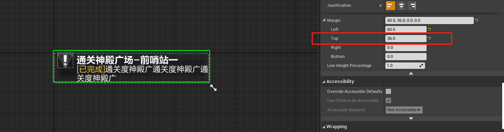

    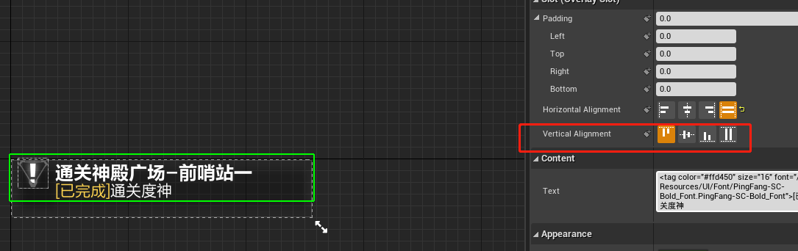

    


* UMG Text  Auto Wrapping 应用

  * 基于父节点的宽度，自适应文本宽度和换行

    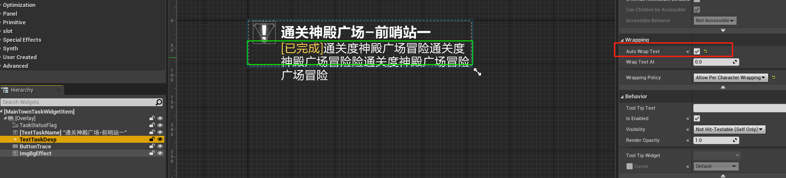

    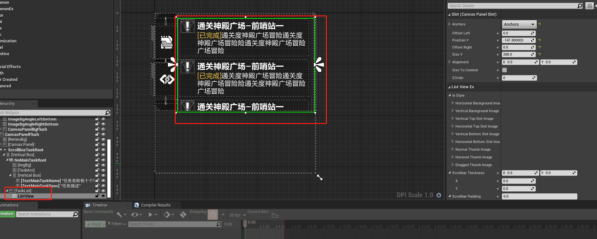

    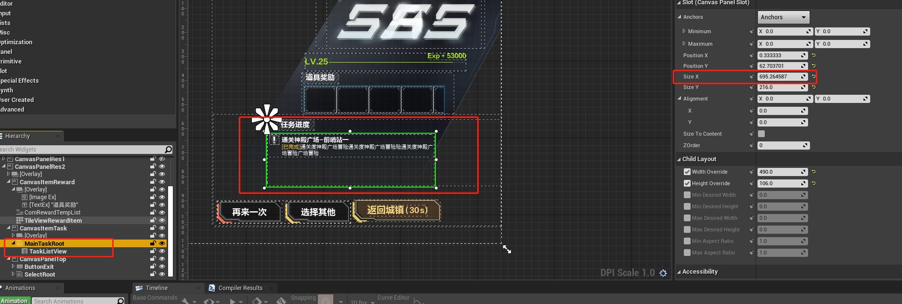


* UMG ScrollBox

  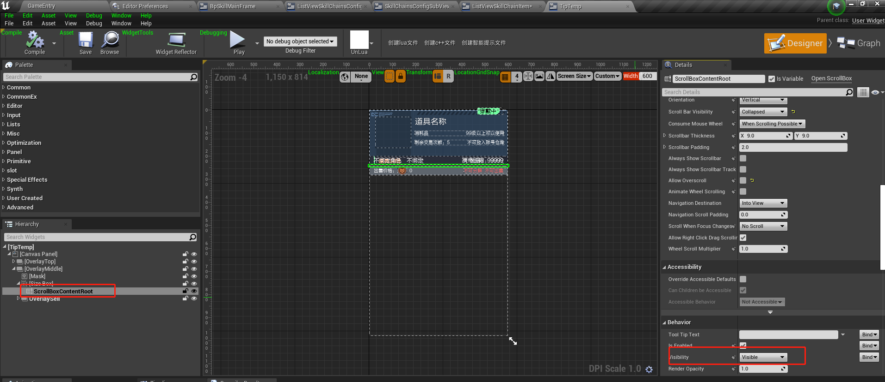

  ``` tex
  ScrollBox如果其下挂载的组件均不可点击，则需要设置为Visible
  如果其下组件平铺并且可响应点击，则可以不设置为Visible
  ```


* UMG TileView间隔

  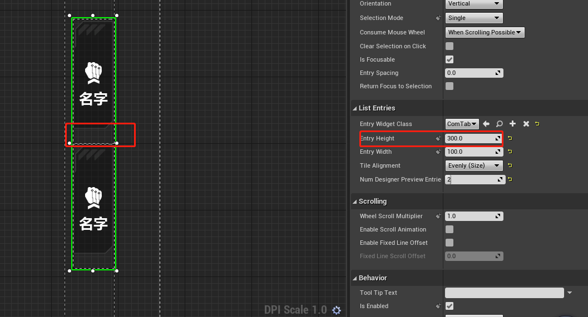

  ``` tex
  由于设置Entry Spacing会将整个Entry Widget缩小，可以适当调大Entry高度，保证Entry自身的大小不变
  ```

  

* ScrollBox 嵌套 TileView/ListView，滚动问题

  ``` tex
  ScrollBox下放TileView或者ListView时，
  非PC或Editor平台时，在TileView和ListView上滑动，不会生效，滑动冲突
  
  上述嵌套发生一般时需要做动态布局（TileView没有内容时，会自动上移置顶），可以通过Vertical替代ScrollBox实现
  ```


* ScrollBox 嵌套 CheckBox (ToggleButton)，滚动问题

  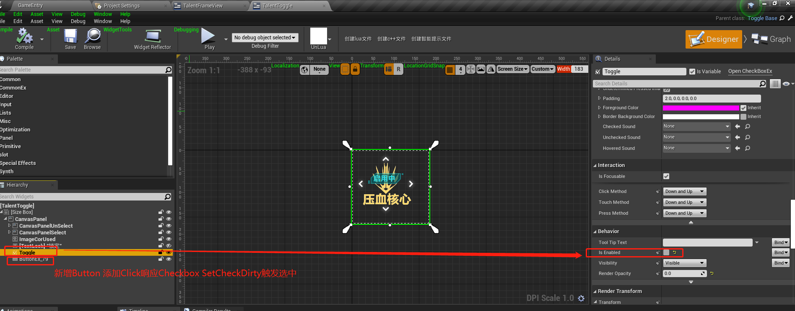

  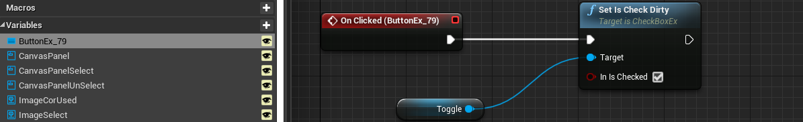

  ``` tex
  设置Checkbox [[IsEnabled为false  不需要设置，只需要保证Toggle无法接受点击即可]]
  新增Button，添加OnClick响应Checkbox SetIsCheckDirty 触发选中回调
  ```
  
  ``` c++
  void UToggleEx::SetIsCheckDirty(bool InIsChecked)
  {
  	SetIsChecked(InIsChecked);
  	if(OnCheckStateChanged.IsBound())
  	{
  		OnCheckStateChanged.Broadcast(InIsChecked);
  	}
  }
  ```


* VerticalBox + ListView/TileView 滚动问题

  ``` tex
  无法完全上拉
  ```

  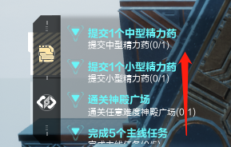

  ``` tex
  在TileView或ListView上添加CanvasPanel后，可以正常上拉
  ```

  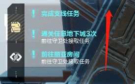


* Toggle（CheckBox）增加响应区域

  ``` tex
  对Toggle的子节点，设置为Visible，可以增大响应Toggle点击区域
  ```

  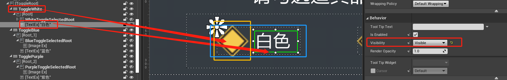


---


### 3D UI

* 问题

  * Cylinder collision (widget component) is incorrect for widget interaction component

    ``` c++
    //获取Cylinder WidgetComponent的点击结果
     if (auto WidgetComp = Cast<UWidgetComponent>(HitResult.GetComponent()))
     {
          auto cylinderHitLocation = WidgetComp->GetCylinderHitLocation(HitResult.Location, GetForwardVector());
          // do something using CylinderHitLocation.Key;
     }
    ```
  
  * 3D WidgetComponent 滑动和点击不灵敏
  
    ``` tex
    根据不同页面，设置Input - Mouse Capture Mode为 永久捕获（包括鼠标按下）
    ```
  
    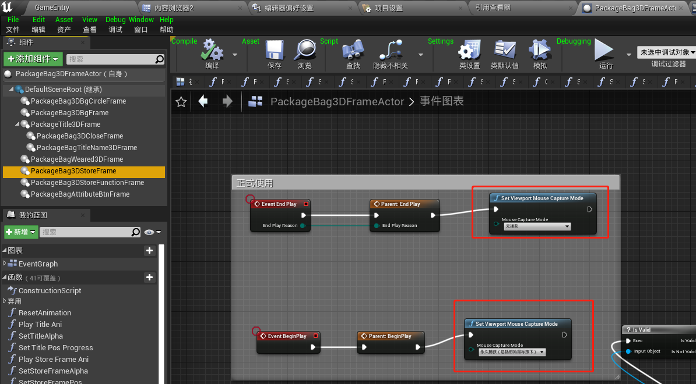
  
    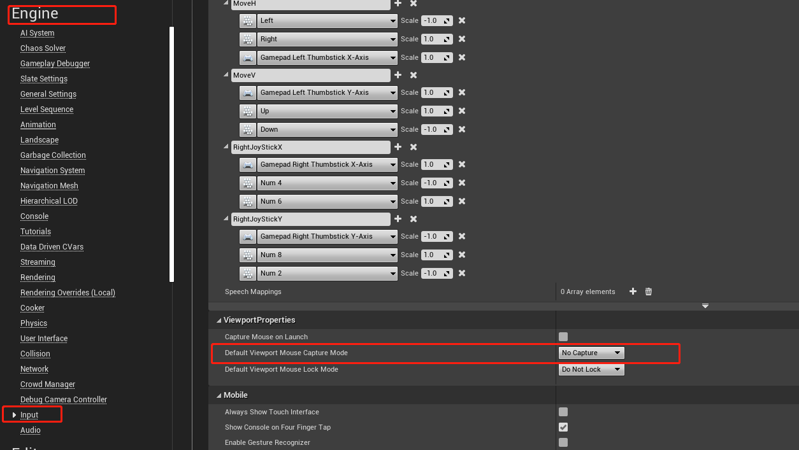
  
    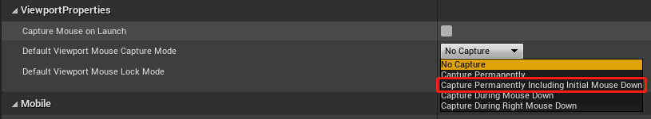


* 相机

  * 移动相机

    ``` tex
    一、创建一个Arrow组件来标记要移动的位置（Arrow的用法之一就是用来标注坐标）。
    二、使用TimeLine时间轴结合插值Lerp来移动相机
    ```

    

* 3DUI设置成Cylinder 曲面模式时，手机上滑动Scroll问题和点击不灵敏问题

  ``` tex
  曲面UI的设置: 在打开和关闭的时候设置
  projectsetting的默认设置还是还原为默认 NoCapture
  ```

  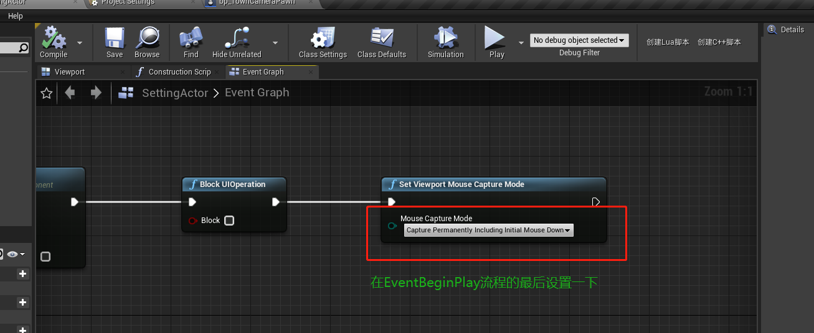

​		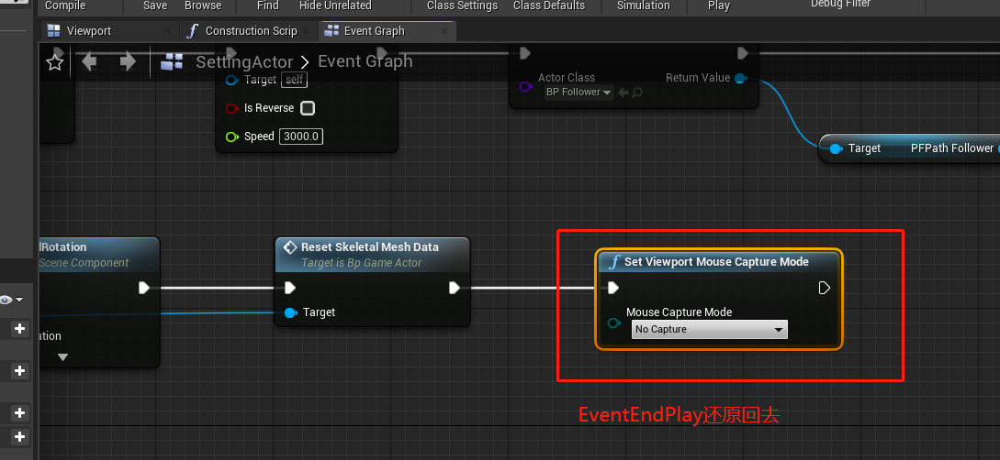 	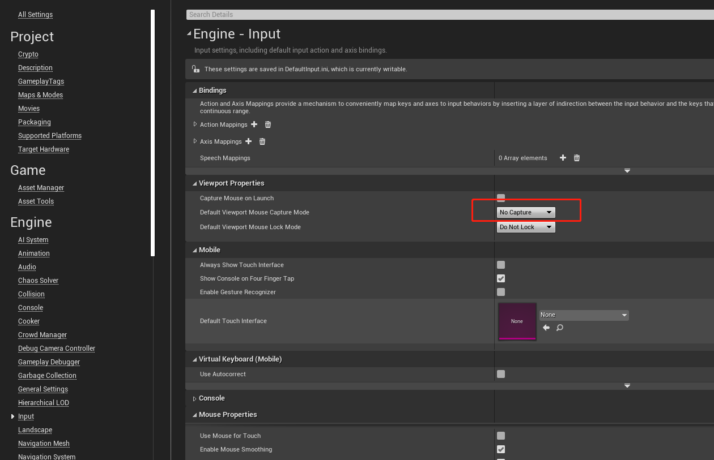


---


### UE4 UI优化

* 点击事件

  ``` tex
  Visibility（ESlateVisibility）
  
  Visible					Visible and hit-testable (can interact with cursor). Default value.
  						可见，可点击
  
  Collapsed				Not visible and takes up no space in the layout (obviously not hit-testable).
  						不可见，不占用布局空间
  
  Hidden					Not visible but occupies layout space (obviously not hit-testable).
  						不可见，占用布局空间
  
  HitTestInvisible		Visible but not hit-testable (cannot interact with cursor) and
  						children in the hierarchy (if any) are also not hit-testable.
  						可见，当前和所有Child的Widget均不可点击
  						
  SelfHitTestInvisible	Visible but not hit-testable (cannot interact with cursor) and 
  						doesn't affect hit-testing on children (if any).
  						可见，当前Widget不可点击，Child Widget可点击
  						
  						
  很多 Widget 默认属性是 Visible,需要手动设置成 HitTestInvisible 和 SelfHitTestInvisible。
  如果大量 Widget 设置成 Visible，那么引擎在点击响应时的效率就会大大下降，这也会增加游戏线程的开销。
  
  Collapsed 不占用布局空间（Layout Space），因此在隐藏后不会进行 Prepass 的计算，性能优于 Hidden。
  可以使用	 Widget Reflector 	帮助检查是否有错误设置的 Visibility 属性。
  
  ```
  
  ``` lua
  --屏蔽点击事件向下传递至3D场景
  function FrameViewBase:OnMouseButtonDown(Geometry, MouseEvent)
      return UE4.UWidgetBlueprintLibrary.Handled()
  end
  
  function FrameViewBase:OnMouseButtonUp(Geometry, MouseEvent)
      return UE4.UWidgetBlueprintLibrary.Handled()
  end
  ```
  
  


* 容器选择

  ``` tex
  UE4.15以前，Canvas Panel不参与合批，推荐使用Overlay，但是Overlay不支持子空间的位置和大小直接设置和适配
  UE4.15后支持 同ZOrder的Canvas Panel批次合并
  
  1.通用的Widget使用Overlay作为根结点
  ```
  
  ``` tex
  Canvas Panel vs. Overlay
  
  Canvas Panel允许指定部件位置 锚点 覆盖层级(ZOrder)
  			允许放置多个子组件
  			适用于手动设置布局，不适用于程序化生成一个Widget并将其放置于一个容器中（除非需要绝对布局）
  		CanvasPanel底下的部件会有Slot(Canvas Panel Slot) ，
  		CanvasPanel和子部件的关系用这个Slot的属性来设置：
  		1.Anchors: CanvasPanel的锚点，可以分别设置x，y在区间[0,1] 的任意值，表示屏幕的百分比位置。
  		2.PositionX
  		  PositionY : 部件锚点(一般是左上角)相对于屏幕锚点的位置偏移
  		3.SizeX
  		  SizeY: 部件的大小
  		4.Alignment: 对齐方式(相当于部件的锚点)，可以分别设置x，y在区间[0,1] 的任意值，表示部件的百分比位置。
  		5.SizeToContent: 当AutoSize为true时，使用部件的实际大小而无视SizeX,Y。（可看作部件大小的语法糖）
  		6.ZOrder: 设置层级，数字越大的放在上面
  		
          //确定部件位置：1.CanvasPanel锚点 + 2.两个锚点间的位置偏移 + 4.部件锚点
          //确定部件大小：3. 5.
          //确定部件层级：6.
          
  Overlay允许组件一个堆在另一个上
  	   每层使用简单的流式布局
  	   Overlay底下的部件会有Slot(Overlay Slot) ，Overlay和子部件的关系用这个Slot的属性来设置：
            1.Padding
              Left
              Top
              Right
              Bottom
              内边距（Overlay的各边到子部件各边的距离）
            2.Horizontal Alignment
              Horizontal Alignment Left
              Horizontal Alignment Center
              Horizontal Alignment Right
              Horizontal Alignment Fill
              Vertical Alignment
              Vertical Alignment Top
              Vertical Alignment Center
              Vertical Alignment Bottom
              Vertical Alignment Fill
              对齐方式，与Padding的值是叠加的。先计算对齐方式，再加上内边距。
              （Fill会使用Overlay的Size代替部件的实际Size）
              
          //确定部件位置：1.内边距 + 2.对齐方式
          //确定部件大小：无
          //确定部件层级：无
  ```
  
  ``` tex
  Overlay作用1：
  	动态挂载时，用Overlay作为挂载的根节点，可以设置Overlay的大小，使挂载对象使用填充方式挂载，如图所示
  ```
  
  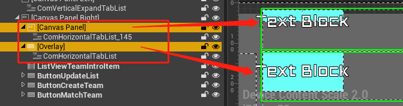
  
  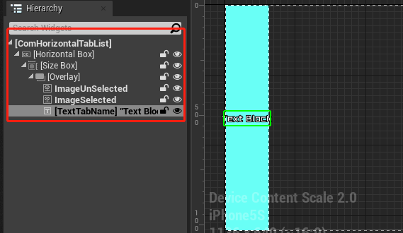


* 合批

  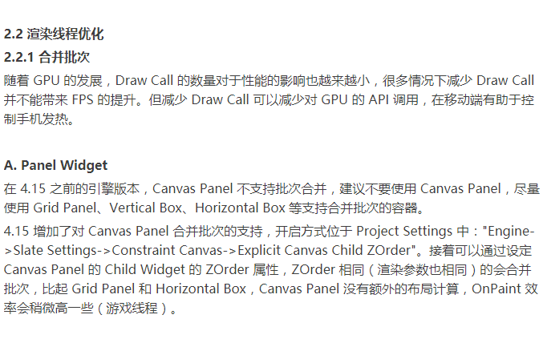

  ``` tex
  开启Canvas Panel支持合批的开关
  Project Settings-> Engine -> Slate Settins -> Constraint Canvas -> Explicit Canvas Child ZOrder
  
  使用相同Zorder的Canvas作为容器，然后设置相同ZOrder的批次合并
  ```


* 拼界面

  ``` tex
  1. 窗口元素尽量扁平化
  	(不要过多的使用容器套娃),套用越多,函数调用递归性越强,执行代码越多,查找Vtable也越多.有可能会造成CPU缓存缺失.
  	窗口小部件树越小，函数调用越少
  	窗口小部件树越扁平，递归越少
  
  
  ```


* UE4 Widget UI优化

  ref: [Unreal Engine 4 中的 UI 优化技巧](https://gameinstitute.qq.com/community/detail/113852)


* 移动平台上UE4的UI优化

  ref:[如何在移动平台上做UE4的UI优化？](https://blog.csdn.net/debugconsole/article/details/79281290)


---


### UE4 Actor交互

* actor with actor

  ``` c++
  //UE4.25.4
  
  class AGameActor::AActor
  {
  public:
  	typedef std::function<void(bool)> OverlapHandle;
  	void SetOverlapHandle(OverlapHandle oHandle);
  private:
  	UFUNCTION()
  	void OnOverlapStart(AActor* OverlappedActor, AActor* OtherActor);
  	UFUNCTION()
  	void OnOverlapEnd(AActor* OverlappedActor, AActor* OtherActor);
  private:
      bool mCanOverlap = false;
      OverlapHandle mOverlapHandle;
  }
  void AGameActor::DeInit()
  {
      if(mCanTouch)
  	{
  #if WITH_EDITOR
  		OnReleased.Clear();
  #else
  		OnInputTouchBegin.Clear();
  #endif
  	}
  	if(mCanOverlap)
  	{
  		OnActorBeginOverlap.Clear();
  		OnActorEndOverlap.Clear();
  	}
  }
  void AGameActor::SetOverlapHandle(OverlapHandle oHandle)
  {
  	if(nullptr != oHandle)
  	{
  		mOverlapHandle = oHandle;
  		mCanOverlap = true;
  		//this->bGenerateOverlapEventsDuringLevelStreaming = 1;
  		OnActorBeginOverlap.AddDynamic(this, &AGameActor::AGameActor::OnOverlapStart);
  		OnActorEndOverlap.AddDynamic(this, &AGameActor::OnOverlapEnd);
  	}
  }
  void AGameActor::OnOverlapStart(AActor* OverlappedActor, AActor* OtherActor)
  {
  	if(nullptr != mOverlapHandle)
  	{
  		mOverlapHandle(true);
  	}
  }
  void AGameActor::OnOverlapEnd(AActor* OverlappedActor, AActor* OtherActor)
  {
  	if(nullptr != mOverlapHandle)
  	{
  		mOverlapHandle(false);
  	}
  }
  ```

  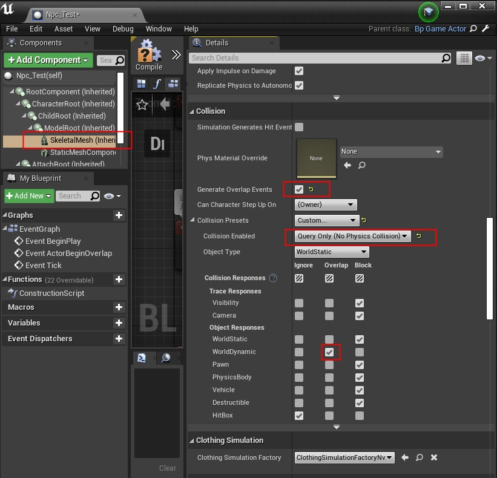

  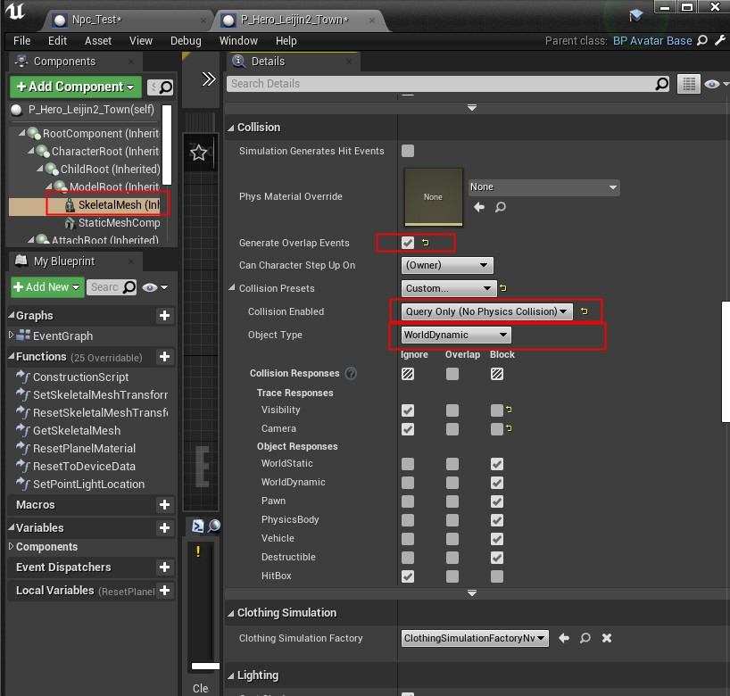

  

* mouse or touch with actor

  ``` c++
  class AGameActor::AActor
  {
  public:
  	typedef std::function<void()> TouchHandle;
  	void SetTouchHandle(TouchHandle tHandle);
  private:
  	UFUNCTION()
  	void OnTouch(ETouchIndex::Type FingerIndex, AActor* TouchedActor);
  	UFUNCTION()
  	void OnMouseReleased(AActor* TouchedActor , FKey ButtonPressed);
  private:
  	bool mCanTouch = false;
  	TouchHandle mTouchHandle;
  }
  void AGameActor::SetTouchHandle(TouchHandle tHandle)
  {
  	if(nullptr != tHandle)
  	{
  		mTouchHandle = tHandle;
  		mCanTouch = true;
  #if WITH_EDITOR
  		OnReleased.AddDynamic(this, &AGameActor::OnMouseReleased);  //OnClicked是双击效果
  		#else
  		OnInputTouchBegin.AddDynamic(this, &AGameActor::OnTouch);
  #endif
  	}
  }
  void AGameActor::OnTouch(ETouchIndex::Type FingerIndex, AActor* TouchedActor)
  {
  	if(nullptr != mTouchHandle)
  	{
  		mTouchHandle();
  	}
  }
  void AGameActor::OnMouseReleased(AActor* TouchedActor, FKey ButtonPressed)
  {
  	if(nullptr != mTouchHandle)
  	{
  		mTouchHandle();
  	}
  }
  ```

  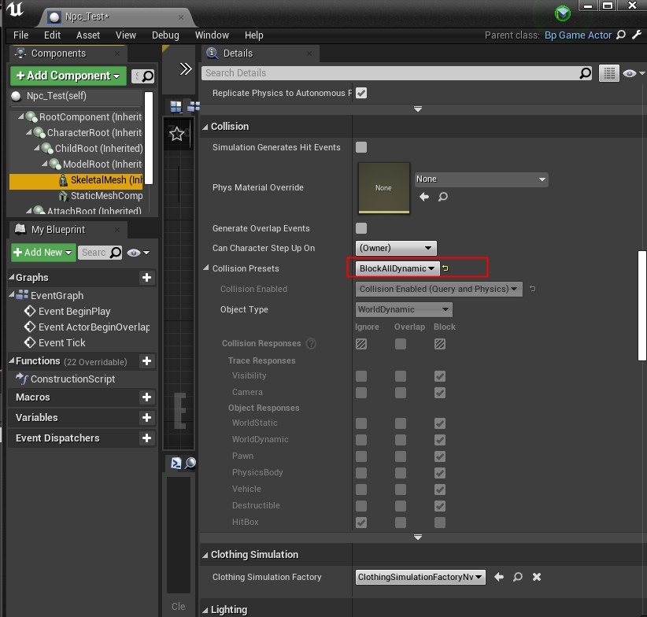

  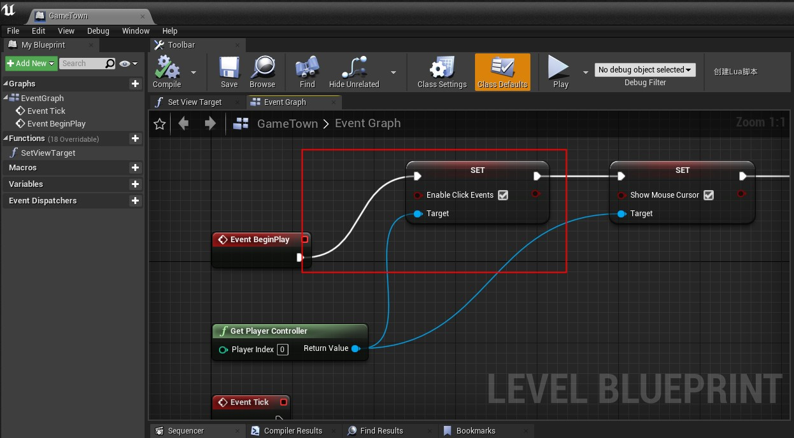


---


### UMG 和 粒子

* 粒子特效显示隐藏的方式（UE4.27）

  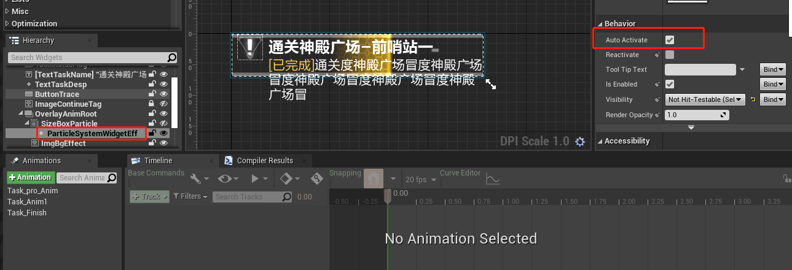

  ``` tex
  选择Auto Activate 表示创建后，就开始播放粒子
  选择Reactivate 表示一轮粒子特效时间后再开始播放粒子特效（即表现上会看到延迟播放）
  
  隐藏粒子特效需要套一个父节点，设置父节点的RenderOpacity为0 以及 Visibility 为 Collapsed(折叠)
  ```

  
