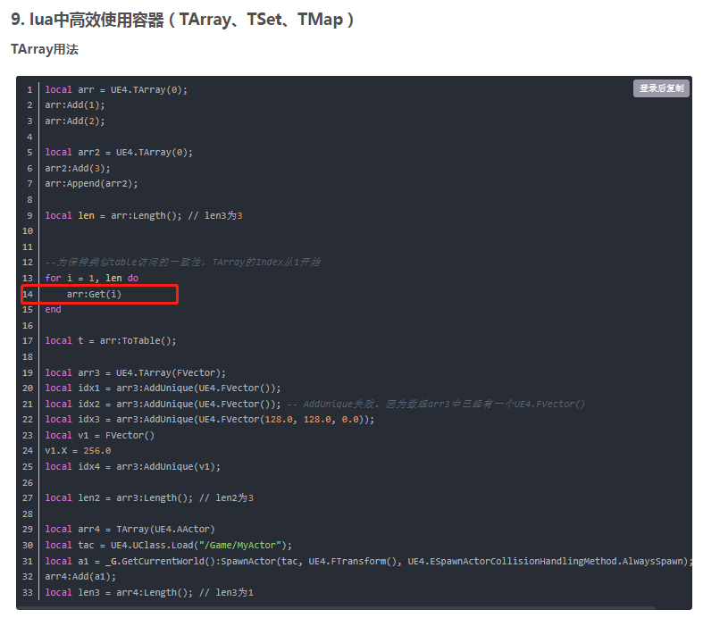
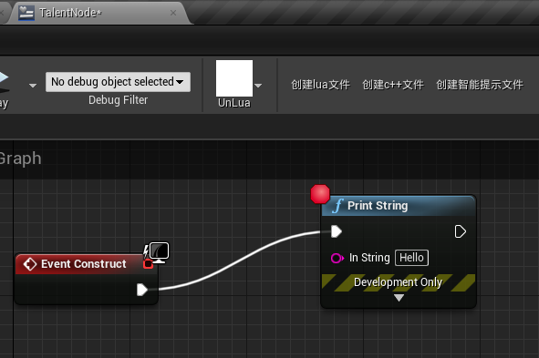
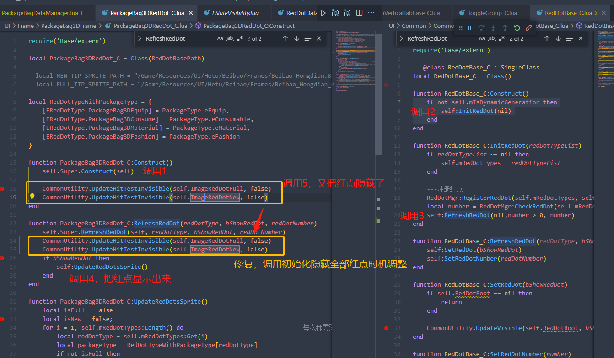

# UE4 UnLua

### 基础

* UnLua资源

  https://github.com/Tencent/UnLua

* UnLua应用场景

  ``` tex
  访问蓝图或C++变量
  	访问蓝图变量，播放UMG动画
  	访问C++变量，Lua创建MyActor
  扩展C++函数实现
  ...
  ```

* UnLua IDE

  VSCode + EmmyLua实现调试


* Demo学习

  ``` tex
  UnLua TPS demo
  1. UI按钮事件
  2. 操作事件绑定并演示蓝图如何绑定
  3. 动作蓝图
  ...
  ```


* 扩展学习

  ``` tex
  Lua栈函数
  基于原生Lua的C++接口实现
  ```

  

* 蓝图 + UnLua 开发 UserWidget

  ``` tex
  为ListView创建Item(Entry)对象，并创建ItemData(Item)数据
  
  ItemData(Item)数据对象继承 蓝图的UObject，添加界面用变量和事件
  事件可以分发ItemData的变化给外部监听对象，
  	也可以ItemData关联的Item(Entry)的改变（Selected，InnerBtnClick等）分发给外部监听对象
  	
  	
  	
  @注意：
  Item（列表项）中不能放self逻辑，需要放到Entry（列表项数据）中，即
  刷新列表时，需要通过更新Entry(即ItemData)数据，然后调用
  TileView/ListView : RegenerateAllEntries()  触发Item 的 OnListItemObjectSet
  
  self逻辑指：每个Entry的改变，触发Item的变化，这些表现相关的可以写在Item类中，但是数据改变相关的需要写在Entry中（或承载Entry的父类中）
  
  RegenerateAllEntries vs. RequestRefresh
  但是调用 TileView/ListView : RequestRefresh()  只是触发下一帧的刷新，不会触发Item 的 OnListItemObjectSet，
  							同时，只是释放当前未绑定到Item上的Entry，会为新的（或新出现的）Item生成对应的Entry，不会刷新当前存在的Item
  							
  一般需要刷新列表中N个元素，则调用RegenerateAllEntries，虽然性能上不理想
  ```
  
  ``` lua
  --unlua中调用蓝图接口
  --蓝图接口 Tarray GetList()
  --lua中需要 遍历Tarray时，Tarray所包含的函数可以在蓝图编辑窗口将方法引线拖出可用函数
  --[[
  	Tarray的遍历需要使用 arrayList:Get(i)
  ]]
  
  --[[
  @注意， 序号从0开始还是从1开始
  ]]
  
  --GetItemAt(index) 从0开始
  ListView:GetItemAt(0)
          --例子
          submitItems = Vector.New() --自定义lua类
          for i = 1, submitItems:Size() do
             local itemGridObj = self.TileViewSubmitItem:GetItemAt(i - 1)
             itemGridObj:Update(submitItems[i])
             itemGridObj:AddSelectedHandler(self, self.OnSubmitItemSelected)
          end
  
  
  --Get(index) 从1开始
  TArray:Get(1)
          --例子
          local items = self.TileViewSubmitItem:GetListItems()
          for i = 1, items:Length() do
              local item = items:Get(i)
              if item ~= nil then
                 item:RemoveSelectedHandler(self, self.OnSubmitItemSelected)
              end
          end
  ```
  


* UnLua调用C++

  * 传给C++数字型字符串，C++可自动解析为数字

    ``` lua
    function TaskDataManager:ParseTaskTrackLinkText(type2, params)
        local iType2 = TaskDetailData.TASK_LINK_TYPE2[type2]
        if iType2 == 0 or iType2 == 1 then                  --寻路
            local targetId = params:Find("p1")						      --TODO test  unlua传给c++ 字符串和整型 是一样的效
            self:TaskAutoTrace(iType2, targetId)                          --TODO test  unlua传给c++ 字符串和整型 是一样的效果
    end
    ```

    ``` c++
    	/// <summary>
    	///	任务追踪
    	///	type: 0表示npc寻路， 1表示关卡寻路
    	///	targetId: 目标id
    	/// mapId: 地图城镇表ID
    	/// </summary>
    	UFUNCTION(BlueprintCallable)
    	static void StartAutoTaskTrace(int32 type, int32 targetId);
    ```


* UnLua延迟调用

  ``` lua
  --方法1
  --创建一个协程 延迟调用函数 测试代码
  function MailFrameView_C:DelayFunc(func, Induration)
     coroutine.resume(coroutine.create(MailFrameView_C.DoDelay), self, self, Induration)
  end
  
  function MailFrameView_C:DoDelay(worldContentObject, duration)
      UE4.UKismetSystemLibrary.Delay(worldContentObject, duration)
      --TODO 其他方法
  end
  ```

  ``` lua
  --方法2
  local anim = function()
       self:PlayGeActorQueueAction(index, animPaths)
       CommonUtility.ClearDelayCall(self,self.mHandle)
  end
  self.mHandle = CommonUtility.DelayCall({self,anim},0.01,false)
  
  --例子：
  --self.mMyHandle = CommonUtility.DelayCall({self, GameModeTown_C.OpenChapterSelectFrame}, 0.1, false)
  --function GameModeTown_C:OpenChapterSelectFrame()
  --    UIManager.OpenFrame(UIFrameClassPath.ChapterSelectFrame, 1, nil)
  --    CommonUtility.ClearDelayCall(self, self.mMyHandle)
  --end
  --
  --delegate:委托事件
  --time：延迟时间
  --isLoop：是否循环
  --在回调结束要清除自己的handle  UE4.UKismetSystemLibrary.K2_ClearTimerHandle(self, self.mHandle)
  ---重点提示：每一个使用DelayCall的地方都要考虑一下，调用对象是否有可能在DelayCall触发之前就已经不存在了。如果有可能，那么在调用者的析构函数里也要ClearDelayCall()。
  ---如果isLoop为true，考虑DelayCall是否会重复调用
  ---DelayCall的回调只能在UObject中调用，如果需要在Frame里调用，需要借用FrameView写回调
  function CommonUtility.DelayCall(delegate,time,isLoop)
      local handle = UE4.UKismetSystemLibrary.K2_SetTimerDelegate(delegate, time, isLoop)
      return handle
  end
  
  function CommonUtility.ClearDelayCall(target,handle)
      UE4.UKismetSystemLibrary.K2_ClearTimerHandle(target, handle)
  end
  ```

  * **延迟调用问题**
  
    **UnLua使用UE4提供的延迟调用函数，在延迟回调里的UpValue变量会被置空**
  
    ``` lua
    -- 更新可接取的任务列表
    function TaskDataManager:UpdateCanAccquireTask(autoAccquire)
    	--...
      local sortedTaskList = self:GetShowSortedTaskList()
        --由于数据没有isTriggerC 需要主动触发一次
      UIEventSystemMgr:SendUIEvent(EBeEventUIType.OnTaskListUpdate, sortedTaskList)  
        -- C++也需要触发
      UTMBlueprintFunctionLibrary.TriggerUIEvent(EBeEventUIType.OnTaskListUpdate)
      	--...
    end
    
    function MainTownTaskWidget_C:OnTaskListUpdate(uiEventID, ...)
        --[[
        local params = {...}
        if #params > 0 then
        	if nil == delayPlayTaskOverHandle then
            	delayPlayTaskOverHandle = CommonUtility.DelayCall(				--延迟调用
                        {self,
                        function ()
                            if params[1]:Size() > 0 then						--回调里的params被置空了！！！				
                               print("### task on event", params[1][1]:TaskId(), params[1][1]:TaskStatus())
                           	else
                                print("### task on event, task is 0")
                            end
                            self:Update(params[1])
                            CommonUtility.ClearDelayCall(self, delayPlayTaskOverHandle)
                            delayPlayTaskOverHandle = nil
                        end}, 
                        self:GetTaskOverAnimPlayDuration(), false)
       		end
        end
        ]]
    
        --修复后
        if nil == delayPlayTaskOverHandle then
            delayPlayTaskOverHandle = CommonUtility.DelayCall(
                        {self,
                        function ()
                            local taskSortList = TaskDataMgr:GetShowSortedTaskList()
                            self:Update(taskSortList)
                            CommonUtility.ClearDelayCall(self, delayPlayTaskOverHandle)
                            delayPlayTaskOverHandle = nil
                        end}, 
                        self:GetTaskOverAnimPlayDuration(), false)
        end  
    end
    ```
  


* UnLua调用UE4 层封装的反射接口

  * Image设置

    ``` lua
    if sprite.__name == nil or sprite.__name == 'UTexture2D' then
       data.Image:SetBrushFromTexture(sprite, true)
    elseif sprite.__name == 'UPaperSprite' then
       data.Image:SetBrushFromAtlasInterface(sprite, true)
    elseif sprite.__name == 'UMaterialInstanceConstant' then
       data.Image:SetBrushFromMaterial(sprite)
    end
    ```

    


---


### UE4 & UnLua内存管理

* 内存池使用注意点
  * **UnLua中使用内存池，如果将UE4层的对象（如，UMG、Actor等）当作池化对象，那么当UE4层尝试释放对这些被池子管理着的对象时，由于lua池子引用，导致无法GC，在切场景时，可能发生内存泄漏**
    * lua和c++交互时，慎用内存池缓存另一边的对象，尽量只缓存自己产生的对象


---


### 语法应用

* UE4 和 UnLua层同时存在

  ``` c++
  UCLASS()
  class HITBOXMAKERBLUEPRINT_API UPlayerBaseDataManager : public UObject, public IUnLuaInterface
  {
      virtual FString GetModuleName_Implementation() const override
  	{
  		return TEXT("DataManager.PlayerBaseDataManager_C");
  	}
  }
  ```

  ``` lua
  local PlayerBaseDataManager_C = Class()
      function PlayerBaseDataManager_C:Init()
          if PlayerBaseDataMgr == nil then
              PlayerBaseDataMgr = self
          end
      end
  return PlayerBaseDataManager_C
  
  --全局可使用 PlayerBaseDataMgr 访问 UE4定义的和UnLua定义的 成员函数和变量
  ```

  

* UnLua使用UE4容器

  


---


### 遇到的问题

* Android NDK 21b / 21e 打包时，编译报错

  ``` tex
  C:/build_env/a8/android_ndk/android-ndk-r21b/toolchains/llvm/prebuilt/windows-x86_64/sysroot/usr/include\bits/pthread_types.h(87,3): error: unknown type name 'int32_t'
    int32_t __private[14];
    ^
  C:/build_env/a8/android_ndk/android-ndk-r21b/toolchains/llvm/prebuilt/windows-x86_64/sysroot/usr/include\bits/pthread_types.h(98,3): error: unknown type name 'int64_t'
    int64_t __private;
    ^
  In file included from C:/jks111/workspace/A8/Observer/Compile/build/Program/Client/NextGenGame/Plugins/ThirdParty/UnLua/Source/ThirdParty/Lua/src/lfunc.c:17:
  In file included from C:/jks111/workspace/A8/Observer/Compile/build/Program/Client/NextGenGame/Plugins/ThirdParty/UnLua/Source/ThirdParty/Lua/src/ldebug.h:11:
  In file included from C:/jks111/workspace/A8/Observer/Compile/build/Program/Client/NextGenGame/Plugins/ThirdParty/UnLua/Source/ThirdParty/Lua/src/lstate.h:125:
  In file included from C:/build_env/a8/android_ndk/android-ndk-r21b/toolchains/llvm/prebuilt/windows-x86_64/sysroot/usr/include\signal.h:33:
  C:/build_env/a8/android_ndk/android-ndk-r21b/toolchains/llvm/prebuilt/windows-x86_64/sysroot/usr/include\sys/types.h(48,9): error: unknown type name 'uint32_t'
  typedef uint32_t __id_t;
          ^
  C:/build_env/a8/android_ndk/android-ndk-r21b/toolchains/llvm/prebuilt/windows-x86_64/sysroot/usr/include\sys/types.h(72,9): error: unknown type name 'uint64_t'
  typedef uint64_t ino64_t;
  ```

  

* require 时序问题

  ``` lua
  --Global.lua
  --DataManager模块
  DataManagerModuleMgr	= require "DataManager/DataManagerModule"
  --界面基类
  FrameBase 				= require "UI/Base/FrameBase"
  
  --DataManagerModule.lua
  TeamDataMgr = require "DataManager/TeamDataManager"
  
  --TeamDataManager.lua
  --TODO 移除，仅测试
  TeamMF = require("UI/Frame/TeamFrame/Main/TeamMainFrame")
  
  --TeamMainFrame.lua
  require('Base/extern')
  local TeamMainFrame = class("TeamMainFrame", FrameBase)
  function TeamMainFrame:Ctor()
      self.Super.Ctor(self)
  end
  
  --error: 导致 TeamMainFrame.lua中获取不到FrameBase作为Super
  --因为Global.lua中 DataMgr模块require先于FrameBase  继承DataMgr的TeamDataMgr中require了TeamMainFrame,导致引入的TeamMainFrame未继承FrameBase
  ```


* UE4 Unlua 调用 AddChild问题  以及  内存泄漏问题

  ``` lua
  --问题示例：
  
  --界面1 包含了 界面2
  local ChapterDetailFrameView_C = Class(ViewBasePath)
  function ChapterDetailFrameView_C:Open(param, frame)
      if self.ChapterDetailMainView ~= nil then
          self.ChapterDetailMainView:Open(paramData,self)
      end
  end
  
  function ChapterDetailFrameView_C:Close()
      if self.ChapterDetailMainView ~= nil then
          self.ChapterDetailMainView:Close()
      end
  end
  return ChapterDetailFrameView_C
  
  --界面2
  local ChapterDetailMainView_C = Class(UserWidgetExPath)
  --结算任务弹窗
  local finishTaskPopup = nil
  function ChapterDetailMainView_C:Open(param, frame)
      finishTaskPopup = LoadPopup()
      
      if self.mRoot ~= nil then
  ----- AddChild() 使用注意点: 
        --[[
  ---Adds a new child widget to the container.  Returns the base slot type,
  ---requires casting to turn it into the type specific to the container.
          会创建一个新的child，原child会执行Destruct，新child会执行Construct
          所以如果挂在同一个对象，需要先移除对象，再添加，但是这样会导致对象的析构函数调用了，对象会被GC，此时不创建对象，仍拿着对象的引用变量去添加对象，会导致对象不存在
          ]]
  
  ---下面这种写法还是错误的： finishTaskPopup只是一个对象，RemoveChild后，对象析构，等待GC后，在AddChild时，对象不存在
          if self.mRoot:HasChild(finishTaskPopup) then
              self.mRoot:RemoveChild(finishTaskPopup)
          end    
          self.mRoot:AddChild(finishTaskPopup)
          
  ----- 正确做法：在同一个节点下只挂载一个对象，根据需求隐藏和显示这个对象，最后释放这个对象    
        if self.mFinishTaskPopupDict ~= nil then
            local popup = nil
             if self.mFinishTaskPopupDict:ContainsKey(taskType) then
                 popup = self.mFinishTaskPopupDict[taskType]
             end
             if nil == popup then
                  self.mFinishTaskPopupDict:Add(taskType, LoadPopup())
                  if root ~= nil then
                      root:AddChild(widgetItem)
                  end
             end
         end
      end
  end
  
  -----内存泄漏：如果不执行Close清理，finishTaskPopup还是绑定着界面3对象，界面3不会被GC
  function ChapterDetailMainView_C:Close()
     finishTaskPopup = nil
  end
  return ChapterDetailMainView_C 
  
  
  --界面3
  local BattleFinishTaskPopup_C = Class(UserWidgetExPath)
  function BattleFinishTaskPopup_C:Construct()
  end
  
  function BattleFinishTaskPopup_C:Destruct()
  end
  return 
  ```

  

* UE4.27结合UnLua，UserWidget创建后通过Lua层绑定UserWidgetEx扩展的脚本，无法调用到蓝图层的Construct和Destruct

  ``` lua
  require("UnLua")
  ---@class UserWidgetEx_C : UUserWidget,SingleClass
  local UserWidgetEx_C = Class()
  
  function UserWidgetEx_C:Construct()
  end
  
  --继承UserWidgetEx的脚本，重写Destruct时，需要将self.Super.Destruct(self)写在Destruct的末尾，因为执行DestroyUObject后，该object及其包含的组件就不可正常访问了
  function UserWidgetEx_C:Destruct()
      UIManager:DestroyUObject(self)
  end
  
  return UserWidgetEx_C
  ```

  ``` lua
  local TalentNode_C = Class(UserWidgetExPath)
  function TalentNode_C:Construct()
  end
  
  function TalentNode_C:Destruct()
      self.Super.Destruct(self)
  end
  --Lua层可以调用Construct
  --但无法调用蓝图Event Construct
  --但可以调用蓝图Event Pre Construct
  ```
  
  


* UnLua 结合 UE4 ，UnLua继承关系的两个Lua对象的构造函数执行顺序 

  ``` tex
  PackageBag3DRedDot_C 继承 RedDotBase_C
  RedDotBase_C是一个纯绑定UserWidget的Lua对象
  
  调用顺序如下图所示
  ```

  