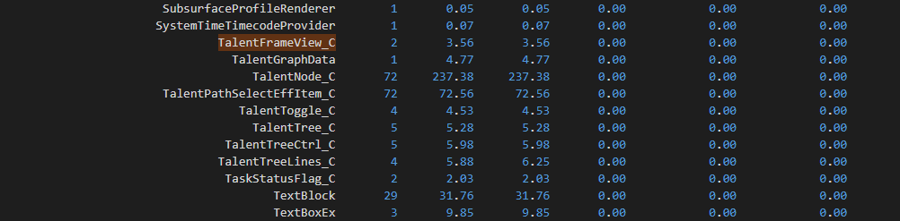
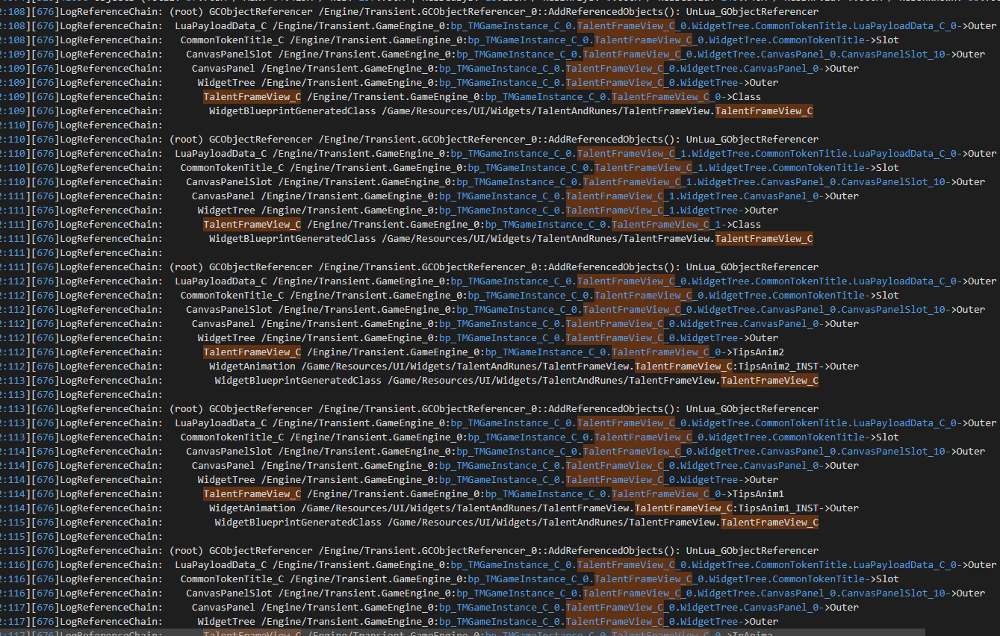

### UE4 性能优化

#### 内存泄漏定义

* 内存泄漏

  * ref

    [UE4内存分析方法](https://zhuanlan.zhihu.com/p/431759166)

  - 命令：Obj list -alphasort 打印出所有现存的Object

    可在打开界面后回登陆，通过命令打印Object List。查看界面的Object数量

    

  - 命令：Obj trygc 手动GC

  - 命令：Obj Refs Name=TalentFrameView_C 打印TalentFrameView_C这个Object的被引用信息。

    

    可以分析出TalentFrameView_C被LuaPayloadData持有。

* 内存报告

  ``` tex
  环境配置：
  	UE4编辑器或者独立窗口 输入(`) 打开命令行
  	输入 memReport full
  	在Saved/Profiling/MemReports/XXX_时间/中可以找到本地运行时的日志报告
  
  操作流程：
  	启动时执行一次命令
  	不重新启动，进行一系列游戏运行测试，返回启动时场景，再次执行一次命令
  ```


---


#### 内存优化

* UnLua

  1. local 变量 绑定UObject对象后 一定要清空 否则会残留

  2. 匿名函数传入UE4 Delegate中，需要传入self入参；UnLua Delegate绑定

     ``` lua
     --#region 延迟调用
     
     ---例子：
     ---```
     ---self.mMyHandle = CommonUtility.DelayCall({self, GameModeTown_C.OpenChapterSelectFrame}, 0.1, false)
     ---function GameModeTown_C:OpenChapterSelectFrame()
     ---    UIManager.OpenFrame(UIFrameClassPath.ChapterSelectFrame, 1, nil)
     ---    CommonUtility.ClearDelayCall(self, self.mMyHandle)
     ---end
     ---```
     ---1. 在回调结束要清除自己的handle  UE4.UKismetSystemLibrary.K2_ClearTimerHandle(self, self.mHandle)
     ---2. 重点提示：每一个使用DelayCall的地方都要考虑一下，调用对象是否有可能在DelayCall触发之前就已经不存在了。如果有可能，那么在调用者的析构函数里也要ClearDelayCall()。
     ---如果isLoop为true，考虑DelayCall是否会重复调用
     ---3. DelayCall的回调只能在UObject中调用，如果需要在Frame里调用，需要借用FrameView写回调
     ---@param delegate function 委托事件
     ---@param time number 延迟时间
     ---@param isLoop boolean 是否循环
     ---@return FTimerHandle
     function CommonUtility.DelayCall(delegate,time,isLoop)
         local handle = UE4.UKismetSystemLibrary.K2_SetTimerDelegate(delegate, time, isLoop)
         return handle
     end
     
     function CommonUtility.DelayCall_Simple(owner,delegate,time,isLoop)
         local handle = UE4.UKismetSystemLibrary.K2_SetTimerDelegate({owner,delegate}, time, isLoop)
         return handle
     end
     
     function CommonUtility.ClearDelayCall(target,handle)
         if target == nil or handle == nil then return end
         
         UE4.UKismetSystemLibrary.K2_ClearTimerHandle(target, handle)
     end
     --#endregion  延迟调用
     ```

     ``` lua
     --延迟刷新
     function MainTownTaskWidget_C:DelayUpdate()
         if updateTaskWaitTaskOverAnim then
             if nil == delayUpdateTaskListHandle then
                 delayUpdateTaskListHandle = CommonUtility.DelayCall(
                             {self,	
                             function (self)				--需要传入入参self，否则Delegate无法清除，MainTownTaskWidget不会被释放
                                 local taskSortList = TaskDataMgr:GetShowSortedTaskList()
                                 self:Update(taskSortList)
                                 CommonUtility.ClearDelayCall(self, delayUpdateTaskListHandle)
                                 delayUpdateTaskListHandle = nil
                                 updateTaskWaitTaskOverAnim = false
                             end}, 
                             self:GetTaskOverAnimPlayDuration(), false)
             end
         else
             local taskSortList = TaskDataMgr:GetShowSortedTaskList()
             self:Update(taskSortList)
             if delayUpdateTaskListHandle ~= nil then
                 CommonUtility.ClearDelayCall(self, delayUpdateTaskListHandle)
                 delayUpdateTaskListHandle = nil
             end
         end
     end