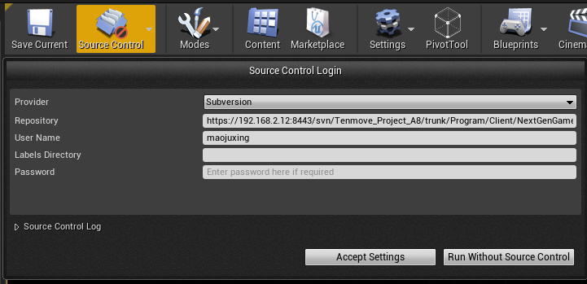
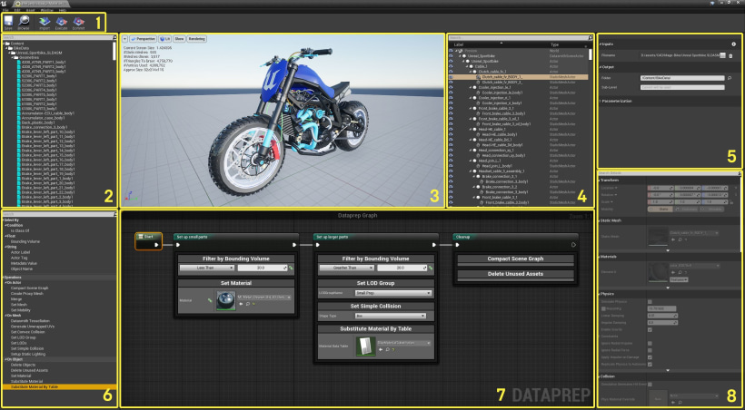
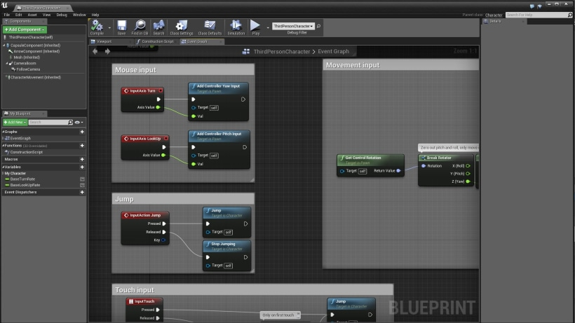

# UE4 操作

* 选择actor

  ``` text
  Ctrl / Shift  		 视口、世界大纲面板 多选
  Ctrl + Alt + 单击     视口中拖拽多选
  ```

* 视口操作

  |              | 控制                   | 操作                         |
  | ------------ | ---------------------- | ---------------------------- |
  | 透视视口     | 单击 + 拖拽            | 前后移动 + 旋转              |
  |              | 右键单击 + 拖拽        | 旋转                         |
  |              | 单击 + 右键单击 + 拖拽 | 上下移动                     |
  | 正交视图     | 单击 + 拖拽            | 创建一个选取框               |
  |              | 右键单击 + 拖拽        | 左右平移正交视图             |
  |              | 单击 + 右键单击 + 拖拽 | 放大和缩小正交视图           |
  | 透视视口追踪 | F                      | 聚焦到视口选中的Actor        |
  | （同Maya）   | Alt + 左键 + 拖拽      | 绕轴心点（或选中点）翻滚视口 |
  |              | Alt + 右键单击 + 拖拽  | 向轴心点（或选中点）缩放视图 |
  |              | Alt + 中键 + 拖拽      | 上下左右移动视图             |
  
  * Viewport窗口交互相机视角
    * 按住左键 - 前后拖拽  | （按住右键同）左右旋转
    * 按住左键和右键 （按住中键同） - 前后上下拖拽
    * 按住右键 - WASD前后上下移动
    * 按住左键/右键/中键 + Q - 垂直向下
    * 按住左键/右键/中键 + E - 垂直向上
    * 按住左键/右键/中键 + C - 镜头拉近  (松开鼠标 还原)
    * 按住左键/右键/中键 + Z - 镜头拉远  (松开鼠标 还原)

​		


---


* Editor

  * 几个运行启动的术语区分

    * Play（运行）：PIE (Play In Editor)  SIE (Simulate In Editor)     

      ​							不能修改蓝图类

      ​							可以修改C++类 并编译 修改会同步到游戏 不用停止Play

      ​							可以选择Keep Simulation Changes保存运行时的修改

      ​							不需要Cook

      

    * Launch（启动）：一般不需要使用Windows和Mac平台，Play更方便运行查看

      ​								提供选择外接的移动设备的执行步骤：

      ​										Editor先开始烘培地图，然后在指定设备上安装，然后在运行

      ​										只支持当前地图安装运行，不支持关卡间的切换

      ​								单独的编辑器窗口：ProjectLauncher  （菜单栏/窗口）

      ​							    可配置项目的发布的执行步骤：

      ​										需要在高级设置中指定：项目（Project）、编译（build）、烘培（Cook）、

      ​																				   包（Package）、存档（Archive）、部署（Deploy）、启动（Launch）

      

    * Package Project（打包项目）：可以在项目设置-项目-打包和项目设置-平台 配置参数

      * 打包类型：发布（Distribution / Shipping）、DebugGame（调试游戏）、Developmenet（开发）

      

    * 补充工具：

      * UnrealFrontend.exe  （独立的Editor，执行高级编译、烘焙、部署、打包及启动选项）

        ``` text
        示例目录：D:\programs\EpicGames\UE_4.26\Engine\Binaries\Win64\UnrealFrontend.exe
        ```

        

  

  * 复制 

    ``` text
    ctrl + w
    alt + 鼠标拖拽
    ```

---


* Light

  * 光照需要重建（1 未构建对象）？

    ``` text
    原因：场景中有光源，并且这些光源没有被构建，这时的光照产生的阴影或者其他都是预设，预览的，并没有真正出现在你的场景中
    解决：
    1、点击构建，或者点击构建那个三角下的仅构建光照
    2、使这些光源变成可移动，实时更新，不需要构建
    	如选中大纲视图中的 Light Source，在细节视图中的变换Tab下有“移动性”，选择“可移动”
    ```

    

---


* Materials

  * 编辑器

    ``` text
    V + 鼠标左键 ==> 创建颜色值参数块
    1 + 鼠标左键 ==> 创建常量参数块
    ```


---


* 设置分辨率

  ``` tex
  File -> Editor Preference -> play -> Play in New Window中设置
  在如下目录下添加GameUserSettings.ini文件：
  $EXPORT_FOLDER%\WindowsNoEditor\$GAME_NAME$\Saved\Config\WindowsNoEditor
  GameUserSettings.ini:
  [/Script/Engine.GameUserSettings]
  bUseVSync=False
  ResolutionSizeX=1280
  ResolutionSizeY=1024
  LastUserConfirmedResolutionSizeX=1280
  LastUserConfirmedResolutionSizeY=1024
  WindowPosX=-1
  WindowPosY=-1
  bUseDesktopResolutionForFullscreen=False
  FullscreenMode=2
  LastConfirmedFullscreenMode=2
  Version=5
  
  bUseDesktopResolutionForFullscreen：表示是否要全屏时使用桌面的分辨率
  FullscreenMode：
  0-真全屏
  1-假全屏，全屏无边框
  2-非全屏
  
  导出exe文件也会在project\Saved\StagedBuilds\WindowsNoEditor中生成，
  也可以在这个目录下的$GAME_NAME$\Saved\Config\WindowsNoEditor中放入GameUserSettings.ini
  ```

  ``` c++
  //代码设置分辨率
  void AMyGameMode::BeginPlay()
  {
   if(GEngine)
   {
       UGameUserSettings* MyGameSettings = GEngine->GetGameUserSettings();
       MyGameSettings->SetScreenResolution(FIntPoint(1024,768));
       MyGameSettings->SetFullscreenMode(EWindowMode::Fullscreen);
       MyGameSettings->SetVSyncEnabled(true);
       MyGameSettings->ApplySettings();
   }
  }
  ```


---


### UE4 SourceControl

* Diffing Unreal Assets

  ref:https://www.unrealengine.com/en-US/blog/diffing-unreal-assets

  


---


### UnrealVersionSelector

* 重装后或者更新引擎版本导致引用丢失，重绑定解决

  ``` tex
  1 找到Epic Lanucher的安装目录，寻找lancher->Engine->Binaries->Win64->UnrealVersionSelector.exe
  2 把UnrealVersionSelector.exe 拷贝到Ue4的版本工程目录，例如UE_4.18->Engine->Binaries->Win64
  3 双击运行UnrealVersionSelector.exe 即可，可能会有延迟，重启一下电脑也可
  ```

  


---


### Hot Key

* ref: [Basic Keyboard Shortcuts for Unreal Engine 4](https://www.domestika.org/en/blog/4733-basic-keyboard-shortcuts-for-unreal-engine-4)

  #### Most common shortcuts

  \- **Copy**: Ctrl + C
  \- **Cut**: Ctrl + X
  \- **Paste**: Ctrl + V
  \- **Save in Blueprint**: Ctrl + S
  \- **Find within Blueprint**: Ctrl + F
  \- **Find in all Blueprints**: Ctrl + Shift + F

  \- **Saves all unsaved levels & assets**: Ctrl + Shift + S 

  \- **Delete**: Delete
  \- **Undo**: Ctrl + Z
  \- **Redo**: Ctrl + Y
  \- **Select All**: Ctrl + A
  \- **Clear Selection**: Esc
  \- **Move Selection**: Arrows
  \- **Rename**: F2
  \- **Open File**: F1
  \- **Find in Content Browser**: Ctrl + B
  \- **Browse Tabs**: Ctrl + Tab
  \- **Open Level**: Ctrl + O
  \- **Play/Simulate**: Alt + P / Alt + S
  \- **Show Nav Mesh**: P
  \- **Zoom**: Mouse Wheel Up/Down

  #### Object Selection Shortcuts

  \- **Group and Ungroup**: Ctrl + G / Shift + G
  This shortcut enables organizing elements or parts of a level.
  \- **Pin and Unpin**: Mouse right-click -> Group
  Pinning allows for moving separate elements. When you unpin, all elements are combined again.

  #### Viewport Transformation Shortcuts

  \- **Scale**: R
  \- **Translate**: W
  \- **Rotate**: E
  \- **Toggle Move, Rotate, Scale**: Spacebar

  

  #### Viewport Camera Shortcuts

  \- **Focus**: F
  Focuses Viewport on a selected object.
  \- **View**: G
  Hide tools such as grids and icons to see how the level will appear.
  \- **Perspective View**: Alt + G
  \- **Front View**: Alt + H
  \- **Top View**: Alt + J
  \- **Side View**: Alt + K

  #### Play World Hotkeys

  \- **Play**: Alt + P
  \- **Pause**: PAUSE
  \- **Full Screen**: F11
  \- **Command Console**: ` / ~
  \- **Eject**: F8

  #### Viewport Navigation Shortcuts

  \- **Wireframe View**: Alt + 2
  \- **Unlit View**: Alt + 3
  \- **Lit View**: Alt + 4
  \- **Increase Grid Size**: Shift + [
  \- **Decrease Grid Size**: Shift + ]

  

  #### Level Editor Shortcuts

  \- **Menú**: Right Mouse Button
  \- **Save All**: Ctrl + S
  \- **Set Bookmark**: Ctrl + 0-9
  \- **Jump to Bookmark**: 0-9
  \- **Hide Selected**: H
  \- **Unhide All**: Ctrl + H
  \- **Snap to Floor:** End
  \- **Snap Pivot to Floor**: Alt + End
  \- **Snap Bounds to Floor**: Shift + End
  \- **Snap Origin to Grid**: Ctrl + End
  \- **Select all Adjacent Floor Surfaces**: Shift + U
  \- **Select all Adjacent Slant Surfaces**: Shift + Y
  \- **Select all Adjacent Surfaces**: Shift + J
  \- **Select all Adjacent Wall Surfaces**: Shift + W
  \- **Select all Coplanar Surfaces**: Shift + C
  \- **Find in Blueprint**: Ctrl + K
  \- **Show Navigation Mesh**: P
  \- **Duplicate and Transform**: Alt + Transform

  #### Mode Shortcuts

  \- **Actor Placement Mode**: Shift + 1
  \- **Paint Editing Mode:** Shift + 2
  \- **Landscape Editing Mode**: Shift + 3
  \- **Foliage Editing Mode**: Shift + 4
  \- **Geometry Editing Mode**: Shift + 5

  #### How to create your own Hotkeys in Unreal Engine 4

  \- Open the Preference tab in Editor, click on Edit, then on Keyboard Shortcuts.
  \- You can use the Search field to look for pre-existing commands.
  \- To modify shortcuts, click on the text field and write up the new hotkey.
  \- To delete an existing shortcut, click on the red delete icon.
