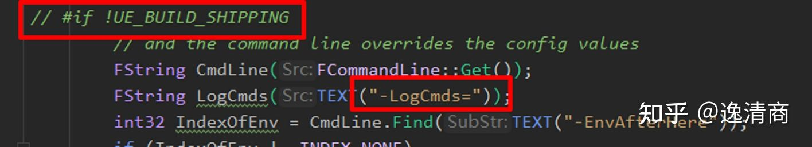

# UE4源码修改

### UE4.25

* fix

  * fix android assets目录读写闪退问题

    ``` tex
    Engine\Source\Runtime\Core\Private\Android\AndroidPlatformFile.cpp
    
    	// Handle that covers the entire content of an asset.
    	FFileHandleAndroid(const FString & path, AAsset * asset)
    		: File(MakeShareable(new FileReference(path, asset)))
    		, Start(0), Length(0), CurrentOffset(0)
    	{
    #if UE_ANDROID_FILE_64 && PLATFORM_32BITS
    		File->Handle = AAsset_openFileDescriptor64(File->Asset, &Start, &Length);
    #else
    		off_t OutStart = Start;
    		off_t OutLength = Length;
    		File->Handle = AAsset_openFileDescriptor(File->Asset, &OutStart, &OutLength);
    		Start = OutStart;
    		Length = OutLength;
    #endif
    		//### FIX(): android assets dir
    		CurrentOffset = Start;
    		
    		CheckValid();
    		LogInfo();
    	}
    ```

    

---


### 通用

* Shipping模式打印Log

  ``` tex
  UE4：Shipping模式打印Log
  需要在Game.Target.cs中添加
  bUseLoggingInShipping = true;
  即可打开shipping版本的log
  ```

  ``` tex
  在LogSuppressionInterface.cpp文件中，
  -LogCmds的处理在Shipping版本被干掉了，需要Shipping版本的log参数控制就需要修改源码重新编译引擎
  ```

  

  ``` tex
  Android可以在Game目录下的UE4CommandLine.txt文件中填写控制台命令参数。
  
  shipping版本在打包后的Enging.ini文件中依然可以通过[Core.Log]来对log进行显示级别控制，如果打开了LogCmds并且设置了参数则会被命令行覆盖。通过ini文件修改Log级别不需要对源码进行修改。
  Android可以在\UE4Game\GameName\GameName\Saved\Config\Android路径下的Engine.ini来进行修改。
  ```

  
