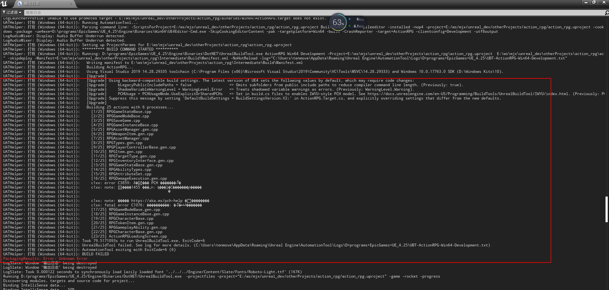

# Unreal Engine 4 多平台构建

*以下基于Unreal Engine 4.25.4版本*

### Windows

[UE4基础：离线安装方法](https://blog.csdn.net/ttm2d/article/details/106161970)

* 遇到的问题

  ``` text
  Q: UATHelper: 打包 (Windows (64-bit)):   ERROR: Could not find NetFxSDK install dir; this will prevent SwarmInterface from installing.  Install a version of .NET Framework SDK at 4.6.0 or higher.
  PackagingResults: Error: Could not find NetFxSDK install dir; this will prevent SwarmInterface from installing.  Install a version of .NET Framework SDK at 4.6.0 or higher.
  
  A: 前往https://dotnet.microsoft.com/download/dotnet-framework
  	下载 Dev Pack！
  ```

* 环境配置

  **基于环境**：Windows10 企业版 + Visual Studio 2019

  * 

* 更改引擎安装位置

  

---


### Android

* 遇到的问题

  1. 通过手动配置SDK NDK JDK 路径时，需要保证各个路径定位到根目录，由于NDK定位到上级目录，导致每次执行构建时都时打开帮助文档网页。

  2. **在mumu模拟器上闪退**

     * 分析

       *在android手机上能正常运行 在模拟器上不行  可能和so架构或者CPU支持有关系  就不用想代码逻辑方面的原因了  即使看到crash日志可能涉及有闪退堆栈*

* 环境配置

  **基于环境**：Windows10 企业版 + Visual Studio 2019

  * 本地未安装Android Studio和Java（jdk）的配置步骤（参考[官方教程](https://docs.unrealengine.com/zh-CN/SharingAndReleasing/Mobile/Android/Setup/AndroidStudio/index.html)）：
    	1. 下载 并 **默认选项**安装 [Android Studio 3.5.3](https://developer.android.com/studio/archive)
     	2. 在“UE4安装目录\UE_4.25\Engine\Extras\Android"下找到SetupAndroid.bat，执行


---


### iOS

* 遇到的问题

* 环境配置

  **基于环境**：Windows10 企业版 + Visual Studio 2019

  * windows 远程到 mac构建 ipa

    同步到mac的工作目录为  **/Users/用户名/UE4/**

    windows本地ssh key目录：

    ``` text
    C:\Users\用户名\AppData\Roaming\Unreal Engine\UnrealBuildTool\SSHKeys\mac ip地址\mac 用户名
    ```

    

* 参考

  [UE4 开发笔记：Mac/iOS 篇](https://imzlp.me/posts/1948/#%E9%98%85%E8%AF%BB%E5%85%A8%E6%96%87)


---


### 自动化构建

* 命令行参考

  [官方 - 自动化工具](https://docs.unrealengine.com/zh-CN/SharingAndReleasing/Deployment/BuildOperations/index.html)

  [官方 - BuildGraph 脚本任务](https://docs.unrealengine.com/zh-CN/ProductionPipelines/BuildTools/AutomationTool/BuildGraph/ScriptAnatomy/Tasks/index.html)

  

  [UE4基础：一键出包脚本](https://wangjie.rocks/2019/01/22/ue4-basic-package/)

  

  [ue4 命令行编译 烘焙 打包 存档](https://blog.csdn.net/u010385624/article/details/89916184)

  [UE4基础二：游戏打包](https://zhuanlan.zhihu.com/p/60996027)

  [UE4 UAT BuildCookRun命令行参数](https://wangjie.rocks/2018/08/09/ue4-uat-buildcookrun-cmd/)

  [UE4命令行参数解析](https://gameinstitute.qq.com/community/detail/121615)

  [https://zhuanlan.zhihu.com/p/30755949](https://zhuanlan.zhihu.com/p/30755949)

  [UE4持续集成打包（Mac脚本自动化打包）](https://blog.csdn.net/xlyrh/article/details/89553655)

  [【虚幻引擎】编写脚本执行打包](https://www.jianshu.com/p/b3954b2ac62f)

  [UE4.24 Jenkins自动打包流程笔记](https://zhuanlan.zhihu.com/p/144656367)
  
  [UE4 命令工具打包](https://blog.csdn.net/qq_35760525/article/details/81564028)
  
  ``` powershell
  #用cmd进入UE4引擎的目录：\Engine\Build\BatchFiles找到RunUAT.bat，cmd中输入以下命令：
  
  RunUAT BuildCookRun -project="F:/VidaUpdater/VidaUpdater.uproject" -noP4 -platform=Win64 -clientconfig=Shipping -cook -allmaps -stage -build -archive -archivedirectory="D:\Packages" -utf8output
  
  
  #说明：
  # -archivedirectory="D:\Packages"   //打包路径
#-clientconfig=Shipping   //打包shipping包，对应的还有Development包，区别比较多
  # 1. development下崩溃的提示比较详细，shipping没有任何代码提示，只有fatel error。
  # 2. development下可以调用控制台，而shipping下不可以。
  ```
  
  


---


### 源码编译

[github - UnrealEngine](https://github.com/EpicGames/UnrealEngine)

[UE4[C++]关于源码版引擎编译的坑](https://zhuanlan.zhihu.com/p/62470691)

[Unreal Engine大幅提升编译速度的技巧](https://zhuanlan.zhihu.com/p/83190575)

[UE4入门以及用源码编译](https://blog.csdn.net/mohuak/article/details/81665967)

[UE4游戏开发基础命令](https://www.cnblogs.com/kekec/p/8684068.html)

[记一次UE4源码编译和游戏项目打包过程](https://www.cnblogs.com/huhuf6/p/13977748.html)

[UE4基础：搭建开发环境](https://wangjie.rocks/2019/01/19/ue4-basic-env/)


[UE4 学习笔记 (一) 引擎源码编译及Binary文件导出](https://arenas0.com/2018/12/03/UE4_Learn_Build_Binary/)

[github - UE4-Binary-Builder](https://github.com/ryanjon2040/UE4-Binary-Builder)


[用Launcher引擎调试UE4源码的方法](https://zhuanlan.zhihu.com/p/133172832)


* Visual Studio环境

  ``` text
  Win10 + VS2019 在线下载慢的解决方法
  
  站长工具 （DNS查询）： download.visualstudio.microsoft.com
  得到国内ip，例如 “湖南[联通]  112.91.133.72 [广东省汕头市 联通]”
  修改C:\Windows\System32\drivers\etc\host  在文件末尾添加 “112.91.133.72 download.visualstudio.microsoft.com”
  ```

  * 切换VS版本

    [升级UE4项目VS版本](https://blog.csdn.net/a359877454/article/details/89152498)

    ``` powershell
    D:/UnrealEngine-4.XXX-release/Engine/Binaries/DotNET/UnrealBuildTool.exe  -projectfiles -project="XXXX.uproject" -game -engine -progress -2017
    REM 第一个是引擎对应构建工具路径，第二个是项目路径，最后一个2017是可以改的，如果你需要生成2019的，改成2019也可以。
    ```

    

* Visual Code环境

  [github - ue4-xcode-vscode-mac](https://github.com/botman99/ue4-xcode-vscode-mac)

  [使用VSCODE开发UE4](https://www.cnblogs.com/AnKen/p/10654678.html)


* 遇到的问题

  1. [[UE4] macOS 从源码编译遇到 SDK not found 问题 #19](https://github.com/yangruihan/blog/issues/19)

  2. [UE4源码Xcode编译错误解决：/Mac/XcodeBuild.sh failed with exit code 5](https://blog.csdn.net/MASILEJFOAISEGJIAE/article/details/104653476)

  3. [UE4源码编译报错，error C3859: 超过了 PCH 的虚拟内存范围问题解决](https://blog.csdn.net/weixin_43704737/article/details/106307112)

     ``` text
     选择你安装源码的盘  设置虚拟内存
     ```

  4. [解决MacOS UE4中以C++创建Object出错（UE4关联配置Xcode）](https://www.cnblogs.com/koongcen/p/10259865.html)

  5. 

     ``` text
     * 文件 - 刷新Visual Studio 2019工程
     * Visual Studio 2019 安装扩展 Game Development with C++   Unreal Engine Installer   Nuget Package Manager
     ```

  6. 

  7. 

* 编译流程 

  **基于环境**：UE4.25.4 + Windows10 + VS2019

  1. 运行Setup.bat

     ``` text
     第一步实际运行的是
     UnrealEngine-release\Engine\Binaries\DotNET\GitDependencies.exe
     
     执行
     GitDependencies.exe --help
     Usage:
        GitDependencies [options]
      
     Options:
        --all                         Sync all folders
        --include=<X>                 Include binaries in folders called <X>
        --exclude=<X>                 Exclude binaries in folders called <X>
        --prompt                      Prompt before overwriting modified files
        --force                       Always overwrite modified files
        --root=<PATH>                 Set the repository directory to be sync
        --threads=<N>                 Use N threads when downloading new files
        --dry-run                     Print a list of outdated files and exit
        --max-retries                 Override maximum number of retries per file
        --proxy=<user:password@url>   Sets the HTTP proxy address and credentials
        --cache=<PATH>                Specifies a custom path for the download cache
        --cache-size-multiplier=<N>   Cache size as multiplier of current download
        --cache-days=<N>              Number of days to keep entries in the cache
        --no-cache                    Disable caching of downloaded files
     ```

     ``` powershell
     # 执行Setup.bat
     Setup.bat --threads=16 或者 20 32等
     
     # 或者修改Setup.bat内容
     # set PROMPT_ARGUMENT=--prompt --threads=20 等
     ```

     

  2. 运行GenerateProjectFiles.bat  最终生成 生成UE4.sln

  3. 启动vs进行编译

     使用VS 2017编译  选择**Development Editor** + **Win64**

     然后右键 UE4 目标  选择生成（Build）
     
  4. 配置VS调试
  
     ``` text
     1. 安装VS2017 和 VS2019 的 UnrealVS 调试插件， 路径： Engine\Extras\UnrealVS\   
     
     2. UE4.natvis 断点中看到自定义变量当前值： Engine\Extras\VisualStudioDebugging
     复制上述文件到VS2019安装目录：（下面这是默认的安装路径）
     Program Files (x86)\Microsoft Visual Studio\2019\Community\Common7\Packages\Debugger\Visualizers
     VS2017安装目录：
     Program Files (x86)\Microsoft Visual Studio\2017\Community\Common7\Packages\Debugger\Visualizers
     ```
  
  5. 多个启动程序注册
  
  6. Generate Visual Studio project files 右键执行的内部命令
  
     [UE4 源码剖析 - 1.1.1 类型系统构建 - 编译系统(UBT之Generate)](https://zhuanlan.zhihu.com/p/157965866)
  
     ``` powershell
     "D:\Program Files (x86)\Epic Games\Launcher\Engine\Binaries\Win64\UnrealVersionSelector.exe" /projectfiles "%1"
     
     #再内部的命令如下
     Running D:/Program Files/Epic Games/UnrealEngine-release/Engine/Binaries/DotNET/UnrealBuildTool.exe  -projectfiles -project="E:/UnrealProjects/TPS/TPS.uproject" -game -engine -progress -log="E:\UnrealProjects\TPS/Saved/Logs/UnrealVersionSelector-2020.06.30-09.19.26.log"
     
     #TM本地PC示例
     D:\softwaves\_Develop\UE4\src\UnrealEngine\Engine\Binaries\DotNET\UnrealBuildTool.exe -projectfiles -project="E:/ws/mjx/unreal_dev/otherProjects/action_rpg_4.26.0/actionRPG4260.uproject" -game -engine -progress -log="E:/ws/mjx/unreal_dev/otherProjects/action_rpg_4.26.0/20201216_gen_vs_proj.log"
     
     #可以在源码 ( 基于源码 4.26.0 ) 中查询到具体参数的作用
     #D:\softwaves\_Develop\UE4\src\UnrealEngine\Engine\Source\Developer\DesktopPlatform\Private\DesktopPlatformBase.cpp
     ```
  
  7. 切换UE4版本时 需要删除原工程的Intermediate文件夹（VS Project Files） 重新用新UE4生成 Generate Visual Studio project files 
  
     可以参考上面 6  然后用对应版本VS打开 重新生成
  
     > 如果保留原工程的Intermediate文件 用新版本UE4在这个上面生成时 会报错 乱码提示
  
  8. 切换引擎版本
  
     [UE4-切换引擎版本时重构建](http://www.wordpress.sin998.cn/index.php/2020/10/27/reprinted-ue4-switch-engine-rebuild/)


* 编译流程2

  **基于环境**：UE4.25.4 + macOS 10.15.4  + Xcode 12.2

  * 参考

    [UE4 Mac 使用Xcode编译教程](https://www.daimajiaoliu.com/daima/47e03b210900414)

    [UE4 Mac 使用Xcode编译教程](https://blog.csdn.net/pizi0475/article/details/47807515)

    [保姆式教你使用FASTBuild对UE4进行联机编译](https://zhuanlan.zhihu.com/p/158400394)
    
    [UE4 使用Xcode真机调试的方法](https://www.jianshu.com/p/a7a909a6cfce)
    
    [从源码起构建虚幻引擎](http://docs.manew.com/ue4/775.html)


---


### 调试

* Android

  [UE4 Android联机调试 - VS](https://zhuanlan.zhihu.com/p/46089199)

  [官方 - AS](https://docs.unrealengine.com/zh-CN/SharingAndReleasing/Mobile/Android/AndroidDebugging/index.html)

  [UE4 Android Studio调试](https://www.cnblogs.com/kekec/p/12632422.html)
  
  [[UE4]android打包时如何修改添加自定义java类和so库，以及Android.mk](https://www.iteye.com/blog/aigo-2278608)
  
  
  
  [Unreal Engine 4-第三方登录、分享（按需接入）配置](http://gasdk.ztgame.com/doc/index.html?file=010-UE4%E6%8E%A5%E5%85%A5/94-%E5%BE%AE%E4%BF%A1QQ%E9%85%8D%E7%BD%AE%EF%BC%88%E6%8C%89%E9%9C%80%E8%A6%81%E6%8E%A5%E5%85%A5%EF%BC%89)


* Dev - Windows - VisualStudio2019

  [[UE4]VS调试模式简单介绍](https://blog.csdn.net/qq_36251561/article/details/89841514)
  
  ``` text
  在UE4中新建的C++的工程，VS部分一般被分为
  DebugGame（直接以全屏方式运行你默认地图的游戏，可以调试，无法编辑蓝图）、
  DebugGame Editor（打开debug工程，可以编辑保存蓝图，可以调试信息）、
  Development（直接运行默认地图游戏，无法调试，无法修改蓝图）、
  Development Editor（可以修改蓝图，无法调试）等
  ```
  
  

---


### 调用

* Android 

  [UE4 Android第三方库导入，JNI调用详解](https://blog.csdn.net/JMcc_/article/details/105512351)

  [UE4：UPL 与 JNI 调用的最佳实践](https://imzlp.me/posts/27289/)


---


### 版本管理

* git

  [如何使用Github管理UE4工程](https://blog.csdn.net/weixin_33232568/article/details/97757384)

  [虚幻的版本控制](https://zhuanlan.zhihu.com/p/136163257)

  .gitignore

  ``` text
  # Visual Studio 2015 user specific files
  .vs/
   
  # Compiled Object files
  *.slo
  *.lo
  *.o
  *.obj
   
  # Precompiled Headers
  *.gch
  *.pch
   
  # Compiled Dynamic libraries
  *.so
  *.dylib
  *.dll
  # Fortran module files
  *.mod
   
  # Compiled Static libraries
  *.lai
  *.la
  *.a
  *.lib
   
  # Executables
  *.exe
  *.out
  *.app
  *.ipa
   
  # These project files can be generated by the engine
  *.xcodeproj
  *.xcworkspace
  *.sln
  *.suo
  *.opensdf
  *.sdf
  *.VC.db
  *.VC.opendb
   
  # Precompiled Assets
  SourceArt/**/*.png
  SourceArt/**/*.tga
  # Binary Files
  Binaries/*
  Plugins/*/Binaries/*
  # Builds
  Build/*
  # Whitelist PakBlacklist-<BuildConfiguration>.txt files
  !Build/*/
  Build/*/**
  !Build/*/PakBlacklist*.txt
  # Don't ignore icon files in Build
  !Build/**/*.ico
  # Built data for maps
  *_BuiltData.uasset
  # Configuration files generated by the Editor
  Saved/*
  # Compiled source files for the engine to use
  Intermediate/*
  Plugins/*/Intermediate/*
  # Cache files for the editor to use
  DerivedDataCache/*
  ```

  


---


### 案例

* Action RPG

  [URL](https://www.unrealengine.com/marketplace/en-US/product/action-rpg)

  * 构建流程

    