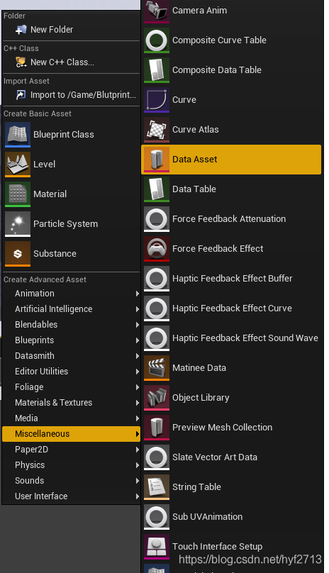
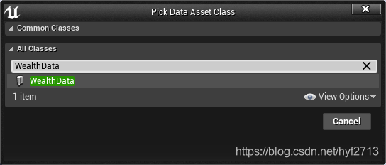
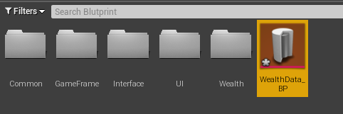
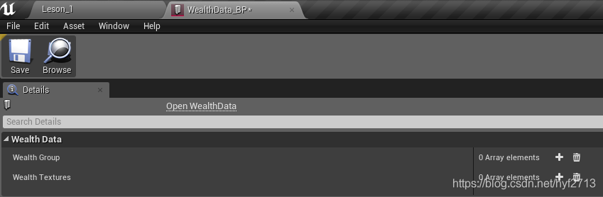
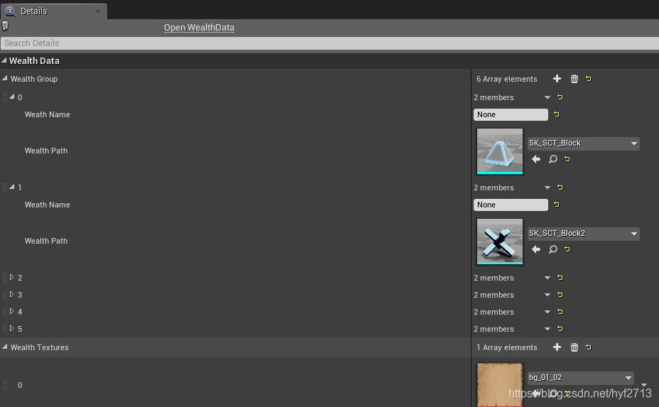
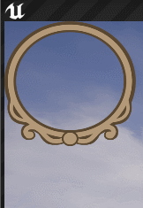

### UE4 DataAsset

* ref 

  [UE4学习记录：资源加载（一） ——DataAsset使用](https://blog.csdn.net/hyf2713/article/details/104972017)

* DataAsset使用

  ``` tex
  DataAsset：包含一个简单资源数据的基类。如果您继承了这个类，编辑器将在content browser中列出它。这个相当于Unity Asset文件，可以用来存储数据。
  ```

  * 创建继承DataAsset的类

    ``` c++
    //FWealthNode:单个资源需要的数据结构
    USTRUCT()
    struct FWealthNode
    {
    	GENERATED_BODY()
     
    public:
    	UPROPERTY(EditAnywhere)   //VisibleAnywhere也可以考虑
    		FName WeathName;
     
    	UPROPERTY(EditAnywhere)
    		FStringAssetReference WealthPath;
     
    };
     
    //FStringAssetReference ：是对资源(Asset)的“软”引用，这个结构在BP中使用起来就像是UObject指针一样
    UCLASS()
    class FRAMECOURSE_API UWealthData : public UDataAsset
    {
    	GENERATED_BODY()
     
    public:
     
    	UPROPERTY(EditAnywhere)
    		TArray<FWealthNode> WealthGroup;
     
    	UPROPERTY(EditAnywhere)
    		TArray<UTexture2D*> WealthTextures;
     
    };
    ```

    

    

    

    

    * 可以填充数据，这样就把资源的引用添加进去了，之后可以在代码中拿到WealthData的引用去里面直接取数据使用。

    

  * 读取WealthData数据

    用WealthData的类里申明定义一个WealthData的变量，并让这个变量在蓝图中可编辑

    创建继承AwelathActor类的蓝图，将WealthData（DataAsset）引用 赋值给actor的成员变量WealthData

    ``` c++
    class FRAMECOURSE_API AWelathActor : public AActor
    {
    	GENERATED_BODY()
    	
    public:	
    	// Sets default values for this actor's properties
    	AWelathActor();
     
    public:
    	UPROPERTY(EditAnywhere)
    		UStaticMeshComponent* WorkMesh;
     
    	UPROPERTY(EditAnywhere)
    		UWealthData* WealthData;					//用WealthData的类里申明定义一个WealthData的变量，并让这个变量在蓝图中可编辑
        FTimerHandle UpdateTextureHandle;
        int MeshIndex;
     
    protected:
    	// Called when the game starts or when spawned
    	virtual void BeginPlay() override;
     
    	void WealthState();
     
    	void UpdateMesh();
     
     
    public:	
    	// Called every frame
    	virtual void Tick(float DeltaTime) override;
    	
    };
    ```

    ``` c++
    #include "WelathActor.h"
    #include "Components/SceneComponent.h"
    #include "FWCommon.h"
    #include "TimerManager.h"
    #include "Engine/ObjectLibrary.h"
    #include "WealthWidget.h"
    #include "HandleWidget.h"
    #include "Engine/StreamableManager.h"
     
    // Sets default values
    AWelathActor::AWelathActor()
    {
     	// Set this actor to call Tick() every frame.  You can turn this off to improve performance if you don't need it.
    	PrimaryActorTick.bCanEverTick = true;
        RootComponent = CreateDefaultSubobject<USceneComponent>(TEXT("RootScene"));
     
    	WorkMesh = CreateDefaultSubobject<UStaticMeshComponent>(TEXT("WorkMesh"));
     
    	//将workMesh放到RootComponent节点下;
    	WorkMesh->SetupAttachment(RootComponent);
    }
     
    // Called when the game starts or when spawned
    void AWelathActor::BeginPlay()
    {
    	Super::BeginPlay();
    	
    	FTimerDelegate UpdateMeshDele = FTimerDelegate::CreateUObject(this, &AWelathActor::UpdateMesh);
    	GetWorld()->GetTimerManager().SetTimer(UpdateMeshHandle, UpdateMeshDele, 1.f, true);
     
    }
    
    void AWelathActor::UpdateMesh()
    {
    	if (WealthData && WealthData->WealthGroup.Num()>0)
    	{
    		UStaticMesh* FactMesh = LoadObject<UStaticMesh>(NULL, *WealthData->WealthGroup[MeshIndex].WealthPath.ToString());
    		WorkMesh->SetStaticMesh(FactMesh);
     
    		MeshIndex = (MeshIndex + 1) >= WealthData->WealthGroup.Num() ? 0 : (MeshIndex + 1);
    	}
    }
     
    // Called every frame
    void AWelathActor::Tick(float DeltaTime)
    {
    	Super::Tick(DeltaTime);
    }
    ```

    

* 异步资源加载

  [UE4学习记录：资源加载（二） ——异步加载资源](https://blog.csdn.net/hyf2713/article/details/104981113)

  ``` tex
  用ObjectLibrary来获取资源路径，然后用StreamableManager异步加载资源
  
  ObjectLibrary：是一个对象，包含了一系列继承共享基类的未加载对象或者未加载对象的FAssetData 。您可以通过提供一个搜索路径来加载一个对象库，它将加载那个路径中的所有资源。
  
  StreamableManager：是使用同步异步加载功能时直接操作的类
  ```

  * 实例

    实现一个功能就是将MenuTex文件下的图片资源加载进来，然后在屏幕上切换显示。

    

    * 创建ObjectLibrary并加载指定文件夹下资源的弱引用

      在WelathActor.h中声明定义ObjectLibrary成员变量，然后在WelathActor.cpp中实例ObjectLibrary对象，并指定文件夹。

      ``` c++
      //声明对象;
      UObjectLibrary* ObjectLibrary;
      //图片路径软引用;
      TArray<FSoftObjectPath> TexturePath;
       
      //实例ObjectLibrary对象，指定文件夹，并将软引用赋值给TexturePath
      void AWelathActor::ObjectLibraryOperate()
      {
      	if (!ObjectLibrary)
      	{
      		ObjectLibrary = UObjectLibrary::CreateLibrary(UObject::StaticClass(), false, false);
      		ObjectLibrary->AddToRoot();
      	}
       
      	//搜索所有Texture的路径;
      	ObjectLibrary->LoadAssetDataFromPath(TEXT("/Game/Resource/UI/Texture/MenuTex"));
       
      	TArray<FAssetData> TextureData;
      	ObjectLibrary->GetAssetDataList(TextureData);
       
      	for (int i=0; i<TextureData.Num();++i)
      	{
      		//FWHelper::Debug(TextureData[i].ToSoftObjectPath().ToString());
      		TexturePath.AddUnique(TextureData[i].ToSoftObjectPath());
      	}
      }
      ```

    * 创建StreamableManager实现异步加载

      ``` tex
      声明一个StreamableManager的对象，调用StreamableManager.RequestAsyncLoad来异步加载资源，
      这个函数可以传入一个完成加载的回调函数，并且返回一个FStreamableHandle，我们将这个返回值保存，
      这个值里保存了加载完成的资源数据，所以在.h文件里我们还要声明个FStreamableHandle对象引用。
      ```

      ``` c++
      FStreamableManager* WealthLoader;
      TSharedPtr<FStreamableHandle> WealthHandle;
      void AWelathActor::StreamableManagerOperate()
      {
      	WealthLoader = new FStreamableManager();
      	WealthHandle = WealthLoader->RequestAsyncLoad(TexturePath, FStreamableDelegate::CreateUObject(this,
      		& AWelathActor::StreamableManagerLoadComplete));
      }
      void AWelathActor::StreamableManagerLoadComplete()
      {
      	TArray<UObject*> OutObjects;
      	WealthHandle->GetLoadedAssets(OutObjects);
       
      	for (int i = 0; i < OutObjects.Num(); i++)
      	{
      		UTexture2D* workTexture = Cast<UTexture2D>(OutObjects[i]);
      		if (workTexture)
      		{
      			TextureGroup.Add(workTexture);
      		}
      	}
       
      	FTimerDelegate UpdateTextureDele = FTimerDelegate::CreateUObject(this, &AWelathActor::UpdateTexture);
      	GetWorld()->GetTimerManager().SetTimer(UpdateTextureHandle, UpdateTextureDele, 1.f, true);
      }
      ```

    * 完整代码

      ``` c++
      class UWealthWidget;
      struct FStreamableManager;
      struct FStreamableHandle;
      UCLASS()
      class FRAMECOURSE_API AWelathActor : public AActor
      {
      	GENERATED_BODY()
      	
      public:	
      	// Sets default values for this actor's properties
      	AWelathActor();
       
      protected:
      	// Called when the game starts or when spawned
      	virtual void BeginPlay() override;
          //更新图片;
      	void UpdateTexture();
          //资源库对象操作;
      	void ObjectLibraryOperate();
       
          //UMG面板用来展示图片;
      	UWealthWidget* WealthWidget;
       
      	//资源异步加载;
      	void StreamableManagerOperate();
       
      	//资源异步加载的完成;
      	void StreamableManagerLoadComplete();
       
      public:	
      	// Called every frame
      	virtual void Tick(float DeltaTime) override;
          
          //绑定UMG面板，这个函数是在对应的widget类里调用;
      	void AssignWealthWidget(UWealthWidget* wealthWidget);
       
          //资源库对象指针;
      	UObjectLibrary* ObjectLibrary;
       
          //资源软引用数组;
      	TArray<FSoftObjectPath> TexturePath;
       
          //异步加载管理器;
      	FStreamableManager* WealthLoader;
          //图片数组;
      	TArray<UTexture2D*> TextureGroup;
      	int TextureIndex;
      };
      ```

      ``` c++
      #include "WelathActor.h"
      #include "FWCommon.h"
      #include "TimerManager.h"
      #include "Engine/ObjectLibrary.h"
      #include "WealthWidget.h"
      #include "Engine/StreamableManager.h"
       
      // Sets default values
      AWelathActor::AWelathActor()
      {
       	// Set this actor to call Tick() every frame.  You can turn this off to improve performance if you don't need it.
      	PrimaryActorTick.bCanEverTick = true;
      }
       
      // Called when the game starts or when spawned
      void AWelathActor::BeginPlay()
      {
      	Super::BeginPlay();
      	ObjectLibraryOperate();
      	StreamableManagerOperate();
      }
       
      void AWelathActor::UpdateTexture()
      {
      	if (TextureGroup.Num() > 0)
      	{
      		WealthWidget->AssignTexture(TextureGroup[TextureIndex]);
      		if (HandleWidget)HandleWidget->AssignTexture(TextureGroup[TextureIndex]);
      		TextureIndex = (TextureIndex + 1) >= TextureGroup.Num() ? 0 : (TextureIndex + 1);
      	}
      }
       
      void AWelathActor::ObjectLibraryOperate()
      {
      	if (!ObjectLibrary)
      	{
      		ObjectLibrary = UObjectLibrary::CreateLibrary(UObject::StaticClass(), false, false);
      		ObjectLibrary->AddToRoot();
      	}
       
      	//搜索所有Texture的路径;
      	ObjectLibrary->LoadAssetDataFromPath(TEXT("/Game/Resource/UI/Texture/MenuTex"));
       
      	TArray<FAssetData> TextureData;
      	ObjectLibrary->GetAssetDataList(TextureData);
       
      	for (int i=0; i<TextureData.Num();++i)
      	{
      		//FWHelper::Debug(TextureData[i].ToSoftObjectPath().ToString());
      		TexturePath.AddUnique(TextureData[i].ToSoftObjectPath());
      	}
      }
       
      void AWelathActor::StreamableManagerOperate()
      {
      	WealthLoader = new FStreamableManager();
      	WealthHandle = WealthLoader->RequestAsyncLoad(TexturePath, FStreamableDelegate::CreateUObject(this,
      		& AWelathActor::StreamableManagerLoadComplete));
      }
       
      void AWelathActor::StreamableManagerLoadComplete()
      {
      	TArray<UObject*> OutObjects;
      	WealthHandle->GetLoadedAssets(OutObjects);
       
      	for (int i = 0; i < OutObjects.Num(); i++)
      	{
      		UTexture2D* workTexture = Cast<UTexture2D>(OutObjects[i]);
      		if (workTexture)
      		{
      			TextureGroup.Add(workTexture);
      		}
      	}
          //定时更新;
      	FTimerDelegate UpdateTextureDele = FTimerDelegate::CreateUObject(this, &AWelathActor::UpdateTexture);
      	GetWorld()->GetTimerManager().SetTimer(UpdateTextureHandle, UpdateTextureDele, 1.f, true);
      }
       
       
      // Called every frame
      void AWelathActor::Tick(float DeltaTime)
      {
      	Super::Tick(DeltaTime);
      }
       
      void AWelathActor::AssignWealthWidget(UWealthWidget* wealthWidget)
      {
      	WealthWidget = wealthWidget;
      }
      ```

      