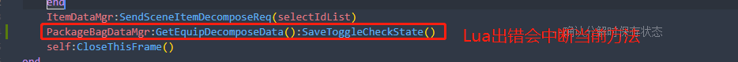

### 经验

* 编码

  1. 不能按照服务器协议做逻辑，协议先后顺序没有保证的
  1. 代码里尽量不要使用写死的string，需要放到通用文件里，运行时加载到内存，同时涉及到多语言发布时，还方便统一替换文本

  

* lua语言

  1. lua的智能提示很重要 容易造成逻辑出错

     例如：函数少传参数导致函数执行逻辑不对，需要多次测试才能发现
     
  2. lua进行业务逻辑开发时，多考虑用表去代替多个if else
  
  3. lua代码中写字符串或者需要拼接字符串时，需要考虑使用 不带引号的 [[XXX]]，XXX中可以包含\n，并且\n不为转义符，仅表示\n这两个字符
  
  4. lua初始化变量或者方法调用设置变量时  使用  变量 or + 默认值
  
     ``` lua
     function ItemData:SetCount(count)
         self.mItemCount = count or 1
     end
     ```
  
  5. lua和c++ 或者 lua和c# 之间相互调用，需要分清楚lua是辅助层，装饰层，是基于c++或者c#的，所以尽量不要发生从c++调用lua函数，这个lua函数又是c++实现的，增加性能消耗
  
  6. **lua回调需要注意传回调实现所在的对象**
  
     ``` lua
     -- ItemBatchUseFrameView_C
     	function ItemBatchUseFrameView_C:Init()
         	ItemNumInputField_C:Init(self, self.OnSmallKeyboardViewReturn)
         end
         function ItemBatchUseFrameView_C:OnSmallKeyboardViewReturn(value)
             batchUseNum = value
         end
     
     -- ItemNumInputField_C
     	function ItemNumInputField_C:Init(target, callback)
         	self.mTarget = target
         	self.mSmallKeyboardEnterCallback = callback
         end
     	function ItemNumInputField_C:OnSmallKeyboardEnterCallback(value)
             if self.mSmallKeyboardEnterCallback ~= nil then
                 self.mSmallKeyboardEnterCallback(self.mTarget, self.mUseNum)
             end
         end
     ```
  
  7.  lua  local param vs. self param
  
     ``` lua
     local PackageBagView_C = {}
     
     -- 每次创建当前PackageBagView_C 对象（表）时，如果不重置下表，则会缓存之前的数据
     local updateSortFirstFlags = {
             [PackageType.eEquip] = true,
             [PackageType.eConsumable] = false,
             [PackageType.eMaterial] = false,
             [PackageType.eFashion] = false,
     }
     
     -- 每次创建当前PackageBagView_C 对象（表）时，都会创建一份新的数据，但是在对象销毁时，还是需要重置一下表中的变量，以免变量引用了外部对象
     self.mUpdateSortFirstFlags = {
             [PackageType.eEquip] = true,
             [PackageType.eConsumable] = false,
             [PackageType.eMaterial] = false,
             [PackageType.eFashion] = false,
     }
     
     return PackageBagView_C
     ```
  
  8. lua引用另一个文件里定义的枚举时，需要require这个文件，即使引入的对象在IDE上显示没用到
  
  9. lua 写接口时 需要在备注里 注明 返回值 以及 返回值是否为空
  
  10. **考虑到一个table所承载的class对象，可能会多次刷新，而非重建，所以内部变量尽量不要使用静态变量（即local，所用self）**
  
  11. lua赋值需要先判空
  
      ```  lua
      ...
      --随机属性
      	--如果不加这一行，但是变量是nil，lua会直接中断这个方法
          if item.randomAttrs ~= nil and item.randomAttrs.randomAttrVec ~= nil then  
              itemData.mRandomAttrs = item.randomAttrs.randomAttrVec
          end
      ...
      ```
  
  12. 显示相关，关于0
  
      ``` lua
      local remainTime = totalTimes - currTime
      if remainTime < 0 then			--凡是取值会靠近0，需要判断展示时是否需要展示小于0的情况，否则都要做保护
         remainTime = 0
      end
      ```
  
  13. lua在方法中报错，会中断，跳出当前方法
  
      
      
  14. lua定义函数的入参
  
      ``` lua
      function CommonUtility.GetNumByKeepDecimalFloor(num, n)
          if type(num) ~= "number" then							--入参进行类型判断
              return num
          end
      end
      ```
  
  


---


### 客户端系统开发

* 尽量不要使用sprite加载的方式动态设置ui，除非是图片大小一样的情况并且需要动态切换

* 城镇数据和战斗数据 尽量分开 ，如果使用通用数据管理器，尽量加一份工具函数（不包含城镇数据或者战斗数据），避免因为误带入对方数据导致异常

* 客户端和服务器联调协议时，设计枚举值的定义，客户端可以根据现有映射一份少量枚举值，这样当服务器需要改动枚举时，可以单独和其开发服务器联调

* Frame（指定界面管理层）需要尽量全部承担业务逻辑，View只是接收数据，改变UI，或者UI交互，发送UI事件；需要将View里的业务逻辑功能抽出来放到Frame里，因为View经常会变动，界面调整，按钮调整，显示调整，但是基本功能点不变

* 客户端数据管理需要考虑 进入游戏和退出到登录 两种情况下 数据的创建、声明和事件绑定，以及相应的清理或者重置（e.g. DataMgr InitData() UninitData() ResetData() ）

* 道具模块

  ``` tex
  对于Comitem和ItemTip，除非策划需求真假道具在tips上的显示有区别；或者在道具icon上，真假道具的显示有区别，才需要手动做区分
  
  否则，真道具有的数据和流程，假道具创建时也需要有，保证构造数据的一致性，区别只是数据来源不同
  ```

* 系统配表

  ``` tex
  能拆分表格就拆分 保证字段在每个表格功能一致且相关，虽然对于策划配表需要多张表一起修改，但是功能含义上会比较明确
  如道具表和道具用途表，道具表中包含用途表ID，道具使用条件在道具表中，道具用途和道具使用并不相关
  ```

* 代码开发规范

  * if...else... 需要配套

    
