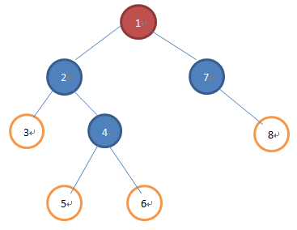

### 行为树基础

* ref

  [行为树的理解和学习 ](https://www.cnblogs.com/hammerc/p/5044815.html)
  
  
  
  ``` tex
  行为树是一种树形结构，所以其可以分成3种节点类型：
  红色的节点：根节点，没有父节点的节点；
  蓝色的节点：组合节点，有父节点和子节点的节点；
  白色的节点：叶节点，没有子节点的节点；
  
  每个节点都会有一个返回值，可能出现的返回值有3个，如下：
  运行中：表示当前节点还在运行中，下一次调用行为树时任然运行当前节点；
  失败：表示当前节点运行失败；
  成功：表示当前节点运行成功；
  
  根节点
  行为树的入口节点，可以是任意类型的节点；
  
  组合节点
  行为树的组合节点是由下面几种类型来组成的：
  
  选择节点/优先选择节点（Selector）
  该节点会从左到右的依次执行其子节点，只要子节点返回“失败”，就继续执行后面的节点，直到有一个节点返回“运行中”或“成功”时，会停止后续节点的运行，并且向父节点返回“运行中”或“成功”，如果所有子节点都返回“失败”则向父节点返回“失败”。
  
  随机选择节点（Random Selector）
  之前的选择节点是有优先级顺序的，而随机选择节点的执行顺序是随机的。但每个节点只会执行一次，比如包含子节点：A、B、C、D、E；使用随机选择节点，执行顺序可能是：D、E、A、C、B或其他组合。其它规则同选择节点一致。
  
  顺序节点（Sequence）
  该节点会从左到右的依次执行其子节点，只要子节点返回“成功”，就继续执行后面的节点，直到有一个节点返回“运行中”或“失败”时，会停止后续节点的运行，并且向父节点返回“运行中”或“失败”，如果所有子节点都返回“成功”则向父节点返回“成功”。
  
  修饰节点（Decorator）
  修饰节点只包含一个子节点，用来以某种方式来改变这个子节点的行为。
  
  修饰节点的类型比较多，这里我们说一些比较常见的修饰节点：
  
  Until Success和Until Failure
  循环执行子节点，直到返回“成功”或“失败”为止。
  比如Until Success在子节点返回“运行中”和“失败”时都会向父节点返回“运行中”，返回“成功”时向父节点返回“成功”。
  Until Failure在子节点返回“运行中”和“成功”时都会向父节点返回“运行中”，返回“失败”时向父节点返回“成功”。
  
  Limit
  执行子节点一定次数后强制返回“失败”。
  当子节点运行指定次数后还没有返回“失败”则该节点向父节点返回失败。
  
  Timer
  子节点不会立即执行，而会在指定的时间到达后才开始执行。
  
  TimeLimit
  指定子节点的最长运行时间，如果子节点在指定时间到达后还在运行则强制返回“失败”。
  
  Invert
  对子节点的返回结果取“非”，即子节点返回“成功”则该节点返回“失败”，子节点返回“失败”则该节点返回成功。
  
  并行节点（Parallel）
  不同于选择和顺序节点依次执行每个节点，并行节点是“同时”执行所有的节点，然后根据所有节点的返回值判断最终返回的结果。
  
  这里的“同时”会迷惑住不少人，实际上，行为树是运行在单一线程上的，并不会在并行节点上开多个线程来进行真正的同时执行，那么“同时”的含义是什么？
  我们知道选择或顺序节点会依次执行所有的子节点，当子节点返回“成功”或“失败”后就会停止后续节点的执行，而并行节点也会依次执行所有的子节点，无论子节点返回“成功”或“失败”都会继续运行后续节点，保证所有子节点都得到运行后在根据每个子节点的返回值来确定最终的返回结果。
  
  并行节点一般可以设定退出该节点的条件，比如：
  当全部节点都返回成功时退出；
  当某一个节点返回成功时退出；
  当全部节点都返回成功或失败时退出；
  当某一个节点返回成功或失败时退出；
  当全部节点都返回失败时退出；
  当某一个节点返回失败时退出；
  
  叶节点
  条件节点（Condition）
  条件节点可以理解为一个if判断语句，当条件的测试结果为true时向父节点传递success，结果为false时向父节点传递failure；
  该节点搭配一些组合节点可以完成各种判断跳转，比如搭配顺序节点，可以做出“是否看见敌人”->“向敌人开火”的AI；
  
  行为节点（Action）
  行为节点用来完成具体的操作，比如，移动到目标点，执行开火等代码逻辑，多种情况下行为节点会返回running和success；
  行为节点也可能会使用多帧来完成；
  
  子树的复用
  我们设计好的行为树可以在其他树中作为一颗子树来进行使用，最大可能的复用子树可以减少开发量。
  ```
  
  ``` tex
  行为树和状态机的选择
  行为树并不能完全的替代状态机，两者都可以用来处理AI编写问题，但行为树是“轮询”机制，而状态机是“事件”机制，在最终使用之前一定要好好权衡和选择才行。
  ```
  
  