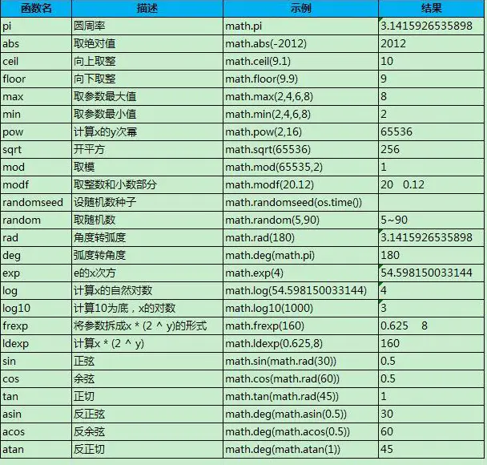

# Lua学习

### lua基础

[Lua 5.1 参考手册](https://www.codingnow.com/2000/download/lua_manual.html)

[Lua 5.3 参考手册](https://cloudwu.github.io/lua53doc/manual.html)

[Lua图解-lua堆栈](./Lua图解)

[Lua和C++交互详细总结](https://www.cnblogs.com/sevenyuan/p/4511808.html)

[lua documentation](https://www.lua.org/docs.html)

* lua 堆栈

  在Lua中，Lua堆栈就是一个struct，堆栈索引的方式可是是正数也可以是负数，区别是：正数索引 1永远表示栈底，负数索引 -1永远表示栈顶。


* 命令行执行lua中文乱码

  ``` tex
  1. lua文件编码格式改为GBK  不推荐
  2. 命令行先输入 chcp 65001 将当前命令窗口临时改为UTF-8编码
  ```


* lua math库

 		


---


### Lua面向对象

* 使用元表和元方法

  元表：metatable

  元方法：__index

  ``` tex
  继承：通过元表的__index元方法，将一个table A的__index元方法设置为另一个table B，那么B被A继承
  	如果访问了lua表中不存在的元素时，就会触发lua的查找机制
  	
  查找机制：
  	1. 在table中查找，如果找到，返回该元素，否则2
  	2. 判断table是否有元表，如果没有元表，返回nil，有元表继续3
  	3. 判断元表有没有__index方法，如果__index方法为nil，则返回nil，如果__index方法是一个表，则重复 1，2，3；
  		如果__index方法是一个函数，则调用该函数，并返回该函数的返回值
  		
  说明：
  	1. 元表如一个备用查找表，假设表A的元表是B，那么在A中找不到就会去B中找
  	2. 设置元表 setmetatable(A, B) 将B设置为A的元表
  	3. 元方法__index是用于确定一个表在被作为元表是的查找方法
  	
  封装：
  	设置新对象的metatable  setmetatable(tempObj, Class)
  	
  继承多态：
  	父类：设置metatable的元方法__index，指向表Class自己
  		Class.__index = Class
  		设置新对象metatable
          setmetatable(tempObj, Class)
          
      子类：设置metatable为Class
      	setmetatable(SubClass, Class)
  		设置metatable的元方法__index，指向表subclass自己
  		SubClass.__index = SubClass
  ```

  


---


### lua语法

* self vs. local

  ``` tex
  * 尽量使用local variables
  * 可以定义全局可用的函数，将它们放在同一份global.lua中
  * 需要共享数据或在共享模块中时，使用self variables
  ```

  ``` lua
  -- ue4 umg unlua
  -- TabItemEntry_C.lua
  function TabItemEntry_C:OnListItemObjectSet(itemObj)
      if itemObj == nil then
          return
      end
      self.mTabData = itemObj
      self.TextMailTabName:SetText(self.mTabData.Name)
  end
  
  function TabItemEntry_C:BP_OnItemSelectionChanged(bIsSelected)
      if bIsSelected and self.mTabData ~= nil then
          if self.mTabData.OnInfoTabSelect ~= nil then
              self.mTabData.OnInfoTabSelect:Broadcast(self.mTabData.Id)
          end
      end
  end
  --使用self变量存储，保证只在当前创建结构中使用
  --如果使用local变量存储，则会在TabItemEntry_C.lua中共享
  ```

  

* : vs. .

  ``` tex
  冒号调用语法糖，调用便利，同时减少一条指令调用
  ```
  
  ``` lua
  -- Lua中的self ref: https://zhuanlan.zhihu.com/p/115159195
      do
          local t = {a = 1, b = 2}
          function t:Add()
              return (self.a + self.b)
          end
          print(t:Add())
      end
  
      do
          local t = {a = 1, b = 2}
          function t:Add()
              return (self.a + self.b)
          end
          function t.Sub(self)
              return (self.a - self.b)
          end
          print(t.Add(t))
          print(t:Sub())
      end
  
      do
          local tA = {a = 1, b = 2}
          function tA.Add(self)
              return (self.a + self.b)
          end
          print(tA.Add(tA))
      end
  
      do
          local tB = {a = 1, b = 2}
          function tB:Add()
              return (self.a + self.b)
          end
          print(tB:Add())
      end
  ```
  
  
  
  
  
  
  
  
  
  


* 中英文截取

  ``` tex
  根据UTF-8字符编码
  字符编码的发展史：ASCII->Unicode->UTF-8
  
  1.ASCII：ASCII码可以表示所有的英语字符(字母、数字、标点符号等)。ASCII码是7位编码(0-127)，但由于计算机基本处理单位为字节(1字节=8位)，所以一个ASCII字符占一个字节。
  
  2.Unicode：因为一个ASCII字符只能表示256个字符，显然是存在着局限的(如不能用来表示中文)。而且不同的语言有不同的字符，为了让世界上所有的字符都有一个唯一的编码值(如果一个编码值对应多个字符，就会出现歧义)，就出现了Unicode码。Unicode码可以容纳100多万个符号，每个符号的编码都不一样。但是Unicode码的缺点是效率不高，比如UCS-4(Unicode的标准之一)规定用4个字节存储一个符号，那么每个英文字母前都必然有三个字节是0，原本只需1个字节现在却用了4个字节，这对存储和传输来说都很耗资源。
  
  3.UTF-8：为了提高Unicode的编码效率，于是就出现了UTF-8编码。UTF-8可以根据不同的符号自动选择编码的长短。
  		在UTF-8中，一个英文占1个字节，一个中文占3个字节。
  		变长字符，字符长度有规律
  ```
  
  ``` lua
  -- lua中的string都是针对单字节字符编码的；对于utf-8中，lua能处理单字节的英文字符，不能处理多字节的中文字符
  
  --[[
  UTF8的编码规则：
  1.字符的第一个字节范围：(0-127)、(194-244)
  2.字符的第二个字节及以后范围(针对多字节编码，如汉字)：(128-191)
  3.(192，193和245-255)不会出现在UTF8编码中
  ]]
  
  --lua的string.sub接口会将中文字符当成3个字符来处理
  --lua5.3是支持UTF-8编码格式的, 但是string.sub()函数本身并未对汉字处理,无法实现中文的正确截取
  ```
  
  ``` tex
  utf-8变长编码：
  一字节：0*******
  两字节：110*****，10******
  三字节：1110****，10******，10******
  四字节：11110***，10******，10******，10******
  五字节：111110**，10******，10******，10******，10******
  六字节：1111110*，10******，10******，10******，10******，10******
  
  判断utf-8字符的byte长度，获取字符首个byte，就能判断出该字符由几个byte表示
  ```
  
  


* 闭包

  [Lua闭包使用](https://www.cnblogs.com/JensenCat/p/5112420.html)

  

  ``` lua
  function func3()
        local num3 = 44
        function func4()
             return num3
        end
        return func4
  end
  
  local func = func3();
  print(func())
  
  --[[
  解释：
  1.在外部无法获取到func3内部的局部变量，但是func3内部的局部方法func4却可以获取到，因此返回一个func4的引用 ，这样在外部通过这个func4就可以获取到func3的内部变量。
  2.虽然是绕了一个圈子，但是在方法外部却通过这样一个手段获取到了内部的值。而这个方法内的局部方法func4就叫做闭包，按照很多书上的概念，这个方法搭建了方法内部与方法外部的桥梁，使得在外部也可以任意的获取到方法内部的资源。
  3.但是闭包会造成变量在内存中持久占用，因此会有一定的性能问题，最好不要轻易使用，即便使用也要在恰当的实际进行释放。
  ]]
  ```

  ``` lua
  --cocos lua
  local testUI = testUI or {}
  local testUI:onBtnClick(sender,event)
      --可获取的参数有:隐藏的self,btn,event
  end
  function testUI:initButton()
       local btn = UIButton:create()
      --重点来了
      btn:addListenHandler(
         function(event)
             --使用闭包把self,btn都传进去了....
             self:onBtnClick(btn,event)				--按钮获取到自身，可以改变自身
         end
      )
  end
  return testUI
  ```


---

### Lua 开发注意点

* __lua声明变量都可以为nil__
  如果代码逻辑里需要初始化一次变量 number a

  ``` lua
  local a =nil 
  if a == 0 then
     a = 1
  end
  --上述初始化变量不会生效
  ```

  


---


### lua with c++

* lua 和 c++通信

  ``` tex
  lua c++ 通信约定：
  所有的lua中的值由lua来管理, c++中产生的值lua不知道
  如果你(c/c++)想要什么, 你告诉我(lua), 我来产生, 然后放到栈上, 你只能通过api来操作这个值, 我只管我的世界
  
  "如果你想要什么, 你告诉我, 我来产生"就可以保证, 凡是lua中的变量, lua要负责这些变量的生命周期和垃圾回收, 
  	所以, 必须由lua来创建这些值(在创建时就加入了生命周期管理要用到的簿记信息)
  
  "然后放到栈上, 你只能通过api来操作这个值", lua api给c提供了一套完备的操作界面, 这个就相当于约定的通信协议, 
  	如果lua客户使用这个操作界面, 那么lua本身不会出现任何"意料之外"的错误.
  
  "我只管我的世界"这句话体现了lua和c/c++作为两个不同系统的分界, c/c++中的值, lua是不知道的, lua只负责它的世界
  
  
  Lua和C++是通过一个虚拟栈来交互的。
  C++调用Lua实际上是：由C++先把数据放入栈中，由Lua去栈中取数据，然后返回数据对应的值到栈顶，再由栈顶返回C++。
  Lua调C++也一样：先编写自己的C模块，然后注册函数到Lua解释器中，然后由Lua去调用这个模块的函数。
  ```

  

* lua value 和 c value的对应关系

  |               | c                        | lua                                          |
  | ------------- | ------------------------ | -------------------------------------------- |
  | nil           | 无                       | {value=0, tt = t_nil}                        |
  | boolean       | int 非0, 0               | {value=非0/0， tt = t_boolean}               |
  | number        | int/float等  1.5         | {value=1.5, tt = t_number}                   |
  | lightuserdata | void*, int*, 各种* point | {value=point, tt = t_lightuserdata}          |
  | string        | char str[]               | {value=gco, tt = t_string}  gco=TString obj  |
  | table         | 无                       | {value=gco, tt = t_table} gco=Table obj      |
  | userdata      | 无                       | {value=gco, tt = t_udata} gco=Udata obj      |
  | closure       | 无                       | {value=gco, tt = t_function} gco=Closure obj |

  ``` tex
  nil值, c中没有对应, 但是可以通过lua_pushnil向lua中压入一个nil值
  
  
  c value –> lua value的流向, 不管是想把一个简单的5放入lua的世界, 还是创建一个table, 都会导致
  1. 栈顶新分配元素    2. 绑定或赋值
  一个c value入栈就是进入了lua的世界, lua会生成一个对应的结构并管理起来, 从此就不再依赖这个c value
  
  lua value –> c value时, 是通过 lua_to* 族api实现
  取出对应的c中的域的值就行了, 只能转化那些c中有对应值的lua value, 
  比如table就不能to c value, 所以api中夜没有提供 lua_totable这样的接口.
  ```

  

* lua to cpp

  * 方法一：直接将cpp模块写到lua源码中

    ``` tex
    可以在lua.c中加入代码，函数规范：
    typedef int (*lua_CFunction) (lua_State *L);
    所有的函数必须接收一个lua_State作为参数，同时返回一个整数值。
    （因为这个函数使用Lua栈作为参数，所以它可以从栈里面读取任意数量和任意类型的参数）
    这个函数的返回值则表示函数返回时有多少返回值被压入Lua栈
    （因为Lua的函数是可以返回多个值的）
    
    一般不建议修改lua源码，最好自己编写独立的c/c++模块，供lua调用
    ```

    ```  c++
    //lua.c
    
    // This is my function  
    static int getTwoVar(lua_State *L)  
    {  
        // 向函数栈中压入2个值  
        lua_pushnumber(L, 10);  
        lua_pushstring(L,"hello");  
       
        return 2;  
    }  
    
    //在pmain函数中，luaL_openlibs函数后加入以下代码：
    //注册函数  
    lua_pushcfunction(L, getTwoVar); //将函数放入栈中  
    lua_setglobal(L, "getTwoVar");   //设置lua全局变量getTwoVar
    
    //整合注册函数方法
    // #define lua_register(L,n,f) (lua_pushcfunction(L, (f)), lua_setglobal(L, (n)))
    lua_register(L,"getTwoVar",getTwoVar);
    ```

  * 方法二：使用静态依赖

    代码见示例工程 CPlusPlus_Test/Cpp_Lua_1/Cpp_Lua_1/TestLua_2.h / .cpp

    ``` tex
    在C++中写一个模块函数，将函数注册到Lua解释器中，然后由C++去执行我们的Lua文件，然后在Lua中调用刚刚注册的函数。
    ```

  * 方法三：使用dll动态链接

    代码见示例工程 CPlusPlus_Test/Cpp_Lua_1/LuaLib_2/LuaLib_2.h / .cpp

    ​							CPlusPlus_Test/Cpp_Lua_1/Cpp_Lua_1/LuaDemo/test_lualib_2.lua

    ``` tex
    require "mLualib"的内部实现如下
    	1. local path = "mLualib.dll"    
    	2. local f = package.loadlib(path,"luaopen_mLualib")   -- 返回luaopen_mLualib函数  
    	3. f()   
    
    函数参数里的lua_State是私有的，每一个函数都有自己的栈。当一个C/C++函数把返回值压入Lua栈以后，该栈会自动被清空
    ```

    

* cpp to lua

  ``` tex
  堆栈操作是基于栈顶的，就是说它只会去操作栈顶的值
  
  lua函数调用流程是先将函数入栈，参数入栈，然后用lua_pcall调用函数，此时栈顶为参数，栈底为函数，
  所以栈过程大致会是：参数出栈->保存参数->参数出栈->保存参数->函数出栈->调用函数->返回结果入栈。
  ```

  


---


### 扩展

* 正则表达式

  正则表达式由元字符按照规则(语法)组成。lua中的特殊字符是%.^$+-*?,一共12个。它们和一般字符按规则构成了lua的正则表达式。

  | 元字符                   | 描述                                                         | 表达式实例                                | 完整匹配的字串          |
  | ------------------------ | ------------------------------------------------------------ | ----------------------------------------- | ----------------------- |
  | 字符                     |                                                              |                                           |                         |
  | 普通字符                 | 除去%.[]()^$*+-?的字符，匹配字符本身                         | Kana                                      | Kana                    |
  | .                        | 匹配任意字符                                                 | Ka.a                                      | Kana                    |
  | %                        | 转义字符，改变后一个字符的原有意思。当后面的接的是特殊字符时，将还原特殊字符的原意。%和一些特定的字母组合构成了lua的预定义字符集。%和数字1~9组合表示之前捕获的分组 | K%wna %%na%% (a)n%1                       | Kana %na% ana           |
  | [...]                    | 字符集（字符类）。匹配一个包含于集合内的字符。[...]中的特殊字符将还原其原意，但有下面几种特殊情况 1. %]，%-，%^作为整体表示字符']'，'-'，'^' 2. 预定义字符集作为一个整体表示对应字符集 3. 当]位于序列的第一个字符时只表示字符']' 4. 形如[^...],[...-...]有特定的其他含义 | [a%]na [%a]na [%%a]na []]na [%]]na [a-]na | %na wna wna ]na ]na -na |
  | [...-...]                | -表示ascii码在它前一个字符到它后一个字符之间的所有字符       | [a-z]a                                    | na                      |
  | [^...]                   | 不在...中的字符集合。                                        | [^0-9]na [^^0-9]na                        | Kna Kna                 |
  | 重复（数量词）           |                                                              |                                           |                         |
  | *                        | 表示前一个字符出现0次或多次                                  | [0-9]* [a-z]*9*                           | 2009 na                 |
  | +                        | 表示前一个字符出现1次或1次以上                               | n+[0-9]+                                  | n2009                   |
  | ?                        | 表示前一个字符出现0次或1次                                   | n?[0-9]+                                  | 2009                    |
  | 预定义字符集             |                                                              |                                           |                         |
  | %s                       | 空白符[ \r\n\t\v\f]                                          | an[%s]?9                                  | an 9                    |
  | %p                       | 标点符号                                                     | an[%p]9                                   | an.9                    |
  | %c                       | 控制字符                                                     |                                           |                         |
  | %w                       | 字母数字[a-zA-Z0-9]                                          | [%w]+                                     | Kana9                   |
  | %a                       | 字母[a-zA-Z]                                                 | [%a]*                                     | Kana                    |
  | %l                       | 小写字母[a-z]                                                | -                                         |                         |
  | %u                       | 大写字母[A-Z]                                                | -                                         |                         |
  | %d                       | 数字[0-9]                                                    | -                                         |                         |
  | %x                       | 16进制数[0-9a-fA-F]                                          | -                                         |                         |
  | %z                       | ascii码是0的字符                                             | -                                         |                         |
  | 分组                     |                                                              |                                           |                         |
  | (...)                    | 表达式中用小括号包围的子字符串为一个分组，分组从左到右（以左括号的位置），组序号从1开始递增。 | ab(%d+) (%d+)%1                           | ab233 123123            |
  | 边界匹配（属于零宽断言） |                                                              |                                           |                         |
  | ^                        | 匹配字符串开头                                               | ^(%a)%w*                                  | abc123                  |
  | $                        | 匹配字符串结尾                                               | %w*(%d)$                                  | abc123                  |
  | %b                       |                                                              |                                           |                         |
  | %bxy                     | 平衡匹配（匹配xy对）。这里的x，y可以是任何字符，即使是特殊字符也是原来的含义，匹配到的子串以x开始，以y结束，并且如果从x开始，每遇到x，计算+1，遇到y计数-1，则结束的y是第一个y使得计数等于0。就是匹配成对的符号，常见的如%b()匹配成对的括号 | %b() %d+%b()                              | (3+4(x*2)) 2(3+4(x*2))  |

  **备注**

  ``` lua
  --1. lua不支持分组后面接重复词（+*?），对于复杂的匹配可以用find+循环手动处理。 
  --2. %bxy跟预定义字符集有区别，前者在[...]仍保持原意，后者则失去特殊意义 
  --3. 上表中是lua对正则的支持，其他的正则如命名组，重复{m, n}等并不能在lua中用。
  --4. 注意转义字符是%不是\
  ```


---


### Lua编码扩展工具

* EmmyLua插件

  注解思想：弱类型、强注释，非侵入式的动态语言协议字段规范
