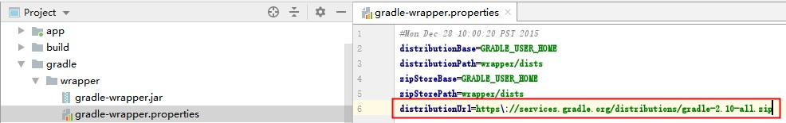
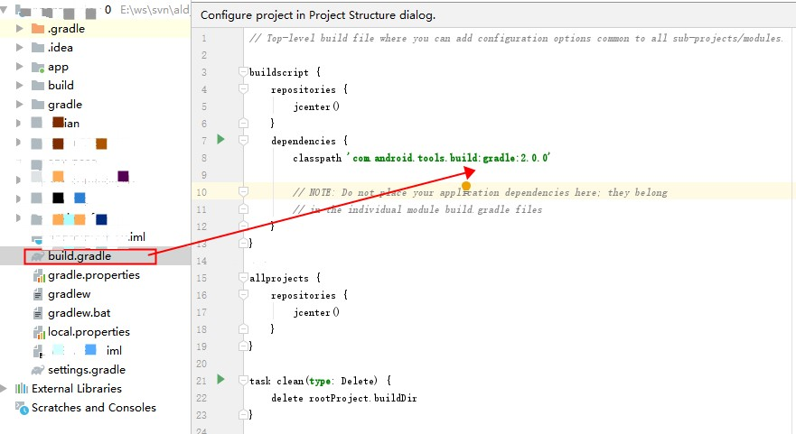

# Android Studio 使用

## Gradle

* aar 和 jar 导出和使用

  [aar的使用（module或者library）](https://www.cnblogs.com/aimqqroad-13/p/8514274.html)
  
  [android studio 创建aar公共库笔记整理](https://www.jianshu.com/p/4f207868c986)
  
  [创建 Android 库](https://developer.android.com/studio/projects/android-library?hl=zh-cn)
  
  [android Studio如何打包和引用AAR](https://zhuanlan.zhihu.com/p/22242264)
  
  


* aar解包和组包

  [Android修改第三方.aar后重新打包](https://www.jianshu.com/p/f0a267551493)

  [二次打包（封装）AAR实用指南](https://zhuanlan.zhihu.com/p/31042358)

  [替换aar里面的资源文件](https://dltech21.github.io/2018/05/03/%E6%9B%BF%E6%8D%A2aar%E9%87%8C%E9%9D%A2%E7%9A%84%E8%B5%84%E6%BA%90%E6%96%87%E4%BB%B6/)


* 语法

  [Gradle语法基础解析](https://www.cnblogs.com/sddai/p/10303978.html)

  [Gradle开发快速入门——DSL语法原理与常用API介绍](https://www.paincker.com/gradle-develop-basics#Groovy%E8%AF%AD%E8%A8%80%E7%AE%80%E4%BB%8B)

  [Android Gradle 看这一篇就够了](https://juejin.cn/post/6844903446814916621)

  [Gradle之build.gradle 语法案例](https://blog.csdn.net/shuizhihun07/article/details/80164460)

  [Gradle 入门--只此一篇](https://www.jianshu.com/p/001abe1d8e95)

  [Gradle 提示与诀窍](https://developer.android.com/studio/build/gradle-tips?hl=zh-cn)

  

* 应用

  [android gradle使用详解](https://www.jianshu.com/p/9467e1879093)


* 修改gradle版本

  * ref

    [Android Studio 修改gradle版本](https://www.jianshu.com/p/23c4663ee326)

  基于Android Studio 3.5.3 & Windows 10

  1. 本地gradle路径位：

     ``` text
     C:\Users\用户名\.gradle\wrapper\dists
     ```

  2. gradle官网下载地址：[下载地址](https://services.gradle.org/distributions/)

  3. 本地手动添加gradle方式：

     ``` text
     官网下载 xxx-bin.zip 或者 xxx-all.zip 
     存放到 “C:\Users\用户名\.gradle\wrapper\dists”
     解压
     ```

     

     

     使用gradle wrapper 在线下载

     使用local gradle distribution 使用本地下载 同时可以全局设置 Offline work 离线模式

  4. gradle wrapper 修改 distributionUrl

     

  5. 配置gradle对应的插件，查询插件版本号

     https://jcenter.bintray.com/com/android/tools/build/gradle/

     如果最新的版本号是2.3.3 可以使用2.3.3+ 后续不需要再修改

     


* 修改module的packagename 

  ``` text
  每个Module都有一个AndroidManifest.xml 
  修改根节点的packagename 即可
  ```

  

* 把so加入到build后的aar中

  [How to Build *.so Library Files into AAR Bundle in Android Studio](https://www.dynamsoft.com/codepool/build-so-aar-android-studio.html)

  ``` text
  在对应module的src/main/下新建文件夹 jniLibs ，将so按cpu架构目录分别放入（armeabi-v7a / x86 ...）
  ```