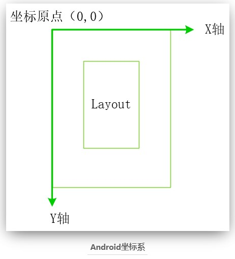
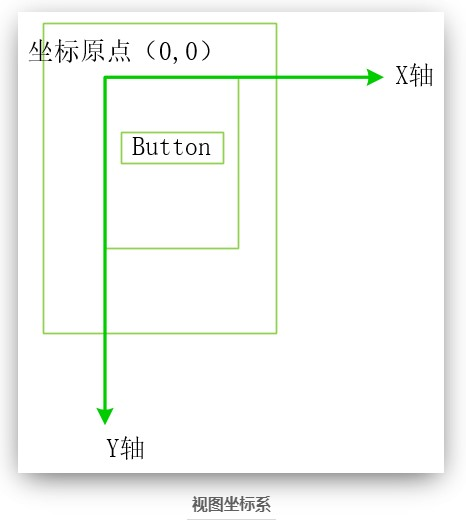
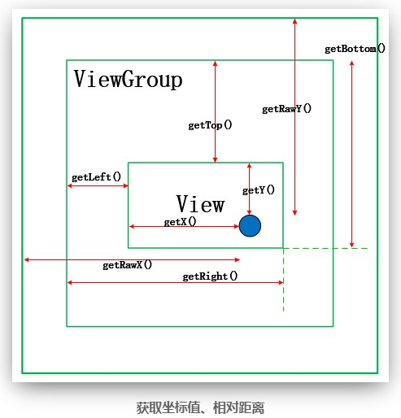

# Android 功能开发


### 基础

* V1 V2 V3签名

  [android应用签名](https://jakkypan.gitbooks.io/android-develop-art-discovery/content/an-quan-xing/ying-yong-qian-ming.html)

  [android-安全性-应用签名](https://source.android.google.cn/security/apksigning?hl=zh-cn)

  ``` tex
  V1方案，基于JAR签名的方案
  V2方案，Android 7.0引入的方案
  
  v1 签名不保护 APK 的某些部分，例如 ZIP 元数据。APK 验证程序需要处理大量不可信（尚未经过验证）的数据结构，然后会舍弃不受签名保护的数据。这会导致相当大的受攻击面。此外，APK 验证程序必须解压所有已压缩的条目，而这需要花费更多时间和内存。
  
  在验证期间，v2+ 方案会将 APK 文件视为 blob，并对整个文件进行签名检查。对 APK 进行的任何修改（包括对 ZIP 元数据进行的修改）都会使 APK 签名作废。这种形式的 APK 验证不仅速度要快得多，而且能够发现更多种未经授权的修改。
  
  新的签名格式向后兼容，因此，使用这种新格式签名的 APK 可在更低版本的 Android 设备上进行安装（会直接忽略添加到 APK 的额外数据），但前提是这些 APK 还带有 v1 签名。
  ```


---


### 插件

* Fmod库

  [github - QQ变声效果](https://github.com/onestravel/QQVoiceChange)

* FFmpeg库

  [github - 视频播放](https://github.com/onestravel/FFmpegDemo)

* Volley库

  [Android Volley框架（三）：解决Volley请求服务器返回中文乱码问题](https://blog.csdn.net/lvyoujt/article/details/50667638)

  ``` text
  解决Volley请求服务器返回中文乱码问题
  
  新建继承自 Request<String / JSONObject>
      @Override
      protected Response<String> parseNetworkResponse(NetworkResponse response) {
          String parsed;
          try {
              Log.e("###", response.headers.toString());    //如果是乱码 这里可能无法找到 Content-type key值
              parsed = new String(response.data, "UTF-8");  //根据服务器端文本编码格式来处理
          } catch (UnsupportedEncodingException e) {
              parsed = new String(response.data);
          }
          return Response.success(parsed, HttpHeaderParser.parseCacheHeaders(response));
      }
  ```

  


---


### API

* 获取apk签名信息

  [Android 获取 apk 签名信息](https://juejin.cn/post/6844903950605352967)
  
  [Android 使用代码获取签名信息](https://blog.csdn.net/hcwfc/article/details/41560591)
  
  [Android在代码中获取应用签名](https://www.cnblogs.com/shenchanghui/p/7910695.html)
  
  ``` java
      public static Signature[] getSignatures(Context context, String packageName){
          try {
              PackageManager manager = context.getPackageManager();
              if(manager != null) {
                  PackageInfo packageInfo = manager.getPackageInfo(packageName, PackageManager.GET_SIGNATURES);
                  return packageInfo.signatures;
              }
          }catch (PackageManager.NameNotFoundException e){
              e.printStackTrace();
          }
          return null;
      }
  ```
  
* 路径

  [google - 访问应用专属文件](https://developer.android.com/training/data-storage/app-specific?hl=zh-cn#java)

  [Adnroid文件存储路径getFilesDir()与getExternalFilesDir的区别](https://blog.csdn.net/losefrank/article/details/53464646)

  [github - All Android Directory Path](https://gist.github.com/lopspower/76421751b21594c69eb2)
  
  [Android系统目录结构](https://www.cnblogs.com/pixy/p/4744501.html)
  
  [【Android】解析Android的路径](https://www.cnblogs.com/HDK2016/p/8707866.html)
  
  ``` text
  区分内部存储和外部存储
  
  内部存储：
  	路径：/data/data/应用包名/files
  	方法：
  		读：
  		//判断文件是否存在
  		File file = context.getFileStreamPath(fileName);
  		file == null || !file.exists() //判断文件是否存在
  		
  		写：
  		读写：
  		openFileOutput()    其中context不需要MainActivity（针对Unity主Activity）
  		例：FileOutputStream fos = /*some context if outside activity.*/openFileOutput("hello.txt", Context.MODE_PRIVATE);
  
  外部存储：SDCard
  	路径：/storage/
  		公有目录：/storage/emulated/0/.
  		私有目录：/storage/emulated/0/Android/data/应用包名/
  	方法：
  		读：
  		Environmant.getExternalStorageState().equals(Environment.MEDIA_MOUNTED)  //判断是否有SDKCard并且是否可读写
  		Environment.getExernalStorageDirectory()
  		
  		//判断文件是否存在
  		Environment.getExernalStorageDirectory().getPath() + filePath
  		File f = new File(file);
  		f.exists()
  		
  		写：
  		读写：
  		
  	权限：
  		<!– 在SDCard中创建与删除文件权限 –>
  		<uses-permission android:name=”android.permission.MOUNT_UNMOUNT_FILESYSTEMS”/>
  		<!– 往SDCard写入数据权限 –>
  		<uses-permission android:name=”android.permission.WRITE_EXTERNAL_STORAGE”/>
  ```
  
  
  
* Logger

  [github - orhanobut / logger](https://github.com/orhanobut/logger)

  [github - michelzanini / android-logger](https://github.com/michelzanini/android-logger)

  [github - noveogroup / android-logger](https://github.com/noveogroup/android-logger)

  [github - klinker41 / android-logger](https://github.com/klinker41/android-logger)

  [github - elvishew / xLog](https://github.com/elvishew/xLog)

  [github - ech0s7r / androidlog](https://github.com/ech0s7r/androidlog)

  [github - savio-zc / Android-Logger](https://github.com/savio-zc/Android-Logger)

  [github - danylovolokh / AndroidLogger](https://github.com/danylovolokh/AndroidLogger)


* 获取屏幕点击坐标

  [Android 中的窗口坐标体系和屏幕的触控事件](https://henleylee.github.io/posts/2018/74e7e0b3.html)

  [android onTouch()与onTouchEvent()的区别](https://blog.csdn.net/guyuealian/article/details/51637033)

  ``` java
  //触控事件  MotionEvent
  // onTouch() vs onTouchEvent()
  
  //Activity 重载
        @Override
        public boolean onTouchEvent(MotionEvent event)
        {
            //@注意：这个判断也不能省  直接获取getRawX() 和 getRawY() 会重复几次
  			switch(event.getAction()) {
  				case MotionEvent.ACTION_DOWN:
  					nativeTouchScreenPos(event.getRawX(), event.getRawY());
                      //@注意：使用break 无法中断 会重复进入几次
  					return true;
  			}
  			return false;
        }
  /*
  event：参数event为手机屏幕触摸事件封装类的对象，其中封装了该事件的所有信息，例如触摸的位置、触摸的类型以及触摸的时间等。该对象会在用户触摸手机屏幕时被创建。
  
  返回值：该方法的返回值机理与键盘响应事件的相同，同样是当已经完整地处理了该事件且不希望其他回调方法再次处理时返回true，否则返回false。
  */
  
  
  //onTouch()是OnTouchListener接口的方法，它是获取某一个控件的触摸事件，因此使用时，必须使用setOnTouchListener绑定到控件，然后才能鉴定该控件的触摸事件。当一个View绑定了OnTouchLister后，当有touch事件触发时，就会调用onTouch方法。通过getAction()方法可以获取当前触摸事件的状态
  myImage.setOnTouchListener(new OnTouchListener() {
  	public boolean onTouch(View v, MotionEvent event) {
  				switch (event.getAction()) {//当前状态
  				case MotionEvent.ACTION_DOWN:
  					break;
  				case MotionEvent.ACTION_MOVE:
  					break;
  				case MotionEvent.ACTION_UP:
  					break;
  				default:
  					break;
  				}
  				return true;//还回为true,说明事件已经完成了，不会再被其他事件监听器调用
  			}
  	});
  
  /*
  1、如果setOnTouchListener中的onTouch方法返回值是true（事件被消费）时，则onTouchEvent方法将不会被执行；
  2、只有当setOnTouchListener中的onTouch方法返回值是false（事件未被消费，向下传递）时，onTouchEvent方法才被执行。
  3、以上说的情况适用于View对象（事件会最先被最内层的View对象先响应）而不是ViewGroup对象（事件会最先被最外层的View对象先响应）。
  综合来讲：
  onTouchListener的onTouch方法优先级比onTouchEvent高，会先触发。
  假如onTouch方法返回false，会接着触发onTouchEvent，反之onTouchEvent方法不会被调用。
  内置诸如click事件的实现等等都基于onTouchEvent，假如onTouch返回true，这些事件将不会被触发。
  */
  ```

  

  

  


---


### 组件化


* link

  [Android组件化开发实践](https://www.jianshu.com/p/d0f5cf304fa4)

  [Android组件化实践项目分享](https://juejin.im/post/5c7f85b3e51d45721073f966)

  [github - 组件化学习](https://github.com/hufeiyang/ComponentLearning)

* 库

  * ARouter 路由

    [github - ARouter](https://github.com/alibaba/ARouter)

    [Android之注解、APT、android-apt 和 annotationProcessor 的区别](https://blog.csdn.net/LVXIANGAN/article/details/88350717)

    ``` text
    ```

    


---


### 库

* 支持库

  [概念 - 官方 - 支持库软件包](https://developer.android.com/topic/libraries/support-library/packages)

  [引用 - maven仓库](https://mvnrepository.com/artifact/com.android.support/support-v4)

  [下载 - Android Support Library Direct Link for Downloading [closed]](https://stackoverflow.com/questions/12518002/android-support-library-direct-link-for-downloading)

  ``` text
  In General this 概念 - 官方 - 支持库软件包 list all Android Support Library Just Choose your Library version and Use Google repository Url:
  
  https://dl-ssl.google.com/android/repository/
  
  e.g.
  for Android Support Library revision 19 :
  https://dl-ssl.google.com/android/repository/support_r19.zip
  
  for Android Support Library revision 19.0.1 :
  https://dl-ssl.google.com/android/repository/support_r19.0.1.zip
  
  for Android Support Library revision 19.1.0 :
  https://dl-ssl.google.com/android/repository/support_r19.1.zip
  
  The Oldest Android Support Library
  https://dl-ssl.google.com/android/repository/support_r04.zip
  ```

  


---


### View

* scrollview

  * 自定义宽高

    [自定义ScrollView最大内容显示高度](https://blog.csdn.net/my_rabbit/article/details/80845660)

    ``` java
    //需要自定义一个继承自原生 ScrollView的类
    
    public class CustomScrollView extends ScrollView {
    
        private Context mContext;
    
        public CustomScrollView(Context context) {
            this(context, null);
        }
    
        public CustomScrollView(Context context, AttributeSet attrs) {
            this(context, attrs, 0);
        }
    
        public CustomScrollView(Context context, AttributeSet attrs, int defStyleAttr) {
            super(context, attrs, defStyleAttr);
            this.mContext = context;
        }
    
        @Override
        protected void onMeasure(int widthMeasureSpec, int heightMeasureSpec) {
            try {
                Display display = ((Activity) mContext).getWindowManager().getDefaultDisplay();
                DisplayMetrics d = new DisplayMetrics();
                display.getMetrics(d);
                // 设置控件最大高度不能超过屏幕高度的一半
                heightMeasureSpec = MeasureSpec.makeMeasureSpec(d.heightPixels / 2, MeasureSpec.AT_MOST);
            } catch (Exception e) {
                e.printStackTrace();
            }
            // 重新计算控件的宽高
            super.onMeasure(widthMeasureSpec, heightMeasureSpec);
        }
    }
    ```

    ``` xml
    <com.wiggins.widget.MyScrollView
     android:layout_width="match_parent"
        android:layout_height="wrap_content"
        android:fadingEdge="none"
        android:fillViewport="true"
        android:overScrollMode="never">
    <LinearLayout
        android:orientation="vertical"
        android:layout_width="match_parent"
        android:layout_height="wrap_content"
        android:paddingLeft="10dp"
        android:paddingRight="12dp">
        <TextView
            android:layout_width="match_parent"
            android:layout_height="wrap_content"
            android:padding="10dip"
            android:textSize="12sp" />
    </LinearLayout>
    </com.wiggins.widget.MyScrollView>
    
    <!--
    1、去除ScrollView边界阴影
    1.1 在xml中添加：android:fadingEdge=”none”
    1.2 代码中添加：scrollView.setHorizontalFadingEdgeEnabled(false);
    
    2、去除ScrollView拉到顶部或底部时继续拉动后出现的阴影效果，适用于2.3及以上
    2.1 在xml中添加：android:overScrollMode=”never”
    
    3、当ScrollView子布局不足以铺满全屏的时候其高度就是子布局高度之和，此时如果想让ScrollView铺满全屏时只需要设置以下属性即可
    3.1 在xml中添加：android:fillViewport=”true”
    -->
    ```

    

  