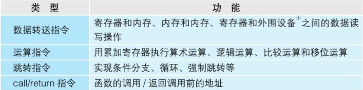

# 计算机基础

## 一、程序运行基础


### *CPU*

* 概念一

  ``` tex
  * 程序：指示计算机每一步动作的一组指令
  * 程序组成：指令和数据
  * 机器语言：CPU可以识别并使用的语言
  * 内存：存储正在运行的程序
  * 内存地址：内存中，用来表示命令和数据存储位置的数值
  * CPU: 属于计算机构成元件，负责程序的解释和运行
  ```

* CPU组成

  * 寄存器

    暂存指令、数据等处理对象，有多种类型的寄存器

  * 控制器

    把内存上的指令、数据等读入寄存器，并根据指令的执行结果来控制整个计算机

    （控制：主要是数据输入输出的时机控制）

  * 运算器

    运算从内存读入寄存器的数据

  * 时钟（可能在CPU外部）

    发出CPU开始计时的时钟信号，1GHZ = 10^9 次/s  1MHZ = 10^6次/s  1KHZ = 10^3次/s


* 寄存器

  开发程序中将寄存器作为对象，程序开发中主要掌握寄存器

  寄存器种类通过名字来区分，eax（累加），ebp（基址）...

  寄存器中可以存储指令和数据（用于运算和表示内存地址的数值）

  


* 汇编语言（assembly）

  通过助记符（memonic）编写，基本是一一对应机器语言指令；

  汇编：汇编语言转成机器语言

  反汇编：机器语言转汇编语言


* 机器语言

  


* 程序计数器

  CPU每执行一个指令，程序计数器会加1；

  当程序存在分支和循环时，程序计数器会存放指定跳转地址

  ``` tex
  函数调用跳转回调用时的位置的方法：
  使用call 和 return 
  在将函数的入口地址设定到程序计数器之前，call指令会把调用函数后要执行的指令地址存储在名为栈的主存内。
  函数处理完毕后，再通过函数的出口来执行return命令。return命令的功能是把保存在栈中的地址设定到程序计数器中。
  ```

  

  

* 标志寄存器

  条件分支中比较运算

  保存当前寄存器的运算结果（累加：负数、零、正数），以及存放溢出（运算结果超过寄存器长度范围）和奇偶校验结果

  寄存器中使用三个bit（位）来分别表示 正数、零、负数

  ``` tex
  CPU比较机制：
  内部做减法，两个寄存器中的数值进行减法，正数表示前者大，零表示相等...
  ```

  

* 基址寄存器、变址寄存器

  对内存上特定内存区进行划分，实现”数组“操作

  实际内存地址 = 基址寄存器（值） + 变址寄存器（值）

  变址寄存器的值相当于数组的索引功能


---


### *内存*

* 概念一

  主存（main memory）

  负责存储程序、数据；DRAM（Dynamic Random Access Memory，动态随机存取存储器）

  使用时需要保证稳定电源供给，并且时常刷新（保证数据最新），断电后自动清楚

  

  内存中存储是按地址划分的


---


### *进制*


* 2进制（BIN）

  * ref

    [加减乘除的二进制位运算方法](https://www.cnblogs.com/paxing/p/10452264.html)

  逢二进一, 借一当二

  ``` tex
  乘法运算
  示例：
  (1101)B * (1110)B
  
  	1101
     *1110
     ------
      0000
     1101
    1101
   1101
   --------
  10110110 
  如果乘数当前位为1，则取被乘数左移一位的结果加到最终结果中；如果当前位为0，则取0加到乘积中（加0也就是什么也不做）
  
  
  0x02 << 3 == 00010000 （0x10, 16）, 即等价于（0x02）* (2^3)
  即 00000010 * 00001000 = 00010000
  即 二进制乘法类似于移位运算
  示例：
  1.1101 （1.8175） * 11.1011 （3.6875）
  结果为：110.10101111（6.68359375）
  过程如下：
  	1. 11.1011中的0.0001 乘上1.1101，即将1.1101右移4位 ==> 0.00011101
  	2. 11.1011中的0.001  乘上1.1101，即将1.1101右移3位 ==> 0.0011101
  	3. 11.1011中的0.1    乘上1.1101，即将1.1101右移1位 ==> 0.11101
  	4. 11.1011中的1      乘上1.1101，即不移动          ==> 1.1101
  	5. 11.1011中的10     乘上1.1101，即将1.1101左移1位 ==> 11.101
  	相加得：110.10101111
  ```

  ``` tex
  除法运算：可以转换成减法运算，即不停的用除数去减被除数，直到被除数小于除数时，此时所减的次数就是我们需要的商，而此时的被除数就是余数
  示例：
  类似于十进制除法：
  795 / 13的过程：
  		1. 795大于13 ，取6，余1
  		2. 15大于13  ，取1，余2
  		3. 2小于13   ，取0，余2
  		4. 所以结果是61余2
  
  11.11（3.75） / 101 (5)
  	1. 除数11.11先左移2位 ==> 1111
  	2. 取前三位111 > 101, 上1， 余10
  	3. 余数拼上剩下得一位得101 == 101, 上1，余0
  	4. 最后将结果11右移2位 ==> 0.11(0.75)
  
  
  1111 / 101 = 11
  	1111
  1	101
     ------
     	 101
  1    101
     ------
     	   0
  
  
  1011011 / 110 = 1111 ... 1
  	1011011
  1	 110
  	-------
  	 101011
  1	  110
  	-------
  	  10011
  1	   110
      -------
          111
  1       110
      -------
            1
  ```

  

* 10进制（DEC）

* 8进制（OCT）

* 16进制（HEX）

  通常使用16进制表示2进制，解决2进制位数过多问题

  A - F分别表示10 - 15

  ``` tex
  2进制 4位
  0000 -  1111
  16进制
  0 - F
  
  32位2进制可以用8位16进制表示
  00000000 - FFFFFFFF
  ```

  * 16进制加减法
  
    借一当十六，逢十六进一
  
    ``` tex
    如计算：0x3F + 0x4A  
    0x0F + 0x0A  ==>  15 + 10 = 25 ==>  0x19 ==> 3 + 4 + 1 ==> 0x89
    
    如计算：0x536 - 0x8F
    0x006 - 0x00F ==> 16 + 6 - 15 = 7 ==> 0x030 ==> 0x020 - 0x080 ==> 16 + 2 - 9 = 10(A) ==> 0x4A7 
    ```


* 进制转换

  

  

  [二、八、十、十六进制转换（图解篇）](https://www.cnblogs.com/gaizai/p/4233780.html)

  ``` tex
  二进制（B） - 十进制（D）  (101011)B => 1 * 2^0 + 1 * 2^1 + ...
  八进制（O） - 十进制      (53)O => 3 * 8^0 + 5 * 8^1
  十六进制（H） - 十进制    (2B)H => B * 16 + 2 * 16^1
   
  
  十进制 - 二进制（除2取余）
  十进制 - 八进制（除8取余）、（先十 - 二，再二 - 八）     "取余从后往前取"
  十进制 - 十六进制 （除16取余）
  
  
  二进制 - 八进制(取3舍1)  (11010111.0100111)B => {0}11 010 111 . 010 011 1{00} => (327.234)O
  					 (1100011100)B => {00}1 100 011 100 => (1434)O
  二进制 - 十六进制
  
  八进制 - 十六进制  (327)O => 011 010 111 => {0} 1101 0111 => (D7)H
  十六进制 - 八进制
  
  十六进制 - 十进制 
  
  包含小数的进制转换  （ABC.8C）H => 10 * 16^2 + 11 * 16^1 + 12 * 16^0 _ 8 * 16^-1 + 12 * 16^-2
  
  byte a = 0x65 => 0110 0101 => 5 * 16^0 + 6 * 16 ^1 = 101
  
  负次幂
  2^-5 = 2^(0-5) = 2^0 / 2^5 = 1 / 2^5
  
  
  我们需要了解一个数学关系，即23=8，24=16，而八进制和十六进制是用这关系衍生而来的，即用三位二进制表示一位八进制，用四位二进制表示一位十六进制数。接着，记住4个数字8、4、2、1（23=8、22=4、21=2、20=1）。
  ```


* 字长

  ``` tex
  （机器）字长：能处理的二进制数据的位数
  （百度百科：计算机进行一次整数运算所能处理的二进制数据的位数（整数运算即定点整数运算）。因为计算机中数的表示有定点数和浮点数之分，定点数又有定点整数和定点小数之分，这里所说的整数运算即定点整数运算。机器字长也就是运算器进行定点数运算的字长，通常也是CPU内部数据通道的宽度。）
  
  字长为8的计算机sbyte类型所能表示的最大数为 11111111
  如果再加1得 100000000（9位），因为最多只能处理二进制位数为8位，最高位1丢弃，得00000000
  所以字长为8的二进制系统的模为2^8,
  (某一台计算机的字长为8位，则它所能表示的二进制数为00000000~11111111，共 256个，即模数为2的8次方)
  
  二进制的模（模数）：
  在计算机中，机器数表示数据的字长即位数是固定的。其模数的大小：
  1)对于n位整数（含一位符号位），则它的模数为2^n
  2)对于纯小数（含符号位），则它的模数总是2。
  ```

  


---


### *原码反码补码移码*

* 符号位，有符号数，无符号数

  * 无符号数运算

    ``` tex
    十进制加法
    10 + 11 = 21
    转换成二进制加法
    1010 + 1011 = 10101 ==> 21
    ```

    

  * 有符号数运算

    有符号数运算必须求出相应补码再进行运算

    ``` tex
    -10 + 11 = 1
    
    -10 为有符号数（+10也为有符号数，有符号数在原码前加一个符号位，负数为1，正数为0）
    -10 原码==> 11010 
    -10 反码==> 10101
    -10 补码==> 10110 （反码+1）
    
    11 补码为01011 （正数原码、反码、补码都一样）
    计算补码相加：10110 + 01011 = 100001 ==> 去掉符号位 00001 即 十进制得 1
    ```


* ref

  [原码、反码、补码和移码详解](https://www.jianshu.com/p/abbdae4f3841)


* 原码

  **正数是其二进制本身；负数是符号位为1,数值部分取X绝对值的二进制。**

  ``` tex
  原码负数不能参与运算并且不能做减法运算
  ```

  

* 反码

  **正数的反码和原码相同；负数是符号位为1,其它位是原码取反。**

  ``` tex
  反码的+0和-0的反码不相同
  ```


* 补码

  **正数的补码和原码，反码相同；负数是符号位为1，其它位是原码取反，未位加1。（或者说负数的补码是其绝对值反码未位加1）**

  ``` tex
  -128在运算中的补码是 [1000 0000]补，并没有原码和反码表示
  ```

  ``` tex
  作用：
  1.为了让计算机将符号位也参与运算2
  2.将减法运算当成加法运算（加上一个负数）
  3.修复了0的符号以及存在两个编码的问题,
  4.能够多表示一个最低数
  （这就是为什么8位二进制, 使用原码或反码表示的范围为[-127, +127], 而使用补码表示的范围为[-128, 127]）
  （联想：32位int表示范围：[-2^31, 2^31-1], 第一位是符号位，同时因为补码可以多表示一位最小值）
  
  
  
  
  示例：
  十进制：1 - 1 = 0
  转成二进制：1 - 1 = 1 + (-1) = [00000001]原 + [10000001]原= [10000010]原 = -2
  
  为了解决上述原码问题：引入反码
  1 - 1 = 1 + (-1) = [0000 0001]原 + [1000 0001]原= [0000 0001]反+ [1111 1110]反= [1111 1111]反= [1000 0000]原= -0
  
  为了解决结果中除真值部分正确外的符号位问题：[0000 0000]原和[1000 0000]原两个编码表示0. 引入补码
  1-1 = 1 + (-1) = [0000 0001]原 + [1000 0001]原 = [0000 0001]补+ [1111 1111]补= [0000 0000]补=[0000 0000]原
  
  此时只用[0000 0000]原 表示0，而 [10000000]补 可以表示-128
  (-1) + (-127) = [1000 0001]原 + [1111 1111]原 = [1111 1111]补+ [1000 0001]补= [1000 0000]补
  @注意：因为用-128是用-0的补码来表示的，同时如果 -128的补码 [10000000]补计算原码为[00000000]原  不准确了
  ```

  ``` tex
  补码求原码：
  已知一个数的补码，求原码的操作分两种情况：
  如果补码的符号位为“0”，表示是一个正数，所以补码就是该数的原码。
  如果补码的符号位为“1”，表示是一个负数，求原码的操作可以是：符号位为1；其余各位取反，然后再整个数加1。
  ```

  ``` tex
  补码加、减法：
  在做补码加减法时，只需要将符号位和数值部分一起参与运算，并且将符号位产生的进位丢弃
  
  加法公式：
  [X+Y]补 = [X]补 + [Y]补
  减法公式：
  [X-Y]补 = [X]补-[Y]补 = [X]补 + [-Y]补
  [-Y]补称为负补,求负补的办法是：对补码的每一位(包括符合位)求反，且未位加1.
  ```

  

* 移码

  **将符号位取反的补码（不区分正负）**

  ``` tex
  移码表示法是在数X上增加一个偏移量来定义的，常用来表示浮点数中的阶码，所以是整数。如果机器字长为n，规定偏移量为2(n-1)。若X是整数，则X移=2^(n-1)+X
  例子：假设字长为8，以上面的108为例
  108移=10000000+01101100=11101100
  -108移=10000000+10010100=00010100
  ```


* 区分

  | 编码 | 10810（sbyte） | -10810（sbyte） |
  | ---- | -------------- | --------------- |
  | 原码 | **0**1101100   | **1**1101100    |
  | 反码 | **0**1101100   | **1**0010011    |
  | 补码 | **0**1101100   | **1**0010100    |
  | 移码 | **1**1101100   | **0**0010100    |