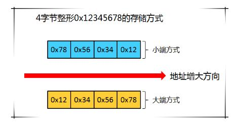

# 计算机基础

### 内存

* 内存最先的存储单元是 **字节**


* 内存中的堆和栈

  ``` text
  栈区：由编译器自动分配和释放，一般存放函数额参数值、局部变量的值等；存取速度较快；一种运算受限的线性表；只能在一段进行插入和删除的特殊线性表，按照先进后出（LIFO）的原则存储数据，先进的数据被压入栈底，最后数据在栈顶，需要读数据时从栈顶弹出数据；用于暂时存放数据和地址，保护断点和现场；
  
  堆区：由程序员分配和释放，如果不主动释放，在程序结束后可能由系统释放；速度较慢，容易产生内存碎片；特定的存储区和寄存器，一端是固定的，另一端是浮动的；允许程序在运行时动态地申请某个大小的内存空间
  
  存储在栈区的数据必须已知固定s大小
  编译时大小不确定的或可能变更大小的必须存储在堆上
  
  在栈上分配内存比堆上快，因为操作系统不需要为新数据搜索一块足够大的空间，同时不需要记录，为下一次分配做准备
  
  访问堆上的数据比访问栈上的要慢，因为需要根据指针寻找
  
  调用一个函数时，传递给函数的值（可能包括堆上指向数据的指针）和函数的局部变量会压入栈中。当函数结束，这些值将从栈中弹出
  ```
  
  


* 大端和小端

  

  

  ``` tex
  区分大端和小端？
  对于跨越多个字节的程序对象(比如，变量，结构体，程序二进制代码，等)，我们必须建立两个统一的规则，用来规范化。
  第一：对象地址怎么表示？ 多字节对象存储为连续的字节顺序，同时对象地址为字节中最小的地址
  第二：对象地址如何在存储器上排序？ 
  	如：一般来说，0x12345678中，高位字节为0x12，低位字节为0x78；对于计算机来说，高位低位怎么放都可以
  
  小端（Little-Endian）：最低有效字节放在存储器低地址的位置；和逻辑方法一致
  大端（Big-Endian）：最高有效字节放在存储器低地址的位置；和”从左到右“阅读习惯一致
  
  大端小端是不同的字节顺序存储方式，统称为字节序；
  
  区分方法：（详见C_Test/test_big_little_endian.h）
  用MSB和LSB讲大端和小端的描述，需要注意，大端和小端描述的是字节之间的关系，
  而MSB、LSB描述的是Bit位之间的关系。字节是存储空间的基本计量单位，所以通过高位字节和低位字节来理解大小端存储是最为直接的。
  MSB: Most Significant Bit ------- 最高有效位(指二进制中最高值的比特)
  LSB: Least Significant Bit ------- 最低有效位(指二进制中最高值的比特)
  
  
  x86系列CPU都是Little-endian字节序，PowerPC通常是Big-endian字节序。
  因为网络协议也都是采用Big-endian方式传输数据的，所以有时也把Big-endian方式称为网络字节序
  ```

  


---


### CPU （ Central Processing Unit）


【计算功能】

* 晶体管

  ``` text
  晶体管的功能简单到不能再简单，给一端通上电，那么电流可以从另外两端通过，否则不能通过，其本质就是一个开关
  
  无论程序员编写的程序多么复杂，软件承载的功能最终都是通过这个小东西简单的开闭完成的
  ```

* AND  OR  NOT

  ```text
  两个开关只有同时打开电流才会通过，灯才会亮
  
  两个开关中只要有一个打开电流就能通过，灯就会亮
  
  当开关关闭时电流通过灯会亮，打开开关灯反而电流不能通过灯会灭
  
  
  任何一个逻辑函数最终都可以通过AND、OR以及NOT表达出来，这就是所谓的逻辑完备性
  ```

  

  

* 二进制加法

  ``` text
  0 + 0，结果为0，进位为0
  0 + 1，结果为1，进位为0
  1 + 0，结果为1，进位为0
  1 + 1，结果为0，进位为1   ==> @注意：  与门
  
  用一个与门和一个异或门就可以实现二进制加法
  ```

  

* ALU

  ``` text
  根据需要将不同的算数运算设计出来，负责计算的电路
  统称为：
  arithmetic/logic unit，ALU，CPU 中专门负责运算的模块
  
  具有计算能力，但不具备存储能力
  ```


---


【存储功能】


* 电路保存信息

  ``` text
  与非门  NAND门
  由与或非门组合而成的
  
  0 | 0 | 1
  0 | 1 | 1
  1 | 0 | 1
  1 | 1 | 0
  
  一个NAND门的输出是两一个NAND门的输入，该电路的组合方式会自带一种很有趣的特性，只要给S和R段输入1，那么这个电路只会有两种状态:
  要么a端为1，此时B=0、A=1、b=0；
  要么a端为0，此时B=1、A=0、b=1;
  
  把a端的值作为电路的输出
  把S端置为0的话(R保持为1)，那么电路的输出也就是a端永远为1，这时就可以说把1存到电路中了；
  而如果把R段置为0的话(S保持为1)，那么此时电路的输出也就是a端永远为0，此时可以说把0存到电路中了。
  
  为使只有一个输入端（存一个bit），改造电路如下下图
  当D为0时，整个电路保存的就是0，否则就是1
  ```

  

  ​	


* 寄存器

  ``` text
  将上述电路串联起来，组成寄存器
  
  继续搭建更加复杂的电路以存储更多信息，同时提供寻址功能，就这样内存也诞生了。
  
  只要通电，这个电路中就保存信息，但是断电后很显然保存的信息就丢掉了，这就是内存在断电后就不能保存数据的原因
  ```

  


---


【执行操作】

* 指令集

  ``` text
  没有必要为所有的计算逻辑实现出对应的硬件
  硬件不可变，但软件可变，不变的是硬件但提供不同的软件就能让硬件实现全新的功能
  
  机制和策略
  CPU 机制：加法
  使用者 策略：哪些进行加法
  
  CPU 表达机制就通过指令集来实现的
  
  这条指令占据16比特，其中前四个比特告诉CPU这是加法指令，这意味着该CPU的指令集中可以包含2^4也就是16个机器指令，这四个比特位告诉CPU该做什么，剩下的bit告诉CPU该怎么做，也就是把寄存器R6和寄存器R2中的值相加然后写到寄存器R6中。
  ```

  


---


【调度】

* 时钟信号

  ``` text
  时钟信号每一次电压改变，整个电路中的各个寄存器(也就是整个电路的状态)会更新一下，这样就能确保整个电路协同工作不会这里提到的问题
  
  CPU的主频: 主频是说一秒钟时钟晶振频率，显然主频越高CPU在一秒内完成的操作也就越多
  
  例如：
  假设我们要计算1+1，这两个数分别来自寄存器R1 和 R2，要知道寄存器中可以保存任意值，怎么能确保加法器开始工作时R1和R2中在这一时刻保存的都是1而不是其它数？
  由时钟信号更新寄存器状态
  ```

  
